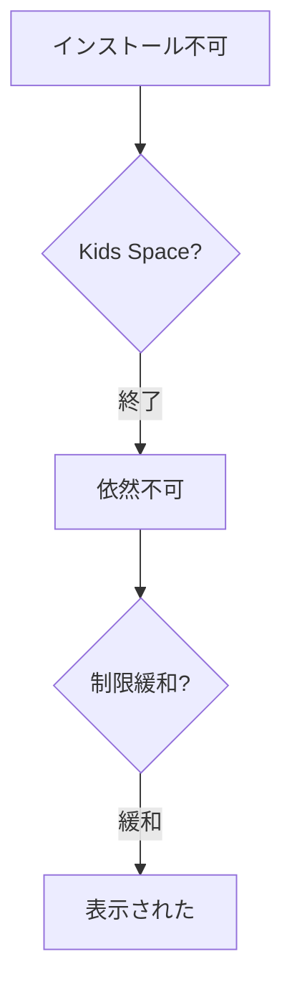

:::message
この記事は、生成AIを使って作成し、筆者が内容を確認・修正したうえで公開しています。使ったツールと用途は、末尾の「生成AIの利用について」に書いています。
:::

## 1. はじめにと事象の概要

Android 16 タブレットにおいて、Google が提供する保護者向けの管理機能「Google Family Link」の管理下にある、子供向け Google アカウントを利用していた際のことです。Google Chrome（以下 Chrome）の PWA（Progressive Web App）および WebAPK インストール機能に相当する「ホーム画面に追加」や「アプリをインストール」といった導線が、一切表示されない事象に遭遇しました。

この問題の切り分けと対策の特定には、実機を用いた多角的な検証が必要であり、解消までに約2時間の試行錯誤を要しました。本稿では、子供向けのランチャーである「Google Kids Space」と Family Link の関係を調べます。さらに、Android のショートカット固定 API の挙動、そして Chrome のウェブ利用制限ポリシーが PWA インストール導線に与える影響の検証結果を示します。これらに基づき、運用上の推奨設計について整理します。

本稿で紹介する検証コードや関連する技術リポジトリは、GitHub で公開している配信基盤を基にしています。
- リポジトリ: [Takenori-Kusaka/publishing-hub](https://github.com/Takenori-Kusaka/publishing-hub)

## 2. 対象環境と発生した初期事象

検証対象となった実機の環境情報は以下の通りです。

- **端末:** Android 16 タブレット
- **ブラウザ:** Google Chrome for Android
- **アカウント:** Google Family Link で監督対象となっている子供向け Google アカウント
- **子供向けランチャー環境:** Google Kids Space を有効化
- **配布想定サービス:** 「がんばりクエスト」を含む PWA（Google Play ストアを介さず、Chrome からの PWA/WebAPK 直接インストールを想定）
- **比較対象:** 自社 PWA に加え、Starbucks など一般に公開されている著名 PWA

初期の事象として、Chrome の三点メニューを開き、「保存して共有」配下などのメニュー項目をくまなく確認したものの、通常であれば表示されるはずの以下の導線がすべて消失していました。

- 「ホーム画面に追加」
- 「アプリをインストール」
- 「インストールしてショートカットを作成」

自社サイトだけでなく、インストール要件を満たしているはずの Starbucks などの著名 PWA でも全く同じ状態であったため、自社 PWA 固有の `manifest.json` や Service Worker、HTTPS 接続の不備が原因である可能性は、極めて低いと判断しました。アイコン指定や `display` 設定、`start_url` などの要因も同様に除外されます。

## 3. 当初の仮説とショートカット固定 API の関係

当初、主な原因として「Google Kids Space」のホーム画面（ランチャー）の制限を疑いました。Google Kids Space は、通常の Android ホーム画面とは大きく異なる子供向けの特化型 UI を提供しています。そのため、この独自ランチャーが Android 標準のショートカット追加 API に対応していない可能性を疑いました。あるいは、子供プロファイルのホーム画面項目的書き換えが制限されているのではないかという仮説を立てました。

Android OS では、ショートカットや PWA のアイコンをホーム画面に追加する際、ランチャー（Launcher）が対応しているかを確認するために、以下の `ShortcutManager` API が用いられます。

```java
// Android SDK における既定ランチャーのショートカット固定機能のサポート検証例
ShortcutManager shortcutManager = context.getSystemService(ShortcutManager.class);
if (shortcutManager != null) {
    if (shortcutManager.isRequestPinShortcutSupported()) {
        // デフォルトランチャーがショートカットの追加（固定）に対応している場合の処理
        Log.d("PWA_Debug", "Home screen shortcut pin is supported.");
    } else {
        // ランチャーがサポートしていない、またはプロファイルにより制限されている場合
        Log.w("PWA_Debug", "Home screen shortcut pin is NOT supported.");
    }
}
```

Android の仕様上、デフォルトランチャーがショートカット追加をサポートしていない場合だけでなく、ホーム画面上の項目追加が制限されたユーザープロファイル（子供向けアカウントなど）である場合も、`isRequestPinShortcutSupported()` は `false` を返します。

Chrome for Android の PWA インストール機能は、背後で WebAPK を自動生成・ビルドして OS へ追加する機能、またはホーム画面へショートカットを固定する機能と深く統合されています。したがって、ランチャーやプロファイルがショートカットの追加を拒否している場合、Chrome が気を利かせて（あるいは API の返り値に基づき）インストール導線自体を非表示にしているのではないかと考えました。

## 4. 検証手順とKidsSpaceの切り分け

仮説を検証するため、以下のステップで環境要因の切り分けを行いました。

### 4.1 自社サイト以外での検証
Starbucks をはじめとする実績のある外部 PWA サイトでも再現を確認し、自社 PWA のマークアップやインストール要件（Installability）の不足ではないことを確認しました。

### 4.2 Chrome ポリシーの確認
ブラウザに適用されているポリシーを確認するため、Chrome 上で `chrome://policy` を開きました。確認できたポリシーは以下の2点のみでした。

- `BrowserSignin`
- `ForceGoogleSafeSearch`

PWA や WebAPK、ホーム画面ショートカットのインストールを直接的かつ明示的に禁止する Chrome Enterprise ポリシー（`WebAppInstallForceList` などに関連する制限）は確認できませんでした。

### 4.3 Google Kids Space ランチャーの終了
親アカウントによる認証を経て Google Kids Space を一時的に終了し、通常の Android ホーム画面に戻しました。

しかし、Kids Space 終了後も、子供アカウントがサインインしている Chrome は「管理対象ブラウザ」と認識されたままであり、PWA/WebAPK インストール導線は復活しませんでした。これにより、「Kids Space ランチャー単体の API 非対応が直接原因である」という当初の仮説は否定されました。

## 5. 検証結果と特定された FamilyLink 制限

次に、アカウント全体を統括している「Google Family Link」の Chrome 向け利用設定を詳細に確認しました。初期状態の設定は以下のようになっていました。

- **Web filter (ウェブサイトのフィルター設定):** `Only allow approved sites`（許可されたサイトのみを許可）
- **Extensions (拡張機能):** `Off`
- **Permissions for sites, extensions, and on-device site data (サイト、拡張機能、オンデバイスサイトデータへの権限):** `Off`

このとき、対象の自社サービスおよび比較対象サイトの URL 自体は「許可されたサイト」として保護者側で正しく登録されていました。そのため、通常のページブラウジング自体は可能でした。

しかし、PWA のインストールおよび WebAPK の生成処理は、通常の Web ページの閲覧とは異なります。裏で `manifest.json` の解析、バックグラウンドでの Service Worker の登録・動作、サイトデータ（Cache Storage / IndexedDB）の広範な保存、および端末上のアプリとの統合など、多岐にわたる処理が発生します。

そこで、Family Link の管理画面から、以下の設定を変更しました。

1. **Web filter** を `Allow all sites`（すべてのサイトを許可）へ一時的に緩和。
2. **Extensions** を `On` に変更。
3. **Permissions for sites, extensions, and on-device site data** を `On` へ変更。
4. 設定変更の反映と Chrome の状態の再初期化を確実にするため、**Android タブレット本体を再起動**。

再起動後、再度 Chrome から対象サイトを開き、三点メニューを確認したところ、**無事に「ホーム画面に追加」（インストール）の導線が表示され、正常に WebAPK の追加が可能となりました。**

以下の図は、今回の検証手順と特定プロセスの流れを示しています。



## 6. 運用における推奨構成と最小権限設計

検証の結果、Family Link のウェブ制限が Chrome の PWA/WebAPK 導線表示に直接関与していることが明らかになりました。

しかし、子供の安全を守る観点から、`Allow all sites`（すべてのサイトを許可）や拡張機能の無許可な有効化を恒久的に適用することは、セキュリティおよびフィルタリングの観点から望ましくありません。安全性を確保しつつ、対象の PWA のみをインストールさせるための「最小権限構成」を特定するためのステップを以下に提案します。

1. **Extensions のオフへの復帰:** `Allow all sites` の状態を維持したまま、まず Extensions を `Off` に戻して再起動します。PWA/WebAPK インストールは本来拡張機能を必要としないため、これで導線が維持されれば、Extensions は本件の直接原因から除外できます。
2. **オンデバイスデータ権限の影響検証:** `Permissions for sites, extensions, and on-device site data` を `Off` に戻して再起動します。もしこれで導線が消える場合、WebAPK の生成やマニフェスト処理に必要な「オンデバイスサイトデータ（オフライン用の Cache や Storage）」への権限が必須要件であると特定できます。
3. **URL フィルターの厳格化とオリジン許可:** Web filter を再び `Only allow approved sites` に戻す場合、メインの URL だけでなく、PWA の動作に必要なすべての「関連オリジン」を許可リストに明示的に登録する必要があります。

特に `Only allow approved sites` フィルターが有効な環境では、メインのページだけを許可しても不十分です。以下のオリジンが1つでもブロックされていると、Chrome がインストール要件を満たしていないと判断し、導線を非表示にする可能性があります。

- マニフェストファイル（`manifest.json`）のホスト先ドメイン
- アイコン画像や静的アセットを配置している CDN ドメイン
- API 通信先ドメイン
- サードパーティの認証プロバイダやリダイレクト先ドメイン

## 7. 長期的な配布方針と代替手段の検討

Chrome の PWA/WebAPK インストール機能は手軽ですが、OS やブラウザ、そして Family Link のポリシーアップデートによって、いつ導線が非表示になるか予測しづらいという運用上のリスクを抱えています。

子供向けに特定の Web サービスをアプリとして確実に提供し続けたい場合、以下の代替手段が最も安定的です。

### Trusted Web Activity（TWA）による Google Play ストア経由の配布
PWA をベースとした Android アプリパッケージ（`.apk`）を作成し、Google Play ストアに登録・公開します。

Google Play ストア経由であれば、Family Link の標準機能である「アプリの承認」を用いて、保護者が個別に対象アプリの使用を許可・ブロックできます。これにより、Chrome のウェブフィルター設定を過度に緩和することなく、子供の端末へ安全に対象サービスをインストールさせることが可能となります。

## 8. 結論とトラブルシューティングの要点

本件のトラブルシューティングを通じて、以下の教訓を得ました。

1. **PWA のインストール不良はアプリ実装の問題だけではない:** 端末の設定や保護者管理ポリシーといった、Web サーバの外側にある環境要因が影響を及ぼすことがあります。
2. **Kids Space と Family Link の境界線:** 子供用ランチャーの終了だけでは不十分であり、背後にある Family Link アカウント自体のポリシーが Chrome の WebAPK 統合機能を抑止している事実が、実機検証により裏付けられました。
3. **隠れた統合仕様:** オンデバイスデータの制限やフィルター機能が、Web アプリのインストール導線を直接消去することは Google の公式ドキュメントに明記されていませんが、実挙動として確実に影響します。

同様の事象で「PWA がホーム画面に追加できない」と悩まれている開発者や保護者の方々は、ぜひ一度 Family Link 側の Chrome 設定（特にウェブサイトの制限およびオンデバイスデータの許可状況）を見直してみてください。

## 生成AIの利用について

この記事の作成には、生成AIの Gemini CLI（Google の gemini-3.7-flash）を使いました。全体の構成の検討に加え、各章の執筆に利用しました。具体的には、1章「はじめにと事象の概要」、2章「対象環境と発生した初期事象」、3章「当初の仮説とショートカット固定機能」の作成を担当しました。また、4章「検証手順とKidsSpaceの切り分け」、5章「検証結果と特定された FamilyLink 制限」、6章「運用における推奨構成と最小権限設計」も作成しました。さらに、7章「長期的な配布方針と代替手段の検討」、8章「結論とトラブルシューティングの要点」の作成にも利用しました。筆者が内容を確認し、必要に応じて修正しました。公開した内容の責任は筆者が負います。
