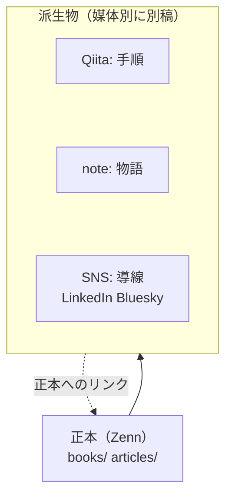
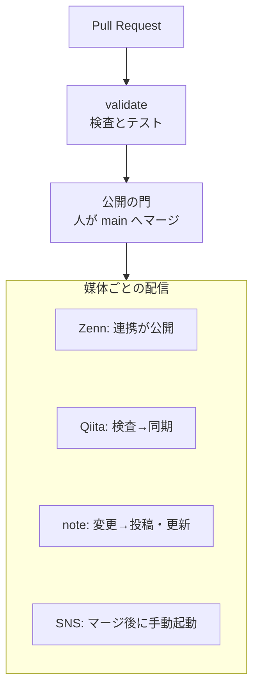

:::message
この記事は、生成AIを使って作成し、筆者が内容を確認・修正したうえで公開しています。
:::

## 1. はじめに：本稿の範囲と前提

本稿は、個人の技術発信をGitとGitHub Actionsで運用するための基盤「publishing-hub（マルチプラットフォーム出版・配信基盤）」の設計と実装を説明します。対象の媒体は、Zenn（本と記事）、Qiita、note、LinkedIn、Blueskyの5つです。本稿では、機械による確認をまとめて「検査」と呼びます（題名の「検証」も同じ意味です）。

- リポジトリ: [Takenori-Kusaka/publishing-hub](https://github.com/Takenori-Kusaka/publishing-hub)（原稿、検査規則、検査スクリプト、ワークフローのすべて）

筆者がこの基盤を作った動機は3つあります。第1は、同じ原稿を媒体ごとに手で貼り直す作業が生じ、修正の反映が追いつかなくなったことです。第2は、媒体ごとに読者の目的と表示の規格が異なるため、1つの文章をそのまま流しても読まれにくいと筆者が判断したことです。第3は、投稿を自動化した瞬間に「誤って本番に流す」「認証トークンを漏らす」不安が生じたことです。

筆者はこれらを、技術よりも運用と編集の問題と捉えました。そこで本基盤は、次の4つを設計の柱にしました。

1. 知識の正本（SSOT）はZennの原稿1つに置き、他の媒体は正本から切り出した派生物として別に書く。
2. 媒体ごとの読者に合わせた規則を、文章の校正・構造・用語の3層の検査として機械化する。
3. 派生物どうし、および派生物と正本が「同じ内容の複製」にならないこと、派生物が正本の限界と矛盾しないことを検査で確かめる。
4. 公開のスイッチは媒体ごとに1つだけ定め、生成AIを含め誰がブランチで立ててもよいとする。配信のワークフローの手動の起動も同じとする。人だけが通せる門は、人が行う`main`へのプルリクエストのマージ1つに置く。

本稿では、なぜこの媒体を選んだのか（2章）、正本はどうあるべきか（3章）、派生物をどう住み分けるか（4章）、情報源と表現の規則と派生物の事実の照合（5章）、検査機構（6章）、公開の門（7章）を順に述べます。続けて、この基盤がどう作られたか（8章）と既知の限界（9章）を記し、最後に要点をまとめます（10章）。記述は2026年9月21日時点のリポジトリに基づき、日付を添えていない数値は本稿を書き直す直前のコミット06a1cdcで数えたものです。公開の門と生成AIの開示の規則は、本稿の書き直しと同じ変更で改めた後のものです。公開のワークフローが`main`以外からの起動を止める規則、Qiitaとnoteの配信の規則（7.1節から7.4節）、noteとSNSの投稿のジョブが紐づくEnvironmentを使えるブランチの設定（7.1節と9章）は、9月22日に改めた後のものです。公開のワークフローの手動の起動を誰が行ってよいかの規則（7.1節）は、9月23日に改めた後のものです。

なお本稿自身も、この基盤の正本です。本稿から切り出したQiita向けの手順記事、note向けのエッセイ、LinkedInとBluesky向けの短文が、それぞれ別の原稿として同じリポジトリに置かれています。4章で、Qiitaとnoteの2つの派生物が正本とどれだけ違うかを、検査の実測値で示します。SNSの短文は重複率の尺度では測らず、正本への導線だけを検査します。

## 2. 媒体の選定：誰に、何を、どの形で届けるか

### 2.1 5つの媒体と役割

媒体を選ぶ基準は、機能の多さではなく「読者が何のためにそこへ来るか」です。本基盤は、各媒体の読者と役割を次のように定義し、設計文書（ADR）、編集ガイド、READMEに書いています。読者像は筆者が定めたものであり、観測した結果ではありません。

| 媒体 | 読者（定義） | 役割 | 求める形 |
| --- | --- | --- | --- |
| Zenn（本・記事） | 技術を体系的に学ぶエンジニア | 正本（SSOT） | 長文・体系的・完全なコードと図・出典 |
| Qiita | 目の前の課題を解きたいエンジニア | 課題解決の手順（レシピ） | 選定理由・コアコード・公式資料への導線 |
| note | プロダクトマネージャー、意思決定者 | 意思決定の物語 | エッセイ。生コードと図の記法を置かない |
| LinkedIn | エンジニアリングマネージャー、テックリード | 専門家としての判断の提示 | 1,600字までの短論考と記事カード |
| Bluesky | 技術的発見を議論したい開発者 | コミュニティとの対話 | 1つの観察（260書記素未満を推奨）と外部カード |

Zennを正本に置いた理由は3つあります。

- 本（複数章）と記事の両方をMarkdownで書けること。
- 本文の文字数の上限が公式文書に記載されておらず、1章に数千字のコードと図を置いて公開できていること。
- GitHubのブランチを登録すると変更が自動で同期されること（[Zenn 公式: アカウントにGitHubリポジトリを連携してZennのコンテンツを管理する](https://zenn.dev/zenn/articles/connect-to-github)）。

原稿がGitにあれば、差分のレビューとCIによる検査がそのまま使えます。

Qiitaを選んだ理由は、読者が検索から「今すぐ解きたい課題」を持って来ると筆者が見ていることと、公式のQiita CLIがGitHub Actionsからの同期を提供していることです（[increments/qiita-cli](https://github.com/increments/qiita-cli)）。noteを選んだ理由は、コードを読まない意思決定者に「なぜ作ったか」を届ける場が、技術媒体の側にはないためです。

### 2.2 なぜSNSはLinkedInとBlueskyの2つなのか

SNSは、正本を見つけてもらうための入口（ディスカバリーチャネル）と位置づけています。本基盤が2つに絞った理由は、読者層と投稿手段の両面にあります。

- LinkedInでは、技術の細部よりも「どんなトレードオフがあり、どう判断したか」を重視するマネージャー層を読者と定めています。投稿にはバージョン管理されたPosts APIがあり、記事カードの題名・説明・サムネイルを投稿側で明示的に指定します（[LinkedIn Posts API](https://learn.microsoft.com/en-us/linkedin/marketing/community-management/shares/posts-api)）。
- Blueskyでは、宣伝を嫌い、具体的な1つの観察や問いに反応する開発者を読者と定めています。AT Protocolの投稿スキーマは本文の上限を300書記素（3,000バイト）と定義しており、機械的に検査できます（[app.bsky.feed.post の lexicon](https://github.com/bluesky-social/atproto/blob/main/lexicons/app/bsky/feed/post.json)）。

どちらも公開されたAPIを持つため、ブラウザ操作を使わずに投稿できます。配信時は生成AIを使わず、原稿の本文へUTMとハッシュタグを機械的に付けて送ります。

### 2.3 環状のリンク構造

派生物には必ず正本への導線を置き、SNSは正本へ戻る入口になります。派生物が正本へ向くことで、検索エンジンにZennを正本として扱ってもらうことを狙い、読者には「続きは正本で」という一貫した動線を作ります。検索エンジンへの効果は測っていません。



## 3. 正本はどうあるべきか：題材ごとの要件と「周辺」の方針

### 3.1 正本に求める2つのこと

本稿では、正本に成果物そのものの価値と、その周辺の両方を書くことを方針とします。成果物の価値とは、システムなら設計と動くコード、未来予測なら推論の結果です。周辺とは「How」です。なぜその成果に至れたのか。どの経路で開発し、どれだけの期間と作業を要したのか。どれだけの証拠を調べ、主観をどう排除したのか。派生物は周辺の一部を切り出して語り、全体を網羅するのは正本だけです。この方針は検査では担保できず、筆者が守ります。

### 3.2 題材はソフトウェアに限らない：genre

正本の題材は、ソフトウェアに限らず広義の技術すべてです。設計書に「動くコード」を求める規則を、一次資料に基づく歴史の推論に当てることはできません。そこで作品（本・記事）ごとにgenreを割り当て、genreが要求する要素を検査します。

| genre | 正本に求める要素 | 例 |
| --- | --- | --- |
| engineering | コードブロック、図、GitHubリポジトリへの導線 | 本稿、QuickScribeの設計 |
| technical | 図（コードとリポジトリは求めない） | ソフトウェア以外の技術（電気・機械・測定など） |
| process | 図 | ピットイン方式 |
| research | 出典のインラインリンク | 未来予測の設計図 |
| companion | 本編への導線 | 付録（用語集・参考文献・補論） |
| essay | なし | 見解・思想の記事 |

記事はfrontmatterの`type`から既定のgenreが決まり（techはengineering、ideaはessay）、付録のような例外は設定ファイルの`genre_overrides`で上書きします。本は設定ファイルへの登録で決まります。genreが未登録の本は警告になるため、本を1冊増やすたびに「この題材に何を求めるか」を宣言することになります。

### 3.3 3冊の本が示す「周辺」の書き方

本基盤で公開している本は4冊あります。ここでは、genreと書き方がそれぞれ異なる3冊を示します。4冊目（がんばりクエストの設計と開発プロセスの本）は、QuickScribeの本と同じengineeringです。

- [AIが実装する時代の開発プロセス — ピットイン方式](https://zenn.dev/takenori_kusaka/books/pit-in-process)（process、10章）: 開発プロセスと組織設計を、二層構造の図と工程ゲートの表で示します。一人称は「本書」に統一し、章末にナビゲーションのリンクを置く規範を持ちます。
- [ローカル完結ボイスジャーナルの設計 ― QuickScribe を Tauri + Rust + Svelte でつくる](https://zenn.dev/takenori_kusaka/books/quickscribe-design)（engineering、15章）: 導線の2章、設計編の8章、実測編の4章、付章の1章で構成します。導線の市場の章、設計編の8章のうち7章、付章では、設計判断を該当箇所で引用し、脚注で意思決定記録（ADR）を示します。実測編では一次情報の脚注で足りるとしています。全章で各脚注に出典のURLを置き、各章の冒頭にはリポジトリへの引用ブロックを置きます。
- [未来予測の設計図 ―― 歴史的事実・現在の外部入力・20年後の社会構造](https://zenn.dev/takenori_kusaka/books/sovereign-resilience-blueprint)（research、97章）: 過去の記述は事実のみで構成し、解釈は章末の節に隔離します。出典は記述の直後にインラインで示し、情報源は一次資料と公的資料に限定します。本文には586箇所のインライン出典があり、参考文献は409件です。

3冊目の本では、章数の上限で失敗しました。Zenn CLIの公式ガイドには「本のチャプターは1冊あたり最大100個まで作成できます」と記載があります（[Zenn CLIで記事・本を管理する方法](https://zenn.dev/zenn/articles/zenn-cli-guide)）。筆者は当初この上限を検査に入れていましたが、2026年9月3日に調査の誤りから検査を外し、106章で公開して101章目以降が反映されないことを実測しました。翌日に上限を検査へ戻し、付録3本を別記事へ切り出し、重複する6章を統合して97章に収めました。この経緯は、検査スクリプトの注釈とコミット履歴に残しています。

### 3.4 正本の文章に求める水準

正本の校正プロファイルは、筆者が商業技術出版に準ずると考える規則と、正本としての客観性を要求します。土台は[textlint-rule-preset-ja-technical-writing](https://github.com/textlint-ja/textlint-rule-preset-ja-technical-writing)で、一文150字、読点3つ、ですます調の統一を課します。加えて、主観的な断定や比喩に流れる語彙（独占を断定する語、情緒的な比喩の語など）と、過剰な謙譲語（「する」を「いたす」と書く類）を、正本では禁止しています。歴史や社会科学の本では固有名詞の漢字が長く連なるため、漢字連続の許可リストを142語持ちます。

## 4. 派生物の住み分け：非対称を規則にする

### 4.1 同じ本文の複製ではなく、同じテーマの別稿

派生物の設計原則は「同じ本文の複製ではなく、同じテーマに基づく個別の成果物」です。読者が違えば、必要な粒度と観点が違います。本基盤は、Qiitaの読者を選定理由と使えるコードを求める人、noteの読者を判断の物語を求める人、SNSの読者を1つの観察を求める人と定義しています。

この住み分けを、媒体ごとの構造ポリシーとして機械化しています。

| 媒体 | 主な規則 |
| --- | --- |
| Qiita | 選定理由の見出し、GitHubリンク、公式資料1ホスト以上、言語名付きコード1箇所以上、冒頭40行以内に正本への導線、Zenn固有記法の禁止 |
| note | コードブロック・インラインコード・Mermaid・表・脚注の禁止、正本への導線、10,000字まで、一人称と意思決定の語、正本と異なる題名 |
| LinkedIn | 1,600字まで推奨（上限3,000字）、冒頭140字に告知型の文やURLを置かない、箇条書き3〜5項目、本文のURLは1つ、ハッシュタグ3個まで |
| Bluesky | 各投稿260書記素未満を推奨（260以上で警告、上限300）、1投稿1論点（4文まで）、1投稿1URL、外部カードは1スレッド1件、日本語なら`langs: [ja]` |

### 4.2 内容の同一性を見る、長さは見ない

派生物が正本の複製になっていないことは、3つの尺度で検査します。文の同一性（正本と同じ文が派生物の何割か。10%で警告、30%でエラー）、文字8-gramのJaccard係数（一部を書き換えただけの複製。0.2以上で警告）、節構成の写し（派生物の見出しの50%以上が正本と同じなら警告）です。文の同一性は、20字以上の文だけを数えます（閾値は設定ファイルにあります）。

```javascript
/** 派生物の文のうち、正本にも同じ文があるものの割合 */
export function duplicateRatio(variantText, sourceText, minChars) {
  const v = sentenceSet(variantText, minChars);
  const s = sentenceSet(sourceText, minChars);
  if (!v.size) return { ratio: 0, shared: [], total: 0 };
  const shared = [...v].filter((x) => s.has(x));
  return { ratio: shared.length / v.size, shared, total: v.size };
}
```

長さは評価しません。派生物の長さが正本と同じでも、粒度や観点に違いがあれば読者にとって価値を持ちます。長さだけで評価すると「削るために削る」誘因になると考え、内容の同一性だけを見ることにしました。

本稿の派生物に対する実測値は次のとおりです。

| 派生物 | 正本と同一の文 | 8-gramのJaccard係数 | 正本と同じ見出し |
| --- | --- | --- | --- |
| Qiita向けの手順記事 | 3% | 0.01 | 対象外（節の見出しがH1のため） |
| note向けのエッセイ | 0% | 0.01 | 0 / 6 |

### 4.3 導線とUTM

派生物には正本への導線を必ず置きます。Qiitaは冒頭40行以内にZennまたはGitHubへのリンク、noteは本文に正本のURL、SNSは記事カード・外部カード、または本文に正本のURLです。SNSの原稿にはUTMパラメータを書かず、配信時に自動で付与します。正本のURLにUTMが混ざっていると検査でエラーになります。

```javascript
/**
 * Injects standard UTM tracking parameters into a URL using WHATWG URL.
 * Throws an error if any of the UTM parameters already exist to prevent silent overwriting.
 *
 * @param {string} urlStr
 * @param {object} params - { source, medium, campaign, content }
 * @returns {string} - The updated URL string
 */
export function injectUTM(urlStr, { source, medium, campaign, content }) {
  if (!urlStr) return '';
  const url = new URL(urlStr);

  const utmParams = {
    utm_source: source,
    utm_medium: medium,
    utm_campaign: campaign,
    utm_content: content
  };

  for (const [key, val] of Object.entries(utmParams)) {
    if (val) {
      if (url.searchParams.has(key)) {
        throw new Error(`Duplicate UTM parameter detected: URL '${urlStr}' already contains '${key}'`);
      }
      url.searchParams.set(key, val);
    }
  }

  return url.toString();
}
```

`utm_source`は`linkedin`または`bluesky`、`utm_medium`は`social`、`utm_campaign`は原稿ごとのキャンペーン名、`utm_content`は原稿のIDです。

## 5. 情報源と表現の規則：嘘にならず、煽らないために

### 5.1 事実の捏造禁止

本基盤の指示書は、不変条件として「正本（SSOT）にない数値、事実、実績、経験を、派生物（SNS投稿原稿、Qiita、note）に付け加えてはなりません」と定めています。SNSの原稿も生成AIが書いてよく、原稿はYAMLファイルとしてリポジトリに置き、プルリクエストで`main`へ入れます。公開してよいかを人が決めるのは、そのマージです（7章）。

### 5.2 出典の形式と情報源の限定を機械化する

研究genreの本は、「はじめに」の章で3つの記述規範を宣言しています。過去の記述は事実のみで構成すること、出典は記述の直後にインラインで示すこと、情報源は一次資料と公的資料に限定することです。この宣言を、作品固有の規範として検査に写し取っています。

```json
{
  "id": "srb-citation-format",
  "description": "出典は [ [ n ] ](URL) の形で当該記述の直後にインラインで示す(規範2)。番号だけの出典は不可",
  "must_not_match": "\\[\\s*\\[\\s*\\d+\\s*\\]\\s*\\](?!\\()|(?<!\\[)\\[\\d{1,3}\\](?![\\]\\(])",
  "severity": "error",
  "message": "出典番号にリンクがありません。[ [ n ] ](一次資料の URL) の形にしてください(はじめに 規範2)",
  "target": "body"
}
```

規範はJSONの正規表現として書くため、コードを変えずに増やせます。研究genreの本には、解釈を隔離する節の存在、出典が1つ以上あること、節番号の連番など13の規範があります。engineering genreのQuickScribeの本には、作品固有の規範として、脚注で意思決定記録を示すこと、脚注の参照と定義が対応すること、各脚注に出典のURLがあることを求めます。

情報源の質は、参考文献の付録で明示しています。採用したのは原典テキスト、学術書と査読論文、日本と各国の政府および国際機関の公式資料、研究機関・標準化団体・事業者の技術仕様です。個人のブログ、匿名の言説、検証されていない速報、原典と照合していない生成系の出力は採用していません。掲載したURLは、公開時点で到達可能であることを確認しています。

### 5.3 煽りと複数称の禁止

表現の規則も機械化しています。煽り・セールストーク（「絶対」「革命」「100%」「誰でも簡単」「今すぐ登録」など13パターン）は、SNSではエラー、Qiitaとnoteでは警告です。正本では、この煽り検査の代わりに3.4節の学術調の語彙制限を当てています。複数称・組織称（「私たち」「弊社」「当社」など8パターン）は、全媒体で禁止です。個人の発信で「私たち」と書くと責任の所在が曖昧になると、筆者は考えるためです。LinkedInの冒頭140字には「記事を書きました」型の告知を置けません。読者の文脈に触れない文で始めると、そこで読むのをやめられると筆者は考えるためです。

### 5.4 用語の統一

用語は、全媒体共通・ソフトウェア工学・作品別の6つのスコープに分けた辞書で統一します。規則は合計144件です。辞書にある語は誤表記をエラーにし、辞書にない語は、語末の長音の有無と和欧間スペースの有無の併存を自動で検出して警告します。表記を決めたら辞書に書き、以後は辞書が守ります。

### 5.5 本稿の根拠

本稿の主張も同じ規則で書いています。外部の仕様や公式文書は各節に一次資料へのリンクを置き、本基盤の挙動は、2026年9月21日時点のリポジトリのファイルとGitの履歴で確認しました。GitHubの設定（環境の保護とブランチの保護）とワークフローの実行の記録は、同じ日にGitHubのAPIで確かめました。筆者の判断や定義は、事実と区別できるようにその旨を書きました。9章に、確かめられなかった事項、まだ動いていない仕組み、今の設計が確かめていないことを明記します。

### 5.6 生成AIの利用の開示

原稿は生成AIを使って作るため、読者にその事実を示します。国内の配信先に明示の規定はありません。ウェブの慣行とEU AI Act の開示規定を手本とし、告知は読者が最初に見る本文の冒頭へ置きます。告知は1文で、生成AIを使ったことと筆者が確認したことを書き、ツール名とモデル名は書きません。読者に要るのは冒頭の告知で足りると筆者が判断したため、使ったツールと用途を書く末尾の宣言は置いていません。本は序文にあたる最初の章に告知を置きます。SNSは字数の枠が小さく、開示の1文が論点に使える分量を削るため、本文には書かず、導線の先にある正本と派生物の告知で果たします。検査は、告知の有無と位置、告知の文に「生成AI」と「確認」か「検証」があることを見ます。書かれたことが事実どおりかは、機械では判定できません。生成AIが作ったコミットには、Gitの共著記録（`Co-Authored-By`）を残します。根拠と文例は[リポジトリの設計文書](https://github.com/Takenori-Kusaka/publishing-hub/blob/main/docs/ai-disclosure.md)にまとめました。

### 5.7 派生物の事実を正本に縛る

派生物は、正本とは別の文章として書きます。4章の重複率は文の同一性しか見ないため、言い換えただけの事実の歪みを捉えられません。たとえば、配信経路に接続していない機能を「除去して送信します」と書く文は、正本のどの文とも一致しません。そこで、正本の限界と但し書きを、テーマごとの照合リストとして登録しています。派生物の文が禁止パターンに当たり、その近くに但し書きの語がなければエラーです。照合リストは正本自身に当てて0件であることをテストで確かめ、正本の限界が変わったら同じコミットで直します。

```json
{
  "id": "exif-not-wired",
  "canonical": "9章: 画像のEXIF除去は実装済みだが、投稿時のアップロード経路には接続していない",
  "forbid": [
    "(アップロード|投稿|配信|送信)(される|する)画像から[^。\\n]{0,40}(削除|除去)",
    "(公開|配信|投稿)(処理|時)[^。\\n]{0,60}EXIF[^。\\n]{0,5}(除去|削除)",
    "(EXIF|メタデータ)[^。\\n]{0,20}(除去|削除)[^。\\n]{0,10}(してから|したうえで|した上で)[^。\\n]{0,20}(送信|アップロード|投稿|配信)",
    {
      "pattern": "(アップロード|投稿|配信|送信)(の)?(経路|時|処理)[^。\\n]{0,20}(導入|組み込|向け|ための|用の)[^。\\n]{0,40}(EXIF|メタデータ)",
      "unless": "未接続|接続して(い)?ません|接続されていません"
    }
  ],
  "unless": "未接続|接続して(い)?ません|接続されていません|まだ|呼ばれていません"
}
```

照合のほかに、次の検査を派生物に当てています。

- 正本にない断定（他製品との比較、外部サービスの仕様、検知の回避、完全性など）を警告にします。
- 正本の題名と「」の引用は、書き換えずに引用させます。
- Qiitaのコードは出典のファイルと逐語で一致させ、公開の分岐を省いてその後の処理だけを載せることを許しません。
- 削った文を受けていた接続の語（「同じ理由で」「しかし」など）が残っていないかを、Gitの直前の版と比べて見ます。

これらは、軽量の生成AI（gemini-3.7-flash）に派生物を改訂させた評価で見つかったすり抜けを、規則に写し取ったものです。経緯はコミットの履歴に残しています。体験談の捏造や選定理由の空洞のように、機械では判定できない問題は残ります。それを補うのは、人が行うマージ（7.6節）と、公開された記事での査読です。

## 6. 検査機構：3層のlinterと12段階のcheck

### 6.1 なぜ1本の設定では足りないか

当初、本基盤は1本のtextlint設定を全ファイルに当てていました。しかし1本の設定では、Qiitaに前置きが長すぎることも、noteにコードが紛れ込んだことも、SNSの煽り文句も検出できません。検査は「文の形」「文書の構造」「用語」の3層に分け、媒体ごと・題材ごとに別々の規則を持たせました。

| 層 | 見るもの | 規則の置き場 |
| --- | --- | --- |
| 校正 | 一文の長さ、読点、文体、禁止語彙、謙譲語 | 媒体別の5つのtextlintプロファイル |
| 構造 | genreの要素、作品固有の規範、レシピ・物語・SNSの要件、媒体間の非対称 | 媒体別の構造ポリシー（JSON） |
| 用語 | 辞書違反、長音と和欧間スペースの表記ゆれ | スコープ別の用語辞書（YAML） |

媒体別・題材別の規則の閾値は、スクリプトではなく設定ファイルに置きます。規則の変更が差分として読め、レビューできるようにするためです。本の構成や図の可読性のように媒体に依らない規則の閾値は、先に作ったスクリプトの中に残っています。

### 6.2 `npm run check` の12段階

1つのコマンドが12の段階を順に実行し、途中で失敗しても最後まで走って全体像を1回で見せます。段階は、媒体別の校正、本の構成（100章の制限を含む）、Mermaid図の可読性、D2で描いた図の再現性と表示幅、日本語の文字集合と複数称、章ラベルのリンク、用語統一、正本の構造、Qiitaの構造、noteの構造、媒体間の非対称、SNS原稿の検査です。結果はMarkdownのレポートにまとまり、CIのStep Summaryに貼られます。

エラーと警告は区別します。エラーはCIを赤にし、警告は判断を人に委ねる助言です。警告も放置せず、規則が誤っているなら設定を、原稿が誤っているなら原稿を直します。

### 6.3 描画事故を検査で見つける

正本の検査は、内容だけでなく描画の事故も見ます。段落の直後に置いた`---`は、CommonMarkでは直前の段落を見出しに変えます。太字の記号`**`は、閉じ側の直前に空白を置くと右側の境界条件を満たさず、記号がそのまま表示されます（[CommonMark Spec: Emphasis and strong emphasis](https://spec.commonmark.org/0.31.2/#emphasis-and-strong-emphasis)）。約物と密着した場合の境界条件は、校正層のtextlint規則が別に見ています。これらの検査を導入した際、開発プロセスの本では記号がそのまま表示される段落を23件検出しました。あわせて章ラベルの参照を検査したところ、付録の用語集で存在しない章への参照を7件検出し、見直しで19件の参照を修正しました。章参照の検査は描画ではなく、リンク先の実在と章題の一致を見るものです。

Mermaid図には、縦方向の配置、ノード8個以下、1つのノードからの矢印2本以下、ラベル1行が全角12文字相当以下（半角は0.5と数える）という規則を、本と記事の図に課しています。Zennでは図が画面幅に縮小されるため、横に広い図は読めなくなるからです。指示書は、アーキテクチャ図をMermaidでは描かず、D2で書いてPNGに描き出すと定めています。検査は、ソース・PNG・再現用の情報がそろっていること、PNGが手で差し替えられていないこと、図の幅がZennの本文幅に収まることを見ます。

### 6.4 SNS原稿の検査

SNSの原稿はYAMLで書き、JSON Schema draft 2020-12で構造を検査します（[JSON Schema 2020-12](https://json-schema.org/draft/2020-12)、[Ajv の draft-2020-12 対応](https://ajv.js.org/json-schema.html)）。LinkedInを有効にしたときだけ投稿者と本文を必須にする、Blueskyを有効にしたときだけ言語と投稿配列を必須にする、といった条件付きの必須項目を`if-then`で定義しています。現在のスキーマでは両媒体の項目を書いたうえで、`enabled`で有効と無効を切り替えます。

Blueskyの文字数は書記素で数えます。JavaScriptの`string.length`はUTF-16のコード単位を数えるため、結合文字や絵文字を1文字として数えられません。`Intl.Segmenter`の`granularity: "grapheme"`で分割し、UTMを付与した後の本文に対して上限300を判定します（[MDN: Intl.Segmenter() constructor](https://developer.mozilla.org/en-US/docs/Web/JavaScript/Reference/Global_Objects/Intl/Segmenter/Segmenter)）。LinkedInの文字数は`string.length`で数えており、絵文字を2以上に数える点は既知の限界です。

原稿の全文字列は再帰的に走査し、`TODO`や`{{`のようなプレースホルダー、LinkedInのトークンやBlueskyのアプリパスワードの形式、JWTの形式に一致する文字列があればエラーを積みます。検査は全項目のエラーを集めてから終了コード1を返し、CIは失敗になります。

## 7. 公開の門：人が行うプルリクエストのマージ

### 7.1 媒体ごとのスイッチは誰が立ててもよく、門は人のマージ1つ

公開のスイッチは媒体ごとに1つです。スイッチは、生成AIを含め誰がブランチ上で立ててもかまいません。公開の門は、人が行う`main`へのプルリクエストのマージ1つです。Zenn・Qiita・noteの配信は`main`への反映で動き、SNSの公開はマージの後に手動で起動します。公開のワークフローを動かすのは、`main`へのpush（マージ）か、手動の起動です。手動の起動は、生成AIが行ってもかまいません。2026年9月23日に筆者がそう決めました。原稿の中身はマージで承認されていて、起動はその後の機械的な操作だからです。人だけが行うのはマージです。公開は`main`からだけ行います。Qiitaの同期、noteの投稿、SNSの公開のワークフローは、`main`以外のブランチからの起動を最初のジョブで止めます。SNSの公開は、指定したコミットが`main`に含まれていなければ、投稿の前に止まります。noteの投稿とSNSの公開のジョブは、使えるブランチを`main`だけに限ったGitHubのEnvironmentに紐づいているので、`main`以外からは動きません。止まらない経路も残ります。Environmentに紐づかないQiitaの同期を、止める段を含まない古いブランチのワークフローのファイルから起動した場合と、`main`へ直接pushした場合です（9章）。

| 媒体 | 公開のスイッチ | 動くワークフロー |
| --- | --- | --- |
| Zenn | 記事の`published: true`、本の設定の`published: true` | ZennのGitHub連携（`main`への反映で同期） |
| Qiita | 記事の`private: false`（未同期の記事も、最初の同期で公開の状態で作られる） | Qiita同期（検査を通してからQiita CLI） |
| note | 原稿の`status: ready`（投稿後は人が`published`に変える） | note投稿（マージで変わった`ready`と`published`の原稿） |
| SNS | 原稿の`status: ready`と対象コミットの`revision` | SNS公開（マージの後に`main`で手動起動） |



検査のCI（validate）は、プルリクエストと`main`へのpushのたびに、`npm run check`の全段階とテストを実行します。人だけが行う操作は、プルリクエストのマージと、投稿の後に原稿の`status`を`published`へ変えることです。公開のワークフローの手動の起動（SNSの公開、noteの投稿、Qiitaの同期の手動実行）は、生成AIが行ってもかまいません。生成AIは`main`へ直接pushせず、ブランチで作業してプルリクエストを出します。この境界は指示書で定めたもので、機構では止めていません（9章）。機構として公開を止めるのは、配信ワークフローごとの検査、`main`以外からの起動を止めるワークフローの段、noteとSNSの投稿のジョブが紐づくEnvironmentの設定（使えるブランチを`main`に限る）です。

生成AIにスイッチを立てさせてよいと決めた基準は、「その操作より後に、人だけが通せる門が残っているか」です。残っていれば生成AIが行ってよく、残っていなければ人の操作にします。ブランチで立てたスイッチの後ろには、人のマージが残ります。公開のワークフローが`main`以外からの起動を止めるためです（止まらない経路は9章）。この基準を置く前は、人の門を公開の手前に重ねていました。2026年9月16日にこの基準を置いたときの理由は、公開は最後の門で止まるので手前に門を重ねても防御は増えず、公開のたびに人の操作だけが増えているというものでした（7e10c15）。このとき最後の門としていたのはSNSのEnvironmentの承認で、7.2節のとおり、その承認を待った実行は記録に1件もありません。同じ日に、指示書の上で承認の場所を`main`へのプルリクエストのマージに移しました（cd07868。`main`に入ったのは9月17日のPR #14）。

2026年9月21日には、スイッチは生成AIを含め誰が立ててもよいと、筆者が改めて決めました。本格的な査読は、公開された記事で行うためです。表示は媒体ごとに違い、プルリクエストの画面では公開後の見え方を確かめられません。筆者は、プルリクエストをPCで読み通すこと自体も、人には難しいと考えています。同じ日に、公開前の確認の記録をマージだけにしました（b05030f、7.6節）。それまでQiitaとnoteの公開では、マージとは別に人の`Reviewed-by`の記録を求めていました。

ここで正直に記すべき点があります。Zennの同期はGitHub連携が直接行うため、検査のCIが失敗してもZennへの公開は止まりません。Zennにとって検査は遮断層ではなく報告です。変更はプルリクエストで入れるため、報告はマージの前に読めます。ただし`main`にはブランチの保護を設定しておらず、検査が失敗していてもマージはでき、マージすればZennに公開されます。QiitaとnoteとSNSは、配信の検査を通らなければ配信されません。

### 7.2 SNS：読み取り専用の検査と、手動起動の公開

SNSの配信は、検査と公開を別のワークフローに分けています。

プルリクエストの検査は、読み取り権限だけで動き、シークレットへの参照を持ちません。スキーマと編集規則の検査、SNS向けの校正、正本への導線の検査、ユニットテストを順に実行し、最後にプレビューのMarkdownをArtifactに保存します。プレビューの生成処理は環境変数を一切読まないため、秘密情報がプレビューの経路に入ることがありません。

公開は、マージの後に`main`から手動で起動します。起動は生成AIが行ってもかまいません（7.1節）。原稿には配信の予定日（`publish_after`）を書きますが、このワークフローはその日時で投稿を止めないため（9章）、予定日を守るのは起動する側です。確認欄に`PUBLISH`と完全一致で入力しなければ、準備ジョブの最初のステップで失敗します。`main`以外のブランチから起動した場合と、指定したコミットが40桁のSHAでない場合も、コミットを取り出す前に失敗します。同じジョブは続けて指定したコミットを取り出し、そのコミットが`main`に含まれること、原稿の`status`が`ready`であること、原稿に書かれた`revision`のコミットが履歴に存在することを確認します。実際に投稿するジョブはGitHubのEnvironment`social-production`に紐づき、SNSの公開のワークフローの中では、シークレットはこのジョブにだけ渡されます。同じEnvironmentは週次のトークンの監視（7.5節）でも使い、Blueskyのアプリパスワードはその監視のジョブにも渡ります。Environmentに必須レビュアーを設定すると、承認されるまでジョブはシークレットにアクセスできません（[GitHub Docs: Managing environments for deployment](https://docs.github.com/en/actions/how-tos/deploy/configure-and-manage-deployments/manage-environments)）。この環境には必須レビュアーを置いていません。使えるブランチは`main`だけに限っています（9章）。以前の文書は、この承認をSNSの最後の門としていました（7e10c15、634d1b4）。しかし実行の記録には、承認を待った実行が1件もありません。SNSの公開の実行は、どれも承認の記録が空で、承認待ちの状態も記録されていません。承認の場所は、2026年9月16日に指示書の上でプルリクエストのマージへ移しました（7.1節）。

投稿するCLIは、CI上で明示的に許可されたときしか実投稿しません。CI用の環境変数を与えない限り、ローカルで誤って叩いても止まります。

```javascript
const isCI = process.env.CI === 'true' && process.env.GITHUB_ACTIONS === 'true';
const isPublishAllowed = process.env.ALLOW_SOCIAL_PUBLISH === 'true';

// @gate CI で明示的に許可されたときだけ実投稿する
// Strict local actual publish block
if (!params.dryRun && (!isCI || !isPublishAllowed)) {
  console.error('❌ SAFETY ERROR: Actual social publishing is blocked locally.');
  console.error('To run a safe local dry-run simulation, append the "--dry-run" flag.');
  return false;
}
```

投稿の結果は、媒体ごとのJSON Lines形式の台帳に追記だけで記録します（Append-Only）。キーは`媒体:原稿ID:コミットSHA`で、送信前に`pending`、成功で`published`、途中で失敗すると`partial`や`pending-unknown`を残します。同じキーの最新の状態が`published`、`partial`、`pending-unknown`のいずれかなら、同じジョブ内での再送信を拒否します。送信前に失敗した`failed-before-send`は再送できます。台帳は`main`ではなく専用の`social-ledger`ブランチにコミットし、Zennの同期を汚しません。ただし追記だけという性質は同じジョブ内でしか成り立ちません。この点は9章で述べます。

この経路は2026年9月12日に本稿のSNS原稿で実際に使い、LinkedInとBlueskyの両方で`pending`から`published`への遷移が台帳に記録されました。なおその投稿の本文は、当時の正本の記述に基づいてEXIF除去を配信処理の一部として述べています。9章のとおり、本稿執筆時点ではその処理は配信経路に接続していません。

### 7.3 Qiita：記事は公開で作る

Qiitaの記事は`main`への反映でQiita CLIが同期します。同期の前に、Qiita向けの校正、レシピの要件、正本との重複率、複数称の検査を通します。同期のワークフローは実行を1つずつ動かし、その時点の最新の`main`を検査して同期します。先の実行が新しく作った記事のIDを`main`へ書き戻した後に、次の実行が同期するためです。検査の後に`main`のQiitaの記事が変わっていたら、その実行では同期せず、その変更で動く実行に任せます。記事は公開で作ります。まだ同期されていない記事（IDがない記事）も、`private: false`なら最初の同期で公開の状態でQiitaに置かれ、IDが付きます。`private: true`の記事は限定共有（URLを知っている人だけが読める状態）で置かれ、`ignorePublish: true`の記事は同期されません。以前は、最初の同期を限定共有にしてIDを付け、公開への切り替えをその後のマージで行う順序にしていました。本稿のQiita向け記事も、この順序で公開しました（限定共有で同期、IDの付与、人が公開へ切り替え）。この順序を検査として機械化したのは、その翌日です。未同期の記事に`private: true`か`ignorePublish: true`を求める検査でした。2026年9月22日に、筆者は「Qiitaの記事は公開で作る」と決め、この検査を外しました。検査の仕組みは残してあり、設定ファイル`lint/policies/qiita.json`の値を1つ戻せば、再び効きます。

### 7.4 note：マージで変わった原稿を投稿し、更新する

noteの原稿は正本とは別のエッセイとして書き、下書きの間の`status`は`draft`です。`ready`への切り替えはブランチ上で誰が行ってもよく、マージで`main`に入った差分のうち、ファイルが変わり、`status`が`ready`か`published`の原稿が投稿の対象になります。ファイルが変わっていない原稿は対象にしません。`ready`のまま残っている原稿を、マージのたびに投稿しないためです。新しく投稿するか、既存の投稿を更新するかは、原稿とnoteの投稿の対応を記録した台帳（`platforms/note/ledger.json`）で決めます。台帳に記録があれば既存の投稿を編集し、無ければ新しく投稿して台帳に記録します。判断には、投稿の直前に`main`から読んだ最新の台帳を使い、読めなければ投稿しません。起動したコミットの台帳は、先に動いた実行の記録を持たないことがあるためです。台帳への記録は、`main`の最新の台帳にこの投稿の記録を足す形で書き戻します。題名と本文から計算した指紋が前回の投稿と同じなら、何もしません。`published`の原稿は、台帳に記録があるときだけ更新し、記録が無ければ投稿せずに止まります。台帳の外で投稿した記事を、重複して作らないためです。`main`から手動で起動した場合は、指定した原稿が`ready`か`published`なら、同じ判断で投稿します。`main`以外のブランチからの起動は、最初のジョブで止めます。投稿ジョブはEnvironment`note-production`に紐づき、原稿の`publish_after`より前なら投稿せずに終わります。この環境にも必須レビュアーは置いていません。使えるブランチは`main`だけに限っているので、止める段を含まない古いブランチのファイルから起動しても、投稿ジョブは動きません（9章）。投稿はブラウザ自動操作（Playwright）でエディタに本文を流し込み、公開ボタンを押す方式です。

### 7.5 トークンの監視

LinkedInのアクセストークンには有効期限があります。週次のワークフローが、人が登録した有効期限の変数から残り日数を計算します。7日以下と期限切れではジョブを失敗させてGitHubのIssueを自動で作り、14日以下ではログに警告を出します。Blueskyはログインの成否を確認します。

### 7.6 確認の記録はマージだけ

告知は「筆者が内容を確認・修正したうえで公開しています」と書きます。公開前の確認の記録は、人が行うプルリクエストのマージだけです。マージとは別に、人の`Reviewed-by`トレーラーを求めることはしません。2026年9月23日に、公開のワークフローの手動の起動を生成AIにも許しました（7.1節）。配信の段階に人の門は無く、人の操作はマージだけになりました。指示書の決まり（`main`へ直接pushしない）が守られている限り、公開の前には人のマージがあります。そこへ`Reviewed-by`まで求めると、人の判断をもう一度記録させることになるからです。この決まりが破られた場合や、止める段を含まない古いブランチのワークフローのファイルからQiitaの同期を起動した場合は、マージを経ずに公開され、確認の記録は残りません（9章）。

仕組みは残しています。Qiitaの同期、noteの投稿、SNSの公開の直前には、人の確認の記録を確かめる段（H1）があり、設定ファイル`lint/derive/review-policy.json`の`mode`で動きが変わります。`mode`が`human`なら、公開原稿の本文を最後に変えたコミットと同じか新しいコミットに、人の`Reviewed-by`がなければ止まります。今の`mode`は`auto`で、記録がないことを注記して通します。`human`に戻すときは、生成AIが`Reviewed-by`を自分で付けない決まりも指示書に戻します。Zennは7.1節のとおり連携が直接公開するため、この段の外にあります。

この設計で失ったものもあります。機械では見分けにくい微妙な事実の歪みを、公開の直前に人が止める段はありません。止める機会はマージだけで、誤りは公開後に直す前提です。

## 8. この基盤はどう作られたか：経緯と規模

### 8.1 経緯

リポジトリの最初のコミットは2026年8月8日で、開発プロセスの本を公開するためのものでした。以後の経緯は次のとおりです。

| 時期 | 出来事 |
| --- | --- |
| 2026-08-08 | 開発プロセスの本（10章）を公開。QuickScribeの設計本を移設。本の構成を検査するCIを追加 |
| 2026-08-23〜25 | 未来予測の本を公開し、本編60章（設定上は序章・第0章・参考文献を含む63章）へ拡張。全章に本文内の出典を注入。学術調の校正と太字境界の検査を追加 |
| 2026-09-02〜04 | 未来予測の本の査読を完了。100章上限を超えて公開する失敗を経て、付録3本の切り出しと章の統合で97章に再構成 |
| 2026-09-12 | 出版モデルのADR、SNS基盤（スキーマ・検査・配信・台帳・手動起動の公開ワークフロー）、Qiita同期、note投稿を追加。この日だけで49コミット |
| 2026-09-13 | 媒体別・題材別のlinterとCIの検査を確立（1コミットで121ファイル、6,208行追加、1,159行削除）。長さによる評価を廃止。続けて、生成AIの開示、派生物の事実の照合、公開前の人の確認を追加し、軽量の生成AIに派生物を改訂させる評価で規則を見直した |
| 2026-09-13 | 公開前の人の確認に、人の`Reviewed-by`を求めない設定（`auto`）を加え、有効にした（e9b569e） |
| 2026-09-16 | プルリクエストでの運用を始めた（PR #1）。人の確認の設定を`human`に戻した（8721c47）。人の門を公開の手前に重ねる形をやめた（7e10c15）。SNSだけ人の確認の設定を`auto`にした（634d1b4）。指示書の上で、承認の場所をEnvironmentの承認からプルリクエストのマージへ移し、生成AIがブランチで公開スイッチを立てることを許した（cd07868。`main`に入ったのは9月17日のPR #14）。SNSの本文から生成AIの開示を外し、Qiitaでは末尾の宣言を求めなくした（294b3a0）。4冊目の本を公開した（PR #13） |
| 2026-09-20 | Zennの末尾の宣言を任意にした（031be48） |
| 2026-09-21 | noteの末尾の宣言を任意にした（7a3023d）。公開前の確認の記録をマージだけにし、人の確認の設定を`auto`にした。タスクのIDをコミットに書く決まりを外した（いずれもb05030f）。本稿を、この日のリポジトリに合わせて書き直した。本稿の書き直しと同じ変更で、生成AIの開示の末尾の宣言を「任意」から「置かない」に改めて原稿12本から宣言の節を消し、告知を1文にしてツール名とモデル名を書かないことにした。同じ変更で、指示書で人だけが行う操作に、Qiitaとnoteの公開のワークフローの手動起動を加えた |
| 2026-09-23 | 公開のワークフローの手動の起動を、人だけが行う操作から外した。生成AIが起動してよい（7.1節）。同じ日に、SNSの原稿1本を生成AIが起動して公開した |
| 2026-09-22 | Qiitaの未同期の記事に`private: true`か`ignorePublish: true`を求める検査を外し、記事を公開で作ることにした。noteの投稿の対象を、`ready`に変わった原稿から、マージで変わった`ready`と`published`の原稿に広げ、本文を直してマージすれば既存の投稿が更新されるようにした。Qiita・note・SNSの公開のワークフローが`main`以外からの起動を止めるようにし（止まらない経路は9章）、SNSは指定したコミットが`main`に含まれることを確かめるようにした。noteとQiitaの公開のワークフローは、待っている実行を取り消さずに1つずつ動かし、判断と同期に`main`の最新の状態を使うようにした（いずれも、本稿の7章を書き直したのと同じ変更）。noteとSNSの投稿のジョブが紐づくEnvironmentで、使えるブランチを`main`だけに限った（GitHubの設定） |

### 8.2 規模

期間は2026年8月8日から9月21日までの45日間（両端を含む）、コミットは285件です。うち44件はブランチを取り込むマージのコミット、13件はQiita CLIの同期結果（メタデータと、初回はQiita上の既存記事8本）を書き戻すbotです。JavaScriptのスクリプトは41ファイル7,834行（検査、配信、図の描き出し、派生物の生成）で、ほかに校正の自動修正用のPythonスクリプトが1本あります。テストは25ファイル2,789行で、テストは156件です。検査規則は、校正プロファイル5本、構造ポリシー8本、テーマごとの照合リスト1本、用語辞書6ファイル（144規則）と適用範囲の索引1ファイルです。ワークフローは7本あります。

作業時間は記録していないため、本稿では工数を主張しません。示せるのはコミットの件数と日付だけです。

### 8.3 生成AIとの分業

このリポジトリでは、Claude CodeやGemini CLIなどの生成AIのエージェントが作業します。共著として記録されたコミットは139件（285件中）で、本の執筆と改訂、スクリプトと検査規則の拡充、派生物の作成に集中しています。そのうち24件は、共著者にGemini CLIが記録されたコミットです。AIの権限は指示書で境界を定めています。AIは`main`へ直接pushせず、公開スイッチはブランチ上で立ててよく、公開のワークフローの手動の起動も行えます。人が行うのはプルリクエストのマージです。正本にない事実の追加は禁止です。タスクのIDをコミットに明記する決まりは、2026年9月12日に置き、9月21日に外しました。作業の前後で全検査とテストを実行することを指示書で求めていますが、実行の記録は残していません。

linterを整備する前の2026年9月12日時点では、校正のエラーが17ファイルで58件、図の問題が109図中38件ありました。翌日9月13日の最終コミットでは、当時の11段階すべてがエラー0、警告0でした（CIの実行の記録で確認）。校正と図の規則は先にあり、原稿をそれに合わせて直しました。描画事故の検査（章参照、閉じない強調、段落直後の`---`）は、原稿で見つけた事故を規則に写し取ったものです。

## 9. 既知の限界と未検証事項

研究者的な誠実さとして、リポジトリから確認できなかったこと、まだ動いていないこと、今の設計が確かめていないことを明記します。

- 画像のEXIF除去は、依存ライブラリなしのピュアJavaScriptとして実装しユニットテストを通していますが、投稿時のアップロード経路にはまだ接続していません。現状の投稿は画像のバイト列をそのまま送ります。除去の対象もJPEGのAPP1セグメントだけで、PNGのメタデータには触れません。
- 公開台帳による二重投稿の拒否は、同じジョブ内では動きます。しかし公開ジョブは`social-ledger`ブランチの台帳を作業ツリーに復元しないため、実行をまたいだ拒否は動きません。同じ原稿と同じコミットで再度手動起動すると、二重に投稿されます。さらに記録ジョブは当該実行分の台帳でブランチ上のファイルを置き換えるため、ブランチ上の台帳には最後の実行分しか残りません。台帳をジョブ開始時に復元し、追記して押し戻す手順を足す必要があります。
- 公開前の確認の記録は、人が行うマージだけです（7.6節）。マージした人が本文を読んだかは、記録に残りません。マージを経ずに公開された場合（次の項目）は、確認の記録は1つも残りません。機械では見分けにくい事実の歪みを公開の直前に止める段はなく、誤りは公開後に直す前提です。
- 公開のワークフロー（Qiitaの同期、noteの投稿、SNSの公開）は、`main`以外のブランチからの起動を最初のジョブで止めます。ただし手動で起動したとき、GitHubが使うのは起動したブランチにあるワークフローのファイルです。止める段を含まない古いブランチ（止める段を入れる前に切ったブランチなど）から起動すると、この段は効きません。noteの投稿とSNSの公開は、それでも止まります。投稿するジョブが紐づくGitHubのEnvironment（`note-production`と`social-production`）では、Environmentを使えるブランチ（Deployment branches）を`main`だけに限っています。2026年9月22日に設定し、GitHubのAPIで確かめました。noteの台帳の書き戻しも同じジョブにあるので、古いブランチの未マージのコミットが、書き戻しで`main`に入ることもありません。止まらないのはQiitaの同期です。Qiitaの同期はEnvironmentを使わないため、古いブランチのファイルから起動すれば、そのブランチのQiitaの記事が同期されえます。また`main`にはブランチの保護を設定していないため、`main`へ直接pushすれば、プルリクエストのマージを経ずに公開されます。生成AIが`main`へ直接pushしないことは、指示書の決まりで、機構では止めていません。検査が失敗していても、マージはできます。
- 本稿に書いたGitHubの設定が、今もそのとおりかは検査していません。Environmentを使えるブランチを`main`に限る設定（前の項目）も、Environmentの承認の設定（7.2節）も、リポジトリのファイルには現れず、GitHubのAPIで確かめただけです。ブランチの設定が外れても検査は気づかず、古いブランチのファイルから起動したnoteとSNSの投稿は、再び止まらなくなります。SNSのEnvironmentの承認は、以前の文書では最後の門でしたが、承認を待った実行は記録にありません（7.2節）。
- SNS原稿の`publish_after`は、`expires_at`との前後関係を検査するだけで、現在時刻と比べて配信を止めることはしません。時刻で配信を止めるのはnoteだけです。予定日を守るのは、公開のワークフローを起動する側です（7.2節）。
- noteの投稿はエディタの画面構造に依存するブラウザ操作です。画面が変われば壊れます。
- noteの台帳は、投稿の後にワークフローが`main`へ書き戻します。書き戻すのは、`main`の最新の台帳にこの実行の記録を足したものだけで、起動した作業ツリーが`main`の履歴に無ければ書き戻さずにジョブを失敗させます。それ以外の理由で書き戻しに失敗しても投稿のジョブは成功で終わるため、台帳に投稿の記録を残せないまま終わることもあります。記録の無い`ready`の原稿は、次に本文を直してマージしたとき新しく投稿され、noteの上で重複します。記録の無い`published`の原稿は更新されず、投稿のジョブが止まります。どちらも、人が台帳に投稿の記録を足すまで直りません。
- noteの投稿とQiitaの同期のワークフローは、実行を1つずつ動かし、待っている実行を100まで残します。それを超えた実行は取り消されます。noteでは、取り消された実行で変わった原稿は、次にその原稿を変えてマージするか、`main`から手動で起動するまで反映されません。Qiitaでは、どの実行もその時点の最新の`main`を同期するため、前に並んでいる実行が取り消された分も同期します。
- Qiitaの同期では、Qiita CLIのアクションが、新しく作った記事のIDをコミットし、`main`へpushして書き戻します。同期の最中に`main`が進むと、このpushは拒まれ、IDが残りません。次の同期は、その記事をもう一度新しく作ります。既存の記事の`updated_at`も古いまま残るため、その記事を次に直したとき、Qiita CLIは原稿がQiita上の記事より古い可能性があるとして止まり、全記事の同期が止まります。noteとQiitaの両方を変えるマージでは、noteの台帳の書き戻しが同期の途中で`main`を進めることがあります。
- 配信予定日（`publish_after`）を未来に置いたnoteの原稿は、マージのときの実行では投稿されずに終わります。その日時を過ぎても、自動では投稿されません。定期的に動く実行が無いためです。その日時の後に、`main`から手動で起動するか、原稿を変えてマージすれば投稿されます。
- 「物語になっているか」「1投稿1論点か」は語彙と構造の近似です。文単位の重複率は一部を書き換えた複製を捉えられず、それは8-gramの警告で拾います。段落を丸ごと言い換えた複製は、どちらの尺度でも捉えられません。
- 派生物の照合（5.7節）が捉えるのは、照合リストに登録した限界との矛盾だけです。体験談の捏造、選定理由の空洞、段落の論理の破綻は、機械では判定できません。
- LinkedIn本文の上限3,000字は設定ファイル（`lint/policies/social.json`）の値で、本稿は一次資料を示していません。Blueskyの300書記素はlexiconで確認しました。LinkedInの文字数は書記素ではなく`string.length`で数えています。

## 10. まとめ

本基盤の要点は4つです。正本はZennの原稿1つに置き、周辺の経緯と証拠まで書く。派生物は媒体の読者に合わせて別に書き、内容の同一性と正本の限界との矛盾を検査し、長さは見ない。文章・構造・用語の規則は設定ファイルに置き、CIが機械的に守る。公開のスイッチは媒体ごとに1つで、生成AIを含め誰がブランチで立ててもよく、配信のワークフローの手動の起動も同じとする。人だけが通せる門は、人が行う`main`へのマージ1つに置く。

次に取り組むのは、9章に挙げたEXIF除去の接続とSNSの台帳の復元手順です。規則と原稿が同じリポジトリにあるので、直した結果はそのまま次の検査に反映されます。設計文書、検査規則、スクリプトはすべて[リポジトリ](https://github.com/Takenori-Kusaka/publishing-hub)にあります。
