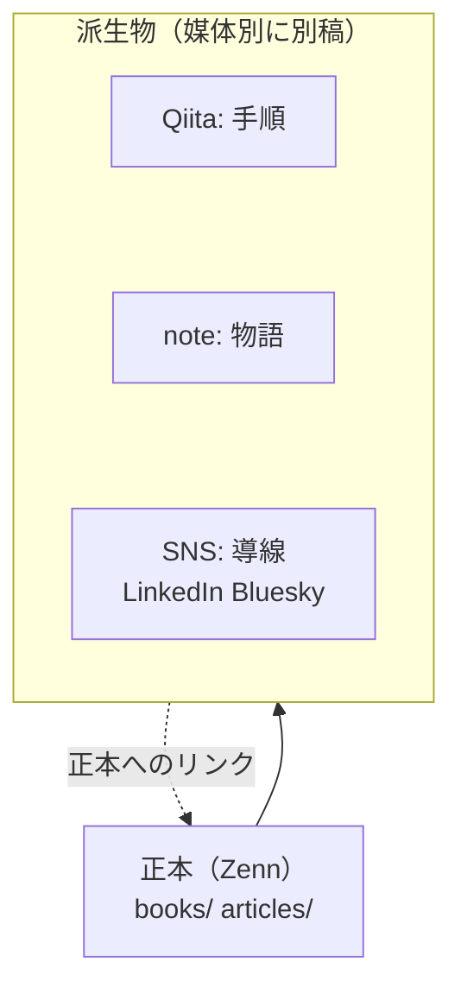
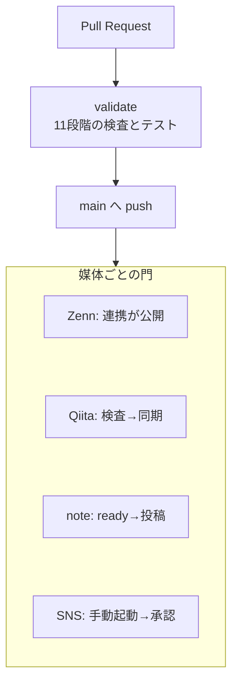

:::message
この記事は、生成AIを使って作成し、筆者が内容を確認・修正したうえで公開しています。使ったツールと用途は、末尾の「生成AIの利用について」に書いています。
:::

## 1. はじめに：本稿の範囲と前提

本稿は、個人の技術発信をGitとGitHub Actionsで運用するための基盤「publishing-hub（マルチプラットフォーム出版・配信基盤）」の設計と実装を説明します。対象の媒体は、Zenn（本と記事）、Qiita、note、LinkedIn、Blueskyの5つです。本稿では、機械による確認をまとめて「検査」と呼びます（題名の「検証」も同じ意味です）。

- リポジトリ: [Takenori-Kusaka/publishing-hub](https://github.com/Takenori-Kusaka/publishing-hub)（原稿、検査規則、検査スクリプト、ワークフローのすべて）

筆者がこの基盤を作った動機は3つあります。第1は、同じ原稿を媒体ごとに手で貼り直す作業が生じ、修正の反映が追いつかなくなったことです。第2は、媒体ごとに読者の目的と表示の規格が異なるため、1つの文章をそのまま流しても読まれにくいと筆者が判断したことです。第3は、投稿を自動化した瞬間に「誤って本番に流す」「認証トークンを漏らす」不安が生じたことです。

筆者はこれらを、技術よりも運用と編集の問題と捉えました。そこで本基盤は、次の4つを設計の柱にしました。

1. 知識の正本（SSOT）はZennの原稿1つに置き、他の媒体は正本から切り出した派生物として別に書く。
2. 媒体ごとの読者に合わせた規則を、文章の校正・構造・用語の3層の検査として機械化する。
3. 派生物どうし、および派生物と正本が「同じ内容の複製」にならないことを検査で保証する。
4. 公開のスイッチは媒体ごとに1つだけ定め、人が切り替える。生成AIには下書きまでを許し、スイッチの操作は指示書で禁じる。

本稿では、なぜこの媒体を選んだのか（2章）、正本はどうあるべきか（3章）、派生物をどう住み分けるか（4章）、情報源と表現の規則（5章）、検査機構（6章）、公開の門（7章）を順に述べます。続けて、この基盤がどう作られたか（8章）と既知の限界（9章）を記し、最後に要点をまとめます（10章）。記述は2026年9月13日時点のリポジトリに基づき、数値はすべてリポジトリ内のファイルまたはGitの履歴から確認したものです。

なお本稿自身も、この基盤の正本です。本稿から切り出したQiita向けの手順記事、note向けのエッセイ、LinkedInとBluesky向けの短文が、それぞれ別の原稿として同じリポジトリに置かれています。4章で、Qiitaとnoteの2つの派生物が正本とどれだけ違うかを、検査の実測値で示します。SNSの短文は重複率の尺度では測らず、正本への導線だけを検査します。

## 2. 媒体の選定：誰に、何を、どの形で届けるか

### 2.1 5つの媒体と役割

媒体を選ぶ基準は、機能の多さではなく「読者が何のためにそこへ来るか」です。本基盤は、各媒体の読者と役割を次のように定義し、設計文書（ADR）、編集ガイド、READMEに書いています。読者像は筆者が定めたものであり、観測した結果ではありません。

| 媒体 | 読者（定義） | 役割 | 求める形 |
| --- | --- | --- | --- |
| Zenn（本・記事） | 技術を体系的に学ぶエンジニア | 正本（SSOT） | 長文・体系的・完全なコードと図・出典 |
| Qiita | 目の前の課題を解きたいエンジニア | 課題解決の手順（レシピ） | 選定理由・コアコード3箇所・公式資料への導線 |
| note | プロダクトマネージャー、意思決定者 | 意思決定の物語 | エッセイ。生コードと図の記法を置かない |
| LinkedIn | エンジニアリングマネージャー、テックリード | 専門家としての判断の提示 | 600〜1,600字の短論考と記事カード |
| Bluesky | 技術的発見を議論したい開発者 | コミュニティとの対話 | 180〜260書記素の1つの観察と外部カード |

Zennを正本に置いた理由は3つあります。

- 本（複数章）と記事の両方をMarkdownで書けること。
- 本文の文字数の上限が公式文書に記載されておらず、1章に数千字のコードと図を置いて公開できていること。
- GitHubのブランチを登録すると変更が自動で同期されること（[Zenn 公式: アカウントにGitHubリポジトリを連携してZennのコンテンツを管理する](https://zenn.dev/zenn/articles/connect-to-github)）。

原稿がGitにあれば、差分のレビューとCIによる検査がそのまま使えます。

Qiitaを選んだ理由は、読者が検索から「今すぐ解きたい課題」を持って来ると筆者が見ていることと、公式のQiita CLIがGitHub Actionsからの同期を提供していることです（[increments/qiita-cli](https://github.com/increments/qiita-cli)）。noteを選んだ理由は、コードを読まない意思決定者に「なぜ作ったか」を届ける場が、技術媒体の側にはないためです。

### 2.2 なぜSNSはLinkedInとBlueskyの2つなのか

SNSは、正本を見つけてもらうための入口（ディスカバリーチャネル）と位置づけています。本基盤が2つに絞った理由は、読者層と投稿手段の両面にあります。

- LinkedInでは、技術の細部よりも「どんなトレードオフがあり、どう判断したか」を重視するマネージャー層を読者と定めています。投稿にはバージョン管理されたPosts APIがあり、記事カードの題名・説明・サムネイルを投稿側で明示的に指定します（[LinkedIn Posts API](https://learn.microsoft.com/en-us/linkedin/marketing/community-management/shares/posts-api)）。
- Blueskyでは、宣伝を嫌い、具体的な1つの観察や問いに反応する開発者を読者と定めています。AT Protocolの投稿スキーマは本文の上限を300書記素（3,000バイト）と定義しており、機械的に検査できます（[app.bsky.feed.post の lexicon](https://github.com/bluesky-social/atproto/blob/main/lexicons/app/bsky/feed/post.json)）。

どちらも公開されたAPIを持つため、ブラウザ操作を使わずに投稿できます。配信時は生成AIを使わず、レビュー済みの本文へUTMとハッシュタグを機械的に付けて送ります。

### 2.3 環状のリンク構造

派生物には必ず正本への導線を置き、SNSは正本へ戻る入口になります。派生物が正本へ向くことで、検索エンジンにZennを正本として扱ってもらうことを狙い、読者には「続きは正本で」という一貫した動線を作ります。検索エンジンへの効果は測っていません。



## 3. 正本はどうあるべきか：題材ごとの要件と「周辺」の方針

### 3.1 正本に求める2つのこと

本稿では、正本に成果物そのものの価値と、その周辺の両方を書くことを方針とします。成果物の価値とは、システムなら設計と動くコード、未来予測なら推論の結果です。周辺とは「How」です。なぜその成果に至れたのか。どの経路で開発し、どれだけの期間と作業を要したのか。どれだけの証拠を調べ、主観をどう排除したのか。派生物は周辺の一部を切り出して語り、全体を網羅するのは正本だけです。この方針は検査では担保できず、筆者が守ります。

### 3.2 題材はソフトウェアに限らない：genre

正本の題材は、ソフトウェアに限らず広義の技術すべてです。設計書に「動くコード」を求める規則を、一次資料に基づく歴史の推論に当てることはできません。そこで作品（本・記事）ごとにgenreを割り当て、genreが要求する要素を検査します。

| genre | 正本に求める要素 | 例 |
| --- | --- | --- |
| engineering | コードブロック、図、GitHubリポジトリへの導線 | 本稿、QuickScribeの設計 |
| technical | 図（コードとリポジトリは求めない） | ソフトウェア以外の技術（電気・機械・測定など） |
| process | 図 | ピットイン方式 |
| research | 出典のインラインリンク | 未来予測の設計図 |
| companion | 本編への導線 | 付録（用語集・参考文献・補論） |
| essay | なし | 見解・思想の記事 |

記事はfrontmatterの`type`から既定のgenreが決まり（techはengineering、ideaはessay）、付録のような例外は設定ファイルの`genre_overrides`で上書きします。本は設定ファイルへの登録で決まります。genreが未登録の本は警告になるため、本を1冊増やすたびに「この題材に何を求めるか」を宣言することになります。

### 3.3 3冊の本が示す「周辺」の書き方

本基盤で公開している本は3冊あり、genreと書き方がそれぞれ異なります。

- [AIが実装する時代の開発プロセス — ピットイン方式](https://zenn.dev/takenori_kusaka/books/pit-in-process)（process、10章）: 開発プロセスと組織設計を、二層構造の図と工程ゲートの表で示します。一人称は「本書」に統一し、章末にナビゲーションのリンクを置く規範を持ちます。
- [ローカル完結ボイスジャーナルの設計 ― QuickScribe を Tauri + Rust + Svelte でつくる](https://zenn.dev/takenori_kusaka/books/quickscribe-design)（engineering、11章）: 設計連載の7章では、設計判断を該当箇所で引用し、脚注で意思決定記録（ADR）を示します。実測に基づく追章では一次情報の脚注で足りるとしています。全章で各脚注に出典のURLを置き、各章の冒頭にはリポジトリへの引用ブロックを置きます。
- [未来予測の設計図 ―― 歴史的事実・現在の外部入力・20年後の社会構造](https://zenn.dev/takenori_kusaka/books/sovereign-resilience-blueprint)（research、97章）: 過去の記述は事実のみで構成し、解釈は章末の節に隔離します。出典は記述の直後にインラインで示し、情報源は一次資料と公的資料に限定します。本文には586箇所のインライン出典があり、参考文献は409件です。

3冊目の本では、章数の上限で失敗しました。Zenn CLIの公式ガイドには「本のチャプターは1冊あたり最大100個まで作成できます」と記載があります（[Zenn CLIで記事・本を管理する方法](https://zenn.dev/zenn/articles/zenn-cli-guide)）。筆者は当初この上限を検査に入れていましたが、2026年9月3日に調査の誤りから検査を外し、106章で公開して101章目以降が反映されないことを実測しました。翌日に上限を検査へ戻し、付録3本を別記事へ切り出し、重複する6章を統合して97章に収めました。この経緯は、検査スクリプトの注釈とコミット履歴に残しています。

### 3.4 正本の文章に求める水準

正本の校正プロファイルは、筆者が商業技術出版に準ずると考える規則と、正本としての客観性を要求します。土台は[textlint-rule-preset-ja-technical-writing](https://github.com/textlint-ja/textlint-rule-preset-ja-technical-writing)で、一文150字、読点3つ、ですます調の統一を課します。加えて、主観的な断定や比喩に流れる語彙（独占を断定する語、情緒的な比喩の語など）と、過剰な謙譲語（「する」を「いたす」と書く類）を、正本では禁止しています。歴史や社会科学の本では固有名詞の漢字が長く連なるため、漢字連続の許可リストを134語持ちます。

## 4. 派生物の住み分け：非対称を規則にする

### 4.1 同じ本文の複製ではなく、同じテーマの別稿

派生物の設計原則は「同じ本文の複製ではなく、同じテーマに基づく個別の成果物」です。読者が違えば、必要な粒度と観点が違います。本基盤は、Qiitaの読者を選定理由と使えるコードを求める人、noteの読者を判断の物語を求める人、SNSの読者を1つの観察を求める人と定義しています。

この住み分けを、媒体ごとの構造ポリシーとして機械化しています。

| 媒体 | 主な規則 |
| --- | --- |
| Qiita | 散文1,500字以上、選定理由の見出し、GitHubリンク、公式資料2ホスト以上、言語名付きコード3箇所以上、冒頭40行以内に正本への導線、Zenn固有記法の禁止 |
| note | コードブロック・インラインコード・Mermaid・表・脚注の禁止、正本への導線、1,500〜6,000字、一人称と意思決定の語、正本と異なる題名 |
| LinkedIn | 600〜1,600字、冒頭140字に告知型の文やURLを置かない、箇条書き3〜5項目、本文のURLは1つ、ハッシュタグ3個まで |
| Bluesky | 各投稿180〜260書記素（上限300）、1投稿1論点（4文まで）、1投稿1URL、外部カードは1スレッド1件、日本語なら`langs: [ja]` |

### 4.2 内容の同一性を見る、長さは見ない

派生物が正本の複製になっていないことは、3つの尺度で検査します。文の同一性（正本と同じ文が派生物の何割か。10%で警告、30%でエラー）、文字8-gramのJaccard係数（一部を書き換えただけの複製。0.2以上で警告）、節構成の写し（派生物の見出しの50%以上が正本と同じなら警告）です。文の同一性は、20字以上の文だけを数えます（閾値は設定ファイルにあります）。

```javascript
/** 派生物の文のうち、正本にも同じ文があるものの割合 */
export function duplicateRatio(variantText, sourceText, minChars) {
  const v = sentenceSet(variantText, minChars);
  const s = sentenceSet(sourceText, minChars);
  if (!v.size) return { ratio: 0, shared: [], total: 0 };
  const shared = [...v].filter((x) => s.has(x));
  return { ratio: shared.length / v.size, shared, total: v.size };
}
```

長さは評価しません。派生物の長さが正本と同じでも、粒度や観点に違いがあれば読者にとって価値を持ちます。長さだけで評価すると「削るために削る」誘因になると考え、内容の同一性だけを見ることにしました。

本稿の派生物に対する実測値は次のとおりです。

| 派生物 | 正本と同一の文 | 8-gramのJaccard係数 | 正本と同じ見出し |
| --- | --- | --- | --- |
| Qiita向けの手順記事 | 0% | 0.01 | 0 / 6 |
| note向けのエッセイ | 0% | 0.00 | 0 / 6 |

### 4.3 導線とUTM

派生物には正本への導線を必ず置きます。Qiitaは冒頭40行以内にZennまたはGitHubへのリンク、noteは本文に正本のURL、SNSは記事カード・外部カード、または本文に正本のURLです。SNSの原稿にはUTMパラメータを書かず、配信時に自動で付与します。正本のURLにUTMが混ざっていると検査でエラーになります。

```javascript
/**
 * Injects standard UTM tracking parameters into a URL using WHATWG URL.
 * Throws an error if any of the UTM parameters already exist to prevent silent overwriting.
 *
 * @param {string} urlStr
 * @param {object} params - { source, medium, campaign, content }
 * @returns {string} - The updated URL string
 */
export function injectUTM(urlStr, { source, medium, campaign, content }) {
  if (!urlStr) return '';
  const url = new URL(urlStr);

  const utmParams = {
    utm_source: source,
    utm_medium: medium,
    utm_campaign: campaign,
    utm_content: content
  };

  for (const [key, val] of Object.entries(utmParams)) {
    if (val) {
      if (url.searchParams.has(key)) {
        throw new Error(`Duplicate UTM parameter detected: URL '${urlStr}' already contains '${key}'`);
      }
      url.searchParams.set(key, val);
    }
  }

  return url.toString();
}
```

`utm_source`は`linkedin`または`bluesky`、`utm_medium`は`social`、`utm_campaign`は原稿ごとのキャンペーン名、`utm_content`は原稿のIDです。

## 5. 情報源と表現の規則：嘘にならず、煽らないために

### 5.1 事実の捏造禁止

本基盤の指示書は、不変条件として「正本（SSOT）にない数値、事実、実績、経験をSNS投稿原稿に付け加えてはなりません」と定めています。筆者はこれをQiitaとnoteの派生物にも適用しています。SNSの原稿を生成AIに下書きさせることは許しますが、その下書きはYAMLファイルとしてリポジトリに置き、公開前に人が読む前提です。ただし本稿執筆時点の履歴にプルリクエストはなく、全コミットが`main`への直接pushです。プルリクエストを契機とする検査は、まだ一度も動いていません。

### 5.2 出典の形式と情報源の限定を機械化する

研究genreの本は、「はじめに」の章で3つの記述規範を宣言しています。過去の記述は事実のみで構成すること、出典は記述の直後にインラインで示すこと、情報源は一次資料と公的資料に限定することです。この宣言を、作品固有の規範として検査に写し取っています。

```json
{
  "id": "srb-citation-format",
  "description": "出典は [ [ n ] ](URL) の形で当該記述の直後にインラインで示す(規範2)。番号だけの出典は不可",
  "must_not_match": "\\[\\s*\\[\\s*\\d+\\s*\\]\\s*\\](?!\\()|(?<!\\[)\\[\\d{1,3}\\](?![\\]\\(])",
  "severity": "error",
  "message": "出典番号にリンクがありません。[ [ n ] ](一次資料の URL) の形にしてください(はじめに 規範2)",
  "target": "body"
}
```

規範はJSONの正規表現として書くため、コードを変えずに増やせます。研究genreの本には、解釈を隔離する節の存在、出典が1つ以上あること、節番号の連番など13の規範があります。engineering genreのQuickScribeの本には、作品固有の規範として、脚注で意思決定記録を示すこと、脚注の参照と定義が対応すること、各脚注に出典のURLがあることを求めます。

情報源の質は、参考文献の付録で明示しています。採用したのは原典テキスト、学術書と査読論文、日本と各国の政府および国際機関の公式資料、研究機関・標準化団体・事業者の技術仕様です。個人のブログ、匿名の言説、検証されていない速報、原典と照合していない生成系の出力は採用していません。掲載したURLは、公開時点で到達可能であることを確認しています。

### 5.3 煽りと複数称の禁止

表現の規則も機械化しています。煽り・セールストーク（「絶対」「革命」「100%」「誰でも簡単」「今すぐ登録」など9パターン）は、SNSではエラー、Qiitaとnoteでは警告です。正本では、この煽り検査の代わりに3.4節の学術調の語彙制限を当てています。複数称・組織称（「私たち」「弊社」「当社」など8パターン）は、全媒体で禁止です。個人の発信で「私たち」と書くと責任の所在が曖昧になると、筆者は考えるためです。LinkedInの冒頭140字には「記事を書きました」型の告知を置けません。読者の文脈に触れない文で始めると、そこで読むのをやめられると筆者は考えるためです。

### 5.4 用語の統一

用語は、全媒体共通・ソフトウェア工学・作品別の5つのスコープに分けた辞書で統一します。規則は合計129件です。辞書にある語は誤表記をエラーにし、辞書にない語は、語末の長音の有無と和欧間スペースの有無の併存を自動で検出して警告します。表記を決めたら辞書に書き、以後は辞書が守ります。

### 5.5 本稿の根拠

本稿の主張も同じ規則で書いています。外部の仕様や公式文書は各節に一次資料へのリンクを置き、本基盤の挙動は本稿執筆時点のリポジトリのファイルとGitの履歴で確認しました。筆者の判断や定義は、事実と区別できるようにその旨を書きました。9章に、リポジトリからは検証できなかった事項と、まだ動いていない仕組みを明記します。

### 5.6 生成AIの利用の開示

原稿は生成AIを使って作るため、読者にその事実を示します。国内の配信先に明示の規定はありませんが、学術出版と報道機関の慣行、EU AI Act の開示規定に倣いました。本文の冒頭には短い告知を置きます。末尾の節「生成AIの利用について」には、使ったツールと用途、人による確認と責任の所在を書きます。本は序文にあたる最初の章に置き、SNSは本文に1文を足します。検査は、告知と宣言の有無、位置、4つの要素を見ます。書かれた内容が事実どおりかは、機械では判定できません。根拠と文例は[リポジトリの設計文書](https://github.com/Takenori-Kusaka/publishing-hub/blob/main/docs/ai-disclosure.md)にまとめました。

## 6. 検査機構：3層のlinterと11段階のcheck

### 6.1 なぜ1本の設定では足りないか

当初、本基盤は1本のtextlint設定を全ファイルに当てていました。しかし1本の設定では、Qiitaに前置きが長すぎることも、noteにコードが紛れ込んだことも、SNSの煽り文句も検出できません。検査は「文の形」「文書の構造」「用語」の3層に分け、媒体ごと・題材ごとに別々の規則を持たせました。

| 層 | 見るもの | 規則の置き場 |
| --- | --- | --- |
| 校正 | 一文の長さ、読点、文体、禁止語彙、謙譲語 | 媒体別の5つのtextlintプロファイル |
| 構造 | genreの要素、作品固有の規範、レシピ・物語・SNSの要件、媒体間の非対称 | 媒体別の構造ポリシー（JSON） |
| 用語 | 辞書違反、長音と和欧間スペースの表記ゆれ | スコープ別の用語辞書（YAML） |

媒体別・題材別の規則の閾値は、スクリプトではなく設定ファイルに置きます。規則の変更が差分として読め、レビューできるようにするためです。本の構成や図の可読性のように媒体に依らない規則の閾値は、先に作ったスクリプトの中に残っています。

### 6.2 `npm run check` の11段階

1つのコマンドが11の段階を順に実行し、途中で失敗しても最後まで走って全体像を1回で見せます。段階は、媒体別の校正、本の構成（100章の制限を含む）、Mermaid図の可読性、日本語の文字集合と複数称、章ラベルのリンク、用語統一、正本の構造、Qiitaの構造、noteの構造、媒体間の非対称、SNS原稿の検査です。結果はMarkdownのレポートにまとまり、CIのStep Summaryに貼られます。

エラーと警告は区別します。エラーはCIを赤にし、警告は判断を人に委ねる助言です。警告も放置せず、規則が誤っているなら設定を、原稿が誤っているなら原稿を直します。

### 6.3 描画事故を検査で見つける

正本の検査は、内容だけでなく描画の事故も見ます。段落の直後に置いた`---`は、CommonMarkでは直前の段落を見出しに変えます。太字の記号`**`は、閉じ側の直前に空白を置くと右側の境界条件を満たさず、記号がそのまま表示されます（[CommonMark Spec: Emphasis and strong emphasis](https://spec.commonmark.org/0.31.2/#emphasis-and-strong-emphasis)）。約物と密着した場合の境界条件は、校正層のtextlint規則が別に見ています。これらの検査を導入した際、開発プロセスの本では記号がそのまま表示される段落を23件検出しました。あわせて章ラベルの参照を検査したところ、付録の用語集で存在しない章への参照を7件検出し、見直しで19件の参照を修正しました。章参照の検査は描画ではなく、リンク先の実在と章題の一致を見るものです。

Mermaid図には、縦方向の配置、ノード8個以下、1つのノードからの矢印2本以下、ラベル1行が全角12文字相当以下（半角は0.5と数える）という規則を、本と記事の図に課しています。Zennでは図が画面幅に縮小されるため、横に広い図は読めなくなるからです。

### 6.4 SNS原稿の検査

SNSの原稿はYAMLで書き、JSON Schema draft 2020-12で構造を検査します（[JSON Schema 2020-12](https://json-schema.org/draft/2020-12)、[Ajv の draft-2020-12 対応](https://ajv.js.org/json-schema.html)）。LinkedInを有効にしたときだけ投稿者と本文を必須にする、Blueskyを有効にしたときだけ言語と投稿配列を必須にする、といった条件付きの必須項目を`if-then`で定義しています。現在のスキーマでは両媒体の項目を書いたうえで、`enabled`で有効と無効を切り替えます。

Blueskyの文字数は書記素で数えます。JavaScriptの`string.length`はUTF-16のコード単位を数えるため、結合文字や絵文字を1文字として数えられません。`Intl.Segmenter`の`granularity: "grapheme"`で分割し、UTMを付与した後の本文に対して上限300を判定します（[MDN: Intl.Segmenter() constructor](https://developer.mozilla.org/en-US/docs/Web/JavaScript/Reference/Global_Objects/Intl/Segmenter/Segmenter)）。LinkedInの文字数は`string.length`で数えており、絵文字を2以上に数える点は既知の限界です。

原稿の全文字列は再帰的に走査し、`TODO`や`{{`のようなプレースホルダー、LinkedInのトークンやBlueskyのアプリパスワードの形式、JWTの形式に一致する文字列があればエラーを積みます。検査は全項目のエラーを集めてから終了コード1を返し、CIは失敗になります。

## 7. 公開の門：生成AIは下書きまで、公開は人が切り替える

### 7.1 媒体ごとに1つのスイッチ

公開のスイッチは媒体ごとに1つです。生成AIがこれらを公開側へ動かすこと、公開するワークフローの起動と承認（Approve）は、指示書で禁じています。機構として止めるのは、Qiitaの未同期記事の検査（7.3節）と、SNSの手動起動とEnvironment承認（7.2節）です。

| 媒体 | 公開のスイッチ | 動くワークフロー |
| --- | --- | --- |
| Zenn | 記事の`published: true`、本の設定の`published: true` | ZennのGitHub連携（pushで同期） |
| Qiita | 記事の`private: false`（未同期の記事は`private: true`か`ignorePublish: true`が必須） | Qiita同期（検査を通してからQiita CLI） |
| note | 原稿の`status: ready`（投稿後は人が`published`に変える） | note投稿（readyに変わった原稿だけ） |
| SNS | 原稿の`status: ready`と対象コミットの`revision` | SNS公開（手動起動とEnvironment承認） |



ここで正直に記すべき点があります。Zennの同期はGitHub連携が直接行うため、検査のCIが失敗してもZennへの公開は止まりません。Zennにとって検査は遮断層ではなく報告です。プルリクエストで見れば公開前の報告になり、`main`へ直接pushすれば公開後の報告になります。本稿執筆時点の履歴は後者です。QiitaとnoteとSNSは、検査を通らなければ配信されない門です。

### 7.2 SNS：読み取り専用の検査と、承認付きの公開

SNSの配信は、検査と公開を別のワークフローに分けています。

プルリクエストの検査は、読み取り権限だけで動き、シークレットへの参照を持ちません。スキーマと編集規則の検査、SNS向けの校正、正本への導線の検査、ユニットテストを順に実行し、最後にプレビューのMarkdownをArtifactに保存します。プレビューの生成処理は環境変数を一切読まないため、秘密情報がプレビューの経路に入ることがありません。

公開は手動起動だけで動きます。確認欄に`PUBLISH`と完全一致で入力しなければ、準備ジョブの最初のステップで失敗します。同じジョブは続けて指定したコミットを取り出し、原稿の`status`が`ready`であることと、原稿に書かれた`revision`のコミットが履歴に存在することを確認します。実際に投稿するジョブはGitHubのEnvironment`social-production`に紐づき、シークレットはこのジョブにだけ渡されます。Environmentに必須レビュアーを設定すると、承認されるまでジョブはシークレットにアクセスできません（[GitHub Docs: Managing environments for deployment](https://docs.github.com/en/actions/how-tos/deploy/configure-and-manage-deployments/manage-environments)）。

投稿するCLIは、CI上で明示的に許可されたときしか実投稿しません。CI用の環境変数を与えない限り、ローカルで誤って叩いても止まります。

```javascript
const isCI = process.env.CI === 'true' && process.env.GITHUB_ACTIONS === 'true';
const isPublishAllowed = process.env.ALLOW_SOCIAL_PUBLISH === 'true';

// Strict local actual publish block
if (!params.dryRun && (!isCI || !isPublishAllowed)) {
  console.error('❌ SAFETY ERROR: Actual social publishing is blocked locally.');
  console.error('To run a safe local dry-run simulation, append the "--dry-run" flag.');
  return false;
}
```

投稿の結果は、媒体ごとのJSON Lines形式の台帳に追記だけで記録します（Append-Only）。キーは`媒体:原稿ID:コミットSHA`で、送信前に`pending`、成功で`published`、途中で失敗すると`partial`や`pending-unknown`を残します。同じキーの最新の状態が`published`、`partial`、`pending-unknown`のいずれかなら、同じジョブ内での再送信を拒否します。送信前に失敗した`failed-before-send`は再送できます。台帳は`main`ではなく専用の`social-ledger`ブランチにコミットし、Zennの同期を汚しません。ただし追記だけという性質は同じジョブ内でしか成り立ちません。この点は9章で述べます。

この経路は2026年9月12日に本稿のSNS原稿で実際に使い、LinkedInとBlueskyの両方で`pending`から`published`への遷移が台帳に記録されました。なおその投稿の本文は、当時の正本の記述に基づいてEXIF除去を配信処理の一部として述べています。9章のとおり、本稿執筆時点ではその処理は配信経路に接続していません。

### 7.3 Qiita：未同期の記事は公開できない

Qiitaの記事は`main`へのpushでQiita CLIが同期します。同期の前に、Qiita向けの校正、レシピの要件、正本との重複率、複数称の検査を通します。まだ同期されていない記事（IDがない記事）は`private: true`か`ignorePublish: true`でなければ検査で止まります。同期でIDが付いた後、`private: false`への切り替えは人が行います。本稿のQiita向け記事も同じ順序で公開しました（非公開で同期、IDの付与、人が公開へ切り替え）。この順序を検査として機械化したのは、その翌日です。

### 7.4 note：readyへの遷移だけが投稿を起こす

noteの原稿は正本とは別のエッセイとして書き、作成時の`status`は`draft`です。人が内容を確認して`ready`に変えてpushすると、そのpushの差分で`ready`に変わった原稿だけが投稿の対象になります。`ready`のまま本文を直しても再投稿はしません。投稿ジョブはEnvironment`note-production`に紐づき、原稿の`publish_after`より前なら投稿せずに終わります。投稿はブラウザ自動操作（Playwright）でエディタに本文を流し込み、公開ボタンを押す方式です。

### 7.5 トークンの監視

LinkedInのアクセストークンには有効期限があります。週次のワークフローが、人が登録した有効期限の変数から残り日数を計算します。7日以下と期限切れではジョブを失敗させてGitHubのIssueを自動で作り、14日以下ではログに警告を出します。Blueskyはログインの成否を確認します。

## 8. この基盤はどう作られたか：経緯と規模

### 8.1 経緯

リポジトリの最初のコミットは2026年8月8日で、開発プロセスの本を公開するためのものでした。以後の経緯は次のとおりです。

| 時期 | 出来事 |
| --- | --- |
| 2026-08-08 | 開発プロセスの本（10章）を公開。QuickScribeの設計本を移設。本の構成を検査するCIを追加 |
| 2026-08-23〜25 | 未来予測の本を公開し、本編60章（設定上は序章・第0章・参考文献を含む63章）へ拡張。全章に本文内の出典を注入。学術調の校正と太字境界の検査を追加 |
| 2026-09-02〜04 | 未来予測の本の査読を完了。100章上限を超えて公開する失敗を経て、付録3本の切り出しと章の統合で97章に再構成 |
| 2026-09-12 | 出版モデルのADR、SNS基盤（スキーマ・検査・配信・台帳・承認付きワークフロー）、Qiita同期、note投稿を追加。この日だけで49コミット |
| 2026-09-13 | 媒体別・題材別のlinterとCIの門を確立（1コミットで121ファイル、6,208行追加、1,159行削除）。長さによる評価を廃止 |

### 8.2 規模

期間は2026年8月8日から9月13日までの37日間（両端を含む）、コミットは108件です。うち103件は筆者、5件はQiita CLIの同期結果（メタデータと、初回はQiita上の既存記事8本）を書き戻すbotです。検査と配信のJavaScriptスクリプトは26ファイル4,917行で、ほかに校正の自動修正用のPythonスクリプトが1本あります。テストは19ファイル1,747行で、テストは93件です。検査規則は、校正プロファイル5本、構造ポリシー6本、用語辞書5ファイル（129規則）と適用範囲の索引1ファイルです。ワークフローは7本あります。

作業時間は記録していないため、本稿では工数を主張しません。示せるのはコミットの件数と日付だけです。

### 8.3 生成AIとの分業

このリポジトリでは、Claude Codeを含む生成AIのエージェントが作業します。共著として記録されたコミットは16件（108件中）で、初期構築、未来予測の本の査読と再構成（100章上限への対応を含む）、linterの拡充に集中しています。AIの権限は指示書で境界を定めています。AIが作れるのは下書きまでで、公開状態への変更、公開ワークフローの起動と承認、正本にない事実の追加は禁止です。2026年9月12日以降は、タスクのIDをコミットに明記しています（108件中42件）。作業の前後で全検査とテストを実行することを指示書で求めていますが、実行の記録は残していません。

linterを整備する前の2026年9月12日時点では、校正のエラーが17ファイルで58件、図の問題が109図中38件ありました。翌日の最終コミットの時点で、11段階すべてがエラー0、警告0になっています。校正と図の規則は先にあり、原稿をそれに合わせて直しました。描画事故の検査（章参照、閉じない強調、段落直後の`---`）は、原稿で見つけた事故を規則に写し取ったものです。

## 9. 既知の限界と未検証事項

研究者的な誠実さとして、リポジトリから確認できなかったこと、まだ動いていないことを明記します。

- 画像のEXIF除去は、依存ライブラリなしのピュアJavaScriptとして実装しユニットテストを通していますが、投稿時のアップロード経路にはまだ接続していません。現状の投稿は画像のバイト列をそのまま送ります。除去の対象もJPEGのAPP1セグメントだけで、PNGのメタデータには触れません。
- 公開台帳による二重投稿の拒否は、同じジョブ内では動きます。しかし公開ジョブは`social-ledger`ブランチの台帳を作業ツリーに復元しないため、実行をまたいだ拒否は動きません。同じ原稿と同じコミットで再度手動起動すると、二重に投稿されます。さらに記録ジョブは当該実行分の台帳でブランチ上のファイルを置き換えるため、ブランチ上の台帳には最後の実行分しか残りません。台帳をジョブ開始時に復元し、追記して押し戻す手順を足す必要があります。
- 指示書はBluesky画像を1MB以下と定めていますが、検査には実装されていません。
- Environmentの必須レビュアーはGitHub側の設定であり、リポジトリのファイルからは設定の有無を確認できません。
- SNS原稿の`publish_after`は、`expires_at`との前後関係を検査するだけで、現在時刻との比較による配信の門ではありません。時刻の門があるのはnoteだけです。
- プルリクエストを契機とする検査（SNS原稿の検査とプレビュー）は、履歴上まだ一度も動いていません。全コミットが`main`への直接pushのためです。
- noteの投稿はエディタの画面構造に依存するブラウザ操作です。画面が変われば壊れます。
- 「物語になっているか」「1投稿1論点か」は語彙と構造の近似です。文単位の重複率は一部を書き換えた複製を捉えられず、それは8-gramの警告で拾います。段落を丸ごと言い換えた複製は、どちらの尺度でも捉えられません。
- LinkedIn本文の上限3,000字は編集ガイドの値で、本稿は一次資料を示していません。Blueskyの300書記素はlexiconで確認しました。LinkedInの文字数は書記素ではなく`string.length`で数えています。

## 10. まとめ

本基盤の要点は4つです。正本はZennの原稿1つに置き、周辺の経緯と証拠まで書く。派生物は媒体の読者に合わせて別に書き、内容の同一性だけを検査し長さは見ない。文章・構造・用語の規則は設定ファイルに置き、CIが機械的に守る。公開のスイッチは媒体ごとに1つで、人だけが切り替える。

次に取り組むのは、9章に挙げたEXIF除去の接続、台帳の復元手順、プルリクエストを前提とした運用への切り替えです。規則と原稿が同じリポジトリにあるので、直した結果はそのまま次の検査に反映されます。設計文書、検査規則、スクリプトはすべて[リポジトリ](https://github.com/Takenori-Kusaka/publishing-hub)にあります。

## 生成AIの利用について

この記事の作成には、生成AIの Claude（Anthropic の Claude Fable 5.1 と Claude Opus 5）を使いました。構成の検討、本文の下書きと改稿、コードの抜粋、校正に使っています。数値は、リポジトリのファイルと Git の履歴から再計算した値です。筆者が内容を確認し、必要に応じて修正しました。公開した内容の責任は筆者が負います。
