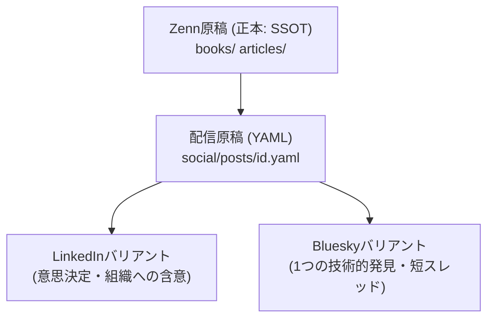

## 1. はじめに：技術発信における「マルチプラットフォーム」の葛藤

技術ブログ、解説書、SNSでのショートTipsなど、現代のエンジニアの発信チャネルは多様化しています。体系的な知識を伝えるなら **Zenn**、具体的なエラー解決手順なら **Qiita** が適しています。また、開発プロセスの泥臭い背景や組織の物語なら **note**、プロフェッショナルとしての知的判断なら **LinkedIn** が向いています。さらに、カジュアルな技術的発見や会話なら **Bluesky** も有効です。このように、媒体によって「読者の目的」や「読みやすさの規格」は大きく異なります。

このとき、多くの発信者にとって、「**コンテンツの管理と配信 of の断片化**」は大きな課題となります。

- **コピペによる複数転載の限界:** 手動での転載は単純作業としての運用コストが極めて高く、文面を修正した際の一括反映も困難になります。
- **機械的な全文ミラー配信のリスク:** 1つの原稿をそのまま全媒体にスクレイピング等で同時投稿するツール（クロス・ポスティング）も存在しますが、これは読者体験を著しく損なうアンチパターンです。検索エンジンに類似ページ群と判定され検索結果から除外（インデックス除外）されるリスクや、SNSの表示文字数・スレッド制限への抵触により、文字化けや途切れを引き起こすリスクがあります。
- **秘密情報や誤公開の恐怖:** 自動投稿botを作る際、ローカル環境で誤って「テスト送信」を叩いて本番公開されてしまったり、認証トークンやパスワードを誤ってリポジトリにコミットしてしまうセキュリティ事故の恐怖が常につきまといます。

私たちは、これらの課題を「エンジニアリング」によって解決しました。

長文の専門テキストを「正本」としてGitで一元管理し、そこから異なる媒体別の価値（バリアント）を人間が明示的に切り出します。そして、GitHub Actionsと専用のバリデーションエンジンにより、検証・プレビュー・本番公開します。今回は、この「**マルチプラットフォーム出版・配信基盤（publishing-hub）**」の設計と実装について共有します。

---

## 2. 推奨設計：「正本（SSOT） ＋ 媒体別派生物」モデル

本基盤が採用した中核的な設計ポリシーは、「**同じ本文の複製ではなく、同じテーマに基づく個別成果物の管理**」です。



1. **Zenn/Qiita/note原稿が「正本（SSOT）」:**
   - 知識や論証の完全な本体は、本リポジトリ内の `books/` や `articles/` フォルダにある Markdown ファイルへ記述します。
2. **`social/posts/*.yaml` が「配信用の媒体別バリアント」:**
   - 正本から「誰の、どの判断を変えるか」を1つだけ選び、LinkedIn用・Bluesky用の最適な文字数や段落構成で記述した、独立した下書き原稿（YAML）を作成します。
   - LLM（生成AI）によるドラフトの合成は許容されますが、生成結果は自動で直接送信されるのではなく、YAMLファイルとしてリポジトリに確定され、Pull Requestの対象となります。
3. **公開Actionは「決定的な処理」のみを実行:**
   - Actionsの実行段階で「AIによる動的な要約やハッシュタグ生成」は行いません。プレビューされた確定済みの文面を読み込み、URLへのUTMパラメータの自動注入、Bluesky用の facets バイトオフセットの決定的な計算、EXIFなどの画像メタデータ除去だけを行ってAPIへ送信します。これにより、予期せぬ挙動や送信文面のズレを完璧に防ぎます。

---

## 3. バリデーションエンジンの設計と実装

本基盤では、YAMLで記述されたSNS配信原稿の整合性を保つため、JSON Schemaによるスキーマ検証に加え、Grapheme（書記素）単位での文字数検証やシークレット漏洩フィルターを実装しています。

### 3.1 JSON Schemaによる構造制限 (Ajv + Draft 2020-12)
`social-post.schema.json` スキーマを記述し、以下の条件的な必須項目を `if-then` ブロックで厳格に定義しています。

- `linkedin.enabled` が `true` の場合のみ、投稿者 `actor` と `text` が必須。
- `bluesky.enabled` が `true` の場合のみ、言語設定 `langs` と `posts` 配列が必須。
- `source.type` が `book_chapter` または `article` の場合のみ、実ファイルへの参照 `path` が必須。

### 3.2 Grapheme（書記素）単位の文字数検証 (Bluesky対策)
JavaScriptの `string.length` は、サロゲートペアや結合文字、ZWJ絵文字（例：`👨‍👩‍👧‍👦`）を正しく「1文字」として数えられません。Blueskyの公式上限である「300文字」を超過しないよう、Node.jsの **`Intl.Segmenter`** を用いたバリデーターをピュアJavaScriptで実装しました。

```javascript
export function countGraphemes(text) {
  if (!text) return 0;
  const segmenter = new Intl.Segmenter('ja', { granularity: 'grapheme' });
  let count = 0;
  for (const _ of segmenter.segment(text)) {
    count++;
  }
  return count;
}
```

### 3.3 依存ライブラリなしのJPEGバイナリ画像処理
アップロード画像に位置情報（GPS）やEXIFメタデータが残っていることは、プライバシー保護の観点から望ましくありません。本基盤では、特定のOSやビルド環境で読み込みに失敗しやすいネイティブパッケージ（Sharp等）を徹底して避け、**依存ライブラリなしのピュアJavaScriptで画像ヘッダーをパースしてEXIF（APP1セグメント：`0xFFE1`）を除去する画像プロセッサー**を実装しました。これにより、WindowsとLinuxのどちらの環境でも同一かつ高速に画像メタデータが除去され、ピクセル情報とアスペクト比だけが安全に維持されます。

### 3.4 プレースホルダー検知とシークレット流出の自動遮断
PRでの確認漏れを防ぐため、データ内を再帰走査して以下を自動検知します。
- `TODO`, `TBD`, `FIXME` やテンプレート記号 `{{` `}}` などのプレースホルダー。
- LinkedInトークンプレフィックス `AQ...`、Blueskyアプリパスワード形式 `xxxx-xxxx-xxxx-xxxx`、一般的なJWT署名。
検知した場合は、CIがエラー（Exit Code 1）を返してワークフローの処理を即座に強制終了します。

---

## 4. GitHub Actions による安全な配信パイプライン

自動公開システムの最大の恐怖である「意図しない本番投稿」を防ぐため、検証権限と公開権限を極限まで分離しています。

```
[開発ブランチ] ➔ プルリクエスト作成 ➔ PR検査Action (social-check.yml)
                                           ├─ スキーマ・論理検証
                                           └─ redacted preview (墨消し) Artifactの生成
                                                   ▼
[mainへマージ] ➔ 手動起動 (social-publish) ➔ Environment承認ロック (Required Reviewer)
                                                   ├─ 承認後、本番投稿実行 (Secretsへアクセス)
                                                   └─ 成功結果を social-ledger ブランチの台帳に記録 (JSONL)
```

1. **PR検査（`social-check.yml`）:**
   - 読み取り専用権限（`permissions: contents: read`）のみで動き、秘密情報（Secrets）へは一切アクセスしません。
   - プレビューレンダラー（`social:render`）が動き、トークンやPerson URNなどのシークレット情報をすべて `[REDACTED]` へ置き換えた高精細なプレビューMarkdownファイルをActions Artifactsへ書き出します。
2. **Environment承認付きの本番公開（`social-publish.yml`）:**
   - 手動実行（`workflow_dispatch`）でのみトリガー可能。`confirm` フィールドに確認キーワード `PUBLISH` を完全一致で入力しなければ即時エラーになります。
   - 実際のAPIクライアントの起動は、GitHubの **Environment `social-production`** で保護します。管理者が手動で「承認（Approve）」ボタンを押すまでは、シークレット（各種APIキー）をジョブのメモリへ絶対に渡さない強固なセキュリティ機構を採用しています。
3. **二重投稿を阻止する「Append-Only 公開台帳」:**
   - 投稿実行の直前に、台帳に一時状態 `pending` を書き込み、APIの応答後に `published`、中途失敗した場合は `partial` や `pending-unknown` などの結果を、JSON Lines（`.jsonl`）形式の公開台帳へ追記（Append-Only）します。
   - この台帳の鍵（キー）に `platform:id:source_sha` を採用し、すでに公開済み、または確認待ちの状態がある場合は、**Actionsを再起動しても台帳側が同一のキーの公開を即座に拒否**します。これにより、ネットワーク切断等による誤った二重投稿（連投スパム化）を防ぎます。
   - Zennの既存の自動デプロイ（`main`へのプッシュを直接Zennが監視）を阻害しないよう、台帳は `main` には書き戻さず、専用の **`social-ledger` ブランチ**にコミットして履歴を完全に分離します。

---

## 5. まとめ：エンジニアとしての「情報発信」の次のステップ

情報の非対称性が強まる現代において、技術を語る「正本」をGitに置き、そこから媒体別に異なる文脈を添えて安全にパブリッシュする仕組みを作ることは、個人の技術的信頼性とデリバリー品質の双方を飛躍的に高めるアプローチです。

「プログラムを書く」ように「自分の言葉と意思決定を届ける」こと。
このマルチプラットフォーム出版・配信基盤は、発信コストをミニマイズし、エンジニアとしての発信力を最大限に引き出すための、強力なライフラインの1つとなります。
