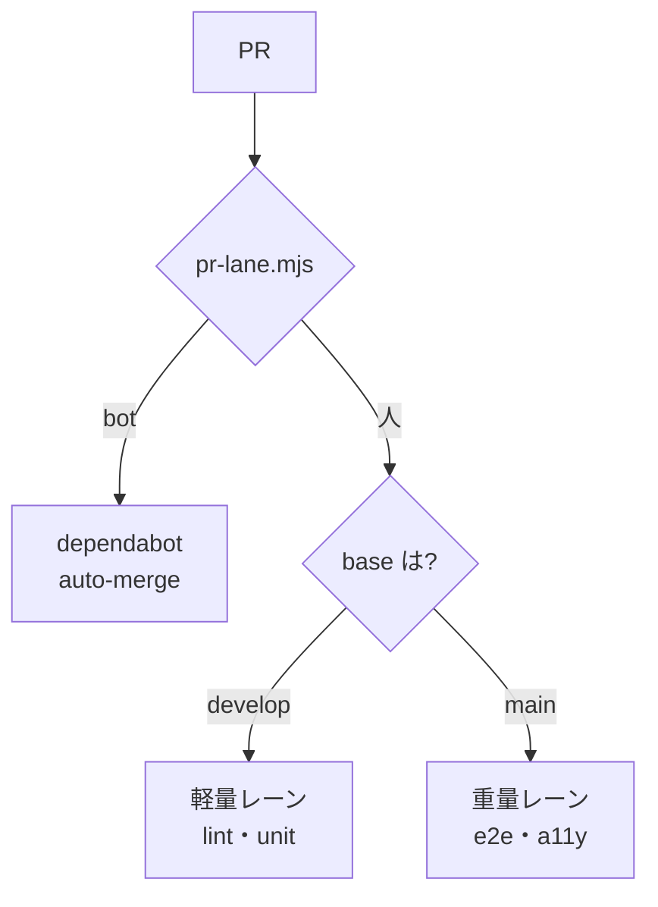

> リポジトリ: [Takenori-Kusaka/ganbari-quest](https://github.com/Takenori-Kusaka/ganbari-quest)

`.github/workflows/` には 33 本の YAML があり、合計 8,530 行です。最大は `ci.yml` の 1,446 行、次が `deploy.yml` の 1,197 行。この章では、33 本を役割で分け、それらを貫く 4 つの原則（lane・required・bot・薄い orchestrator）を扱います。最後に 8 本を消した判断を見ます。個々の gate の中身は第Ⅴ部で扱ったので、ここでは全体の設計だけです。

## 33 本の内訳

| 役割 | 本数 | 例 |
| --- | --- | --- |
| PR の gate | 11 | pr-template-gate（6 job）、pr-quality-gate（4 job）、pr-ac-verification-check、pr-merge-gate、pr-author-guard、lp-metrics、orphan-check |
| CI 本体 | 2 | ci.yml（22 job）、codeql |
| 見た目の回帰 | 3 | lp / child-home / app の visual regression |
| deploy | 5 | deploy（AWS 本番）、deploy-nuc、pages（LP）、deploy-aws-staging、deploy-nuc-staging |
| branch の機構 | 4 | integration-pr、integration-attest、hotfix-back-merge、graphify-refresh |
| 定期 | 8 | cost-audit（月次）、weekly-report、close-leak-report、code-quality-weekly、ac-audit-monthly、admin-bypass-evidence（日次）、security-scan（四半期）、dependabot-auto-merge |

最初の workflow は 2026-03-02 の `ci.yml` で、deploy.yml は 03-17、pages.yml は 03-27 です。PR の gate は 4 月に 8 本が入り、visual regression は 5〜6 月、branch の機構は [第Ⅶ部-2](branch-strategy-evolution) の二層化と同じ 6 月、graphify-refresh は 8 月です[^workflows]。

branch-strategy には、全 workflow の「gate と lane の対応表」があります。各 workflow がどの lane で発火し、どの check context を生むか。「新規 workflow を追加する人はこの表に必ず 1 行追加する」。表は 32 本と書いていますが、実際は 33 本です。かつては表と実体の一致を機械検証する script がありましたが、#4322 で削除され、いまは手動の同期です[^branchstrategy]。

## lane で振り分ける

すべての PR は、まず lane に分類されます。判定の SSOT は `scripts/pr-lane.mjs` の 5 つの rule です。rule 1 は bot（dependabot と renovate）、rule 2 は integration（`release/*` か `develop` から `main`）、rule 3 は hotfix（`fix/*` から `main`）。rule 4 と 5 は feature（`develop` 向け）です。composite action `actions/pr-lane` がこれを各 workflow に配ります[^prlane]。

composite action の置き場所には、GitHub の制約があります。`.github/actions/` に置くと reusable workflow と誤認されるため、リポジトリのルートの `actions/` に置く。ところがその配下の `pr-lane/` は、screenshots 用の `.gitignore` の `/pr-*/` に偶発的に重なります。だから `.gitignore` に `!actions/` の un-ignore があります。[第Ⅶ部-1](monorepo-and-artifacts) で見た 160 行の 1 つは、この衝突の記録です。

`ci.yml` の 22 job のうち、重量の 6 job（storybook、e2e、a11y、cognito、docker、demo Lambda）は develop 向け PR では skip され、main 向けの統合 PR では paths filter に依らず保証発火します。`e2e-matrix` は統合 PR にだけあります。`changes` job の paths filter は、`src/` から `graphify-out/` まで 24 のパターンを持ち、その閉包を test が検査します。filter に漏れたパスの変更で unit test が skip されないためです[^ciyml]。

## required は filter で消さない

対応表には、2 つの不変原則が太字で書かれています。1 つ目は「required は trigger filter で skip 不可」。required status check に登録した context を、`branches:` や `paths:` の filter で workflow ごと skip すると、GitHub 側で「報告されない = pending」のまま merge が永久にブロックされます。だから required の context を生む job は filter で消さず、job の内部で全 lane を実行して観点だけを切り替える。2 つ目は「lane 分岐は job 内部で観点切替、全体 skip 禁止」です[^branchstrategy]。

もう 1 つ、逆向きの注意があります。`ci-gate` は `failure` と `cancelled` だけを数え、`skipped` を数えません。paths filter で skip した job が merge を止めないための、意図された設計です。しかしその結果、「見ていない gate が pass に見える」。[第Ⅴ部-1](pre-ready) で見たとおり、Ready の判定は `ci-gate` の緑ではなく `gh pr checks` で `unit-test` が `pass` であることを見ます。skip は pass ではない、例外なし[^branchstrategy]。

trigger の設計にも、実測に基づく除外があります。`ci.yml` は `ready_for_review` と `edited` で発火しません。Draft から Ready への変更も、PR 本文の編集も、同じ SHA に対する再実行にしかならず、統合 PR では 16〜20 分の重量レーンを丸ごと捨てます。本文を入力にする検査は、軽量な gate 4 本（いずれも 10〜40 秒）が `edited` を購読して担います。この配置は test が機械検証します。concurrency の cancel も PR の lane だけで、main への push の run は cancel しません。短時間に merge が続くと、中間の commit の検証が欠落するからです[^ciyml]。

## bot に PR を出させる

bot が出す PR は 4 種あります。統合 PR、hotfix の back-merge、graphify の refresh、そして dependabot。前の 3 つは [第Ⅶ部-2](branch-strategy-evolution) で見た GitHub App の短命 token を使います。

dependabot は別の扱いで、`dependabot-auto-merge.yml` が patch と minor を CI 通過で自動 merge します。ここには 3 つの修正の跡があります。#4133 は、判定に `github.actor` を使う問題です。人が base を変えたり label を付けた瞬間、actor は人に変わり、auto-merge が発火しなくなる。だから PR の作成者で判定する。#4422 は「人が dependabot の branch を rebase すると commit の署名が失われ、fetch-metadata が job を fail させる」ので、fail ではなく auto-merge 対象外として skip する。#4946 は、`commit.committer.name` を `dependabot[bot]` と比較する判定が常に人の commit と誤判定していた問題です。GitHub は bot が API で作った commit の committer を常に web-flow の `GitHub` にします。そこで比較を直す。直近 5 件の merge 済み dependabot PR で auto-merge が 1 度も動いていなかった、と実測が書かれています[^dependabot]。

反対に、PR を出してはいけない相手もいます。`pr-author-guard.yml` は、PR が opened・reopened・ready_for_review になった瞬間、author を検査します。lab のアカウントなら即 close して違反コメントを投稿します。[第Ⅳ部-3](maker-not-approver) の「作成者 ≠ 承認者」を server side で強制する gate です。それまでの Claude Code の hook と pre-push の hook は client 依存で、Web UI や REST の直叩きを捕捉できず、実際に 2 度違反が再発しました[^authorguard]。

## 薄い orchestrator

branch の機構の workflow は、どれも同じ形をしています。判定は `scripts/*.mjs` の pure function、unit test 付き、workflow は薄い orchestrator。integration-pr の本文は `integration-pr-body.mjs`、back-merge の判定は `hotfix-back-merge.mjs`。attestation の predicate は `generate-release-predicate.mjs`、close 漏れの検出は `close-leak-report.mjs`。「本文組み立て logic は yml に分散させない」と、各 workflow の冒頭のコメントに書かれています[^integrationyml]。

YAML はテストできず、AI が書くと長くなります。ci.yml の 1,446 行と deploy.yml の 1,197 行は、その例です。deploy.yml は、かつて pre-deploy の test を持っていました。ci.yml と完全に重複し、flaky が 2 回走って main が詰まる温床だったので、#1277 で外されました。いまの deploy.yml は build、deploy、health check、失敗時の前 image への rollback、そして PR の本文から顧客向けのリリースノートを作って Discord に送る job です。リリースノートの出典は commit の件名から PR の顧客価値の節に移り、fail-closed になりました（#4883）[^deployyml]。

action は SHA で pin されます。`actions/checkout@3d3c42e5…` のように、tag ではなく commit で。`check-action-sha-pin.mjs` がそれを検査し、[第Ⅵ部-4](graphify) で見た python 依存の hash pin と同じ思想です[^shapin]。

## 8 本を消す

削除された workflow は 8 本です。2026-04-25 に `pr-size-check`（pr-info に統合）。08-02 に `audit-run` と `gcp-terraform`。08-07 に `check-pr-template-sections-sync`・`draft-on-ci-fail`・`issue-close-gate`・`lp-fallback-check`・`zenn-lint` の 5 本[^workflows]。

8 月の 7 本は、#4291 の結果です。オーナーの決定は「すべてのブロッカーを機械で入れることは不可能だと判断しました。機械的な打ち手は『その打ち手を守る打ち手』を呼び、無限ループになります。目標値を 100 点ではなく 80 点に置きます」。61 本の check script と 37 本の workflow を 3 つに振り分ける。A は 80 点のあとの 20 点しか詰めない検査で、削除する。B はリリースの最終レビューで 1 回やれば流出を防げる検査で、統合レーンへ移管する。C は顧客の金・データ・法務に直結し PR 単位でしか判定できないもので、維持する[^issue4291]。

B が効く理由は、こう書かれています。「顧客に届くのは main に入った時点であって、PR が develop に入った時点ではありません。流出を止められる最後の地点で 1 回やれば十分な検査を、PR ごとに 1 日何回も回していました」。[第Ⅶ部-2](branch-strategy-evolution) の二層は、gate を減らす根拠にもなりました。前身の #4121 は「8 本に絞る」を目標にして 1 本も減らせず、#4291 は「装置が実際に減ったことで判定する」と AC を書き換えています。check script は 61 本から 45 本になりました。

## 今ならこうする

lane の分類を 1 つの script に集め、composite action で配る設計は、33 本を 1 つの系として保つ核でした。lane が無ければ、各 workflow が自分の `if:` で base を判定し、判定はずれます。

required を filter で消さない原則は、GitHub 固有の落とし穴を知らないと踏みます。permanent pending は、初めて踏んだとき何が起きているか分かりません。原則を docs に書き、job 内で観点を切り替える形に揃えたのは、正しい。

8 本を消した判断は、この部で最も重要です。AI は workflow を書けます。書けるものは増えます。「その打ち手を守る打ち手」の無限ループを止めたのは、機械ではなくオーナーの 1 文でした。第Ⅳ部で見た「装置を増やさない」は、この 1 文から始まっています。

[^workflows]: workflow の一覧と行数、初出日は `git log --follow` で取った（2026-09-16）。削除は `git log --diff-filter=D -- .github/workflows`。出典: [.github/workflows/](https://github.com/Takenori-Kusaka/ganbari-quest/tree/3af6c2ed9fd4fe5766fc80c255656e940f8ec8f0/.github/workflows)

[^branchstrategy]: ブランチ戦略 SSOT §4 gate 二層対応表（2 つの不変原則、lane 帰属の凡例、全 workflow の対応表）、§4.1 Ready 判定の根拠（skip は pass ではない）。出典: [docs/sessions/branch-strategy.md](https://github.com/Takenori-Kusaka/ganbari-quest/blob/3af6c2ed9fd4fe5766fc80c255656e940f8ec8f0/docs/sessions/branch-strategy.md)

[^prlane]: lane 判定の SSOT と composite action。出典: [scripts/pr-lane.mjs](https://github.com/Takenori-Kusaka/ganbari-quest/blob/3af6c2ed9fd4fe5766fc80c255656e940f8ec8f0/scripts/pr-lane.mjs)、[actions/pr-lane/action.yml](https://github.com/Takenori-Kusaka/ganbari-quest/blob/3af6c2ed9fd4fe5766fc80c255656e940f8ec8f0/actions/pr-lane/action.yml)

[^ciyml]: ci.yml（1,446 行、22 job）。concurrency の設計（#3128）、trigger の除外（#1218 / #4171）、`changes` の paths filter、重量 job の保証発火。出典: [.github/workflows/ci.yml](https://github.com/Takenori-Kusaka/ganbari-quest/blob/3af6c2ed9fd4fe5766fc80c255656e940f8ec8f0/.github/workflows/ci.yml)、[scripts/lib/ci/pr-trigger-lane-registry.mjs](https://github.com/Takenori-Kusaka/ganbari-quest/blob/3af6c2ed9fd4fe5766fc80c255656e940f8ec8f0/scripts/lib/ci/pr-trigger-lane-registry.mjs)

[^dependabot]: dependabot auto-merge の workflow（#2947 / #4133 / #4422 / #4946）。出典: [.github/workflows/dependabot-auto-merge.yml](https://github.com/Takenori-Kusaka/ganbari-quest/blob/3af6c2ed9fd4fe5766fc80c255656e940f8ec8f0/.github/workflows/dependabot-auto-merge.yml)

[^authorguard]: PR 起票アカウントの server side gate（#1994）。背景、動作、設計判断。出典: [.github/workflows/pr-author-guard.yml](https://github.com/Takenori-Kusaka/ganbari-quest/blob/3af6c2ed9fd4fe5766fc80c255656e940f8ec8f0/.github/workflows/pr-author-guard.yml)

[^integrationyml]: 統合 PR の workflow の冒頭コメント（薄い orchestrator の原則）。出典: [.github/workflows/integration-pr.yml](https://github.com/Takenori-Kusaka/ganbari-quest/blob/3af6c2ed9fd4fe5766fc80c255656e940f8ec8f0/.github/workflows/integration-pr.yml)

[^deployyml]: 本番 deploy の workflow（1,197 行）。pre-deploy test の撤去（#1277）、rollback、release notes（#4883）。出典: [.github/workflows/deploy.yml](https://github.com/Takenori-Kusaka/ganbari-quest/blob/3af6c2ed9fd4fe5766fc80c255656e940f8ec8f0/.github/workflows/deploy.yml)

[^shapin]: action の SHA pin の検査。出典: [scripts/check-action-sha-pin.mjs](https://github.com/Takenori-Kusaka/ganbari-quest/blob/3af6c2ed9fd4fe5766fc80c255656e940f8ec8f0/scripts/check-action-sha-pin.mjs)

[^issue4291]: Issue #4291「品質ゲートを 80 点主義で削減・移管する」。オーナー決定、A / B / C の判定基準、やらないこと、AC。出典: [Issue #4291](https://github.com/Takenori-Kusaka/ganbari-quest/issues/4291)
