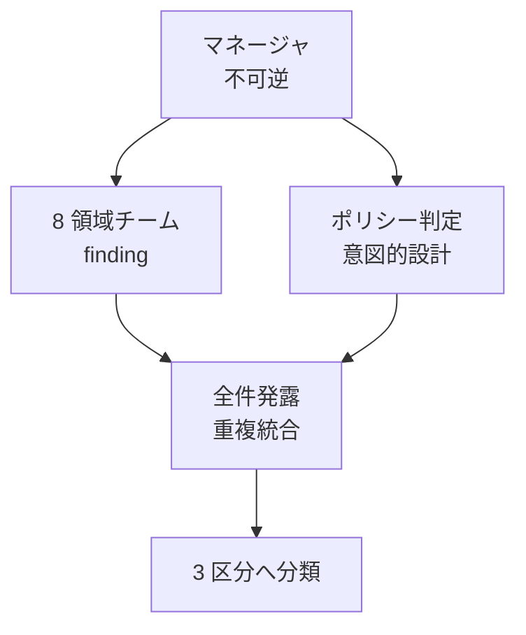

> リポジトリ: [Takenori-Kusaka/ganbari-quest](https://github.com/Takenori-Kusaka/ganbari-quest)

個別のプルリクエストはすべて緑でも、統合した状態では顧客の体験は崩れうるものです。画面間の整合、複数の変更が重なった動線、本番でだけ壊れる差異は、PR 単位のレビューでは原理的に捕まりません。この章では、develop から main への統合を第三者として監査するロール、その構成、finding の扱い、そして「機械が緑でも顧客の画面は壊れうる」を実証した記録を扱います。

## なぜ 2 段目の gate が要るのか

役割定義の文書は、設計の背景をこう書いています。

> 統合前に CUJ（Critical User Journey）を横断する第三者監査層が存在しない: QM は feature → develop PR 単位で「その PR の機能が AC どおりか」を毎時判定するが、複数 PR が develop に積み上がった後の「統合状態で顧客体験が崩れていないか」を横断検査する役割が不在だった。[^auditteam]

main は本番で、push は即 deploy です。QM は毎時、feature から develop への PR を判定します。監査チームは 1 日 1 回、release branch から main への統合 PR を判定します。同じ GitHub アカウントを使いますが、base branch の違いでロールを区別します。役割が曖昧だと起きる 3 つの失敗も明記されています。毎時の QM と判定が衝突して二重判定になること、self-review が形骸化したまま統合されること、検出した問題を 1 件で即棄却して残りを発露させないことです[^auditteam]。

## マネージャ + 8 チーム + ポリシー準拠判定

監査は、1 つの orchestrator と 8 つの領域チーム、そしてポリシー準拠判定の agent で構成されます。

8 つの領域は、競合、技術、プロダクト実装、a11y とユーザビリティ、セキュリティ、パフォーマンス、テスト品質、問題起票です。新設したのは競合調査、ポリシー準拠判定、audit-manager の 3 点だけで、残りは既存の skill やワークフローを再利用します。技術調査は影響分析の skill、a11y は axe-core の job、セキュリティは CodeQL と dependency-review のワークフロー、といった具合です[^auditteam]。

境界は明確です。

> subagent（8 チーム + ポリシー準拠判定）: evidence 生成（finding を structured JSON で出力）が責務。approve / merge / Issue 起票の action 不可。
> audit-manager（orchestrator）: subagent 起動 → evidence 物理 verify → filter → 不可逆 action 実行が責務。evidence 生成（finding 自体の捏造）は不可（Echoing 抑制のため自分で finding を作って自分で採用しない）。[^auditteam]

finding を作る側と、それを採用して行動する側を分けています。[第Ⅳ部-3](maker-not-approver) で見た Echoing、つまり相手の主張を反復して独立した判断が消える現象への対処です。audit-manager は CUJ を横断する構造的な問題については自ら deep research を行いますが、一次情報の URL がない主張は finding にせず、読んでいない URL を引用しません[^auditmanager]。

## 全件発露してから絞る

finding の処理には順序があります。1 件見つけて即棄却するのではなく、固定の時間枠の中で全件を発露させ、そのあと 3 段の filter に通します[^auditteam]。

1. 全件発露。8 チームとポリシー準拠判定が finding を structured JSON で全件出力する
2. 重複統合。同一原因、同一箇所の finding を 1 件にまとめる
3. severity の閾値。軽微（1〜2）は accepted-residual として PR 本文に記録し、重大（3〜4）は次へ
4. ポリシー準拠判定。「あえてそうしているプロダクトポリシー」由来の挙動なら棄却し、根拠の ADR を記録する
5. 残った真の問題を blocking / class-lock 対象 / accepted-residual の 3 区分に強制分類する

第 4 段のポリシー準拠判定は、この製品に特有の必要です。第Ⅰ部で見た anti-engagement 原則や Pre-PMF のスコープ判断により、一般的な SaaS なら「不具合」に見える挙動が意図的に設計されています。それを Issue にしてしまう誤起票を防ぐ filter です。第 5 段は [第Ⅳ部-5](sixty-to-hundred) で見た accepted-residual gate で、severity が high 以上のものは residual にできません。

## 判定に要るエビデンス

統合 PR を merge するために揃えるエビデンスは 6 点です。新機能と修正の一覧、対応するテストケースの一覧、テスト結果の表、カバレッジと ratchet の閾値、severity 閾値以上の未解決 NG が 0 件であること、CodeQL の新規 alert が 0 件であることです[^auditteam]。

CodeQL の扱いは興味深い判断です。CodeQL は解析に時間がかかるため、main の branch ruleset で required にはしていません。しかし「required でないから赤でも通す」を audit-manager が個別に判断することは禁じられています。外形が admin bypass と区別できないからです。代わりに、統合 PR の merge ref に対する open alert が baseline を 1 件も超えないことを NG 0 件の条件に含め、未スキャンや API の取得失敗も fail にします。「検査できなかった」を pass に倒さない、という [第Ⅳ部-4](definition-of-done) の原則がここにも現れます[^auditteam]。

merge の方式も決まっています。統合 PR は merge commit を必須とし、squash は禁止です。develop の履歴の粒度を壊すからです。merge を契機に、SARIF 形式の finding と、含有 PR の一覧やテスト結果と NG 0 件の宣言を載せた predicate が Sigstore で署名され、GitHub の attestation として永続化されます。一時ファイルが揮発しても、merge commit を subject にして監査の証跡を改ざん検知付きで遡れます[^auditteam]。

## 統合 PR で起きること

運用文書には、統合 PR に固有の落とし穴が記録されています。

CI の失敗は、最初の 1 件で止めず、固定の時間枠の中で全 fail を発露させてから triage します。1 件直して再実行し、次の 1 件で止まる、を繰り返すと時間が溶けるからです。監査中に修正を release branch へ足した場合は、古い approve で未監査の変更が merge されることを防ぐため、adversarial の証跡を再生成して再承認します[^auditteam]。

「Closes #N」の欠落は、他のずれと違う副作用を持ちます。GitHub の auto-close が発火せず、merge されると main 上の恒久記録になります。文書は、監査が「Closes を追加した」と報告したのに実際の PR 本文には存在しなかった事例を記録し、下書きと実 body の照合をコマンドで行うよう定めています。

> `grep` で代替しない。 `grep -c "Closes #4129"` は撤回経緯の言及にもヒットする（PR #4152 の実 body で実測 4 件、実際の close 宣言は 0 件）。判定は行頭一致 SSOT（`integration-pr-body.mjs` の `extractClosedIssues`）に委譲されている。[^auditteam]

[第Ⅳ部-4](definition-of-done) の「部分一致で判定しない」の規律が、ここでは運用の手順として現れています。

develop が育ちすぎると、統合 PR は実査できなくなります。main と develop の差が 50 コミットを超えたら PO に release cut を提案する、という規則は、develop が動き続けて凍結できず 4 日間実査不能のまま棄却された統合 PR の経験から生まれました[^auditteam]。

## 機械が緑でも顧客の画面は壊れる

監査の機械化がどこまで進んでも、実機で画面を触る工程は残ります。未知の不具合を探す skill の冒頭には、その理由が 1 行で書かれています。

> 実績: この探索を最初に回した release 第18回（2026-07-31）で、全 CI 緑 + E2E 緑 + 統合監査完了の後に、アップグレード導線が完全に死んでいる（#4139）ことがブラウザ 1 回で見つかった。機械が緑でも顧客の画面は壊れうる。[^defecthunt]

同じ発想で、2026-08-19 には 10 のレンズ（ショップ、子供画面、管理画面、設定、認証、課金、マーケットプレイスとデモ、LP、規約、データ）で実機の総ざらいが行われ、約 180 件の finding から 42 件の Issue が起票されました。そこで見つかった最も重要な class は「SQLite で動くが本番のデータベースでは違う」、つまり本番でだけ壊れる不具合でした。年齢が 0 歳になる、レベルと使用時間が 0 になる、取込が原子的でない、といった事故です。以後の再監査では、本番と同じデータベース実装のレンズを必ず 1 つ入れることになりました。[第Ⅰ部-3](age-tiers) で見た「3 つのデータベース実装の既定値が食い違っていた」事故も、この class に属します。

自動化への慣れにも対策があります。PO の決裁を要しない PR から、1 回の run ごとに無作為で 1〜2 件を抽出し、PO が直接目視するサンプリング監査です。AI のレビューを追認するだけの状態、automation complacency を防ぐためです[^auditteam]。

## 第三者を保つ

[第Ⅳ部-1](one-human-many-sessions) で見た憲章 §0 のルール 8 は「監査だけは第三者を保つ」でした。QM が Dev に指摘を返さず自分で直す運用に切り替えても、監査は PO や Dev の判断に相乗りしません。ただし finding の受け渡しは Issue に積まず、統合 PR のコメントで行い、直せるものは監査自身が PR を出します。その PR を approve するのは QM で、作成者と承認者の分離はここでも維持されます。

一人の人間が全ロールを運用する体制で、監査を「第三者」と呼ぶことには限界があります。それでも、統合の gate を PR 単位の gate と別のセッション、別の時間、別の base branch に置くことで、同じ人間が同じ変更を 2 度、違う視点で見る構造は作れます。この章の役割定義は、その構造を維持するための境界線です。

[^auditteam]: 外部品質監査チームの役割定義。§0 mailbox と 50 コミットの cut 提案、§1 設計背景、§3.1 8 チームの構成、§3.2 既存 skill の再利用マップを引用。§3.3 不可逆 action の専権、§3.5 マージ判定エビデンス（CodeQL の扱い、merge commit 必須、attestation）も引用。さらに §3.6 棄却運用 flow、§3.8 統合 PR の運用（全 fail の発露、再承認、Closes の照合）、サンプリング監査を引用。出典: [docs/sessions/audit-team.md](https://github.com/Takenori-Kusaka/ganbari-quest/blob/3af6c2ed9fd4fe5766fc80c255656e940f8ec8f0/docs/sessions/audit-team.md)

[^auditmanager]: audit-manager の agent 定義。CUJ 横断テーマの deep research と幻覚抑制ルール（一次情報 URL なき主張は finding にしない、読んでいない URL を引用しない）。出典: [.claude/agents/audit-manager.md](https://github.com/Takenori-Kusaka/ganbari-quest/blob/3af6c2ed9fd4fe5766fc80c255656e940f8ec8f0/.claude/agents/audit-manager.md)

[^defecthunt]: 未知の不具合を探す skill。release 第 18 回で全 CI 緑のあとにアップグレード導線の死が見つかった実績。出典: [.claude/skills/ui-defect-hunt/SKILL.md](https://github.com/Takenori-Kusaka/ganbari-quest/blob/3af6c2ed9fd4fe5766fc80c255656e940f8ec8f0/.claude/skills/ui-defect-hunt/SKILL.md)
