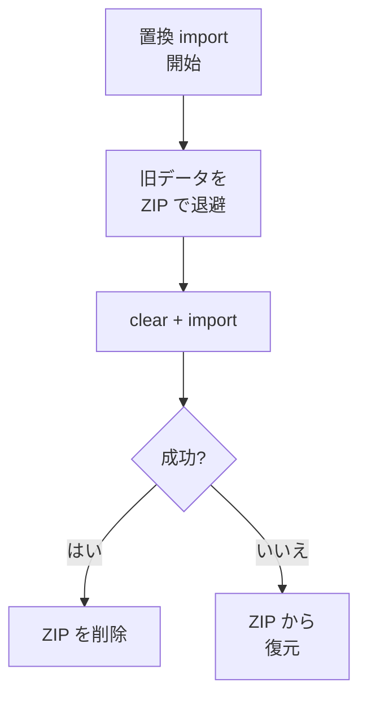

> リポジトリ: [Takenori-Kusaka/ganbari-quest](https://github.com/Takenori-Kusaka/ganbari-quest)

家族のデータは、顧客が自分で持ち出せなければなりません。NUC から SaaS へ、SaaS から NUC へ、あるいは退会の前に手元へ。この章では、ある本番テナントで置換インポートの途中で家族データが半分消えた事故と、そこから設計し直した export と import を扱います。DSQL の 3,000 行制限のもとでの原子性、6MB の壁を越える非同期の配信、そして「何を残し、何を再計算し、何を捨てるか」の分類も扱います。

## 活動が 101 から 0 に

ある本番テナントで、「全削除して逐次投入する」置換インポートが途中で hang し、家族データが半分消えました。clear が先行し、import が途中で失敗すれば、旧データは永久に失われます。構造的に発生する故障モードでした[^replaceimport]。

再設計の文書は、事故の機序を再現テストで確定してから直す方針を取りました。活動が 101 から 0 になった機序は、置換インポートが children を作る前に活動を投入し、child の id の対応表が無いか、先頭の child へ一律に紐付けていたため、per-child の紐付けを喪失していたことです。修正は依存順序（children を先行させ、元の child へ復元する）で、round-trip の完全性テストが回帰のネットになりました[^redesign]。

事故の背景には、export と import の両側の網羅漏れがありました。置換インポートで約半数の種別（活動・活動ログ・評価・ごほうびの大半）が失われ、失敗が warning に埋もれて 200 を返す。非 ACID で半端な状態が残り、per-child の instance を master に flatten して紐付けを失う。個別に直すと別の漏れで再び手戻りするため、export の網羅、import の正しい復元、完全性テストを一体で設計し直しました[^redesign]。

## source、派生、除外

設計原則の 1 つ目は、各 family の実体を「source（保持必須）、派生（source から再計算で復元）、除外（廃止、未実装、再生成可）」のいずれかに必ず宣言することです。分類されない実体があれば CI が落ちます。schema の全テーブルと key builder の全件が registry に含まれることを機械検証し、未 export の source 実体は 0 件を ratchet で守ります[^redesign]。

| 分類 | 例 |
| --- | --- |
| source | children、per-child の活動、活動ログ、ステータス履歴、ポイント台帳、ごほうびの交換、チャレンジ、評価、チェックリスト、親のメッセージ、証明書 |
| 派生 | ステータスの現在値、ポイント残高、活動の習熟度、バトルの状態 |
| 除外 | 廃止した実績と称号、未実装のアバターアイテム、再生成可能なキャラクター画像、繰延中のデイリーミッション |

ステータス履歴を source に置く根拠は、丁寧に書かれています。監査は当初「派生候補」と仮置きしましたが、履歴には減衰（時間駆動の cron）や管理者の手動調整のように、対応する活動ログを持たない変更が含まれます。活動ログからの再計算では原理的に再構成できないため、source に確定しました。一方、ステータスの現在値は履歴から再構成できる真の projection なので派生のままです[^redesign]。

PO の決裁は 5 つです。event-sourcing は Lite（現在値は保持し、復元時のみ派生を再計算）。置換モードは残すが clear 先行は廃止。おやカギコードは backup へ同梱せず復元後に再設定（4 桁の低エントロピーの hash を同梱するリスク）。派生の明示除外を確定。そして下位互換は不要（ユーザー未獲得なので旧 ZIP の互換読込は実装しない）[^redesign]。

キャラクター画像の除外には、正直な注記があります。Gemini の生成は非決定的で、「再生成可 = 除外」は復元時に別の画像が生成されることを意味します。子供が愛着を持つ画像が backup と restore のたびに silent へ変わる。PO 承知の上での除外です[^redesign]。

## import-then-swap

clear と import を「途中失敗時に旧データを必ず復元可能」な原子境界で実行する方法は、backend で違います。SQLite は単一接続で `BEGIN IMMEDIATE` と `ROLLBACK`。pg 系（DSQL と PGlite）は単一のトランザクションが使えません。[第Ⅱ部-6](aurora-dsql) で見たとおり 1 write txn は 3,000 行までで、repo 内のトランザクションのネストも禁止です。そこで補償トランザクションを取ります。clear の前に旧データを full backup の ZIP として storage の recovery の prefix に永続化し、clear と import を試行し、失敗したら ZIP から clear と復元をやり直す。プロセスが死んでも（Lambda の timeout など）永続化済みの ZIP から手動で復旧できます。成功したら ZIP を消します[^replaceimport]。

この strategy にも、本番でだけ壊れる class の事故がありました。backend の判定が demo 以外を全部 sqlite と判定していたため、pg でも better-sqlite3 の接続に BEGIN と ROLLBACK を発行するだけで、実 DB は clear されたままでした。[第Ⅱ部-2](layered-architecture) で見た `isPgBackend()` への統一は、この事故の修正でもあります[^replaceimport]。

ZIP には整合性の manifest が入ります。data.json だけでなく、同梱した画像や音声の全エントリの SHA-256 とバイト数を記録し、import 前に照合して偶発的な破損を検出します。検出できるものとできないものが明記されています。転送や保存中の偶発的破損、記載ファイルの欠落、記載外ファイルの混入、data.json の件数の不一致は検出できる。意図的な改竄は検出できない。manifest は未署名で、攻撃者は改竄後に manifest を再計算できるからです。path injection と zip-slip の防御は別の場所が担い、manifest は「偶発的破損の検出専用」と位置づけられています[^manifest]。

## 6MB の壁

export の ZIP は、当初 request のレスポンス body で直接返していました。AWS では Function URL が buffered モードで body の上限が 6MB、Lambda の timeout が 30 秒。大きめの ZIP は 6MB で配信不能になり 500 でした。NUC でも、生成中にリクエストが返らず、ブラウザやリバースプロキシの timeout に晒され、進捗が見えません。「同期生成してレスポンスで返す」は runtime を問わず不適でした[^async]。

設計は、生成を背景化し、生成物を別の DL 経路で渡す 1 本のフローです。export の起票は `pending` で insert して即返す。5 分ごとの cron が `pending` を拾って `building` を掴み、ZIP を作って storage へ保存し `ready` にする。AWS の dispatcher と NUC の scheduler が同じ job を回すため、`pending` から `building` の遷移は条件付き更新で 1 worker に絞ります。10 分を超えて `building` のままのレコードは、次の cron が `failed` に倒します。`pending` への差し戻しによる自動再試行は採りません。kill された worker が不完全な ZIP を書いている可能性があり、fail-closed でユーザーに再 export を促す方が安全だからです[^async]。

配信は runtime で分かれます。AWS は S3 の presigned URL へ 302 で redirect し、60〜300 秒の短命の URL で 6MB と 30 秒の両方を迂回します。NUC は署名付きのアプリの route が認証済みで stream します。NUC の保存先は `static/` の外です。子供データの ZIP を web 配信の対象に置くと無認証で配信されうるからです[^async]。

受け取り側の取込は、状態を先に判定します。`pending` や `building` なら 409 で「まだ準備中です」、`failed` なら保管し直しの案内。発行から cron の起動までの窓は必ず生成待ちに当たるため、この分類が無いと受け取る側には 500 しか見えません[^async]。

## 保持期間と物理削除

履歴の保持期間はプラン別で、無料は 90 日、スタンダードは 365 日、家族は無期限です。3 つの数値がプロダクト全体の SSOT で、表示側に数値を複製すると、定数を変えた瞬間にテストが落ちます[^retention]。

期限を過ぎた履歴は物理削除されます。ADR-0049 は当初 3 テーブルを対象にしていましたが、PO の「他にも保管期限を同様に管理するデータ群があるはず。抜け漏れが気になる」を受けた調査で、子供関連の 49 テーブルのうち 22 が対象に含まれていない押し漏れが判明し、優先順で対象を拡張しました。親の設定（ごほうびの catalog、チェックリストの雛形）と法的記録（卒業の同意、証明書）は対象外です。ログインボーナスは、per-date の永続行から子供ごとの counter に縮約したことで「削除すべき日次履歴が最初から生まれない」構造になり、対象から外れました[^adr49]。

ポイントの残高は、履歴を削除しても変わりません。[第Ⅱ部-6](aurora-dsql) で見たとおり残高は書込時に更新される派生列で、古い台帳の行を消しても総額は不変です。「ポイントは消えず過去の明細だけが消える」が、顧客への約束です。

NUC の日次バックアップは、[第Ⅲ部-7](nuc-selfhost) で見た HTTP 越しの起動で、取得、検証、確定、ローテーション、状態の記録を担い、最終成功と最終失敗をファイルに残します。fail が沈黙しないための可視化点です[^pglitebackup]。

## 今ならこうする

活動が 101 から 0 になった事故は、この製品で最も顧客に近い事故でした。原因は「clear が先」という順序で、AI が書いた import は素直にそう書きます。旧データを退避してから clear する順序は、事故を経験するまで設計に無く、経験したあとは backend ごとの補償トランザクションとして固まりました。

source と派生と除外の分類は、うまくいった設計です。「全部 backup する」は不可能で、「何を backup しないか」を宣言しなければ、漏れは silent に増えます。分類を registry にし、未分類を CI で落とす形は、[第Ⅴ部-4](fitness-functions) の no-silent-gap と同じです。

6MB の壁は、[第Ⅲ部-3](lambda-sveltekit) の buffered モードの帰結です。非同期の配信は正しい解でしたが、5 分ごとの cron と `building` の reclaim と presigned URL は、同期で返せていれば要らなかった装置でもあります。

[^replaceimport]: 置換インポートの原子化。事故の故障モード、backend ごとの手段（SQLite の単一 txn、pg 系の補償トランザクション）、本番でだけ壊れていた backend 判定。出典: [src/lib/server/services/replace-import-service.ts](https://github.com/Takenori-Kusaka/ganbari-quest/blob/3af6c2ed9fd4fe5766fc80c255656e940f8ec8f0/src/lib/server/services/replace-import-service.ts)

[^redesign]: backup export / import の再設計。設計背景、設計原則 7 つ、活動喪失の機序、source と派生と除外の registry、PO 判断 5 つ、実装状況。出典: [docs/design/backup-import-redesign.md](https://github.com/Takenori-Kusaka/ganbari-quest/blob/3af6c2ed9fd4fe5766fc80c255656e940f8ec8f0/docs/design/backup-import-redesign.md)

[^manifest]: バックアップ ZIP の整合性マニフェスト。保護対象と非対象、注入防御の役割分担、後方互換。出典: [src/lib/server/services/backup-manifest.ts](https://github.com/Takenori-Kusaka/ganbari-quest/blob/3af6c2ed9fd4fe5766fc80c255656e940f8ec8f0/src/lib/server/services/backup-manifest.ts)

[^async]: 非同期 backup export と一時 DL リンクの確定設計。6MB と 30 秒の天井、設計原則 7 つ、status と cron-drain、stale の reclaim、受け取り側の状態判定、DL 経路、NUC の保存先。出典: [docs/design/async-backup-export.md](https://github.com/Takenori-Kusaka/ganbari-quest/blob/3af6c2ed9fd4fe5766fc80c255656e940f8ec8f0/docs/design/async-backup-export.md)

[^retention]: プラン別の履歴保持日数の SSOT。出典: [src/lib/domain/constants/plan-retention.ts](https://github.com/Takenori-Kusaka/ganbari-quest/blob/3af6c2ed9fd4fe5766fc80c255656e940f8ec8f0/src/lib/domain/constants/plan-retention.ts)

[^adr49]: ADR-0049「プラン別の履歴保持期間ポリシー — 物理削除の対象テーブル拡張」。押し漏れ調査、拡張対象と対象外、ログインボーナスの除去。出典: [docs/decisions/0049-retention-physical-delete-extended.md](https://github.com/Takenori-Kusaka/ganbari-quest/blob/3af6c2ed9fd4fe5766fc80c255656e940f8ec8f0/docs/decisions/0049-retention-physical-delete-extended.md)

[^pglitebackup]: PGlite バックアップの実行サービス。取得、検証、確定、ローテーション、状態記録。出典: [src/lib/server/services/pglite-backup-service.ts](https://github.com/Takenori-Kusaka/ganbari-quest/blob/3af6c2ed9fd4fe5766fc80c255656e940f8ec8f0/src/lib/server/services/pglite-backup-service.ts)
