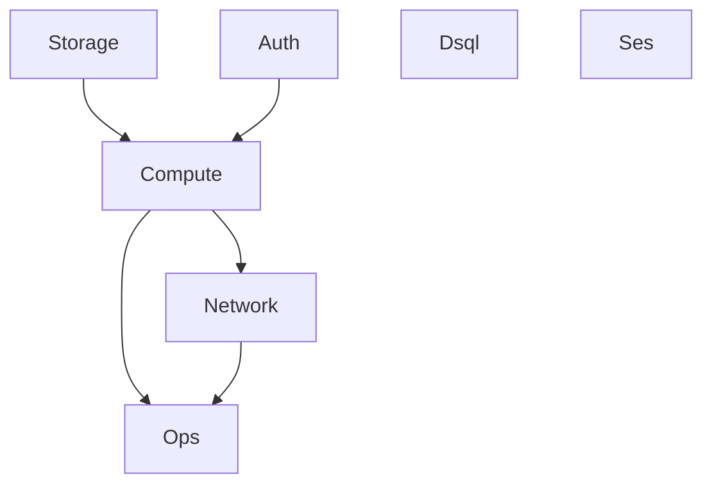

> リポジトリ: [Takenori-Kusaka/ganbari-quest](https://github.com/Takenori-Kusaka/ganbari-quest)

インフラは AWS CDK で書かれ、TypeScript のファイルは `infra/lib/` に 10 本、合わせて約 3,700 行です。この章では、7 つのスタックに分けた理由と、分けたことで生まれた制約、本番と staging を同じクラスで組む仕組み、そして CloudFront と Lambda の間に置いた共有 secret を扱います。生成AIが書くインフラコードで最も高くついたのは、コードそのものではなく、CloudFormation の「使用中の export は消せない」という制約でした。

## 7 つのスタック

| スタック | リソース | 依存 |
| --- | --- | --- |
| Storage | S3、ECR、AWS Backup vault | なし |
| Auth | Cognito User Pool、SSM パラメータ | なし |
| Compute | Lambda（コンテナ）、Function URL、cron dispatcher | Storage、Auth |
| Network | CloudFront、Route 53、ACM | Compute |
| Ops | CloudWatch alarm と dashboard、SNS、Budgets | Compute、Network |
| Dsql | Aurora DSQL cluster、コストの alarm、dashboard | なし（context gate） |
| Ses | SES の送信 identity、受信パイプライン | なし |

region はすべて `us-east-1` に固定です。Cognito のカスタムドメインに使う ACM 証明書が `us-east-1` を要求するため、他のリソースも揃えています[^infraclaude]。

Auth と Compute の間には依存の矢印がありますが、Cognito の設定は cross-stack の export ではなく SSM パラメータで渡します。`app.ts` のコメントは「ComputeStack は SSM パラメータ経由で Cognito 設定を取得（cross-stack export 回避）」と書いています[^appts]。なぜ export を避けるのかは、次の節の事故が説明します。

## 使用中の export は消せない

2026 年 7 月、DynamoDB のテーブルを撤去して Aurora DSQL に一本化しました。テーブルは StorageStack にあり、ComputeStack がその名前と ARN を `Fn::ImportValue` で参照していました。CloudFormation では、利用中の export は削除できず、値の変更もできません。producer 側が export を消せるのは、consumer 側の import の消失が本番へ反映されたあとだけです。撤去は 2 回の deploy に分かれました[^awsdesign]。

1 回目で ComputeStack から参照を全部外し、StorageStack はテーブルと export を保持する。2 回目で StorageStack からテーブルと export を撤去する。1 回目には失敗があり、ARN の export だけを残して名前の export を消したところ、Ref の欠落で rollback しました。以後、Ref と Arn は別の export として数えます[^awsdesign]。

撤去にはもう 1 つ、消せないものがありました。旧テーブルの日次 backup が作った vault です。vault は recovery point を 2 件保持していて、AWS Backup は「recovery point を持つ vault の削除」を API レベルで拒否します。撤去を試みると deploy が失敗し、StorageStack が rollback して本番 deploy が止まります。対処は vault を残して `removalPolicy` を RETAIN に是正することでした。旧設定の DESTROY は CDK の既定に反していて、削除を試みさせる元凶でした。物理的な削除は、移行が安定したあとに PO 承認つきの手作業で行う手順が設計書に残されています[^awsdesign]。

この経験から、cross-stack の export は ratchet で管理されています。`cross-stack-export-ratchet.test.ts` は全スタックを `app.ts` と同じ配線で synth し、export 名と `Fn::ImportValue` を allowlist と集合一致で照合します。baseline は実測 13 本（本番 9、staging 4）です。新しい自動 export が混入したら CI が落ち、SSM で疎結合にしたら allowlist から削除する一方通行です。cross-stack を完全に禁止しないのは、同一 App 内の層状参照が AWS 公式の正規手段だからです[^crossstack]。

## 本番と staging を同じクラスで組む

AWS staging は本番の 4 スタック（Storage、Auth、Compute、Network）を `-c stagingEnabled=true` の context gate でだけ作ります。staging 専用のクラスは書きません。各スタックが optional な `envConfig` prop を持ち、既定値が本番の設定なので、context 無しの synth では本番のテンプレートが従来と同一になります[^envconfig]。

| 設定 | 本番 | staging |
| --- | --- | --- |
| リソース名の prefix | `ganbari-quest` | `ganbari-quest-staging` |
| Backup vault | 作る | 作らない |
| demo Lambda / cron dispatcher / log archiving | 作る | 作らない |
| RemovalPolicy | RETAIN | DESTROY |

`PROD_ENV_CONFIG` のコメントは「値を変えると prod template が変わるため変更禁止」です。本番テンプレートが変わらないことは 3 重に守られます。optional props と既定値による diff ゼロの設計、synth 時に物理名を assert する unit test、deploy 時の Replacement 検知 gate です[^awsdesign]。3 つ目は [第Ⅲ部-4](deploy-gates) で扱います。

assets バケットの名前は、StorageStack が作るときと DsqlStack が backup の対象に載せるときの 2 か所で使います。片方だけ変えると「バックアップしているつもりで別のバケットを見ている」状態になり、しかも成功扱いで気づけません。名前は `env-config.ts` の 1 関数に閉じ、両スタックがそれぞれ呼びます。ARN を GetAtt で渡さないのは、cross-stack の export を増やさないためです[^envconfig]。

## CloudFront の後ろにいることを証明する

Lambda の Function URL は CloudFront の背後にありますが、URL 自体は公開されています。CloudFront の geoRestriction（日本のみ）は、Function URL を直接叩けば迂回できます。2026 年 8 月、CloudFront から origin へ共有 secret を `x-origin-verify` header で送り、`/admin`、`/api/v1/admin`、`/ops` はこの header を要求する構成にしました[^networkstack]。

NetworkStack の props で、この secret は optional ではありません。コメントは「optional にすると『header を付け忘れた distribution』を型で表現できてしまい、その配備は CloudFront 層の制御を Function URL 直叩きで迂回可能なまま黙って動く」と書いています。値の解決は 1 つのモジュールが担い、context に無ければ synth を止めます。空文字で素通しすると「header 無しの distribution + 無効なアプリ側検査」が黙って無防備になるからです[^networkstack]。

secret のローテーションには窓があります。値は CloudFront と Lambda の 2 スタックに配られ、`cdk deploy --all` は依存関係により Compute、Network の順で走ります。値を 1 本だけ差し替えると「Lambda は新値を期待、CloudFront はまだ旧値を送出」の窓が必ず開き、その間 `/admin` が全顧客で 404 になります。対処は 1 世代前の値を `ORIGIN_VERIFY_SECRET_PREVIOUS` に置き、新旧 2 値を並行受理してから切り替える 3 段の手順です[^infraclaude]。

NUC のセルフホストにはこの secret を配りません。NUC は CloudFront を持たず LAN 内で直接配信するので、secret を入れると「front door が無いのに検査が有効」になり、保護者の画面が全部 404 になります。未設定で検査が無効になるのが、NUC の正しい状態です[^infraclaude]。

## deploy で初めて落ちる class を層で捕まえる

第 16 回のリリースで、「synth 成功、unit test 通過、staging すり抜けで、本番 deploy の実 AWS で初めて失敗する」CDK トラブルが 2 class 連続で起きました。infra の CLAUDE.md は、どの層が最初に捕捉すべきかを表にしています[^infraclaude]。

| 層 | 検証 | 捕まえるもの |
| --- | --- | --- |
| 1: synth 静的 lint | `cdk synth --all` の出力を cfn-lint で検査 | AWS schema 由来の制約違反。IAM Role の Description の非 ASCII 文字など |
| 2: project 固有 fitness | synth 後のテンプレートを assert | cross-stack export の ratchet、明示物理名の ratchet、IAM description の ASCII |
| 3: rehearsal | staging への実 deploy | export の in-use ロックなど、deployed-state に依存する失敗 |

上位ほど安価で高速です。cfn-lint は Python の dev tool で、AWS 認証とネットワークのどちらも不要で offline で動きます。CDK が生成するテンプレートのノイズは `.cfnlintrc` で抑え、error ルールだけを hard-fail にしています[^infraclaude]。

## Lambda の env は CDK が SSOT

`aws lambda update-function-configuration` で env を直接足してはいけない、と CLAUDE.md は書いています。足したものは次の deploy でも消えません。CloudFormation は out-of-band の drift を戻さず、テンプレートのプロパティが前回と同一ならそのリソースを触らないからです。実害として、検証のために手で注入した Stripe の price id が staging の full deploy を跨いで残り、「staging で checkout が通る」ことが修正の証拠にならない状態が続きました[^infraclaude]。

機械強制は deploy job の末尾にあります。live の env のキー集合が、CDK テンプレートのキーと実行時に解決するキーの和集合に含まれることを assert します。値は読まず、キー名だけで判定します。判定する step は 1 本だけです。2 本置くと、基準が食い違ったときに一方 pass、一方 fail となり、どちらが正か決められません[^infraclaude]。

## 今ならこうする

7 スタックは、1 人で運用する製品には多すぎました。分割の動機は blast radius と deploy 時間ですが、代わりに cross-stack の制約を抱え、テーブル 1 つの撤去に 2 回の deploy と 1 回の rollback を払いました。SSM パラメータで疎結合にする判断は最初から正しく、export を allowlist で数える ratchet はもっと早く置くべきでした。

一方で、staging を同じクラスで組む判断は、そのまま残します。staging 専用クラスを複製していたら、本番と staging の差分が「意図した差」なのか「追随漏れ」なのか、誰にも分からなくなっていたはずです。設定の差は 1 ファイルの 2 つの定数に閉じ、テンプレートの不変は test が守る。生成AIにインフラを書かせるときに、最も効いた構造がこれでした。

[^infraclaude]: infra 配下の CLAUDE.md。§AWS リソース region SSOT、§CDK deploy 失敗の層別 未然防止（3 層の表と cfn-lint）、§production env 必須配布 4 経路を引用。§`ORIGIN_VERIFY_SECRET` を NUC に配布しない理由、§ローテーションは 2 値受理を前提にする、§Lambda env の SSOT は CDK も引用。出典: [infra/CLAUDE.md](https://github.com/Takenori-Kusaka/ganbari-quest/blob/3af6c2ed9fd4fe5766fc80c255656e940f8ec8f0/infra/CLAUDE.md)

[^appts]: CDK の app entry。region の固定、context の解決、7 スタックの配線、SSM 経由の Cognito 設定、origin-verify secret の fail-fast。出典: [infra/bin/app.ts](https://github.com/Takenori-Kusaka/ganbari-quest/blob/3af6c2ed9fd4fe5766fc80c255656e940f8ec8f0/infra/bin/app.ts)

[^awsdesign]: AWSサーバレスアーキテクチャ設計書。§3 スタック構成の表と §3.1 StorageStack（DynamoDB 撤去の 2-deploy strangler、Ref と Arn の両 export、Backup vault の RETAIN-orphan と物理削除の手順）を引用。§3.1.1 cross-stack export allowlist ratchet と §4.3 AWS staging（prod template 不変の 3 重防御）も引用。出典: [docs/design/13-AWSサーバレスアーキテクチャ設計書.md](https://github.com/Takenori-Kusaka/ganbari-quest/blob/3af6c2ed9fd4fe5766fc80c255656e940f8ec8f0/docs/design/13-AWSサーバレスアーキテクチャ設計書.md)

[^crossstack]: cross-stack export の allowlist ratchet。全スタックを synth して export 名と ImportValue を集合一致で照合する。出典: [tests/unit/infra/cross-stack-export-ratchet.test.ts](https://github.com/Takenori-Kusaka/ganbari-quest/blob/3af6c2ed9fd4fe5766fc80c255656e940f8ec8f0/tests/unit/infra/cross-stack-export-ratchet.test.ts)

[^envconfig]: 環境別 CDK 設定の SSOT。`GqEnvConfig` の各項目、assets バケット名を 1 関数に閉じる理由、`PROD_ENV_CONFIG` の変更禁止、`STAGING_ENV_CONFIG`。出典: [infra/lib/env-config.ts](https://github.com/Takenori-Kusaka/ganbari-quest/blob/3af6c2ed9fd4fe5766fc80c255656e940f8ec8f0/infra/lib/env-config.ts)

[^networkstack]: NetworkStack の props。`originVerifySecret` を必須にする理由、demo の distribution、S3 offload の flag。出典: [infra/lib/network-stack.ts](https://github.com/Takenori-Kusaka/ganbari-quest/blob/3af6c2ed9fd4fe5766fc80c255656e940f8ec8f0/infra/lib/network-stack.ts)。secret の解決は [infra/lib/origin-verify-context.ts](https://github.com/Takenori-Kusaka/ganbari-quest/blob/3af6c2ed9fd4fe5766fc80c255656e940f8ec8f0/infra/lib/origin-verify-context.ts)
