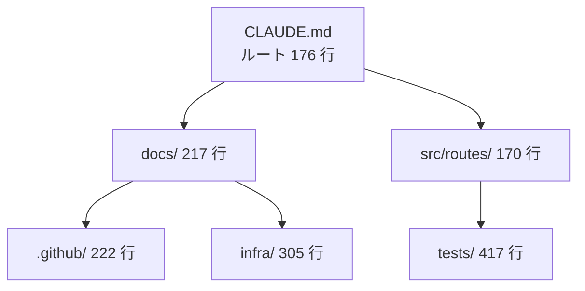

> リポジトリ: [Takenori-Kusaka/ganbari-quest](https://github.com/Takenori-Kusaka/ganbari-quest)

第Ⅵ部は、生成AIに渡す文脈をどう保つかを扱います。コードを書くのは AI ですが、AI が何を読んでからコードを書くかは、人が決めます。この章では、最初の commit に含まれていた 2,881 バイトの CLAUDE.md が 7 階層に育った過程、常時ロードされるファイルの総量を bytes で測って削った判断、そして「読まれているはずの文書が 1 行も読まれていなかった」発見を扱います。

## 初日の CLAUDE.md

2026-02-19 の最初の commit は 6 ファイルで、そのうち 2 つが CLAUDE.md と AGENTS.md でした。CLAUDE.md は 2,881 バイト。主要ディレクトリ、コーディング指針、ビルドとテストのコマンド、やってはいけないこと、コンパクション時の規則、NUC へのデプロイ先が書かれています[^firstcommit]。

コーディング指針の 6 項目は、7 か月後の今もほぼ同じ文で残っています。型は必須、データ取得は `load`、状態は Runes、UI は primitives 経由、`+server.ts` から ORM を呼ばない、API エラーは `error` と `json` で返す。第Ⅱ部で見た層構造と fitness function は、この 6 行を CI が守る形に育てたものです。

コンパクション時の規則も初日からあります。「変更ファイル一覧、実行したテストコマンドと結果、作業中のチケット番号を要約に残す」。会話が長くなると文脈が要約に置き換わるという Claude Code の性質を、初日から前提にしていました。

## 7 階層

現在の CLAUDE.md は 7 つあります。ルート、`docs/`、`.github/`、`infra/`、`src/routes/`、`tests/`、そして `.claude/` です。行数はルートが 176、`tests/` が 417、`infra/` が 305、`.github/` が 222、`docs/` が 217、`src/routes/` が 170、`.claude/` は 3 行です[^rootclaude]。

原則は 2 つです。1 つは「各ディレクトリの CLAUDE.md は、そのディレクトリを触るときに読むものだけを持つ」。`infra/CLAUDE.md` は AWS の region や env の配布経路を持ち、`tests/CLAUDE.md` は repo 走査 test の区分宣言や render-only 禁止を持ちます。もう 1 つは「SSOT の中身をミラーしない」。ルートの CLAUDE.md は、デザインは DESIGN.md、設計書は docs/CLAUDE.md、ADR は decisions/README.md、と指す先だけを書きます[^rootclaude]。

ルートの CLAUDE.md には、1 つだけ長いブロックがあります。CI で hard-fail する検査の一覧です。[第Ⅴ部-1](pre-ready) で見たとおり、この一覧は `ci.yml` と test で突合され、列挙漏れや理由なしの除外で CI が落ちます。CLAUDE.md の中で、機械が正しさを保証している数少ない部分です[^cissot]。

## 常時ロードされる 16 万バイト

CLAUDE.md は、ルートから `@` で他の文書を import します。DESIGN.md、docs/CLAUDE.md、decisions/README.md、codebase-map.md、src/routes/CLAUDE.md。これらはセッションの開始時に全部読み込まれます。

2026-08-06 の Issue #4374 は、この「常時ロードされる 6 file」を bytes で測りました。合計 1,774 行、166,371 バイト。DESIGN.md が 66,974 バイト、decisions/README.md が 42,373 バイトで、2 つだけで全体の 66% でした[^issue4374]。

肥大の原因は、どちらも SSOT のミラーでした。DESIGN.md はカラートークンの全列挙、primitives の一覧、`terms.ts` の atom の一覧をスクリプトで自動生成して載せていました。実体は `app.css` や `terms.ts` にあり、grep すれば足ります。decisions/README.md は、月 1 棚卸のレポート 11 節を本文に抱えていました。それは「現状の正解」ではなく経緯です[^issue4374]。

判断は「掲載しない」でした。DESIGN.md の §2、§5、§6 は「トークン名と値の一覧はこのファイルに掲載しない。SSOT は `app.css`」という形に置き換わりました。[第Ⅱ部-3](design-system) で見た DESIGN.md の各節が「確認手順: `grep -n -- "--color-" src/lib/ui/styles/app.css`」で始まるのは、この判断の跡です。decisions/README.md の棚卸レポートは削除され、履歴は git に委ねられました[^designmd]。

| 時点 | ルート CLAUDE.md | docs/CLAUDE.md | DESIGN.md | decisions/README.md | codebase-map.md |
| --- | --- | --- | --- | --- | --- |
| 2026-02-19 | 2,881 | — | — | — | — |
| 2026-04-30 | 14,385 | 16,042 | 30,904 | 12,648 | — |
| 2026-05-31 | 8,137 | 12,667 | 57,043 | 25,006 | 13,908 |
| 2026-07-31 | 9,012 | 18,542 | 66,974 | 42,373 | 16,030 |
| 2026-09-16 | 15,729 | 22,214 | 59,619 | 22,421 | 16,794 |

単位はバイトで、`git show` で各月末の版を取って数えました。decisions/README.md は 7 月末の 42K から 22K に減り、DESIGN.md は 67K から 60K に減りました。ルートの CLAUDE.md は 8 月に CI hard-fail の一覧を抱えて 14K に戻っています。

## なぜ bytes で測るか

この計測の背景は、2026-08-01 の Issue #4210 です。オーナーの報告は「Claude Code の週間リミットの残が約 10%。枯渇するとプロダクトが停止し、hotfix リリースもできなくなる」でした。リリース 1 回で週間リミットの約 15% を消費し、現状 1 回も打てない[^issue4210]。

それまでの優先軸は作業の安定と品質でした。装置と手順が洗練される一方でトークン消費が増え、消費対効果を一度も見ていなかった。Issue は、消費の所在を数えています。第 19 回のリリース run で、adversarial evidence の再生成が 4 回、監査の自作 test の是正が 3 往復、本文と実態のずれ訂正が 4 回。検査そのものではなく、やり直しが主因でした[^issue4210]。

PO 自身の消費も自己申告されています。決裁コメント 1 件あたり 1,500〜2,500 字を 20 件以上、teammate を 6 名 spawn。「内容の正しさとトークン効率は別軸で、後者を一度も見ていなかった」。この Issue から「常時ロードしない」が原則になり、ルートの CLAUDE.md には「画像アセットを作るときだけ Read する」「teammate を spawn する前に Read する」という但し書きが付きました[^rootclaude]。

行数ではなく bytes で測る理由も、この過程で決まりました。先行した #4308 は `docs/sessions/` を 3,936 行から 1,000 行以下にする Issue でしたが、行数は空行の削除で 29% 減らせてしまい、トークンはほぼ減りません。指標は bytes か token です[^issue4374]。

## 読まれていなかった docs/sessions

#4374 には、もう 1 つの発見があります。#4308 が圧縮しようとしていた `docs/sessions/` は、セッションの文脈に 1 行も載っていませんでした。ルートの CLAUDE.md の `@docs/sessions/po-session.md）` のように、パスの直後に全角の閉じ括弧が空白なしで続いていて、括弧がパスに吸われて import が壊れていた。main と develop の両方で同じでした[^issue4374]。

つまり、第Ⅳ部で見たロールセッションの憲章、label mailbox、agent-teams の運用知は、ルートから自動では読まれていませんでした。読まれていたのは、`.claude/agents/*.md` のロール定義と、skill の本文だけです。そして「書いてあることが多すぎて伝わっていない」が #4308 の問題意識でしたが、伝わっていない理由の一部は量ではなく配線でした。

この本を書いている 2026-09-16 の CLAUDE.md にも、同じ `.md）` の表記が残っています。docs/sessions/ は 4,375 行あります。読まれているかどうかは、Claude Code の import の解釈に依存し、私は確認していません。#4374 の指摘が今も成り立つなら、`docs/sessions/` は「読む人が明示的に Read するとき」だけ読まれる文書です。

## 凍結された AGENTS.md と GEMINI.md

AGENTS.md は、初日の 1 版のまま 7 か月間変わっていません。DB は SQLite、チケットは `docs/tickets/`、API は `api/v1/`、ブランチは `feature/XXXX-チケット名`。どれも現在のリポジトリには無いか、変わっています[^agentsmd]。

GEMINI.md は 2026-04-24 に 1 度書かれ、それきりです。「詳細なルールは各フォルダの GEMINI.md を参照」として `src/routes/GEMINI.md` など 5 つを指しますが、それらは 15〜24 行で、同じディレクトリの CLAUDE.md は 170〜417 行です。CLAUDE.md が 7 か月で 80 回改版される間、GEMINI.md の側は 0 回でした[^geminimd]。

`.github/copilot-instructions.md` は 202 行で 2026-09-04 に更新されていますが、冒頭の技術スタックは SQLite のままです。[第Ⅱ部-1](stack-selection) で見たとおり、Copilot は実装に参加せず、PR の自動レビューも解約されました。この文書は、読み手を失ったまま更新されています[^copilot]。

複数の AI 向けに同じ規約を保つ計画は、実際には 1 つの AI にしか保たれませんでした。CLAUDE.md を変えるたびに AGENTS.md と GEMINI.md を同期させる規則は無く、検査も無かったからです。

## 今ならこうする

CLAUDE.md の階層は、正しい形でした。ディレクトリごとに「そこを触るときの規則」を置き、ルートは指す先だけを持つ。問題は量で、量を測る単位を bytes にしたのは #4210 の逼迫があってからでした。最初から測るべきでした。

CI hard-fail の一覧を test で突合する仕組みは、CLAUDE.md の中で最も信頼できる部分です。同じ仕組みを import の配線にも掛けるべきでした。`@` で指した先が実際に読まれているかを検査する test があれば、docs/sessions は 4 か月早く見つかっていました。

AGENTS.md と GEMINI.md は、生成するか削除するかのどちらかです。手で同期する計画は、1 人の運用では成立しません。1 つの AI に集中した以上、その AI の文脈だけを保つ方が正直です。

[^firstcommit]: 最初の commit（2026-02-19、6 ファイル）。CLAUDE.md 2,881 バイトの初版。出典: [commit 752434b](https://github.com/Takenori-Kusaka/ganbari-quest/commit/752434bef5d6ec109d87b11db9d6540183c91a2a)。初版の本文は [CLAUDE.md（初版）](https://github.com/Takenori-Kusaka/ganbari-quest/blob/752434bef5d6ec109d87b11db9d6540183c91a2a/CLAUDE.md)

[^rootclaude]: ルートの CLAUDE.md。SSOT の指し先、Key Directories、CI hard-fail 一覧、「常時ロードしない」の但し書き。出典: [CLAUDE.md](https://github.com/Takenori-Kusaka/ganbari-quest/blob/3af6c2ed9fd4fe5766fc80c255656e940f8ec8f0/CLAUDE.md)

[^cissot]: CI hard-fail 一覧と `ci.yml` の突合 test。出典: [tests/unit/docs/ci-hard-fail-check-list-ssot.test.ts](https://github.com/Takenori-Kusaka/ganbari-quest/blob/3af6c2ed9fd4fe5766fc80c255656e940f8ec8f0/tests/unit/docs/ci-hard-fail-check-list-ssot.test.ts)

[^issue4374]: Issue #4374「常時ロードされる 6 file を圧縮する」。6 file の bytes 表、DESIGN.md と decisions/README.md で 66%、docs/sessions の import が壊れている指摘、行数ではなく bytes で測る決定。出典: [Issue #4374](https://github.com/Takenori-Kusaka/ganbari-quest/issues/4374)

[^designmd]: DESIGN.md §2、§5、§6 の「掲載しない」と確認手順、§12 更新ルール。出典: [docs/DESIGN.md](https://github.com/Takenori-Kusaka/ganbari-quest/blob/3af6c2ed9fd4fe5766fc80c255656e940f8ec8f0/docs/DESIGN.md)

[^issue4210]: Issue #4210「トークン消費対効果を最優先軸に切り替える」。週間リミット残 10%、リリース 1 回で 15%、第 19 回 run の再生成 11 回、PO 自身の消費。出典: [Issue #4210](https://github.com/Takenori-Kusaka/ganbari-quest/issues/4210)

[^agentsmd]: AGENTS.md（2026-02-19 の 1 版のまま）。Tech Stack に SQLite、Project Structure に docs/tickets と api/v1、Git Workflow に feature ブランチ。出典: [AGENTS.md](https://github.com/Takenori-Kusaka/ganbari-quest/blob/3af6c2ed9fd4fe5766fc80c255656e940f8ec8f0/AGENTS.md)

[^geminimd]: GEMINI.md（2026-04-24 の 1 版）。Context-specific Rules が指す 5 つのフォルダ別 GEMINI.md。出典: [GEMINI.md](https://github.com/Takenori-Kusaka/ganbari-quest/blob/3af6c2ed9fd4fe5766fc80c255656e940f8ec8f0/GEMINI.md)、[src/routes/GEMINI.md](https://github.com/Takenori-Kusaka/ganbari-quest/blob/3af6c2ed9fd4fe5766fc80c255656e940f8ec8f0/src/routes/GEMINI.md)

[^copilot]: Copilot のレビュー指示（202 行、2026-09-04 更新、Project Overview は SQLite のまま）。出典: [.github/copilot-instructions.md](https://github.com/Takenori-Kusaka/ganbari-quest/blob/3af6c2ed9fd4fe5766fc80c255656e940f8ec8f0/.github/copilot-instructions.md)
