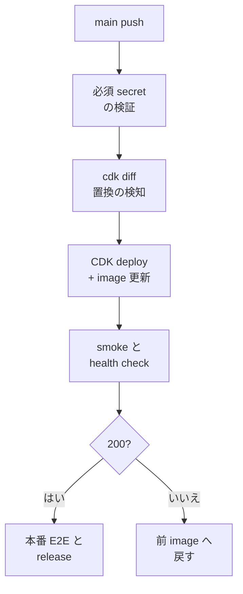

> リポジトリ: [Takenori-Kusaka/ganbari-quest](https://github.com/Takenori-Kusaka/ganbari-quest)

本番への deploy は、main への push で自動的に走ります。人は押しません。だから、deploy の前後に置く gate が、人の判断の代わりをします。`deploy.yml` は約 1,200 行あり、その大半は deploy そのものではなく、deploy の前に止める検査と、deploy の後に確かめる検査です。この章では、2 つの事故から生まれた ADR と、それが workflow のどこに置かれたかを扱います。

## 事故 1: in-place の更新で stuck する

2026-04-21、Cognito の User Pool で email 属性の `mutable` を false から true へ変える CDK の変更を本番に deploy しました。CloudFormation は in-place の更新を試み、`UPDATE_ROLLBACK_FAILED` で止まりました。ADR-0019 は構造的な欠陥を 3 つ挙げています。`deploy.yml` は `cdk deploy` を直接実行しており、deploy 前に `cdk diff` で Replacement が起きるかを確認する仕組みが無かった。PR のレビューで気づけなかった。ADR を書いても実際の deploy で初めて判明するリスクが残っていた[^adr19]。

対処は `check-cdk-replacement.mjs` です。`cdk diff` の出力を解析し、削除、置き換え、置き換えを誘発するプロパティ変更の論理 ID を抽出します。承認は PR 本文かコミットメッセージの `replacement-approved: LogicalId1,LogicalId2` で、承認が無ければ exit 1 で deploy を止めます。全 PR で CloudFormation の changeset を実行する案は AWS 認証と実スタック参照が要るため退け、`cdk diff --strict` は変更があるだけで失敗するため退け、目視のみは同じ経路の再発を防げないため退けました[^adr19]。

この gate には、運用で分かった性質が ADR に追記されています。

- **承認は main HEAD の 1 commit に紐づく**。gate は `git log -1` で HEAD のメッセージだけを読むため、承認後に別の commit を積むと承認が失効する。2026-09-11 の第 22 回統合では、hotfix が 1 つの置き換えだけを承認した状態で HEAD になり、次の run で別の置き換えが露出して 2 度目の BLOCK になった
- **悲観判定がある**。Route 53 の RecordSet に未解決の `Fn::GetAtt` が含まれると、`cdk diff` は値を確定できず「変わったかもしれない」と判定する。SES の DKIM トークンは identity が置き換わらない限り不変なので、aws-cdk-lib の bump で出る BLOCK は差分検出器のアーティファクトである。`--method=change-set` で正確に判定してから承認する
- **真正だが無害な置き換えがある**。`BucketDeployment` が付ける `AwsCliLayer` は全プロパティが Replacement で、失われるものは無い。gate 側で `[exempt]` として必ず出力しながら除外する。型だけ、パスだけでは除外しない
- **本番でしか出ない置き換えがある**。staging の gate は staging のスタックしか見ないため、staging に無いリソースは exercise されない。「staging 全緑 ≠ 本番 deploy 可」で、止まってから実 diff を見て承認する。事前のブランケット承認はしない

## 事故 2: 2 日間、誰も気づかない

2026 年 4 月末、EventBridge の cron を追加した PR の deploy で、本番の cron が全部失敗し、2 日間誰も気づきませんでした。ADR-0024 は 4 つの根本原因が複合したと記録しています[^adr24]。

| # | 根本原因 |
| --- | --- |
| A | GitHub Secret が未登録。PR 本文の「登録済み」の記載は虚偽だった |
| B | CDK の `?? ''` と spread による silent な欠落。env が無くても deploy が通った |
| C | dispatcher Lambda への fallback の注入漏れ |
| D | deploy 後の smoke test が 0、CloudWatch Alarm が 0 |

A は、生成AIが書く PR 本文の弱点そのものです。「登録済み」と書くことと、登録されていることは別で、[第Ⅴ部-6](pr-body-gates) で見たとおり gate は本文の真偽を見られません。B は、ADR-0006 が禁じる「assertion を弱める変更」の CDK 版で、`...(value ? { ENV: value } : {})` のパターンが複数残っていました。

ADR-0024 は 5 つのルールを定めます。必須の env は `tryGetContext` の直後に throw で assert し、silent skip を禁止する。`deploy.yml` に必須 secret の存在を検証する step を置く。新規 Lambda を含む PR は deploy 後の smoke test を必須にする。scheduled な Lambda は CloudWatch Alarm を必須にする。そして 2026 年 7 月の再発から加わったルール 5、既存 env の必須化も新規追加と同じ配布証跡を要求する[^adr24]。ルール 5 の実装は [第Ⅴ部-7](security-scans) で見ました。

## 1,200 行の workflow

これらの ADR の置き場所が `deploy.yml` です。deploy job の流れを、step 名から抜き出します[^deployyml]。

deploy の前は 5 段です。バージョンの判定と必須 secret の検証。OIDC による AWS 認証。Storage スタックの diff と deploy。Docker のビルド、ECR への push、静的アセットの抽出。DSQL の deploy と schema の適用、そして全スタックの diff と deploy です。deploy の後も多段です。orphan の検出と DSQL の role 付与。Lambda イメージの更新と待機。incident webhook と alarm 宛先の検証。demo Lambda の更新。cron dispatcher と demo の smoke。health check と front door の検査。失敗時のロールバック。リソース監査、DSQL backup の smoke、env drift の検査です[^deployyml]。

ci.yml のテストは deploy.yml で繰り返しません。PR 時の ci.yml が branch ruleset の required check で強制しているため、重複実行を避けます。flaky な e2e を deploy.yml でもう 1 度走らせて main を詰まらせる事故が 4 回起きたこと。それがこの分離の理由です[^pipeline]。

## deploy の後に確かめる

health check は Function URL の `/api/health` を 10 秒待ってから 5 回試し、200 が返らなければ exit 1 です。失敗すると、ECR の push 日時で 2 番目に新しい image の digest を取り、`update-function-code` で前の image に戻します[^deployyml]。設計書の rollback 手順は「`git revert` して main に push」「緊急時は console で前バージョンに切替」の 2 つで、workflow の自動 rollback とは別に人の手順として残っています[^pipeline]。

front door の検査は、[第Ⅲ部-2](cdk-stacks) の共有 secret が本当に効いているかを見ます。health check は front door の対象外なので必ず 200 を返し、「検査が黙って無効」を検出できません。そこで header 無しで `/admin` を叩き、404 が返ることを確認します。CloudFront 側の header が origin 側の env とずれる方向は、本番の CloudFront が日本国外の runner を 403 で弾くため自動化できず、残余として明記されています[^deployyml]。

orphan の検出は、rollback で CloudFormation の管理から外れた named resource が `already exists` で再 deploy を止める class への対処です。deploy が失敗したとき、全スタックのイベントと changeset から `already exists` を探し、見つかれば runbook の URL を出します[^deployyml]。

## rehearsal としての staging

本番 deploy の経路そのものを統合 PR で検証するのが AWS staging です。本番の 4 スタックを staging の名前で作り、CDK synth から ECR push、Lambda の更新、health までを実 AWS で貫通させます。staging に本番データは入れず、geoRestriction は外し、Stripe は test mode の鍵だけを 2 段の機械強制で注入します。demo Lambda、cron dispatcher、log archiving は作らず、RemovalPolicy は DESTROY です。固定費は ECR repo の月 $0.05〜0.15 だけで、idle は 0 円です[^awsdesign]。

NUC にも staging があります。本番 NUC と別の working directory、別の port、別の compose project で、直近の本番 DB の snapshot から起動して migration 込みの実機起動を検証します。snapshot は online backup で本番 DB を read のみで取ります[^awsdesign]。

deploy 後の確認手順は `deploy-verify` skill が SSOT で、監査チームの手順の 1 段として AWS と NUC の両 health を見ます[^deployverify]。

## 今ならこうする

2 つの事故に共通するのは、「書いてあること」と「なっていること」の差です。PR 本文の「登録済み」、CDK の `?? ''`、ADR に書いた段取り。どれも書いた時点では守られるつもりで、機械が確かめるまで守られていませんでした。ADR-0019 の最後の一文はこうです。「『ADR を書く』だけでは防げない。機械チェックを deploy フローに組み込むことで、次回の CDK Replacement 事故を予防する」[^adr19]。

一方で、1,200 行の workflow は装置です。[第Ⅳ部-8](platform-session) の凍結以降、deploy.yml に足されたのは front door の検査と env drift の検査で、どちらも「顧客の金かデータに現に届いている」例外に当たります。承認が HEAD の 1 commit に紐づく仕様は、知らなければ 2 度止まります。生成AIに deploy の workflow を書かせるとき、最も読ませるべきは ADR の本文ではなく、ADR に追記された「運用で分かった性質」の節でした。

[^adr19]: ADR-0019「CDK Replacement 検知を deploy 前必須ゲートとして組み込む」。事故の背景と構造的欠陥、検出パターン、承認マーカー、退けた代替案、運用で分かった性質（承認の失効、DKIM の悲観判定、`AwsCliLayer` の除外、本番でしか出ない置き換え）。出典: [docs/decisions/0019-cdk-replacement-detection-gate.md](https://github.com/Takenori-Kusaka/ganbari-quest/blob/3af6c2ed9fd4fe5766fc80c255656e940f8ec8f0/docs/decisions/0019-cdk-replacement-detection-gate.md)

[^adr24]: ADR-0024「インフラ PR 必須要件」。2 日間気づかなかった incident の 4 つの根本原因、2026-07-31 の再発、5 つのルール、例外手続き。出典: [docs/decisions/0024-infra-pr-required-baseline.md](https://github.com/Takenori-Kusaka/ganbari-quest/blob/3af6c2ed9fd4fe5766fc80c255656e940f8ec8f0/docs/decisions/0024-infra-pr-required-baseline.md)

[^deployyml]: 本番 deploy の workflow（約 1,200 行）。deploy job の各 step、health check とロールバック、front door の検査と残余、orphan の検出、env drift の検査、後続の e2e-production / release / release-notes / notify job。出典: [.github/workflows/deploy.yml](https://github.com/Takenori-Kusaka/ganbari-quest/blob/3af6c2ed9fd4fe5766fc80c255656e940f8ec8f0/.github/workflows/deploy.yml)

[^pipeline]: デプロイ・リリースパイプライン設計書。§3.1 フロー（ci.yml と deploy.yml の分離、flaky e2e の事故）、§3.5 ロールバック手順。出典: [docs/design/25-デプロイパイプライン設計書.md](https://github.com/Takenori-Kusaka/ganbari-quest/blob/3af6c2ed9fd4fe5766fc80c255656e940f8ec8f0/docs/design/25-デプロイパイプライン設計書.md)

[^awsdesign]: AWSサーバレスアーキテクチャ設計書。§4 デプロイパイプライン、§4.2 NUC staging（snapshot-forward migration）、§4.3 AWS staging（4 スタック、Stripe test mode の 2 段強制、コスト、prod template 不変）。出典: [docs/design/13-AWSサーバレスアーキテクチャ設計書.md](https://github.com/Takenori-Kusaka/ganbari-quest/blob/3af6c2ed9fd4fe5766fc80c255656e940f8ec8f0/docs/design/13-AWSサーバレスアーキテクチャ設計書.md)

[^deployverify]: deploy 後の実機検証手順の SSOT。出典: [.claude/skills/deploy-verify/SKILL.md](https://github.com/Takenori-Kusaka/ganbari-quest/blob/3af6c2ed9fd4fe5766fc80c255656e940f8ec8f0/.claude/skills/deploy-verify/SKILL.md)
