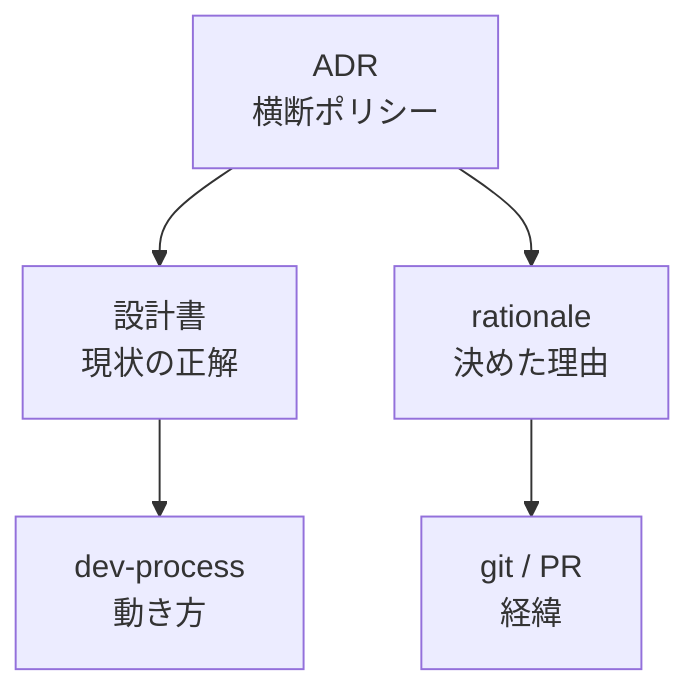

> リポジトリ: [Takenori-Kusaka/ganbari-quest](https://github.com/Takenori-Kusaka/ganbari-quest)

コードより先に設計書がありました。2026-02-19 の最初の commit にある `docs/input/first-input.md` は、オーナーが書いた最初の入力です。「娘と息子に手伝い・運動・勉強・コミュニケーションなど、あらゆるスキルを伸ばしてもらいたい」から始まります。そして、企画書からテスト設計書までの 9 本を `docs/design` に作れ、と指示しています[^firstinput]。この章では、その 9 本がどう増え、何が「設計書は SSOT」という原則を生み、経緯を書かない規律と実在を検査する test がどう加わったかを扱います。

## 2 日で 9 本

2026-02-19 に企画書・要求仕様書・ユースケース設計書、続いて要件定義書・開発指針書。翌 02-20 に UI設計書・API設計書・データベース設計書・テスト設計書。9 本が 2 日で書かれ、`package.json` はそのあとでした[^firstdocs]。

最初の入力には「最初のインプットなのでおそらく不足が多くあります。その際は不足している情報を追加で提供しますので、随時更新してください」とあります。設計書を一度に完成させる想定ではなく、入力を足すたびに更新する前提でした。この文書自体は 2026-04-04 の整理で削除され、git の履歴にだけ残っています[^firstinput]。

現在、番号付きの設計書は 46 本です（01 から 44 まで、17 と 22 は a と b に分かれています）。サブディレクトリを含めた `docs/design/` の Markdown は 100 本。改版の回数を git で数えると、UI設計書が 239 回、API設計書とデータベース設計書が 119 回ずつ、セキュリティ設計書が 96 回、AWSサーバレスアーキテクチャ設計書が 74 回です[^revisions]。

## 会話は消える

「設計書は SSOT」を原則にした ADR-0001 の契機は、2026-04 のスタンプカードです。仕様を会話で 4 回繰り返す事態が起きました。会話で決まった仕様が設計書に反映されず、会話のコンパクションで消えた。決定は「会話で確定した機能仕様は、必ずその場で該当する設計書に反映する。Issue 本文に書いて『設計書は後で』と先送りすることは禁止」です[^adr1]。

これは生成AIとの開発に固有の問題です。人のチームなら、会話の相手が覚えています。AI のセッションは、コンパクションで要約に置き換わり、次のセッションは何も覚えていません。書かれていない仕様は「存在しない仕様」と同じ、という docs/CLAUDE.md の一文は、比喩ではなく事実の記述です[^docsclaude]。

docs/CLAUDE.md は、変更の種別と更新すべき設計書の対応表を持ちます。API は 07、DB は 08、UI は 06、AWS は 13、認証は 14、契約状態は billing-redesign の matrix。禁忌は「設計書は後で」「設計書更新を別 Issue に切り出して本体を Done」です。ADR-0008 はさらに手前で、新テーブル・新 interface・課金・AWS リソースの追加は、実装の前に PO の設計合意を要求します。契機は #804 と #820 で、実装が 90% 進んでから方針と不一致が分かり、PR が 2 本 close されました[^adr8]。

## 3 部構成

2026-04-21 の #1329 で、設計書は 3 部構成になりました。§1 設計背景、§2 設計原則、§3 以降が仕様です。テンプレートは、背景に「この設計がなかった場合に何が困るか」を書くことを求め、原則には good と bad の例を置きます。「とにかく UX を良くする」は bad で、「子供が操作を 2 タップ以内で完了できること」が good です[^template]。

理由は、AI が仕様だけを読むと「なぜそうなっているか」を知らずに変えてしまうからです。原則が書かれていれば、AI は仕様の変更が原則に反するかを判断できます。現在、`設計背景` の節を持つ設計書は 29 本です。全部ではありません。docs/CLAUDE.md は「既存設計書も改訂時に §1〜§2 を追加（後回し禁止）」と書いていますが、漸進適用のまま残っています[^docsclaude]。

## 経緯を書かない

2026-05-22 の #2440 は、docs 配下全体を棚卸し、「経緯メタ情報の混入禁止」を原則にしました。設計 docs は「現状の正解」だけを書く。変更履歴・supersede の経緯・修正理由は git の commit や PR に置く。検討の narrative と棄却案は `docs/rationale/`、意思決定の supersede は ADR、計測結果は `docs/research/`。設計 docs の本文で禁止されるのは、「変更履歴」節、strikethrough の履歴表、「旧 X は #NNNN で撤去済」型の注記、「YYYY-MM-DD 時点」の datestamp です[^docsclaude]。

rationale の層は、この棚卸の前、2026-04-25 に新設されました。ADR は横断の哲学、設計書は結論、その間の「なぜそう決めたか」「何を棄却したか」は、どこにも保存されず時間とともに失われていました。rationale は What ではなく Why を答える文書で、現在 19 本あります。テンプレートの節は、議論の発端、検討した代替案、棄却理由、採用案とその理由、残された懸念です[^rationale]。

この分離は、AI が書く文書に特に効きます。AI は経緯を書くのが得意です。「#1234 で A を導入、#1250 で B に変更、#1300 で撤去済」という文を、AI は正確に量産します。しかし読む側の AI は、現状の正解を知りたいだけです。経緯が本文に混ざると、常時ロードされる bytes が増え、[第Ⅵ部-1](claude-md-hierarchy) で見た逼迫を招きます。

矛盾も残っています。設計書のテンプレート自身が、末尾に「改訂履歴」の表を持ちます。#2440 が禁じた「変更履歴」節そのものです。テンプレートは 2026-04 のもので、棚卸より前に書かれました[^template]。

## 削除と実在の検査

設計書は増える一方ではありません。2026-07-17 に、ライセンスキーの設計書 4 本（要件、ライフサイクル、競合分析、subscription との因果）が削除されました。[第Ⅱ部-12](billing) で見たとおり、ライセンスキーは全廃され、その設計書は「現状の正解」ではなくなったからです。アクセシビリティ監査の一時文書も同じ月に消えました[^deleted]。

残った設計書が指すパスは、test が実在を検査します。並行実装マップに書かれたファイルとディレクトリは、`design-doc-reference-existence.test.ts` が存在を確認し、撤去済みのものを「同期先」として指し続けることを防ぎます。撤去済みで「新設禁止」を伝えるために名前を書く必要があるときは、`ASSERTED_ABSENT` に理由付きで登録し、不在であることを assert する側に回ります[^parallel]。

それでも、第Ⅱ部で見たとおり、技術スタックの表は 3 つの文書でばらばらに古びています。実在の検査はパスにしか効かず、表の中身には効きません。設計書の SSOT 性は、機械が守れる部分と、人が読み直すしかない部分に分かれます。

## 今ならこうする

「設計書は SSOT」は、AI 開発で最初に置くべき原則の 1 つです。会話は消えます。消えない場所に書く規律が無いと、同じ仕様を何度も決め直します。ADR-0001 の契機が「4 回繰り返した」であったことは、規律の無い状態の実測です。

3 部構成は正しい形ですが、29 本で止まっています。テンプレートで新規に強制するより、既存の設計書に §1 と §2 を足す方はコストが高く、後回しになりました。「後回し禁止」と書いても、書いただけでは進みません。

経緯を書かない規律は、AI に書かせる文書でこそ必要です。AI は経緯を書けてしまいます。テンプレートの「改訂履歴」表を消し忘れているのは、規律より前に作ったテンプレートが規律の後も生き残る、という小さな例です。テンプレートは規律の一部で、規律を変えたらテンプレートも変えるべきでした。

[^firstinput]: オーナーの最初の入力（2026-02-19、2026-04-04 に削除）。目的、5 つの重要なこと、ユースケース、作るべき 9 本の設計書。出典: [docs/input/first-input.md（初版）](https://github.com/Takenori-Kusaka/ganbari-quest/blob/752434bef5d6ec109d87b11db9d6540183c91a2a/docs/input/first-input.md)

[^firstdocs]: 設計書 9 本の作成 commit（2026-02-19〜20）。出典: [commit e7206c7（企画書・要求仕様書・ユースケース）](https://github.com/Takenori-Kusaka/ganbari-quest/commit/e7206c71b)、[commit aa593d9（UI・API・DB・テスト設計書）](https://github.com/Takenori-Kusaka/ganbari-quest/commit/aa593d95a)

[^revisions]: 改版回数は `git log --oneline --follow -- <file> | wc -l` で数えた（2026-09-16、main）。出典: [docs/design/](https://github.com/Takenori-Kusaka/ganbari-quest/tree/3af6c2ed9fd4fe5766fc80c255656e940f8ec8f0/docs/design)

[^adr1]: ADR-0001「設計書は Single Source of Truth」。契機（スタンプカード仕様を会話で 4 回繰り返す、#607）と決定。出典: [docs/decisions/0001-design-doc-as-source-of-truth.md](https://github.com/Takenori-Kusaka/ganbari-quest/blob/3af6c2ed9fd4fe5766fc80c255656e940f8ec8f0/docs/decisions/0001-design-doc-as-source-of-truth.md)

[^docsclaude]: docs/CLAUDE.md。設計書更新ルールの対応表と禁忌、docs SSOT 原則（#2440）、research 配置規律（#3516）、3 部構成化原則（#1329）。出典: [docs/CLAUDE.md](https://github.com/Takenori-Kusaka/ganbari-quest/blob/3af6c2ed9fd4fe5766fc80c255656e940f8ec8f0/docs/CLAUDE.md)

[^adr8]: ADR-0008「設計ポリシー先行確認フロー」。#804 と #820 の撤回、PO 合意の 3 形式、免除条件。出典: [docs/decisions/0008-design-policy-pre-approval.md](https://github.com/Takenori-Kusaka/ganbari-quest/blob/3af6c2ed9fd4fe5766fc80c255656e940f8ec8f0/docs/decisions/0008-design-policy-pre-approval.md)

[^template]: 設計書テンプレート。§1 設計背景、§2 設計原則（good と bad の例）、§3 仕様、末尾の改訂履歴表。出典: [docs/design/_template.md](https://github.com/Takenori-Kusaka/ganbari-quest/blob/3af6c2ed9fd4fe5766fc80c255656e940f8ec8f0/docs/design/_template.md)

[^rationale]: rationale の運用ルール。目的、いつ書くか、ADR と設計書と memory との使い分け、テンプレートの節、一覧。出典: [docs/rationale/01-README.md](https://github.com/Takenori-Kusaka/ganbari-quest/blob/3af6c2ed9fd4fe5766fc80c255656e940f8ec8f0/docs/rationale/01-README.md)

[^deleted]: ライセンスキー設計書 4 本の削除 commit（2026-07-17）。出典: [commit e8daa12](https://github.com/Takenori-Kusaka/ganbari-quest/commit/e8daa129e)

[^parallel]: 並行実装マップの冒頭（実在の機械検証、末尾 `/` の規則、`ASSERTED_ABSENT`）。出典: [docs/design/parallel-implementations.md](https://github.com/Takenori-Kusaka/ganbari-quest/blob/3af6c2ed9fd4fe5766fc80c255656e940f8ec8f0/docs/design/parallel-implementations.md)、[tests/unit/docs/design-doc-reference-existence.test.ts](https://github.com/Takenori-Kusaka/ganbari-quest/blob/3af6c2ed9fd4fe5766fc80c255656e940f8ec8f0/tests/unit/docs/design-doc-reference-existence.test.ts)
