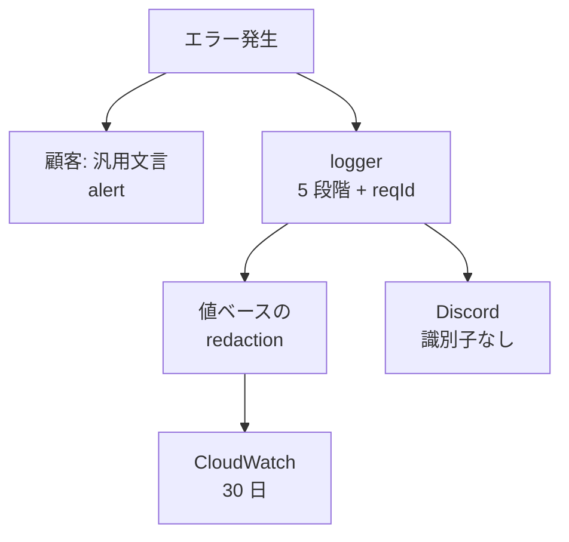

> リポジトリ: [Takenori-Kusaka/ganbari-quest](https://github.com/Takenori-Kusaka/ganbari-quest)

エラーの扱いには 3 つの面があります。顧客に何を見せるか、運営者に何を届けるか、log に何を残すか。この章では、バックエンドのエラーで画面が無反応になる silent failure を禁じた ADR-0062、内部例外を顧客に見せない規約、そして 2026 年 9 月に見つかった「おやカギコードと保護者のメールが CloudWatch に平文で出る」事故と、その 3 層の対処を扱います。3 つ目は、生成AIが書いたデバッグ log が、別の修正で本番に露出した事故です。

## 無反応を禁じる

400 でも 403 でも 500 でも、バックエンドがエラーを返したのに画面が何も言わない。この silent failure が複数の画面で反復しました。通知のボタン、checkout、と続き、根因は統一されたエラー表示の helper が無いことでした。各画面が `error`・`memberError`・`actionMessage` を独自の名前で散在実装していました。`fetch` の `!res.ok`、catch、form action の `failure` を表示に繋ぐ規約がありませんでした[^adr62]。

ADR-0062 はこれを WCAG 2.2 の 3.3.1（Error Identification）と 4.1.3（Status Messages）の二重違反と位置づけ、種別と通知手段のマッピングを 1 軸で決めました。

| 種別 | 手段 | role |
| --- | --- | --- |
| 一時的で回復可能 | Toast と再試行、永続なら Banner | status |
| 入力起因の 400 | field 直下の inline と集約サマリー | aria-invalid と alert |
| 権限や状態起因の 403 と 409 | Banner に状態と次のアクション | alert |
| サーバ内部の 500 | Dialog か Alert で操作をブロック | alert |

Toast は、success と info なら `role="status"` で 3 秒で消え、error なら `role="alert"` で自動では消えません。修正を要するエラーをタイマーで消すと情報が失われるからです。共通原則は、色だけに依存しない、子供画面はひらがなで責めない文言と次のアクション、await を伴う全操作で loading の表示と確定のフィードバック[^adr62]。

再発防止は ratchet です。routes と features の client の `fetch` のうち、エラー処理を伴わないものを走査し、baseline を超える新規の silent fetch を CI で落とします。[第Ⅴ部-4](fitness-functions) の Base トークンの ratchet と同型です[^adr62]。

## 内部例外を見せない

500 系は、サーバの body の message を信用せず汎用の文言にします。DynamoDB や Stripe や SQL の生の例外、スタックトレース、例外のクラス名は、logger と監視だけに送ります。サーバ層は `error(status, 'UI 向け文言')` を返し、`err.message` をそのままレスポンスに載せません。Apple の HIG の「コード羅列タイトル禁止」と NN/g の「専門用語禁止」が根拠です[^adr62]。

この規約は、[第Ⅱ部-15](notifications-pwa) の push の subscribe と unsubscribe で個別に適用されています。catch が `String(err)` を client に返していた箇所を汎用の message に置き換え、内部例外は server の log だけに残します。

## 運営者に届ける

Discord への alert には、スロットリングがあります。キーは path と errorSummary の組で、5 分の窓に 3 件が閾値。1〜2 件は個別に通知、3 件目は「多発検知」のまとめ通知、4 件目以降は無音、5 分経過でリセット[^logdesign]。

alert に載せる内容は、[第Ⅲ部-5](observability) で見たとおり顧客識別子を含みません。「載せてよい」のは事象の種別、発生時刻、件数、エラー種別、環境名、job 名、そして log を引くための鍵の requestId。「載せない」のは tenantId、childId、メールアドレス、家族名、顧客データそのもの。redact は呼び出し側ではなく送出側で行う単一強制点です。callsite ごとの注意に依存すると、新しい alert が 1 つ増えるたびに漏れます[^notifyprivacy]。

残る穴も明記されています。自由記述（error message や stack）に日本語の氏名や活動名がそのまま含まれる場合、機械的には検出できません。落とせるのは email、電話、カード、UUID、長い数字列、URL の path 中の id といった形が決まっているものまでです。だから embed に載せる field は「こちらが決めた項目だけ」に閉じ、顧客データを field 名で足さない設計を併用します。ADR-0061 の accepted residual です[^notifyprivacy]。

## log に何を残すか

logger は 5 段階（debug、info、warn、error、critical）の構造化 log で、本番の最小レベルは info です。NUC では日次のファイルに書き、Lambda では console 出力だけが CloudWatch への到達経路です[^logger]。CloudWatch Logs は 30 日保持され、[第Ⅲ部-5](observability) で見たとおり Firehose 経由で S3 に archive されます。ログ設計書は CloudWatch の保持を「無期限（デフォルト）」と書いていますが、CDK は 30 日を設定しています[^logdesign]。

2026 年 9 月 12 日、第 22 回リリースの直後に事故が見つかりました。放置タブの 503 を直す hotfix が、logger の `entry.context` を console に出すように変えました。それまで本番のどこにも到達していなかった context が、この変更で一斉に露出しました。そこに、削除され忘れた時限のデバッグ log が乗っていました。おやカギコードの char code の列で、平文と可逆です。本番の最小レベルは info なので、warn は通過します。おやカギコードを 1 回間違えるだけで、その PIN が平文相当で CloudWatch に残る状態でした。保護者のメールアドレスの平文も 15 か所ありました[^issue4947]。

context を出す変更自体は正しいものでした。その前の障害（fail-closed の 503）で、DB 例外の cause が実質どこにも書かれておらず、原因不明のまま化していたからです。正しい修正が、忘れられたデバッグ log を露出させました[^logger]。

QM は当初の修正を BLOCK しました。当初の `sanitizeContext()` は context の key 名だけを見ていて、message や error の値に含まれる PII を通すからです。対処は「context の key 名で隠す」から「PII が log に出る class を 3 層で閉じる」に変わりました。出口の値ベースの redaction、発生源のデバッグ log の削除、そして再発を検出するテストです。ファイル出力も同じ redaction を通します。既に出てしまった平文の削除は不可逆でオーナーの手番のため、別 Issue に切り出されました[^issue4947]。

## 副作用を分離する

活動を記録したあとの副作用（スタンプ、レベル判定、通知、証明書）は、Hook パターンで疎結合に実行されます。dynamic import と try-catch で、1 つの hook の失敗が記録そのものを止めません。[第Ⅱ部-6](aurora-dsql) で見た「core は単一 txn、optional は独立」の分離は、この Hook パターンの DSQL 版です[^errordesign]。

## 今ならこうする

ADR-0062 が置いたマッピングは、エラー表示を「どの画面でどう出すか」の判断から、「種別が決まれば手段が決まる」規約に変えました。生成AIは画面ごとに違う表示を書きます。規約が無ければ、それは 1 画面ごとの発明になります。

平文の PIN の事故は、3 つの学びを含んでいます。時限のデバッグ log は時限を守らない。「本番に到達していない」log は、到達経路が変わった瞬間に到達する。そして key 名で隠す redaction は、値を見ていない。QM が最初の修正を BLOCK したことが、3 層の対処を生みました。作成者と承認者の分離（[第Ⅳ部-3](maker-not-approver)）が、そのまま効いた例です。

alert の「残る穴」を明記した判断は、正直な設計の例です。日本語の自由記述から氏名を機械で落とすことはできません。できないことをできないと書き、embed の field を閉じることで別の方法で守る。生成AIは「全部 redact する」と書きたがりますが、それは嘘になります。

[^adr62]: ADR-0062「統一エラー通知設計」。コンテキスト（silent failure の反復と WCAG）、種別 × 通知手段のマッピング、内部例外の非露出、Toast の role と自動消滅、共通原則、fetch の ratchet。出典: [docs/decisions/0062-unified-error-notification.md](https://github.com/Takenori-Kusaka/ganbari-quest/blob/3af6c2ed9fd4fe5766fc80c255656e940f8ec8f0/docs/decisions/0062-unified-error-notification.md)

[^logdesign]: ログ設計書。5 段階のレベル、requestId、Discord alert の通知条件とスロットリング、保持ポリシー。出典: [docs/design/17b-ログ設計書.md](https://github.com/Takenori-Kusaka/ganbari-quest/blob/3af6c2ed9fd4fe5766fc80c255656e940f8ec8f0/docs/design/17b-%E3%83%AD%E3%82%B0%E8%A8%AD%E8%A8%88%E6%9B%B8.md)

[^notifyprivacy]: 運用者向け外部通知の payload から顧客識別子を落とす単一強制点。載せてよいものと載せないもの、送出側で redact する理由、残る穴。出典: [src/lib/server/notify-privacy.ts](https://github.com/Takenori-Kusaka/ganbari-quest/blob/3af6c2ed9fd4fe5766fc80c255656e940f8ec8f0/src/lib/server/notify-privacy.ts)

[^logger]: 構造化 logger。ファイル出力と console 出力の分岐、console に meta を出す理由、ファイル出力への redaction。出典: [src/lib/server/logger.ts](https://github.com/Takenori-Kusaka/ganbari-quest/blob/3af6c2ed9fd4fe5766fc80c255656e940f8ec8f0/src/lib/server/logger.ts)

[^issue4947]: おやカギコードと保護者メールが CloudWatch に平文で出ていた修正 PR。発生の経緯、QM の BLOCK と 3 層への変更、過去分の削除の切り出し。出典: [PR #4947](https://github.com/Takenori-Kusaka/ganbari-quest/pull/4947)

[^errordesign]: エラーハンドリング設計書 §6 サイドエフェクトのエラー分離（Hook パターン）。出典: [docs/design/28-エラーハンドリング設計書.md](https://github.com/Takenori-Kusaka/ganbari-quest/blob/3af6c2ed9fd4fe5766fc80c255656e940f8ec8f0/docs/design/28-%E3%82%A8%E3%83%A9%E3%83%BC%E3%83%8F%E3%83%B3%E3%83%89%E3%83%AA%E3%83%B3%E3%82%B0%E8%A8%AD%E8%A8%88%E6%9B%B8.md)
