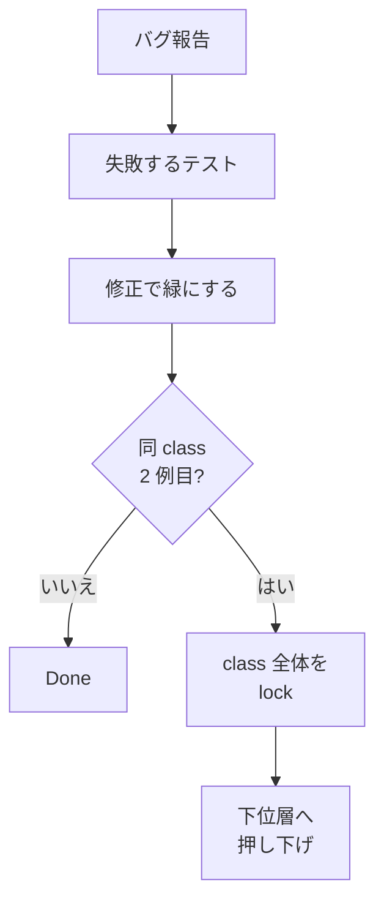

> リポジトリ: [Takenori-Kusaka/ganbari-quest](https://github.com/Takenori-Kusaka/ganbari-quest)

`tests/unit/architecture/` には 97 本のテストがあります。どれも機能の正しさを見るテストではありません。「routes から DB を直接触っていない」「除外リストの理由が空でない」「不採用と記録した OSS が実は使われていない」といった、リポジトリの構造や運用文書と実装の一致を検査します。この章では、この種のテストをなぜ書くことになったのか、どんな形をしているのか、どこまで効いてどこで止めたのかを扱います。

## モグラ叩きを断つための 5 原則

きっかけは 2026 年 6 月の export / import 機能でした。2 サイクル連続で blocker が出て、日本語名の値域、points の値域と、別の instance を都度パッチした結果「1 つ直すと次が露見する」状態になりました。ADR-0061 はこれを個別の見落としではなく構造の失敗と診断しています。

> 再発防止が「人の注意」依存で、不変条件が高レベル (e2e) にしか表明されていない構造的失敗である。同じ class のバグが安価な PR-time check に降りていないため、統合監査まで露見しない。[^adr61]

決定は 5 原則です。

| # | 原則 | 内容 |
| --- | --- | --- |
| 1 | failing-test-first | バグ修正は、まず失敗するテストを書き、それが緑になることで修正を証明する |
| 2 | same-class-N → guard | 同じ class が 2 回出たら、別 instance のパッチでは Done にせず、class 全体を機械で lock する |
| 3 | push-down-the-pyramid | 重量レーンで落ちるたび「同じ条件を unit / lint で捕まえられたか」を問い、下位層に降ろす |
| 4 | fitness function 化 | CLAUDE.md の散文の構造ルールを、人手レビューでなく vitest の走査テストに encode する |
| 5 | accepted-residual gate | 反対理由を 3 件生産することと 3 件 Issue 化することを分け、受容する残課題は統合 PR 本文に記録する |

原則 2 には、あとから発火の前倒しと、適用範囲の限定が加わりました。前倒しは「N 回再発を待たず、同じ PR で同 class の 2 例目に触れた時点で lock する」です。限定は 2026-07-30 の amendment で、[第Ⅳ部-8](platform-session) の凍結と同じ実測を根拠にしています。

> 原則 2 の class-lock は 顧客に見える不変条件 (データ整合 / 課金 / 認可 / 日付境界 / 表示崩れ) にのみ適用する。検証装置自身の不具合 (CI gate / hook / PR body 検査 / テンプレート整合) には適用しない。装置の不具合への処方は class-lock ではなく 装置の削減であり[^adr61]

装置に class-lock を掛けると「装置を守る装置」が生まれ、それがまた新しい class の発生源になる。ADR はこれを who-watches-the-watchmen と呼び、無限後退の実例として「同 class 4 例目 / 6 例目」を名乗る Issue が open の 10% を占めた事実を挙げています[^adr61]。97 本のうち 58 本が ADR-0061 を引用していますが、その全部がこの限定の前に書かれたわけではありません。限定後に増えたのは、顧客の金・データ・認可に接続するものです。

## 走査テストの基本形

最初の適用は routes と DB の境界でした。CLAUDE.md には「`+server.ts` から ORM 直呼び禁止、routes に DB 直接アクセス禁止」と散文で書かれていましたが、守るのは人でした。`route-db-boundary.test.ts` は `src/routes` 配下の全ファイルを読み、`drizzle-orm` や schema、backend 固有の repo を import している route を列挙します。新規ツールの導入はゼロで、既存の vitest と node の fs だけです[^routedb]。

このテストには QM のレビューで開いた穴が記録されています。当初は静的な `import ... from` だけを見ていたため、`switch/+page.server.ts` が動的 `import()` で raw ORM を呼んでいるのをすり抜けました。QM は BLOCK を出し、テストは `import('...')` と `require('...')` も対象にしました。既知の違反は `BASELINE_VIOLATIONS` に 1 件単位で明記し「baseline の拡大は不可、縮小のみ歓迎」と決めています。現在この配列は空です[^routedb]。

同じ形で、値の上限を刻む variant があります。デザインシステムの Base トークン（`--color-brand-500` のような生のスケール）は routes で直接使わず Semantic トークンを経由する規約ですが、既存の `.svelte` に 221 か所（37 ファイル）の使用がありました。0 件の hard guard は不可能なので、`BASELINE_OCCURRENCES = 221` を上限とし、増えたら落ち、減らしたら定数を下げる ratchet にしました[^basetoken]。

## 値そのものを読む

構造だけでなく、値を読むテストもあります。Lighthouse の実測で、子供ホーム、ショップ、親ダッシュボード、LP の 4 画面がコントラスト比で落ちていました。最悪は 1.51:1 です。原因は個々の component ではなく、トークンの値でした。`--theme-primary` を白文字の塗りにも白背景の文字にも使い回していたためです。

値を直しても「誰かがブランド色を明るく戻す」「新テーマを足すときに strong 系を書き忘れる」で静かに戻ります。そのため `color-contrast-tokens.test.ts` は `app.css` を読み、文字色トークンと背景トークンの組み合わせを列挙して WCAG 1.4.3 AA の 4.5:1 を数値で検証します。component 側でどのトークンを使っているかは axe を使った E2E が担い、二層で見る構成です[^contrast]。

## 網羅漏れを黙って見逃さない

admin リソース管理画面の正準契約は registry で宣言されています。契約の弱点は「registry に載っていない画面」で、載っていなければ検査の対象外になり、黙って漏れます。`admin-resource-model-registry.test.ts` は admin route の実ファイルシステムから `+page.*` を持つディレクトリを導出し、全画面が registry か明示除外リストのどちらかで説明されていることを要求します。除外は理由付きで登録し、契約が自身の網羅漏れを見逃さない形にしています[^registry]。

ところが、この「理由付き」自体が守られていませんでした。#4030 の横展開調査で、`reason` フィールドを持ちながら値を読む assertion が 0 件のリストが 10 件見つかりました。空文字でも通ります。しかも、#4025 が「正しい実装」として引用した当のファイルで、姉妹のリストには非空の assertion があり、もう一方には無い状態でした。テストのコメントは「先例が自分自身に対する反証になっていた」と書いています[^exclreason]。

対処は 2 段です。`exclusion-reason-nonempty.test.ts` が export されたリストの理由を検査し、`TODO` や `n/a` のような定型の stub も弾きます。判定の実体は `reason-declaration.mjs` に集約され、最小 12 文字と stub 一覧を SSOT として複数の gate が共有します。「理由の非強制を作らない」は #3956 の教訓です。gate ごとに stub 一覧を持つと、片方だけ `n/a` を通すドリフトが起きるためです[^reasondecl]。

## 記録を反証可能にする

ADR 一覧には「OSS 調査済み・不採用記録」の表があります。Graphify は 2026-07-29 に不採用として記録されたあと、2026-08-06 に採用され、hook が毎コミット走る状態になりました。それでも表は不採用のまま残り、「調べたか、結論、何が変われば覆るか」を 1 行で答えるという表の役割が逆向きに機能しました。読んだ人は「未採用」と判断します[^ossrej]。

表自身は「採用したなら採用記録へ移す」という削除トリガーを定めていましたが、移動は人の注意に依存していて発火しませんでした。そこで各行に「不在の証明」列を設け、「これがリポジトリに存在したら不採用は嘘」と言えるパスを宣言させます。テストは全行のパスを検査し、存在したら fail します。不在を機械で言えない候補は表に載せません。採用の有無を後から判定できず、記録が腐っても誰も気づけないからです[^ossrej]。

## 顧客への約束をコードに置く

アバターの AI 生成は、子供のニックネームと年齢をそのまま prompt に埋めて Google の Gemini へ送る配線でした。これはプライバシーポリシー第 10 条「子供の識別情報は運営者の環境の外にある生成AIサービスには送信しません」と正面から食い違います。5 Whys が指した root cause は「顧客への約束をコード側で表明している場所が 1 つも無かった」ことでした。約束が法務文書にだけ書かれ、実装から参照されていなければ、誰かが新しい呼び出し口を足しても誰も落ちません[^extai]。

機能の撤去と同時に、`external-ai-client-boundary.test.ts` は外部 AI の SDK を import してよいファイルを allowlist で固定しました。新しいファイルが `@google/generative-ai` を掴んだ時点でテストが落ち、「その payload に子供の識別情報が入っていないか」を人間が判断する契機になります[^extai]。

## 検査していないのに pass と出る class

fitness function の対象で、実害が最も大きかったのはこの class です。本番の cron は、稼働開始の 2026 年 4 月から約 4 か月間、成功 0 回でした。直近 24 時間の実測は「dispatcher が呼んだ 945 回 = HTTP 401 が 945 回」で、export の生成、Stripe webhook の配送確認、保持期間の掃除、通知メールの全部が落ちていました。原因は公開ルートの一覧に `/api/cron` が無く、認可層で 401 になっていたことです[^cronsmoke]。

4 か月気づけなかった理由は別にあります。deploy 後の smoke は `dryRun: true` を投げていて、dryRun は env の検証だけで HTTP POST の手前で return します。実経路が 100% 失敗していても smoke は常に 200 で緑でした。テストはこれを「そもそも検査していないのに pass と表示される」問題と呼び、アラームの宛先がゼロだった問題（鳴っても届かない）とは原因が別だと区別しています。要求は、smoke が実 HTTP 経路を 1 回叩き、返ってきた 401 が route 側の `Unauthorized` か hooks 側の「認証が必要です」かを区別することです。わざと誤った secret を送るので副作用はゼロです[^cronsmoke]。

同じ class に、env の配布があります。読む口があるのに誰も配っていない env は、deploy が成功したまま静かに落ちます。実害は 4 例で、NUC の `CRON_SECRET` 未配布による 18 晩のバックアップ失敗と alert 0 通、本番 incident 通知が一度も飛んでいなかった件、CloudWatch アラーム全系統の宛先ゼロが含まれます。4 例とも実害が出るまで誰も気づきませんでした[^envclosure]。

経路ごとに closure テストを建てる方向は正しかったのですが、SSOT が経路ごとにバラバラで、新しい読み手が増えるたびに対象外の穴ができました。「compose が配る」と宣言していた 5 key のうち 2 つは compose と `.env` のどちらにも無く、免除の理由が事実と違っても誰も検査していませんでした。そこで読む側 4 系統と配る側を機械抽出して突き合わせる 1 本に統合し、旧 2 ファイルは削除しました。装置の本数は 3 から 1 に減っています[^envclosure]。

## 走査のコスト

リポジトリ全体を読むテストは実行時間が入力サイズに比例します。既定の 5 秒 timeout のまま unit レーンに置くと、他 worker との CPU と FS の競合次第で落ちます。落ちても壊れてはいないので、開発者は毎回、本物の回帰と負荷を切り分けることになります。[第Ⅴ部-3](test-pyramid) で見たとおり、切り分けを間違えれば、無い回帰を追うことになります。あるいは本物の回帰を「また負荷だろう」と見逃します[^scanreg]。

同 class が 4 例に達したため、走査テストは registry で区分を宣言する gate になりました。`repo` は明示 timeout 必須、`bounded` は入力が有界なので追加要求なし。`scope` は gate 側が静的に判定した値と一致していなければ fail し、`bounded` と自己申告するだけで timeout 要求を回避できません。宣言が検査を無効化しないようにするためです[^scanreg]。

## 今ならこうする

97 本は多すぎます。ADR-0061 の amendment が言うとおり、走査テストは装置であり、装置は製品コードの 0.76 倍に達しました。振り返ると、書いてよかったのは「顧客への約束」「検査していないのに pass」「記録の反証可能性」の 3 種で、どれも人の注意では守れないものです。逆に、書式や網羅性を守るテストの多くは、[第Ⅳ部-8](platform-session) の判断原則で類型 3 に落ち、警告に降格するか撤去されました。

もう 1 つの学びは、fitness function は自分自身を守れないことです。理由フィールドの非空を要求する先例が、自分の姉妹リストでは要求していませんでした。ADR-0061 の最初の適用が admin 正準契約で、その契約の穴が #4030 で見つかるまで 1 か月以上かかっています。機械化は人の注意を不要にするのではなく、注意を向ける先を「実装」から「テストが何を見ていないか」へ移すものでした。

[^adr61]: ADR-0061「band-aid サイクル打破 + shift-left の機械強制」。コンテキスト（export / import の 2 サイクル連続 blocker、構造的失敗の診断）と 5 原則を引用。原則 2 の発火 shift-left と 2026-07-30 amendment も引用。amendment の実測は、顧客に見える不変条件への限定・装置コード 0.76 倍・check script 63 本・直近 20 PR の 60% が装置修理・open の 10% が同 class N 例目。encode 先の表を参照。出典: [docs/decisions/0061-band-aid-breaking-shift-left-mechanization.md](https://github.com/Takenori-Kusaka/ganbari-quest/blob/3af6c2ed9fd4fe5766fc80c255656e940f8ec8f0/docs/decisions/0061-band-aid-breaking-shift-left-mechanization.md)

[^routedb]: routes と DB の境界の fitness function。冒頭コメント（CLAUDE.md の散文ルールの encode、新規ツール導入ゼロ、QM BLOCK で dynamic import を対象に追加、`BASELINE_VIOLATIONS` の拡大不可）と、現在は空の baseline 配列。出典: [tests/unit/architecture/route-db-boundary.test.ts](https://github.com/Takenori-Kusaka/ganbari-quest/blob/3af6c2ed9fd4fe5766fc80c255656e940f8ec8f0/tests/unit/architecture/route-db-boundary.test.ts)

[^basetoken]: Base トークンの ratchet。既存 221 occurrence（37 file）の実測、hard guard 不可の判断、`BASELINE_OCCURRENCES = 221` と ratchet-down の指示。出典: [tests/unit/architecture/base-token-routes-ratchet.test.ts](https://github.com/Takenori-Kusaka/ganbari-quest/blob/3af6c2ed9fd4fe5766fc80c255656e940f8ec8f0/tests/unit/architecture/base-token-routes-ratchet.test.ts)

[^contrast]: コントラスト比の fitness function。Lighthouse 実測（4 画面、最悪 1.51:1）、原因がトークンの値であったこと、`app.css` の実値を読む設計、axe との二層構成。出典: [tests/unit/architecture/color-contrast-tokens.test.ts](https://github.com/Takenori-Kusaka/ganbari-quest/blob/3af6c2ed9fd4fe5766fc80c255656e940f8ec8f0/tests/unit/architecture/color-contrast-tokens.test.ts)

[^registry]: admin リソース正準契約の no-silent-gap guard。admin route の実 FS から画面を導出し、registry か明示除外リストのいずれかで説明されることを要求する。出典: [tests/unit/features/admin-resource-model-registry.test.ts](https://github.com/Takenori-Kusaka/ganbari-quest/blob/3af6c2ed9fd4fe5766fc80c255656e940f8ec8f0/tests/unit/features/admin-resource-model-registry.test.ts)

[^exclreason]: 除外理由の非空を要求するテスト。#4030 で見つかった 10 件、「先例が自分自身に対する反証」、stub を弾く理由、scope の限定。出典: [tests/unit/architecture/exclusion-reason-nonempty.test.ts](https://github.com/Takenori-Kusaka/ganbari-quest/blob/3af6c2ed9fd4fe5766fc80c255656e940f8ec8f0/tests/unit/architecture/exclusion-reason-nonempty.test.ts)

[^reasondecl]: 例外宣言における理由の実体判定 SSOT。最小 12 文字、stub 一覧、gate ごとに持つとドリフトが起きる理由、利用側の一覧。出典: [scripts/lib/ci/reason-declaration.mjs](https://github.com/Takenori-Kusaka/ganbari-quest/blob/3af6c2ed9fd4fe5766fc80c255656e940f8ec8f0/scripts/lib/ci/reason-declaration.mjs)

[^ossrej]: 不採用記録の反証可能性テスト。Graphify の 2026-07-29 不採用と 2026-08-06 採用、表が逆向きに機能した経緯、「不在の証明」列の設計、4 つのテスト項目。出典: [tests/unit/architecture/oss-rejection-record-falsifiable.test.ts](https://github.com/Takenori-Kusaka/ganbari-quest/blob/3af6c2ed9fd4fe5766fc80c255656e940f8ec8f0/tests/unit/architecture/oss-rejection-record-falsifiable.test.ts)

[^extai]: 外部 AI client の境界テスト。アバター生成が子供のニックネームと年齢を Gemini へ送っていた配線、プライバシーポリシー第 10 条と第 3 条との食い違い、root cause、allowlist による固定。出典: [tests/unit/architecture/external-ai-client-boundary.test.ts](https://github.com/Takenori-Kusaka/ganbari-quest/blob/3af6c2ed9fd4fe5766fc80c255656e940f8ec8f0/tests/unit/architecture/external-ai-client-boundary.test.ts)

[^cronsmoke]: cron smoke の到達性テスト。本番実測（4 か月成功 0 回、24 時間で 945 回の 401）、原因（公開ルート一覧の漏れ）、dryRun が HTTP の手前で return する構造、route 側と hooks 側の 401 を区別する要求。出典: [tests/unit/architecture/cron-smoke-reaches-route.test.ts](https://github.com/Takenori-Kusaka/ganbari-quest/blob/3af6c2ed9fd4fe5766fc80c255656e940f8ec8f0/tests/unit/architecture/cron-smoke-reaches-route.test.ts)

[^envclosure]: env / context の配布 closure テスト。実害 4 例の表、旧 2 テストで足りなかった理由（SSOT が経路ごと、免除の理由が事実と違った）、読む側 4 系統と配る側の機械抽出、装置 3 → 1。出典: [tests/unit/architecture/env-distribution-closure.test.ts](https://github.com/Takenori-Kusaka/ganbari-quest/blob/3af6c2ed9fd4fe5766fc80c255656e940f8ec8f0/tests/unit/architecture/env-distribution-closure.test.ts)

[^scanreg]: repo 走査テストの区分宣言 SSOT。5 秒 timeout で落ちる構造、同 class 4 例、`repo` / `bounded` の区分、自己申告で回避できない設計、最小 timeout 20 秒。出典: [scripts/lib/ci/repo-scan-test-registry.mjs](https://github.com/Takenori-Kusaka/ganbari-quest/blob/3af6c2ed9fd4fe5766fc80c255656e940f8ec8f0/scripts/lib/ci/repo-scan-test-registry.mjs)
