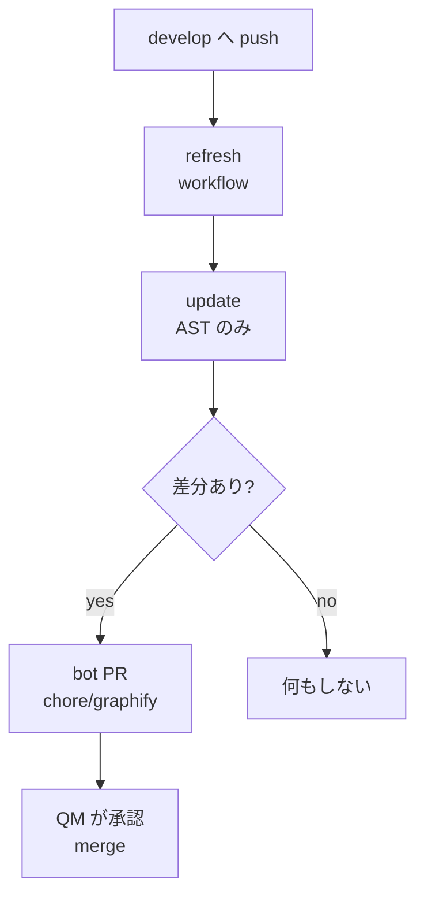

> リポジトリ: [Takenori-Kusaka/ganbari-quest](https://github.com/Takenori-Kusaka/ganbari-quest)

コードベースをナレッジグラフにする OSS、Graphify は、2026-07-29 に実測のうえ不採用と記録され、1 週間後に採用されました。この章では、不採用の根拠、覆った理由、採用後に起きた「並行 PR が全部 conflict する」事故、bot が develop に PR を出す再生成パイプライン、そして python 依存 30 件を hash で固定するまでを扱います。この本を書くために私が打った `graphify query` の結果も、正直に書きます。

## 不採用の実測

評価は PO の依頼で始まりました。「リポジトリを調査してこのプロダクトへの適合性、効果性を踏まえて検討し、導入価値があれば導入」。既存の探索資産は、CLAUDE.md の階層、codebase-map、grep、dependency-cruiser、impact-analysis skill でした[^rationale16]。

実測値は表に残っています。グラフは 20,973 nodes と 39,750 edges、ビルド 2 分 13 秒、API キー不要。`.svelte` は 237 ファイルが全部ファイルレベルの node にとどまり、コンポーネントの内部構造は無い。`.ts` は 1,514 ファイルで 9,629 nodes。`god-nodes` は中核（`ChildId` 457 edges、`getRepos()` 420、`requireTenantId()` 125）を正しく検出した。しかし `query` は BFS が 434 nodes に当たって 42 件に切り詰められ、内容はハブノイズ（`logger`、`labels.ts`、`ChildId`）が優位で、狙った grep より当たらない[^rationale16]。

不採用の決定要因は「UI 層がグラフ上の空白になる」でした。SvelteKit と Svelte 5 が主戦場のリポジトリで、探索の主経路を UI 層が空白のグラフに切り替えるのは劣化になる。`cites`（コードから ADR への 979 edge）は `git grep` の 1 コマンドで代替でき、`affected` は dependency-cruiser と重複する。`graph.json` 21.6MB は git に commit できず、commit しなければ全員が 2 分の再ビルドを負う。再評価トリガーは `tree-sitter-svelte` 対応でした[^rationale16]。

## 1 週間で覆る

2026-08-05 の #4291 は、品質ゲートを「80 点主義」で削減する Issue でした。61 本の check スクリプトと 37 本の workflow を、削除・リリースプロセスへ移管・維持に振り分ける。その翌日の #4343 で、Graphify は導入されました[^issue4343]。

採用記録の理由は「ローカル AST 解析のみで増分更新でき LLM トークンを消費しない。`graphify-out/` を git 追跡することで、新しい clone / セッションがチェックアウト直後から構造を引ける（コールドスタート解消）」です。制約も併記されています。`.svelte` は symbol 抽出が浅く、250 file が 492 node で `.ts` の 6.6 node/file に対し 2.0 node/file。UI 層の探索は codebase-map と grep を主経路のままとする[^adrreadme]。

不採用時の「全て L1」は、採用後の再実測で成り立たないと分かりました。492 node のうち 242 が symbol レベルです。rationale は先頭に「現状: 採用済み」の注記を付けて残されました。何を測って何を理由に落としたかを、再評価時に引き継ぐためです。不採用の表には不採用のまま残り、#4395 で採用記録へ移されました[^rationale16]。

導入は公式インストーラで行われ、`.claude/settings.json` に PreToolUse の hook が 2 つ入りました。`Bash|Grep` の前に `graphify hook-guard search`、`Read|Glob` の前に `graphify hook-guard read`。grep や Read の前にグラフを見ろ、と AI に促す仕組みです。settings.json のコメントは、絶対パスを書かない理由（clone ごとに Windows のユーザー名が異なる）と、matcher が「任意の副作用を起こせるツール」全経路を覆うことを test が検証する、と書いています[^settings]。

## 並行 PR が全部 conflict する

採用の 6 日後、2026-08-12 の #4536 です。`.husky/post-commit` が全 branch でコミットのたびに `graphify update .` を走らせ、`graph.json`（27MB 超）を再生成していました。並行する feature branch がそれぞれ独自の graphify-out を持ち、develop への merge のたびに残り全 PR が graphify-out だけで conflict する。実測では PR #4514 の merge 時、conflict は graphify-out の 3 ファイルだけでした[^postcommit]。

対策は 2 つです。post-commit は branch が develop か main のときだけ再生成し、feature branch では何もしない。develop 上の再生成は push 契機の workflow `graphify-refresh.yml` が担い、差分があれば bot が `chore/graphify-refresh` branch と PR を発行し、QM が承認して merge する。develop と main は ruleset が直接 push を拒否するため、[第Ⅳ部-3](maker-not-approver) の admin bypass 禁止と同じ経路を通ります。無限ループは `paths-ignore: graphify-out/**` で止めます[^refreshyml]。

この workflow は、導入から 1 か月近く 1 度も成功していませんでした。2026-09-03 の実測で、`actions/checkout` の既定 `persist-credentials: true` が `GITHUB_TOKEN` を `.git/config` に残し、後段の App token での push でも既定 token が優先されて 403 になっていた。#4853 が最初に成功した run です[^refreshyml]。

## 30 件を hash で固定する

#4853 の adversarial review が、security high を 1 件出しました。workflow は `pip install graphifyy==0.9.32` の直後に、develop へ push できる短命 token を発行します。pin は最上位だけで、runtime 依存 29 件（networkx、numpy、rapidfuzz、tree-sitter の grammar 26 件）は範囲指定でした。「範囲指定は、その範囲に将来公開される版を無条件に信用する」ので、脅威モデルの経路は開いたままでした[^refreshyml]。

#4866 で、30 件を `--require-hashes` と `--only-binary` で固定しました。sha256 は実際に artifact を生成した run のログから採った解決済みの閉包で、手で書いたものではありません。workflow のコメントには、初版の誤りも残されています。初版は `--no-deps` を付け、「閉包が欠けたら直後の `graphify update .` が import で落ちるので list 自体が自己検査になる」と書いていました。「これは嘘だった」。tree-sitter 系 26 件の import は `try / except ImportError` の中にあり、欠けても例外は出ず、その言語の抽出が空になるだけでした。A/B の実測で、`--no-deps` は「30 件が真の閉包」という不変条件を pip の機械検証から人間の主張へ格下げしていたと分かりました[^refreshyml]。

## この本を書きながら

現在の graph.json は 31.5MB で、git に追跡されています。25,695 nodes、46,935 edges、3,097 ファイル、1,541 communities。不採用時に「commit 不可」とされた 21.6MB より大きくなり、commit されています[^report]。

この章を書くために、私は `graphify query` を打ちました。CLAUDE.md の階層について問うと、BFS が 74 nodes に当たり、61 件に切り詰められ、先頭は `owner-gate.test.ts` の `context()` と `LoadingButton.svelte` でした。pre-push hook について問うと 616 nodes に当たり、8 件に切り詰められました。rationale が「ハブノイズ優位」と書いた実測は、採用後も変わっていません。私が実際に使ったのは git・grep・Read で、hook のメッセージは毎回「MANDATORY: You MUST run graphify query before grepping」と出ました。

## 今ならこうする

採用の価値は「clone 直後から構造を引ける」に集約されます。人手の codebase-map が持てない量を、AST から自動で持つ。それは正しい。しかし、その価値は `god-nodes` と `GRAPH_REPORT.md` の Community Hubs にあり、`query` にはありませんでした。hook で grep の前に `query` を強制するのは、価値の無い方を強制しています。

再生成パイプラインは、道具より大きくなりました。bot PR、App token、hash pin 30 件、`persist-credentials`。31.5MB を git で追跡するための装置です。[第Ⅳ部-8](platform-session) の「装置を増やさない」と並べると、この章は例外の記録です。

不採用の記録が残っていたことは、良い判断でした。1 週間で覆ったとき、何が変わって何が変わっていないかを、実測と突き合わせられました。「全て L1」が成り立たないと分かったのは、記録があったからです。

[^rationale16]: Graphify 評価の rationale（2026-07-29、不採用 → 採用済みの注記）。実測条件の表、棄却理由、再評価トリガー、採用後の再実測（#4395）。出典: [docs/rationale/16-graphify-evaluation-rationale.md](https://github.com/Takenori-Kusaka/ganbari-quest/blob/3af6c2ed9fd4fe5766fc80c255656e940f8ec8f0/docs/rationale/16-graphify-evaluation-rationale.md)

[^issue4343]: PR #4343「Graphify ナレッジグラフ構築基盤の導入および Git 運用自動化の確立」（#4291）。出典: [PR #4343](https://github.com/Takenori-Kusaka/ganbari-quest/pull/4343)

[^adrreadme]: ADR 一覧 §OSS 採用記録の Graphify の行（採用根拠と制約）。出典: [docs/decisions/README.md](https://github.com/Takenori-Kusaka/ganbari-quest/blob/3af6c2ed9fd4fe5766fc80c255656e940f8ec8f0/docs/decisions/README.md)

[^settings]: Claude Code の settings.json。PreToolUse の hook 3 組（QA アカウントの PR 防止、heavy lock、graphify hook-guard）と `$comment`。出典: [.claude/settings.json](https://github.com/Takenori-Kusaka/ganbari-quest/blob/3af6c2ed9fd4fe5766fc80c255656e940f8ec8f0/.claude/settings.json)

[^postcommit]: post-commit hook。develop と main だけで再生成する分岐と、#4536 の経緯。出典: [.husky/post-commit](https://github.com/Takenori-Kusaka/ganbari-quest/blob/3af6c2ed9fd4fe5766fc80c255656e940f8ec8f0/.husky/post-commit)

[^refreshyml]: graphify-refresh workflow。背景、無限ループ防止、設計原則、`persist-credentials` の 403、python 依存 30 件の hash pin と `--no-deps` を外した理由（#4853 / #4866）。出典: [.github/workflows/graphify-refresh.yml](https://github.com/Takenori-Kusaka/ganbari-quest/blob/3af6c2ed9fd4fe5766fc80c255656e940f8ec8f0/.github/workflows/graphify-refresh.yml)

[^report]: グラフのレポート（2026-09-12、25,695 nodes、46,935 edges、Community Hubs）。出典: [graphify-out/GRAPH_REPORT.md](https://github.com/Takenori-Kusaka/ganbari-quest/blob/3af6c2ed9fd4fe5766fc80c255656e940f8ec8f0/graphify-out/GRAPH_REPORT.md)
