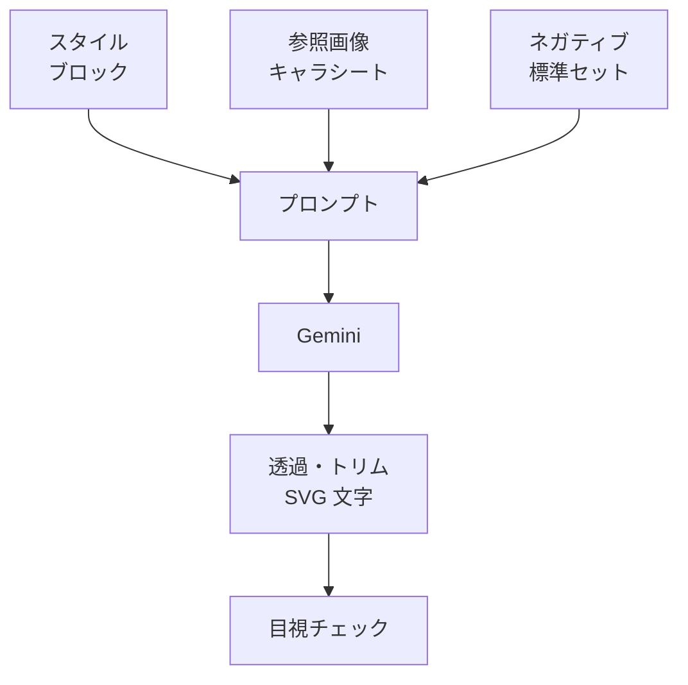

> リポジトリ: [Takenori-Kusaka/ganbari-quest](https://github.com/Takenori-Kusaka/ganbari-quest)

コードだけが生成AIの成果物ではありません。ロゴ、ファビコン、スタンプ、キャラクター、LP の画像、OGP、Stripe の商品画像。この製品の画像は、ほぼすべて Gemini で生成されました。この章では、18 の候補から勇者を選んだ 2026 年 3 月末、8 本の生成スクリプト、ブランドから逸脱しないためのプロンプトの規律、そして「作る予定」のまま残っている画像を扱います。画像は、コードより試行錯誤の跡が残りにくい資産です。

## 18 の候補から

シンボルマークは、かわいい勇者のキャラクター（ヘルメット、マント、魔法の杖）です。2026-03-28、Gemini 3 Pro Image で 6 つのコンセプト × 3 バリエーション、計 18 の候補を生成しました。コンセプトは、芽と手、山頂の旗、星の塔、勇者キャラ、家族の木、輝く星。選ばれたのは勇者キャラの簡略版で、理由は「がんばりクエスト」の名前と RPG の世界観に最も直結すること、0〜18 歳の幅広い年齢に対応すること、ヘルメットで性別を特定しないこと、「やらなきゃいけない大変なこと」ではなく「冒険、楽しさ」を訴求することです[^brand]。

ブランドガイドラインは、デザインの要素を意味と色で表にしています。ヘルメットは冒険者の象徴でブルーのグラデーション、魔法の杖と星は達成と報酬でゴールド、胸の星のエンブレムはがんばりの証、頬の赤みはかわいさで 45% 透過のピーチ。使用規定は、最小 16 ピクセル、周囲にシンボル幅の 25% 以上の余白、変形禁止、キャラクターの改変禁止です[^brand]。

git の履歴が、試行錯誤の形を残しています。`favicon.svg` は 2026-03-02 に最初の版が入り、03-28 までに 6 回変わりました。LP のキャラクター画像は 03-28 から 05-09 に 5 回、圧縮版のロゴは 7 回。ファビコンの候補 3 枚と比較画像は 04-02 に、リポジトリの `static/assets/favicon/` に残っています。ガイドラインが参照する候補画像のアーカイブのディレクトリは、リポジトリに存在しません[^brand]。

## 6 つのスタンプと 8 本のスクリプト

活動を記録すると、おみくじのスタンプが出ます。大吉、中吉、小吉、吉、末吉、大大吉の 6 つで、2026-04-01 に生成されました。生成のパイプラインは 4 段です。Gemini Pro でテキストなしの画像を生成し、flood-fill で背景を透過にし、トリムし、SVG でテキストを個別に配置する。文字を画像に焼き込まず、あとから差し替えられる形です[^stamps]。

生成スクリプトは 8 本あります。

| スクリプト | 対象 |
| --- | --- |
| generate-image | 汎用の CLI。カテゴリとレアリティを指定してブランドスタイルを自動付与 |
| generate-stamp-images / regenerate-all-stamps | おみくじのスタンプ 6 種 |
| generate-marketing-images | SNS のバナーと OGP。Twitter の header と post、Instagram の post、プレスのキービジュアル |
| generate-stripe-product-images | Stripe の商品画像 2 枚（スタンダードと家族、690×690） |
| generate-pwa-icons | `favicon.svg` から PWA のアイコンを sharp で生成 |
| generate-coreloop-summary | LP の「活動 → 習慣 → ごほうび」の循環図 |
| check-orphan-assets | 参照ゼロの画像の検出 |

マーケティング画像とロゴキャラクターを参照して生成し、Stripe の商品画像はロゴをベースにプランごとへ作ります。どちらも 04-03 と 04-04 の 1〜2 回の commit で、その後変わっていません[^scripts]。

LP の循環図は、正本を SVG に変えました。既定の経路は SVG から sharp で透過 PNG に変換する決定的なもので、Gemini の鍵は不要です。Gemini で SVG 自体を再生成する経路は opt-in で残し、「出力は JPEG のバイト列の可能性があるため PR レビューで透過チェックが必要、透過保証が必要なら SVG を手動編集する運用に切り替えること」と注記しています[^assetcatalog]。

## ブランドを崩さない

Gemini の画像生成ガイドは、すべてのプロンプトの冒頭に必ず貼るブランドスタイルブロックを持ちます。kawaii chibi flat illustration、頭身 1:1.5、顔の 35〜40% を占める大きな目、cel-shaded の warm pastel。2〜3 ピクセルの平坦な輪郭、透過 PNG、テキストと透かしと UI 要素は無し。ブランドの 3 色、参照キャラクターは D3 の勇者。「このブロックなしに生成するとブランドから逸脱した画像が生まれる」[^guide]。

レアリティには視覚言語があります。Normal はシンプルで単色のアクセント、Rare はスパークル、Super Rare はゴールドのグローと宝石、Ultra Rare は虹色のシマーとオーラ。CLI で `--rarity SR` と指定するとスタイルブロックに語彙が自動付与されます[^guide]。

セッション管理の規律が、生成AIの画像に固有です。「同一テーマの画像を 1 セッションで 10 枚以上生成しない。10 枚を超えると Gemini のコンテキストが薄れ、スタイルが徐々にブランドから逸脱する。新しいセッションを開始し、参照画像を再提供する」。参照画像はマスターのキャラクターシートで、2026-04-25 に 1 枚だけ作られました[^guide]。

ネガティブプロンプトの標準セットもあります。realistic、photorealistic、3D render、shadow、text、watermark、adult、complex shading、dark theme。子供向けの製品で、画像が写実に寄ることを防ぎます[^guide]。

## 作る予定のまま

アセットカタログは、判断基準を明示しています。画像が必要なのは、ゲーミフィケーションの報酬（シール、バッジ、トロフィー）、キャラクターとマスコット、ブランド、レベルとランクの表示、OS 間で見た目が変わると困る要素。絵文字で許容するのは、ステータスのラベル、リストの装飾、そしてユーザーがカスタマイズする活動アイコン[^assetcatalog]。

カタログの一覧には、「現状」と「目標」の列があります。優先度が最高の 3 つ、シール 16 種以上、実績バッジ 20 種以上、称号アイコン 15 種以上は、現状が絵文字 1 文字で、目標がイラスト画像のままです。カテゴリアイコン、レベルアップの演出、特別報酬のアイコンも同じです。作られたのは、おみくじのスタンプ 6 つ、バトルのキャラクターと敵、そしてブランド系の画像です[^assetcatalog]。

作られたものにも、あとから直したものがあります。2026-09-12、バトル画面のキャラクター画像に市松模様の「偽透過」の背景が焼き込まれていることが見つかりました。生成AI が透過を表現するときに描く市松模様が、そのまま画像に入っていました[^issue4921]。

OS に依存する絵文字を SVG に置き換えた例もあります。LP の信頼を示す 4 つのバッジ（広告なし、家族限定、保護者専用のカギ、データを家族の手元に）は、当初 🚫👪🔑🔍 の絵文字で、Safari と Android で見た目が大きく異なりました。ブランド色の単色のフラットな SVG 4 種に置き換えました[^assetcatalog]。

LP の画像は、サイズの閾値で最適化されています。圧縮版のロゴは 757.6KB から 19.2KB へ 97.5% 削減。LCP の改善と SEO と直帰率が目的です[^assetcatalog]。

## 今ならこうする

ブランドスタイルブロックと 10 枚のセッション上限は、生成AIで画像を量産するときの最小の規律として正しかったと考えています。コードには lint がありますが、画像には lint がありません。「冒頭に必ず貼る」「10 枚で切る」「参照画像を渡す」は、lint の代わりに人が守る規律です。

作られなかった画像の一覧は、正直に残っています。バッジと称号は絵文字のままです。カタログの「現状」列は 2026 年 4 月から更新されておらず、目標は目標のままです。画像を作るコストは低いのですが、作った画像を製品に組み込み、年齢帯ごとに検証し、baseline に載せるコストは低くありません。[第Ⅴ部-5](visual-regression) の 3 層の baseline は、画像を足すたびに更新が要ります。

偽透過の市松模様は、生成AI の画像に固有の壊れ方です。コードのテストは透過を検証しません。人の目で見るまで分かりませんでした。

[^brand]: ブランドガイドライン。§2 シンボルマーク（デザイン選定の経緯、18 候補、選定理由、デザイン要素の表、ファイル一覧、使用規定）、§8 アイコン再生成手順。出典: [docs/design/15-ブランドガイドライン.md](https://github.com/Takenori-Kusaka/ganbari-quest/blob/3af6c2ed9fd4fe5766fc80c255656e940f8ec8f0/docs/design/15-%E3%83%96%E3%83%A9%E3%83%B3%E3%83%89%E3%82%AC%E3%82%A4%E3%83%89%E3%83%A9%E3%82%A4%E3%83%B3.md)。ファビコンの候補は [static/assets/favicon/](https://github.com/Takenori-Kusaka/ganbari-quest/tree/3af6c2ed9fd4fe5766fc80c255656e940f8ec8f0/static/assets/favicon)

[^stamps]: おみくじスタンプの再生成パイプライン。出典: [scripts/regenerate-all-stamps.mjs](https://github.com/Takenori-Kusaka/ganbari-quest/blob/3af6c2ed9fd4fe5766fc80c255656e940f8ec8f0/scripts/regenerate-all-stamps.mjs)。画像は [static/assets/stamps/](https://github.com/Takenori-Kusaka/ganbari-quest/tree/3af6c2ed9fd4fe5766fc80c255656e940f8ec8f0/static/assets/stamps)

[^scripts]: 生成スクリプト群。汎用 CLI は [scripts/generate-image.mjs](https://github.com/Takenori-Kusaka/ganbari-quest/blob/3af6c2ed9fd4fe5766fc80c255656e940f8ec8f0/scripts/generate-image.mjs)。マーケティングは [scripts/generate-marketing-images.mjs](https://github.com/Takenori-Kusaka/ganbari-quest/blob/3af6c2ed9fd4fe5766fc80c255656e940f8ec8f0/scripts/generate-marketing-images.mjs)。Stripe は [scripts/generate-stripe-product-images.mjs](https://github.com/Takenori-Kusaka/ganbari-quest/blob/3af6c2ed9fd4fe5766fc80c255656e940f8ec8f0/scripts/generate-stripe-product-images.mjs)。参照ゼロの検出は [scripts/check-orphan-assets.mjs](https://github.com/Takenori-Kusaka/ganbari-quest/blob/3af6c2ed9fd4fe5766fc80c255656e940f8ec8f0/scripts/check-orphan-assets.mjs)

[^assetcatalog]: 画像アセットカタログ。判断基準、アセット一覧（現状と目標）、trust の SVG 4 種、LP 巨大画像の最適化、コアループの summary 画像（SVG 正本化）。出典: [docs/design/asset-catalog.md](https://github.com/Takenori-Kusaka/ganbari-quest/blob/3af6c2ed9fd4fe5766fc80c255656e940f8ec8f0/docs/design/asset-catalog.md)

[^guide]: Gemini 画像生成ガイド。A-1 ブランドスタイルブロック、A-2 レアリティ別の視覚言語、A-4 セッション管理（10 枚の閾値）、A-5 ネガティブプロンプト、A-6 モデル選択。出典: [docs/reference/gemini_image_generation_guide.md](https://github.com/Takenori-Kusaka/ganbari-quest/blob/3af6c2ed9fd4fe5766fc80c255656e940f8ec8f0/docs/reference/gemini_image_generation_guide.md)。参照画像は [static/assets/brand/master-character-sheet.png](https://github.com/Takenori-Kusaka/ganbari-quest/blob/3af6c2ed9fd4fe5766fc80c255656e940f8ec8f0/static/assets/brand/master-character-sheet.png)

[^issue4921]: バトル画面のキャラクター画像に偽透過の背景が焼き込まれていた Issue。出典: [Issue #4921](https://github.com/Takenori-Kusaka/ganbari-quest/issues/4921)
