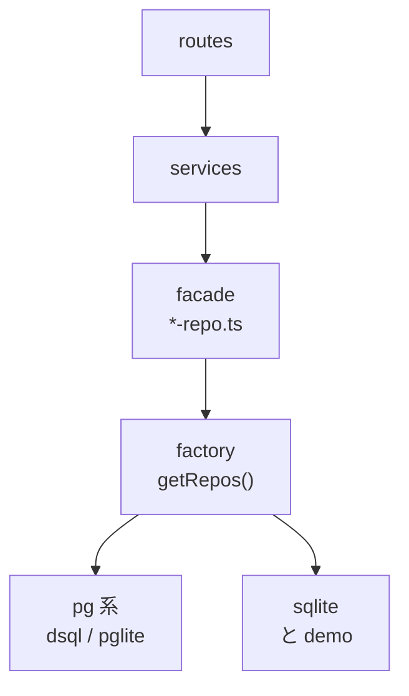

> リポジトリ: [Takenori-Kusaka/ganbari-quest](https://github.com/Takenori-Kusaka/ganbari-quest)

アプリは 5 つの層に分かれ、上の層は下の層にだけ依存します。routes は 71 ページと 108 の API endpoint、service は 121 本、repository の interface は 38 本です。この章では、層の分け方と、DB の backend を 4 つ切り替える factory、認可の 3 軸、そして層の境界を人ではなく CI が守るようになった経緯を扱います。層の設計は珍しくありません。珍しいのは、生成AIが層を破る頻度と、それを止める方法です。

## 5 つの層

| 層 | 場所 | 責務 |
| --- | --- | --- |
| 1 Presentation | `src/routes/` | ファイルベースのルーティング。ビジネスロジックを書かない |
| 2 Feature と UI | `src/lib/features/`、`src/lib/ui/` | 機能単位のコンポーネントと、Ark UI を包む primitives |
| 3 Domain | `src/lib/domain/` | 用語辞書、レベル計算、ストリーク、年齢モード。サーバとクライアントの両方で使える純粋関数 |
| 4 Service | `src/lib/server/services/` | ビジネスロジック |
| 5 Data Access | `src/lib/server/db/` | Repository パターンによる抽象化 |

Presentation のルールは短いものです。`+page.svelte` にビジネスロジックを書かない、データ取得は `+page.server.ts` の `load` で行う、コンポーネント内の直接 `fetch` は禁止、`<style>` は 50 行以下、inline style は動的な値だけ。Service のルールは「`+server.ts` から ORM を直接呼ばない、必ず Service 経由」です[^archdoc]。

パターンは 4 つです。Repository、Factory、Facade、そして Hook。Hook は活動記録のあとに走る副作用（スタンプ、レベル判定、通知）を dynamic import と try-catch で疎結合にし、1 つの hook の失敗が記録そのものを止めない設計です[^archdoc]。

## 4 つの backend

Data Access の層は、`DATA_SOURCE` の環境変数で backend を切り替えます。

| 値 | backend | 用途 |
| --- | --- | --- |
| `sqlite` | better-sqlite3 | ローカル開発とテスト |
| `dsql` | Aurora DSQL | AWS の本番 |
| `pglite` | PGlite | NUC のセルフホスト。DSQL の repository を再利用 |
| `demo` | in-memory の fixture | デモ環境 |

facade となる `<name>-repo.ts` が factory を呼び、factory が backend の実装を返します。設計書の図には `dynamodb/` のディレクトリが残っていますが、DynamoDB の backend は 2026 年 7 月に撤去され、repository 33 本と分岐が消えました[^backend]。

backend の判定には、本番でだけ壊れる class の事故があります。`isDsqlBackend()` が `pglite` を既定の `sqlite` に潰していたため、NUC では活動記録と取消の単一トランザクション経路、uuid の guard、置換インポートの pg 戦略がすべて無効になっていました。sqlite でも dsql でも再現せず、NUC の PGlite でだけ起きます。対処は、判定を「pg 系（dsql と pglite）」と「sqlite」の 2 値にし、`isPgBackend()` の 1 関数に寄せることでした。dsql と pglite を個別に分岐しません[^backend]。

同じ月に、facade が特定の backend を直接 import している class も見つかりました。usage-log の facade が sqlite の実装を直接 import していたため、本番の pg 系では表が未作成で throw し、WARN と「0 分」に化けていました。regression guard として、テストが 3 条件を検査します。facade は `./sqlite/`・`./dsql/`・`./demo/` を import しないこと。`getRepos()` を少なくとも 1 回呼ぶこと。interface ごとに 3 backend の実装ファイルが揃っていること[^facadetest]。

## 層を CI が守る

「routes から DB に触らない」は、CLAUDE.md に散文で書かれていました。守るのは人でした。[第Ⅴ部-4](fitness-functions) で見たとおり、2026 年 6 月にこれは走査テストになり、`src/routes` 配下の全ファイルから `drizzle-orm` や schema や backend 固有の repository への import を列挙します。QM のレビューで動的 `import()` のすり抜けが見つかり、対象に加わりました[^routedb]。

facade の parity テスト、backend 判定の 1 関数化、routes の境界テスト。3 つとも 2026 年 6 月から 8 月に、事故のあとで置かれました。層の設計図は 4 月からあり、生成AIはその設計図を読んで書いていました。それでも境界は破られました。境界を守るのは設計図ではなく、境界を越えた瞬間に落ちるテストでした。

## 認可の 3 軸

すべてのリクエストは `hooks.server.ts` を通ります。961 行の handle は、順に、メンテナンスモードの判定、front door の検査（[第Ⅲ部-2](cdk-stacks) の共有 secret）、rate limit、旧 URL のリダイレクト、デモの実行モード、ルートの認可、親の PIN gate、セキュリティヘッダーの付与、リクエストの log と進みます。front door を rate limiter より前に置くのは、迂回の試行で rate limit の枠を消費させないためと、header の比較 1 回が最も安い判定だからです[^hooks]。

認可は「ルート × ロール × ライセンス状態」の 3 軸です。ロールは owner、parent、child の 3 つ。ルートの保護ルールは上から順に照合し、最初に一致したルールを適用します。`/admin/**` は owner と parent、`/child/**` は child も含む 3 ロール、`/ops/**` は Cognito の ops group です。`/api/cron/**` と `/api/stripe/webhook` は認可層の allowlist に載せたうえで、route 側が共有 secret と署名で検証します[^security]。

ルールの照合には、前方一致の落とし穴が記録されています。`/ops` に素朴な `startsWith` を使うと、`/opsedit` のような実在しない route も巻き込みます。ファイルの冒頭に、綴りを直してはいけない負例として残されています[^authorization]。

ID の取り違えにも guard があります。`locals.identity.userId` は IdP の sub で、アプリの DB の `users.user_id` ではありません。memberships や invites や children はすべて後者を参照するため、sub を渡すと一致するレコードが無く「削除したのに消えない」「本人判定が効かない」が静かに起きます。DB を触る route は必ず `requireAppUserId()` から取り、cognito 系以外は fail-closed で 401 にします。sub へのフォールバックは作りません[^guards]。

## 使われていなかった Policy Gate

機能のゲート判断を 1 か所に集約する Policy Gate があります。`can()` は純関数で、I/O を持たず、「この機能は何のモード × プランで使えるか」の SSOT になるはずでした[^capabilities]。

2026 年 9 月の監査で、この層に 3 つの capability がプラン条件を独自に持っていることが見つかりました。しかも、production から一度も呼ばれておらず、`invite.family_member` は「family 以外は deny」で、plan-limit-service の「スタンダードは 4 人まで招待可」と正反対の定義でした。配線した瞬間にスタンダード契約者の招待が 403 になる地雷です。3 件を削除し、プラン判定の SSOT を plan-limit-service の 1 本に戻しました[^capabilities]。

「未配線 + 二重定義」は、生成AIが書く設計層に典型的な形です。設計として正しい層を作り、そこに正しそうな判断を書き、しかし呼び出し側を配線しない。呼ばれないコードは間違っていても落ちません。[第Ⅳ部-5](sixty-to-hundred) の「配線の確認は実装の確認ではない」は、この事故から出た言葉です。

## 今ならこうする

5 層と 4 backend の設計は、そのまま残します。DSQL への移行、PGlite への切り替え、デモの分離が、どれも facade と factory の境界の内側で完結したことが、この設計の価値です。routes と services は backend を知りません。

変えるのは、境界を守るテストを置く時期です。2026 年 4 月に層を決めた時点で、routes の境界テストと facade の parity テストは書けました。書かなかったのは、生成AIが設計図を守ると思っていたからです。守りませんでした。設計図を読める AI に対しても、境界は落ちるテストで表現する。これが第Ⅱ部を通じて繰り返す学びです。

[^archdoc]: ソフトウェアアーキテクチャ設計書。§2 レイヤードアーキテクチャ（5 層、各層のルール、Service 一覧）、§2.6 Data Access（Repository と factory）、§4 デザインパターン（Repository、Factory、Facade、Hook）。出典: [docs/design/24-ソフトウェアアーキテクチャ設計書.md](https://github.com/Takenori-Kusaka/ganbari-quest/blob/3af6c2ed9fd4fe5766fc80c255656e940f8ec8f0/docs/design/24-%E3%82%BD%E3%83%95%E3%83%88%E3%82%A6%E3%82%A7%E3%82%A2%E3%82%A2%E3%83%BC%E3%82%AD%E3%83%86%E3%82%AF%E3%83%81%E3%83%A3%E8%A8%AD%E8%A8%88%E6%9B%B8.md)

[^backend]: backend 切替の単一解決点。4 つの `DATA_SOURCE`、DynamoDB backend の撤去、`isPgBackend()` に寄せた理由（NUC でだけ壊れていた class）。出典: [src/lib/server/db/backend.ts](https://github.com/Takenori-Kusaka/ganbari-quest/blob/3af6c2ed9fd4fe5766fc80c255656e940f8ec8f0/src/lib/server/db/backend.ts)。factory は [src/lib/server/db/factory.ts](https://github.com/Takenori-Kusaka/ganbari-quest/blob/3af6c2ed9fd4fe5766fc80c255656e940f8ec8f0/src/lib/server/db/factory.ts)

[^facadetest]: facade と backend の parity テスト。usage-log の直 import による実害、3 つの検査条件。出典: [tests/unit/architecture/db-facade-backend-parity.test.ts](https://github.com/Takenori-Kusaka/ganbari-quest/blob/3af6c2ed9fd4fe5766fc80c255656e940f8ec8f0/tests/unit/architecture/db-facade-backend-parity.test.ts)

[^routedb]: routes と DB の境界の fitness function。出典: [tests/unit/architecture/route-db-boundary.test.ts](https://github.com/Takenori-Kusaka/ganbari-quest/blob/3af6c2ed9fd4fe5766fc80c255656e940f8ec8f0/tests/unit/architecture/route-db-boundary.test.ts)

[^hooks]: 全リクエストの前処理。handle の各段（メンテナンス、front door、rate limit、旧 URL、デモ、認可、PIN gate、ヘッダー、log）と、front door を rate limiter の前に置く理由。出典: [src/hooks.server.ts](https://github.com/Takenori-Kusaka/ganbari-quest/blob/3af6c2ed9fd4fe5766fc80c255656e940f8ec8f0/src/hooks.server.ts)

[^security]: セキュリティ設計書 §5 認可。ロール体系、ルート保護マトリクス、3 軸の判定、セッションを持たない外部呼び出しの扱い。出典: [docs/design/14-セキュリティ設計書.md](https://github.com/Takenori-Kusaka/ganbari-quest/blob/3af6c2ed9fd4fe5766fc80c255656e940f8ec8f0/docs/design/14-%E3%82%BB%E3%82%AD%E3%83%A5%E3%83%AA%E3%83%86%E3%82%A3%E8%A8%AD%E8%A8%88%E6%9B%B8.md)

[^authorization]: ロールとルートの認可マトリクス。上から順の照合、前方一致の負例。出典: [src/lib/server/auth/authorization.ts](https://github.com/Takenori-Kusaka/ganbari-quest/blob/3af6c2ed9fd4fe5766fc80c255656e940f8ec8f0/src/lib/server/auth/authorization.ts)

[^guards]: 認証ガード関数。`requireAppUserId()` と、IdP の sub をアプリの user id と取り違える実害。出典: [src/lib/server/auth/guards.ts](https://github.com/Takenori-Kusaka/ganbari-quest/blob/3af6c2ed9fd4fe5766fc80c255656e940f8ec8f0/src/lib/server/auth/guards.ts)

[^capabilities]: Policy Gate。純関数の設計、プラン条件を置かない理由（未配線 + 二重定義の 3 件と、スタンダードの招待が 403 になる地雷）。出典: [src/lib/policy/capabilities.ts](https://github.com/Takenori-Kusaka/ganbari-quest/blob/3af6c2ed9fd4fe5766fc80c255656e940f8ec8f0/src/lib/policy/capabilities.ts)
