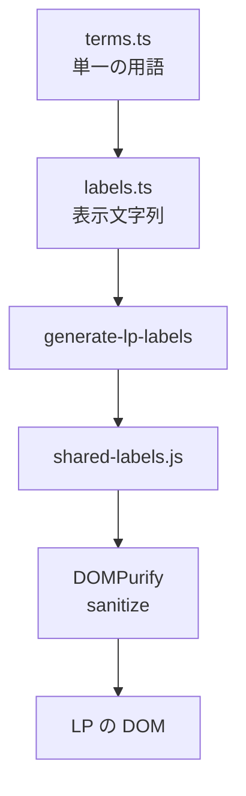

> リポジトリ: [Takenori-Kusaka/ganbari-quest](https://github.com/Takenori-Kusaka/ganbari-quest)

LP は 10 枚の静的 HTML で、GitHub Pages から配信されます。トップ、料金、FAQ、パンフレット、セルフホスト、卒業、そして法務文書 4 枚です。SvelteKit を通らないので Lambda の費用は掛かりませんが、代わりに 3 つの問題を抱えます。アプリと同じ文言をどう保つか、静的 HTML でどう XSS を防ぐか、製品のスクリーンショットをどう最新に保つか。この章では、その 3 つに対する ADR 4 本と 1 本の workflow を扱います。

## 文言の SSOT を静的 HTML まで届ける

UI の文言は `terms.ts`（単一の用語）と `labels.ts`（用語を組み立てた表示文字列）の 2 階層で管理されています。LP はこのファイルを import できないので、`generate-lp-labels.mjs` が template literal を解決した値を `site/shared-labels.js` に書き出します。`--check` を付けると差分があれば exit 1 で、CI の hard-fail step に含まれます[^genlabels]。

文言の SSOT には、もう 1 つの原則が重なります。ADR-0013「LP 文言は実装の事実を SSOT とする」です。2026 年 4 月、LP の「シールガチャ」という文言が実装の mechanic と食い違ったまま運用されていることが見つかりました。販促文言が先行し、設計書と実装がそれを追認する逆転構造が根本原因でした。以後、販促文書は現在のコードで確認できる mechanic だけを書き、将来の候補は内部文書に限定します[^adr13]。プリセット活動数の訴求値が実数を超えたら CI が落ちる検査は、この原則の機械化です。

HTML 側は `data-lp-key` 属性で注入先を宣言します。当初の実装は `el.textContent = value` で、これには 3 つの限界がありました。`<strong>` や `<a>` を内包する要素（156 件以上）は textContent では壊れる。法務文書 4 枚の 354 件は除外運用で SSOT の外にある。印刷専用のパンフレットは注入完了前に印刷されうる。PO の方針は「SSOT 漏れのコンテンツは存在してはいけない」で、LP 339 件と法務 354 件の合計 693 件を全部 SSOT の配下に入れることが目標になりました[^adr25]。

## innerHTML と DOMPurify

ADR-0025 は 4 案を比較しました。nested な tag を独立した `` に分解する案は、HTML が読めなくなり labels のキーが 200 増える。LP 全体を SvelteKit の `adapter-static` に吸収する案は、アーキテクチャの大改修で Pre-PMF 過剰。自前の sanitizer は、XSS 関連は確立 OSS 必須のルールに反する。採用したのは DOMPurify による innerHTML 注入で、許可する tag と属性を制限し、`target=_blank` の link には `rel=noopener noreferrer` を hook で強制します[^adr25]。

DOMPurify は CDN から読みます。`site/` は GitHub Pages の静的配信で npm bundle の経路を持たないためです。未ロード時は安全側で textContent にフォールバックし、console に warn を出します。693 件の移行は 4 つの sub PR に分割し、各 sub は単独で完遂、partial close は禁止で進めました[^adr25]。

## CSP と SRI の両立不可能

DOMPurify を CDN から読むと、次の問題が出ます。QM のレビューで 3 点が指摘されました。同じ LP の splidejs は SRI 付きなのに DOMPurify だけ SRI が無い。DOMPurify は major pin（`dompurify@3`）で patch を自動取り込みする方針なので、SRI で bytes を固定すると CDN の配信物が変わった瞬間にロードが失敗し LP が全停止する。そして LP 全 10 ページに CSP が無い[^adr29]。

major pin と SRI は構造的に両立しません。ADR-0029 は、一次資料（OWASP、MDN、GitHub Pages 公式、jsDelivr）から「SRI は特定バージョン pin のときだけ意味があり range pin とは両立不可」が業界合意であることを確認し、ライブラリの種別で戦略を分けました。

| 種別 | pin | SRI | CSP allowlist |
| --- | --- | --- | --- |
| 特定バージョン pin（splidejs） | 完全 pin | 必須 | 補助 |
| major / range pin（DOMPurify、budoux） | major | 付与禁止 | 必須 |

GitHub Pages は HTTP のレスポンスヘッダを制御できないため、CSP は `<meta http-equiv>` で置きます。`frame-ancestors` など meta では効かない指令がありますが、静的配信で認証と analytics のどちらも無い LP の脅威モデルでは他の指令で足ります。多層防御は、DOMPurify のサニタイズ、CSP の allowlist、SRI 付きの完全 pin の 3 層です。`'unsafe-inline'` は現行 LP の inline script と style が多いため許可したままで、将来 inline を全排除した時点で nonce 化を検討すると書かれています[^adr29]。

自前ホスティングは将来の fallback として文書化されています。移行条件は 3 つです。jsDelivr の障害が複数回起きる。DOMPurify の配布物への改ざんが観測される。jsDelivr の規約変更で広告やトラッカーの注入が始まる[^adr29]。

アプリ側の CSP は別の ADR です。SvelteKit の `kit.csp` の hash mode で `script-src` から `'unsafe-inline'` を撤廃し、hydration の bootstrap だけを sha256 で許可します。`style-src` は Svelte が `style:` binding を inline の style 属性として serialize するため撤廃できず、`'unsafe-inline'` を維持しています。LP とアプリは origin、配信経路、脅威モデルのすべてが違うため、2 つの ADR は supersede ではなく併存です[^adr67]。

## spacing も 3 層のトークンで

LP の padding と margin は、カラートークンと同じ Base、Semantic、Component の 3 層です。Base は `--space-*` の 4px グリッド、Semantic は `--lp-section-padding-y` のような役割名、Component は HTML の class セレクタです。`site/index.html` の `<style>` 内に数値を直書きすることは禁忌で、値を変えたいときは Component を触らず Semantic か Base を 1 行更新します。LP の高さが ratchet へ触れるたび、散在する padding を手で削る作業を構造で避けるためです[^design]。

2 層防御と書かれているのは、実装側の本ガイドラインと、[第Ⅴ部-5](visual-regression) で見た CI 側の累積 desktopHeight の gate です。かつてあった inline style の検査は削除され、機械強制は無く、レビューで担保しています[^design]。

## スクリーンショットの鮮度を CI で強制する

LP に載せる製品スクリーンショットは、手動運用だと陳腐化します。2026-04-18 に PO から「LP のスクリーンショットが古いバージョンに見える」と指摘され、撮影を `pages.yml` に組み込みました。main への push で、sitemap の再生成、SvelteKit のビルド、demo 環境での preview 起動、撮影、参照されている画像の実在確認、鮮度の検査、GitHub Pages への deploy が順に走ります。`site/screenshots/` は git の管理対象外で、commit 済みだった 36 ファイルは削除しました[^lppipeline]。

fail の条件は 4 つです。preview の起動が 60 秒で timeout する、撮影スクリプトが非 0 で終わる、生成された WebP が 20 枚未満、そして撮影が黙って skip されて古い画像が残る（鮮度 30 分超）。どれも「無言で古い画像を残さない」ためで、ADR-0006 の assertion 浸食禁止の適用です[^lppipeline]。

撮影は本番ルートを demo の fixture で描画する構成で、`?screenshot=all` で本番 NUC ユーザーが見る演出を強制表示します。撮影日で表示が変わる演出（誕生日の banner など）を screenshot mode 中は OFF にし、baseline との比較を決定的に保ちます[^lppipeline]。

## 今ならこうする

静的 HTML に SSOT の文言を届ける仕組みは、生成AIと相性が良いものでした。文言の変更は `terms.ts` の 1 行で、生成スクリプトと `--check` が追随を強制し、LP の禁止語 gate（[第Ⅴ部-5](visual-regression)）が語彙を守ります。AI が LP に開発者語彙（`AWS` や `git clone`）を書けば CI が落ちます。

一方で、DOMPurify を CDN から読む判断は、jsDelivr への信頼に依存したままです。ADR は fallback の条件を書きましたが、条件を監視する仕組みはありません。LP の CSP に `'unsafe-inline'` が残っている点も、アプリ側が hash 化を終えた今、LP 側だけが緩い状態です。

法務文書を SSOT に入れた判断は、[第Ⅰ部-6](legal-by-design) の 2 層設計を可能にしました。画面の同意文と法務文書の条文が同じ辞書から出るので、片方だけを直して食い違う事故が構造的に起きません。

[^genlabels]: LP 用ラベル辞書の生成スクリプト。`labels.ts` と `terms.ts` から `site/shared-labels.js` を生成し、`--check` で CI の不整合を検出する。出典: [scripts/generate-lp-labels.mjs](https://github.com/Takenori-Kusaka/ganbari-quest/blob/3af6c2ed9fd4fe5766fc80c255656e940f8ec8f0/scripts/generate-lp-labels.mjs)

[^adr13]: ADR-0013「LP 文言は実装の事実を SSOT とする原則」。「シールガチャ」の食い違い、逆転構造の診断、Committed と Aspirational の分離、retrofit design doc の禁止。出典: [docs/decisions/0013-lp-truth-from-implementation.md](https://github.com/Takenori-Kusaka/ganbari-quest/blob/3af6c2ed9fd4fe5766fc80c255656e940f8ec8f0/docs/decisions/0013-lp-truth-from-implementation.md)

[^adr25]: ADR-0025「LP SSOT 注入機構の innerHTML 化 + XSS 設計（DOMPurify）」。textContent の 3 つの限界、693 件の目標、4 案の比較、CDN 配信とフォールバック、4 つの sub PR。出典: [docs/decisions/0025-lp-ssot-html-injection-with-xss-protection.md](https://github.com/Takenori-Kusaka/ganbari-quest/blob/3af6c2ed9fd4fe5766fc80c255656e940f8ec8f0/docs/decisions/0025-lp-ssot-html-injection-with-xss-protection.md)

[^adr29]: ADR-0029「LP CSP 多層防御 + CDN SRI / pin 戦略」。QM の 3 点の指摘、SRI と range pin の両立不可、ライブラリ種別の表、meta tag CSP の制約、`'unsafe-inline'` の残存、自前ホスティングへの移行条件。出典: [docs/decisions/0029-lp-csp-and-cdn-sri-strategy.md](https://github.com/Takenori-Kusaka/ganbari-quest/blob/3af6c2ed9fd4fe5766fc80c255656e940f8ec8f0/docs/decisions/0029-lp-csp-and-cdn-sri-strategy.md)

[^adr67]: ADR-0067「アプリ側 CSP の `'unsafe-inline'` hardening」。`kit.csp` の hash mode、`style-src` を維持する構造的理由、ADR-0029 との併存。出典: [docs/decisions/0067-app-csp-script-src-hash.md](https://github.com/Takenori-Kusaka/ganbari-quest/blob/3af6c2ed9fd4fe5766fc80c255656e940f8ec8f0/docs/decisions/0067-app-csp-script-src-hash.md)

[^design]: デザインシステム SSOT §4 LP Spacing / Layout 3 層トークン。設計原則の表、禁忌、2 層防御、削除済み検査の扱い。出典: [docs/DESIGN.md](https://github.com/Takenori-Kusaka/ganbari-quest/blob/3af6c2ed9fd4fe5766fc80c255656e940f8ec8f0/docs/DESIGN.md)

[^lppipeline]: LP デプロイパイプライン設計書。目的（2026-04-18 の指摘）、パイプライン構成、git 管理方針（36 ファイルの削除）、撮影失敗時の 4 つの fail 条件、`?screenshot` mode と日付依存演出の抑止、鮮度の CI gate。出典: [docs/design/lp-deploy-pipeline.md](https://github.com/Takenori-Kusaka/ganbari-quest/blob/3af6c2ed9fd4fe5766fc80c255656e940f8ec8f0/docs/design/lp-deploy-pipeline.md)。workflow 本体は [.github/workflows/pages.yml](https://github.com/Takenori-Kusaka/ganbari-quest/blob/3af6c2ed9fd4fe5766fc80c255656e940f8ec8f0/.github/workflows/pages.yml)
