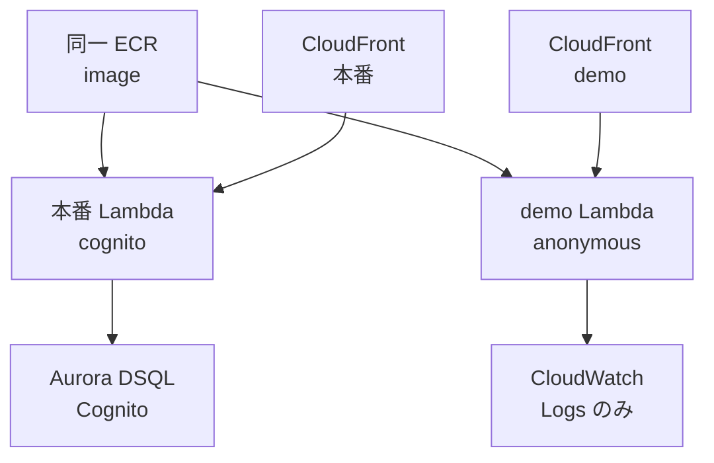

> リポジトリ: [Takenori-Kusaka/ganbari-quest](https://github.com/Takenori-Kusaka/ganbari-quest)

がんばりクエストには、登録なしで触れるデモがあります。`demo.ganbari-quest.com` で動いているのは、本番と同じ Docker イメージ、同じ routes です。違うのは環境変数 2 つと IAM role だけです。この形に落ち着くまでに、デモと本番の UI を統合する試みは 8 回失敗しました。この章では、失敗の構造、退けた 3 案、採用した Multi-Lambda の設計、そして「本番の DB に触れない」ことを CI が保証する仕組みを扱います。

## 8 回の失敗

当初、デモは `src/routes/demo/**` という別のツリーでした。本番の画面を変えるたびにデモも変える必要があり、8 回の系統で乖離しました。ADR-0048 は最終的な原因を 3 つ挙げています。別ツリーの並行実装、single Lambda で cookie と locals によりデモを判定する設計を採用しながら `/demo/**` の削除が未完遂だったこと、そして個人開発で security incident に対応しきれない制約です[^adr48]。

3 つ目が、次の案の選定を決めました。

| 案 | 内容 | 判定 |
| --- | --- | --- |
| A | single Lambda + cookie 駆動（現状維持） | 過去 8 回の構造原因を解消できない |
| B | single Lambda + tenant_id filter（Supabase 流） | Supabase 自身が「permissive default で漏洩リスク」と警告。filter bug 1 つで本番データが漏れ、個人開発では incident response を捌けない |
| C | Multi-Lambda。demo を別 deploy、env 駆動、IAM role 分離 | 採用 |
| D | 別 AWS account | Pre-PMF で 2 account 運用は過剰 |

案 B は、2 つの Agent が 3 分の 2 で推奨した案でした。退けた理由は技術ではなく運用です。filter の bug が見つかったとき、緊急 patch と影響範囲の調査と顧客への通知を、1 人で捌けない。だから「bug があっても漏れない」形を選びました[^adr48]。

## 環境変数 2 つと IAM role

demo Lambda は本番と同じ ECR イメージを使い、`DATA_SOURCE=demo` と `AUTH_MODE=anonymous` で振る舞いを切り替えます。IAM の実行 role は基本の実行権限だけで、DynamoDB、Cognito、Secrets Manager、SES への権限を一切持ちません。本番の secret も、DB の endpoint も、Stripe の鍵も注入しません[^awsdesign]。

アプリ側は Repository パターンと Abstract Factory です。`factory.ts` が `DATA_SOURCE=demo` のとき demo 用の Repository を返し、in-memory の fixture を返す stateless な provider として 30 本以上が実装されました。認証は Strategy で、`AnonymousAuthProvider` が dummy user を返します。ADR は demo Lambda を Martin Fowler の Test Double で位置づけ、read は Fake（fixture から返す）、write は Stub（`{ ok: true, demo: true }` の no-op を 200 で返す）としています[^adr48]。

Lambda は stateless です。「demo で記録して、リロードしても保持される」体験は client の sessionStorage に限定し、tab を閉じれば消えます。Lambda の module-level singleton に user 固有の mutable state を置くことは AWS 公式が anti-pattern としており、研究文書はこれを「最重要 / 致命的判定」の項に置きました。tab を閉じれば消える性質は、[第Ⅰ部-2](anti-engagement) の観点では正です。demo に長く滞在させる理由がありません[^adr48]。

## CI が保証する「触れない」

設計書が「この設計の最大の load-bearing 保証」と呼ぶのは、synth 時の unit test です。demo の IAM role の policy document に DynamoDB、Cognito、Secrets Manager、SES の action が一切含まれないこと。NetworkStack に CloudFront の distribution が 2 本あること。demo Lambda の env に `DATA_SOURCE=demo` と `AUTH_MODE=anonymous` が含まれ、本番の secret が含まれないこと。将来「demo に本番 DB へのアクセスを足した方が楽」と誤って grant を追加した瞬間に CI が落ちます[^awsdesign]。

デモの判定も 1 行です。`resolveDemoActive(env)` は `AUTH_MODE === 'anonymous' && DATA_SOURCE === 'demo'` を返します。当初あった cookie、クエリ、パスの 3 つの signal は 2026-05-17 に全部撤去されました。`anonymous` と `sqlite` の組み合わせは false で、開発者の設定ミスで実 DB を no-op writer 化しない防御です[^demomode]。

旧 `/demo/**` の 47 ファイルは物理削除され、ブックマークや外部リンクからの旧 URL は redirect の表で 308 として本番のパスに救済されます。この表は永久保持です[^adr48]。

## 費用と cold start

demo Lambda の費用は月 $0.10 程度です。Function URL は無料、CloudFront の distribution 追加は無料枠内、Route 53 の ALIAS は同一 hosted zone 内で無料です。Provisioned Concurrency は採用していません。PO の 14 判断では 1 unit（月 $2.74）で cold start を排除する案が選ばれていましたが、AWS アカウントの Lambda 同時実行 quota が不足していて割り当てられず、cold start 1〜2 秒で運用しています[^awsdesign]。

メモリは本番と同じ 512MB です。当初の 256MB では SvelteKit と Node 22 の cold start で OOM が起き 502 になり、deploy 後に発覚しました[^computestack]。

## 一次情報で検証された研究

この決定の前に、研究文書が 1 本書かれています。前回の文書が「Stripe / Vercel / Atlassian は Multi-Lambda を採用している」と述べた箇所を、一次情報源で再検証したものです。結果は 3 つとも裏付かず、Atlassian については反証がありました。Atlassian の Trust Center は「tenant context による logical isolation」を明記しており、別インフラではありません。逆に、物理的な isolation を採用している事例として一次情報で裏付いたのは 5 件です。AWS Well-Architected の SaaS Lens・AWS の Multi-Account 戦略・Mattermost Cloud・Shopify の pod・Heroku の Review Apps です[^research]。

文書の結論は慎重です。AWS 公式が推奨するのは account の分離であり、同一 account 内の Lambda 分離を等価とは記述していない。同一 account 内の Multi-Lambda は、IAM role の 1:1 分離によって blast radius を限定する中間段階として根拠を持つ。「銀の弾丸」ではなく、trade-off は cold start、deploy の同期、月 $5〜15 の cost である[^research]。[第Ⅳ部-5](sixty-to-hundred) で見た「調査の出力は一次情報で裏を取る」規律の、インフラ側の実例です。

## 今ならこうする

8 回の失敗は、UI の層で分岐を書き続けたことの代償でした。`if (isDemo)` が増えるほど、本番とデモは別のものになります。インフラの層で分けたことで、UI に分岐が要らなくなり、デモは「本番と機能 100% 同等、差は認証とデータだけ」になりました。ADR の言葉では、過去 8 回の構造原因が「物理的に発生不可能」になっています。

この設計が LP のスクリーンショットも救いました。[第Ⅴ部-5](visual-regression) で見たとおり、LP の撮影は本番ルートを demo の fixture で描画する構成で、デモ固有の UI が映り込む事故はこの構成でなくなりました。

残る限界は cold start です。1〜2 秒は、LP から初めて触る人が最初に見る待ち時間です。quota の増額申請を出して Provisioned Concurrency を 1 unit 入れるかどうかは、demo の訪問頻度が判断材料になります。

[^adr48]: ADR-0048「Multi-Lambda Demo Deployment」。8 回失敗の原因、4 つの選択肢、deploy 構成の表、アプリケーション設計（Repository + Abstract Factory、Strategy、Test Double、stateless）、PO 14 判断、`/demo/**` 47 ファイルの物理削除、env-only 単一化。出典: [docs/decisions/0048-multi-lambda-demo-deployment.md](https://github.com/Takenori-Kusaka/ganbari-quest/blob/3af6c2ed9fd4fe5766fc80c255656e940f8ec8f0/docs/decisions/0048-multi-lambda-demo-deployment.md)

[^awsdesign]: AWSサーバレスアーキテクチャ設計書 §3.7 Multi-Lambda Demo Deployment。設計背景、ComputeStack の追加リソース（env の差分、IAM role）、NetworkStack の追加リソース、IAM 分離検証の 3 条件、コスト試算、demo 検出ロジックの env-only 単一化。出典: [docs/design/13-AWSサーバレスアーキテクチャ設計書.md](https://github.com/Takenori-Kusaka/ganbari-quest/blob/3af6c2ed9fd4fe5766fc80c255656e940f8ec8f0/docs/design/13-AWSサーバレスアーキテクチャ設計書.md)。検証の実体は [tests/unit/infra/multi-lambda-cdk.test.ts](https://github.com/Takenori-Kusaka/ganbari-quest/blob/3af6c2ed9fd4fe5766fc80c255656e940f8ec8f0/tests/unit/infra/multi-lambda-cdk.test.ts)

[^demomode]: デモ判定の純関数。出典: [src/lib/server/demo/demo-mode.ts](https://github.com/Takenori-Kusaka/ganbari-quest/blob/3af6c2ed9fd4fe5766fc80c255656e940f8ec8f0/src/lib/server/demo/demo-mode.ts)

[^computestack]: ComputeStack の demo Lambda 定義。512MB にした理由（256MB での OOM）、Provisioned Concurrency を割り当てられなかった quota の事情。出典: [infra/lib/compute-stack.ts](https://github.com/Takenori-Kusaka/ganbari-quest/blob/3af6c2ed9fd4fe5766fc80c255656e940f8ec8f0/infra/lib/compute-stack.ts)

[^research]: Multi-Lambda の実証事例と AWS 公式 source の調査。前回主張の検証結果の表、一次情報で裏付いた 5 件、ganbari-quest 固有の判断と trade-off。出典: [docs/research/2097-multi-lambda-demo-evidence-based-architecture.md](https://github.com/Takenori-Kusaka/ganbari-quest/blob/3af6c2ed9fd4fe5766fc80c255656e940f8ec8f0/docs/research/2097-multi-lambda-demo-evidence-based-architecture.md)
