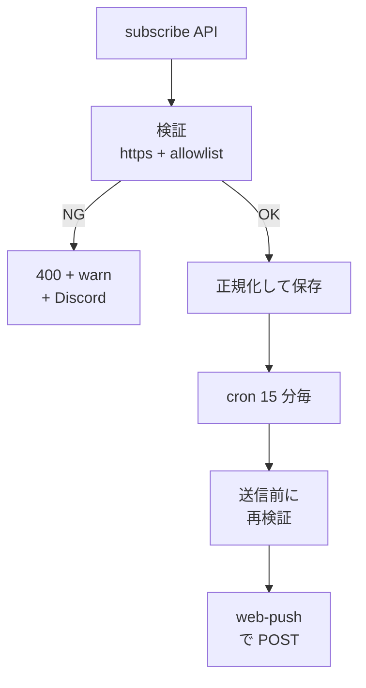

> リポジトリ: [Takenori-Kusaka/ganbari-quest](https://github.com/Takenori-Kusaka/ganbari-quest)

通知は、滞在時間を伸ばす最も安い道具です。だから、この製品では通知に上限があります。1 テナント 1 日 3 通、夜 9 時から朝 7 時は送らない、子供の端末には永久に送らない、親宛のマーケティングメールは年 6 回まで。この章では、その上限の実装、Web Push の endpoint に対する SSRF の防御、Service Worker とオフライン、そして「一度閉じたら二度と出さない」ホーム画面への追加の案内を扱います。

## 上限を先に決める

Web Push の設定は、リマインダー、ストリークの警告、達成の通知の 3 種と、サイレント時間帯です。定数は domain に置かれ、1 日の上限は 3 通、サイレント時間帯の既定は 21:00 から 07:00 で、開始が終了より遅いラップアラウンドを許します[^notifconst]。ローカルモードでは log を出すだけで送りません[^notifservice]。

配信は 15 分ごとの cron が担います。週次のメールレポート、リマインダーの push、ストリークの警告 push の 3 配信をまとめて送り、送信済みマーカーで冪等にします。15 分間隔なのは、リマインダーの時刻が任意の HH:MM だからで、毎時だと最大 59 分遅れます。判定用の設定はキーごとに 1 クエリへ畳み、実行頻度を上げてもクエリ数はテナント数に比例しません[^awsdesign]。

親宛のライフサイクルメール（期限切れ前のリマインド、休眠からの復帰）は、年 6 回の上限と List-Unsubscribe の header を構造的に保証します。リマインドは 30 日、7 日、1 日前の 3 回、休眠は最終ログインから 90 日です。トライアルの通知は「システム通知」として上限の枠外です[^lifecycle]。

## 子供に送らない

子供の端末への直接のマーケティング通信は、永久に NG です。COPPA の改正と [第Ⅰ部-2](anti-engagement) の原則の二重の規制です。設計は 2 層で、subscribe の API は `context.role === 'child'` なら 403 を返し、送信時にも `subscriberRole` が parent か owner でない subscription を skip して warn を出します。型の定義に `'child'` は含まれず、schema の default は `'parent'` です[^security]。

## endpoint への SSRF

Web Push の送信は、`push_subscriptions` に保存された endpoint の URL へ POST します。subscribe の API が受け取った endpoint を scheme や host の検証なしで保存すると、内部の host（169.254.169.254、localhost、RFC1918）を指定した攻撃者経由で SSRF が成立しえます[^security]。

保存前の検証は 4 つです。`https:` のみ。既知の Web Push service の host の allowlist（FCM は exact 一致、Mozilla・Apple・Windows は dot-suffix の末尾一致）。endpoint は 2,048 文字まで。key は base64 の charset と長さ上限。末尾一致なので `fcm.googleapis.com.attacker.com` のような偽装 host は弾かれます。保存は raw ではなく WHATWG の `new URL()` の `.href` で正規化した形で、「検証は WHATWG の parse、送信は web-push の legacy な `url.parse()`」という parser の差を保存時点で排除します[^security]。

送信側でも再検証します。過去のレコード、repo への直接 insert、将来の bulk import で allowlist 外の endpoint が入った場合、実際に HTTP request を出す送信側が SSRF の実 sink になるからです。subscribe と送信で同一の検証関数を共有し、二重実装しません。skip した endpoint のうち、確定的に不正なもの（非 https、private や loopback の IP）だけを削除し、allowlist の網羅漏れ（https で未知だが plausible な公開ベンダー）は削除せず skip と warn に留めます。allowlist は「動く標的」で、ベンダーが push host を新設した正規の subscription を一律削除すると恒久に失われるからです[^security]。

有効な subscription が 0 件で送信全体を skip する場合も、`notification_logs` に `success: false` と理由を記録します。早期 return が log を通らないと、通知の silent な全消失を運用が追跡できません[^security]。

## Service Worker とオフライン

Service Worker は、ビルド生成物と静的ファイルと prerender 済みページを precache します。除外は `/uploads/` と `/sounds/` で、`/tenants/` の認証済み user-content も precache に載せません。オフライン時の navigate の着地先は `/offline` で、prerender されているので precache に載ります。パスは定数化され、precache・fallback・test が同じ 1 か所を参照します。パスがずれると「precache していないページに fallback する」で無効になるからです[^sw]。

push の通知にも Service Worker が要ります。`renotify` は Notification API の正式なオプションですが TypeScript の DOM の lib の型には無く、webworker の lib だけが持つため、型を明示しています。細かい話ですが、生成AIが書くと型エラーを黙らせる方向に倒れやすい箇所です[^sw]。

## ホーム画面に追加

「ホーム画面に追加」の案内は、判定を component から切り出した純ロジックです。理由は、判定（どの環境で何を出すか、一度閉じたら二度と出さない）が実害に直結するからで、[第Ⅰ部-2](anti-engagement) の要求「閉じたら二度と出さない」を component の中の暗黙の分岐に埋めると回帰が検出できません[^pwainstall]。

閉じた記録は localStorage です。端末ごとの判断なので、サーバ側の tenant の設定にしてはいけません。同じ家庭でも「親のスマホには追加したが、リビングのタブレットにはまだ」が普通に起きます。iOS の Safari は `beforeinstallprompt` を実装しておらず、プログラムから追加ダイアログを出す手段が無いため、iOS だけは手順書を見せます。UA の判定は本来避けたいのですが、機能検出で代替できないため、ここでの分岐だけは UA です[^pwainstall]。

## メールの受信

SES は送信だけでなく受信も持ちます。サポート宛のメールは受信ルールで S3 に置かれ、Lambda が Discord に転送します。bounce と complaint は SNS の topic で受けます[^sesstack]。

## 今ならこうする

通知の上限を先に決めたことは、この製品で最も一貫した判断でした。1 日 3 通、夜間は送らない、子供には送らない、年 6 回。数字は変えられますが、上限が無い状態には戻せません。AI に通知機能を書かせると、送る理由は無限に出てきます。上限は、送らない理由を数字で固定します。

SSRF の防御は、subscribe 側だけでは足りませんでした。送信側の再検証、確定 SSRF だけを削除する保守的な cleanup、0 件 skip の証跡まで積み上がりました。allowlist を「動く標的」と認めて削除を控える判断は、正しさより顧客の subscription を守る判断です。

Service Worker の precache に `/offline` を含めるための定数化は、小さな規律の例です。「同じ値を 2 か所に書かない」は、[第Ⅱ部-3](design-system) から繰り返し見てきた形です。

[^notifconst]: 通知の定数。1 日の上限、サイレント時間帯の既定。出典: [src/lib/domain/constants/notification.ts](https://github.com/Takenori-Kusaka/ganbari-quest/blob/3af6c2ed9fd4fe5766fc80c255656e940f8ec8f0/src/lib/domain/constants/notification.ts)

[^notifservice]: Web Push の通知サービス。VAPID と web-push、ローカルモードの挙動、endpoint の検証。出典: [src/lib/server/services/notification-service.ts](https://github.com/Takenori-Kusaka/ganbari-quest/blob/3af6c2ed9fd4fe5766fc80c255656e940f8ec8f0/src/lib/server/services/notification-service.ts)

[^awsdesign]: AWSサーバレスアーキテクチャ設計書 §3.3 の cron ジョブ一覧（notification-delivery の 3 配信と 15 分間隔の理由）。出典: [docs/design/13-AWSサーバレスアーキテクチャ設計書.md](https://github.com/Takenori-Kusaka/ganbari-quest/blob/3af6c2ed9fd4fe5766fc80c255656e940f8ec8f0/docs/design/13-AWS%E3%82%B5%E3%83%BC%E3%83%90%E3%83%AC%E3%82%B9%E3%82%A2%E3%83%BC%E3%82%AD%E3%83%86%E3%82%AF%E3%83%81%E3%83%A3%E8%A8%AD%E8%A8%88%E6%9B%B8.md)

[^lifecycle]: ライフサイクルメールのサービス。年 6 回の上限、リマインドの 3 タイミング、休眠の閾値。出典: [src/lib/server/services/lifecycle-email-service.ts](https://github.com/Takenori-Kusaka/ganbari-quest/blob/3af6c2ed9fd4fe5766fc80c255656e940f8ec8f0/src/lib/server/services/lifecycle-email-service.ts)

[^security]: セキュリティ設計書 §8.8 Web Push 通知の対象監査（子供に送らない 2 層）、§8.9 subscribe endpoint の SSRF hardening（allowlist、正規化保存、送信側の再検証、確定 SSRF のみ cleanup、0 件 skip の証跡）。出典: [docs/design/14-セキュリティ設計書.md](https://github.com/Takenori-Kusaka/ganbari-quest/blob/3af6c2ed9fd4fe5766fc80c255656e940f8ec8f0/docs/design/14-%E3%82%BB%E3%82%AD%E3%83%A5%E3%83%AA%E3%83%86%E3%82%A3%E8%A8%AD%E8%A8%88%E6%9B%B8.md)

[^sw]: Service Worker。precache の対象と除外、オフラインの着地先の定数化、`renotify` の型。出典: [src/service-worker.ts](https://github.com/Takenori-Kusaka/ganbari-quest/blob/3af6c2ed9fd4fe5766fc80c255656e940f8ec8f0/src/service-worker.ts)

[^pwainstall]: 「ホーム画面に追加」の純ロジック。component から切り出す理由、localStorage の理由、iOS の UA 判定。出典: [src/lib/features/pwa/pwa-install.ts](https://github.com/Takenori-Kusaka/ganbari-quest/blob/3af6c2ed9fd4fe5766fc80c255656e940f8ec8f0/src/lib/features/pwa/pwa-install.ts)

[^sesstack]: SesStack の CDK 定義。送信 identity、受信ルール、bounce と complaint の topic。出典: [infra/lib/ses-stack.ts](https://github.com/Takenori-Kusaka/ganbari-quest/blob/3af6c2ed9fd4fe5766fc80c255656e940f8ec8f0/infra/lib/ses-stack.ts)
