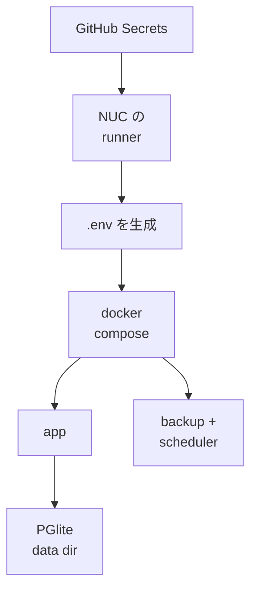

> リポジトリ: [Takenori-Kusaka/ganbari-quest](https://github.com/Takenori-Kusaka/ganbari-quest)

がんばりクエストは AGPL-3.0 で公開されていて、`docker compose up -d` の 3 コマンドで自宅のサーバや NAS に立てられます。私自身の家庭でも、Intel NUC の上で本番として動いています。この章では、SaaS と同じコードでセルフホストを成立させる仕組みを扱います。実行モードの分岐、GitHub Secrets から `.env` を生成する deploy、SQLite から PGlite への非破壊の切り替え、そしてバックアップが「動いているように見えて無保護」だった事故です。

## 3 つのコマンドと 5 つの約束

LP のセルフホスト版ガイドは、動作要件と約束を短く書いています。Docker Engine 20.10 以上、RAM 512MB、ストレージ 1GB。記録は完全に自分の管理下で、AI 機能を使わない限りデータは外部へ送信されない。完全無料で機能制限なし。オフラインでも LAN 内で動く。そして AGPL-3.0 の義務として、改変版をネットワーク経由で提供する場合は同じライセンスでソースを開示すること[^selfhost]。

SaaS 版との比較表は、セットアップ（アカウント登録だけ、対 Docker のインストール）、料金（基本無料と有料プラン、対 完全無料）、データ管理（AWS 上に暗号化保存、対 自分のサーバ）の 3 行です。[第Ⅰ部-5](pre-pmf-scope) で見た「作らないことを決める」判断と対で、セルフホストは「全機能を無料で開放する」判断です。

## 5 つの実行モードと Edition badge

同一のコードベースが 5 つの実行モードを駆動します。build（SSR の prerender）、demo、local-debug（`npm run dev`）、aws-prod、nuc-prod です。特に nuc-prod と aws-prod は同じ UI コードが両方を駆動するため、分岐を各 component に散らすと構造的な欠陥が出ます。設計書は 4 つを挙げています。SSOT が 2 系統になり表示が矛盾する、NUC で意味のない「ライセンスキー適用 / 決済 / 支払い履歴」を表示する、1 component が全モードの分岐を抱えて 940 行に肥大化する、Sentry の self-hosted のように cloud UI の痕跡が残る[^bifurcation]。

業界の prior art を 5 件比較し、Mattermost Team Edition や GitLab Community Edition と同じ「Edition badge + 簡略表示」の B 型を採りました。画面ゼロの A 型（Plausible）は極端、cloud UI の痕跡が残る C 型（Sentry）は悪い見本です。分岐は page 層の 1 か所に集約し、`locals.runtimeMode` が `nuc-prod` なら NUC 用の panel、それ以外は SaaS 用の panel を描画します。panel の内部にはモードの分岐を持ちません。940 行だった page は 25 行の薄いラッパーになりました[^bifurcation]。

NUC で削除したのは 5 セクションです。ライセンスキーの適用、現在のプラン、プラン管理、7 日間の trial、支払い履歴。どれも「NUC = 課金なし、全機能有効」で意味を持ちません[^bifurcation]。

## GitHub Secrets から `.env` を生成する

NUC への deploy は、NUC 上に常駐する self-hosted runner が担います。`deploy-nuc.yml` は main への push で走り、実行できる actor を 2 つの account に限定しています。public リポジトリの self-hosted runner で、想定外の actor が本番マシン上で任意コードを実行することを防ぐためです[^awsdesign]。

step は 6 つです。app コンテナの停止（WAL の flush）、最新コードの pull、GitHub Secrets からの `.env` 生成、PGlite への cutover（非破壊、初回のみ）、profile 付きの build と起動、health check。最後に、失敗を Discord に届ける step があります[^deploynuc]。

profile が要る理由は、2 度の再発から書かれています。`docker-compose.yml` の backup と scheduler は profile gate の配下にあり、profile を付けない deploy では build と再作成の対象外になります。一度も起動していなければ起動せず、手動で上げていても rebuild されません。registry にジョブを足しても NUC では永久に走らない状態が、設計書の前提を deploy が満たしていない形で存在していました[^deploynuc]。

失敗通知の step は、2026-08-05 のリリースから生まれました。その日の release は main に merge され、AWS 本番の deploy は成功しましたが、同じ push で起動した NUC の deploy は `.env` 生成 step の PowerShell の parse error で失敗しました。通知は 0 通で、気づいたのは人の目視です。AWS 側が success だったため「リリース済み」に見えていました。この deploy は最初に app コンテナを止めるため、失敗した時点で NUC は止まったままでした。[第Ⅳ部-8](platform-session) で見た「装置が顧客を止めた 3.5 時間」がこの事故です[^issue4275]。

env の配布には 4 経路があります。CI の通常 job、deploy 前のテスト、Lambda 本番（GitHub Secrets から CDK の context を経て Lambda の env へ）、NUC（GitHub Secrets から runner を経て `.env` へ）。1 つ欠けると本番の起動に失敗し、過去に 25 連続で失敗した原因でした。NUC には配らない env もあります。CloudFront の共有 secret は、[第Ⅲ部-2](cdk-stacks) で見たとおり NUC には入れません。Gemini の API key は任意ですが、NUC は AI provider が Gemini 固定のため、未設定だと AI 提案が全部キーワード提案に縮退します[^infraclaude]。

## SQLite から PGlite へ

NUC のデータベースは、2026 年 7 月に better-sqlite3 から PGlite（組込 Postgres の WASM）に切り替わりました。動機はクエリの複雑さではありません。クラウド側が Aurora DSQL に移行した際、33 本の repository を pg 固有の raw SQL で書いたため、SQLite では動かなくなりました。生成列による条件付き一意、`SELECT ... FOR UPDATE`、`gen_random_uuid()`、`RETURNING`。「同一 repo を 2 方言で再利用」する当初設計が不成立になったのです[^adr64]。

3 案を比較しました。A は SQLite 用の raw SQL repo を別に書く案で、33 本 × 2 の恒久的な方言 parity 税を払います。B は drizzle の query builder で方言非依存に書き直す案です。しかし drizzle は `pgTable` と `sqliteTable` を意図的に分離していて runtime の swap ができません。pg 固有の不変条件は結局 raw に退避が要り、しかも shipping 済みの 33 本を全面書き直す回帰リスクを負います。C は NUC を PGlite で動かし、pg の repo を verbatim で再利用する案です[^adr64]。

C の決定的な事実は「33 本は既に PGlite 上で全 unit test が通っている」ことでした。DSQL の integration test に PGlite を使っていたためです。方言税ゼロ、書き直しゼロ。PO は 2026-07-09 に「PGlite にしたいのは SQLite がクエリ複雑度に耐えられないからか」と問い、答えは No でした。理由は複雑度ではなく、二重実装税のゼロ化とクラウド挙動との parity です。承認の条件はロールバック可能であることでした[^adr64]。

懸念も一次情報で書かれています。PGlite は single-user mode で単一接続、公式の positioning は embedded / local-first / dev tool で「複数同時ユーザーには不適」と明記。永続化は Node の FS で、長期本番の durability は better-sqlite3 ほど battle-tested ではない。NUC は単一世帯、単一 writer なので、この制約と envelope が重なります[^adr64]。

## 非破壊の cutover

ロールバック可能を担保するのが import-then-swap です。旧 SQLite の DB は全工程で read-only とし、copy に対して export します。新しい PGlite の DB は別に構築し、import 後に 14 軸の件数を突合します。errors が 0 でなければ CLI が data dir を削除して exit 1 し、swap しません。検証が通ったら `.env` の `DATA_SOURCE` を `pglite` に切り替えて起動し、health が `dataSource: "pglite"` と `schemaValid: true` を返すことを確認します。旧 DB は物理的に保持し、問題があれば `.env` を戻すだけで復帰します[^cutover]。

deploy の cutover step は、PGlite の data dir が既に存在すれば skip します。PGlite 稼働後の deploy で cutover 後のデータを凍結 snapshot で上書きしないためです。意図的にやり直す場合は data dir を退避してから dispatch し、「cutover 以降の記録データは失われる」ことを PO に確認してから実行します[^cutover]。

## 動いているように見えて無保護

2026-07-12 の PGlite 移行後も、backup サービスは旧 SQLite を複製し続けていました。しかもその SQLite に残った FK violation で毎日 fail していました。「毎日動いているように見えて実データは無保護」の状態です[^backup]。

対処は 2 つです。backup の入口を 1 本にし、backend を見て経路を振り分ける。PGlite は data dir を単一プロセスで占有するため backup コンテナから直接 open できず、整合したスナップショットを採れるのは DB を掴んでいるアプリプロセスだけです。だから backup コンテナはアプリの `/api/cron/pglite-backup` を HTTP で叩き、起動を依頼します。そして backend の判定は env ではなく `/api/health` の `dataSource`（アプリが実際に使っている backend）で行い、env とは照合だけをして、食い違ったら実行前に落とします。旧実装の `process.env.DATA_SOURCE || 'sqlite'` は、未設定、typo、配布漏れのどれでも黙って SQLite の経路に落ち、間違った backend を成功と報告しうる形でした[^backup]。

この backup が `CRON_SECRET` の未配布で 18 晩失敗した件は、[第Ⅴ部-4](fitness-functions) で見ました。「読む口があるのに誰も配っていない env」の 4 例のうちの 1 つです。

## 今ならこうする

セルフホストを SaaS と同じコードで成立させる判断は、正しかったと考えています。デモ、SaaS、セルフホストのすべてが、1 つのイメージと環境変数で動きます。[第Ⅲ部-6](multi-lambda-demo) の設計と同じ原理です。

一方で、NUC は事故の多い環境でした。deploy の失敗が通知されず、backup が旧 DB を複製し続け、env が配られず、scheduler が起動していませんでした。共通するのは「AWS 側が緑なら全部緑に見える」ことです。self-hosted runner の上で動く deploy は、GitHub-hosted の runner とは別の失敗の仕方をします。NUC の staging を作り、health を監査の手順に配線したのは、その学びのあとでした。

PGlite への切り替えは、実装量ゼロで方言税を消した判断ですが、PGlite の本番 durability はまだ「NUC 1 台の実績」しかありません。better-sqlite3 に戻す fallback は ADR に温存されています。

[^selfhost]: LP のセルフホスト版ガイド。クイックスタートの 3 コマンド、動作要件、5 つのメリット、AGPL-3.0 の義務、SaaS 版との比較表。出典: [site/selfhost.html](https://github.com/Takenori-Kusaka/ganbari-quest/blob/3af6c2ed9fd4fe5766fc80c255656e940f8ec8f0/site/selfhost.html)

[^bifurcation]: NUC と SaaS の runtime 分岐の設計書。5 つの実行モード、4 つの構造欠陥、業界 prior art 5 件と B 型の採用、page 層 1 か所の分岐、NUC で削除する 5 セクション、拡張ガイドライン。出典: [docs/design/nuc-saas-runtime-bifurcation.md](https://github.com/Takenori-Kusaka/ganbari-quest/blob/3af6c2ed9fd4fe5766fc80c255656e940f8ec8f0/docs/design/nuc-saas-runtime-bifurcation.md)

[^awsdesign]: AWSサーバレスアーキテクチャ設計書 §4.1 NUC self-hosted runner の actor ガード、§4.2 NUC staging。出典: [docs/design/13-AWSサーバレスアーキテクチャ設計書.md](https://github.com/Takenori-Kusaka/ganbari-quest/blob/3af6c2ed9fd4fe5766fc80c255656e940f8ec8f0/docs/design/13-AWSサーバレスアーキテクチャ設計書.md)

[^deploynuc]: NUC への deploy workflow。6 つの step、PGlite cutover の skip 条件、profile を付ける理由（2 度の再発）、失敗通知の step。出典: [.github/workflows/deploy-nuc.yml](https://github.com/Takenori-Kusaka/ganbari-quest/blob/3af6c2ed9fd4fe5766fc80c255656e940f8ec8f0/.github/workflows/deploy-nuc.yml)

[^issue4275]: 2026-08-05 のリリースが本番 NUC に届いていなかった Issue。顧客影響、実測、根本原因（`.env` 生成 step の PowerShell parse error）。出典: [Issue #4275](https://github.com/Takenori-Kusaka/ganbari-quest/issues/4275)

[^infraclaude]: infra 配下の CLAUDE.md。§production env 必須配布 4 経路（25 連続失敗の原因）、必須 production env の表（Gemini の API key と NUC の縮退、CloudFront の共有 secret を NUC に配布しない理由）。出典: [infra/CLAUDE.md](https://github.com/Takenori-Kusaka/ganbari-quest/blob/3af6c2ed9fd4fe5766fc80c255656e940f8ec8f0/infra/CLAUDE.md)

[^adr64]: ADR-0064「NUC 新 model repo 構築方式 — PGlite 一次採用」。コンテキスト（pg 固有機能への依存）、3 案の比較、PO の問いと回答、決定的根拠、トレードオフ、ロールバック保証、検証 gate。出典: [docs/decisions/0064-sqlite-core-repo-strategy.md](https://github.com/Takenori-Kusaka/ganbari-quest/blob/3af6c2ed9fd4fe5766fc80c255656e940f8ec8f0/docs/decisions/0064-sqlite-core-repo-strategy.md)

[^cutover]: PGlite cutover の runbook。前提、手順（export、import と件数突合、swap、health）、中止基準、復帰手順、意図的な再 cutover。出典: [docs/runbooks/nuc-pglite-cutover.md](https://github.com/Takenori-Kusaka/ganbari-quest/blob/3af6c2ed9fd4fe5766fc80c255656e940f8ec8f0/docs/runbooks/nuc-pglite-cutover.md)

[^backup]: NUC 日次バックアップの入口。backend の決め方（`/api/health` の `dataSource`）、HTTP 越しにする理由、振り分けが要る理由（2026-07-12 以降の事故）。出典: [scripts/backup-nuc.cjs](https://github.com/Takenori-Kusaka/ganbari-quest/blob/3af6c2ed9fd4fe5766fc80c255656e940f8ec8f0/scripts/backup-nuc.cjs)
