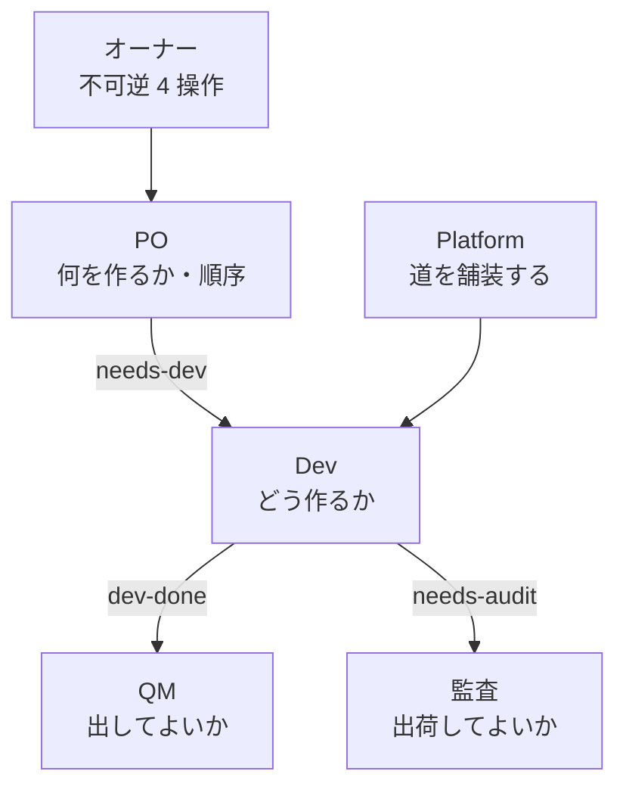

> リポジトリ: [Takenori-Kusaka/ganbari-quest](https://github.com/Takenori-Kusaka/ganbari-quest)

がんばりクエストの開発者は一人です。しかしリポジトリの運用文書には、PO、Dev、QM、監査、Platform という 5 つのロールが登場し、それぞれが別のクローンと別の Claude Code セッションで動いています。この部では、一人の人間が生成AIとともにどう開発してきたかを扱います。最初の章は、その体制を定めた「チーム憲章」と、誰が何を決めるかの表です。

## なぜ一人でロールを分けるのか

生成AIに実装を任せると、実装のコストは下がりますが、検証と判断のコストは下がりません。むしろ生成される変更の量が人間の検証帯域を超え、レビューは「読んで承認する」から「印を押す」へ縮退します。この構造は既刊『AIが実装する時代の開発プロセス ― ピットイン方式』の主題で、本書はその実例にあたります。

がんばりクエストがロールを分けた直接の理由は、チーム憲章の「Scrum からの逸脱」の表に書かれています。

> QM / 監査という gate ロールがある。Scrum に品質ゲート役は無い（Developers が Definition of Done に責任を持つ）。理由: ADR-0022 作成者 ≠ 承認者。AI エージェントは自分の成果物を自分で承認しがちで、実際に繰り返し起きた。gh アカウント分離（`ganbariquestsupport-lab`）で機械的に分けている[^charter]

AI は自分の成果物を自分で承認します。人間なら「自分のプルリクエストは自分で approve しない」という常識で止まる行為を、AI は止めません。そこで、作る側と承認する側を別のセッション、別の GitHub アカウントに分けました。この分離は次の章以降で繰り返し出てくる、本書で最も重要な機構です。

## 体制図

憲章の全体図を Mermaid に写します。各クローンは互いを知らず、受け渡しはすべて GitHub の label を経由します。

| ロール | クローン | 決めること | Scrum との対応 |
| --- | --- | --- | --- |
| PO | `ganbari-quest-po` | 何を作るか、backlog の順序、顧客に見える文言と UX の方針 | Product Owner |
| Dev | `ganbari-quest-dev` | どう作るか、いつ誰がやるか、使う OSS、テストの書き方 | Developers |
| QM | `ganbari-quest-qa` | 個別のプルリクエストを merge してよいか | Scrum にはない gate ロール |
| 監査 | `ganbari-quest-audit` | develop から main への統合可否、release cut | 同上 |
| Platform | `ganbari-quest-platform` | 装置（検査・ワークフロー・テンプレート）の削減と自動生成 | Team Topologies の platform team |
| オーナー | 人間 | 本番データの削除、本番 deploy、課金の書き込み、スキーマ変更 | — |

憲章は Scrum Guide の原文を引いて、各ロールの責任を対応づけています。PO は「製品の価値を最大化する」責任と「backlog の順序を決める」責任を持ちますが、着手そのものは管理しません。Dev は self-managing で、「誰が何をいつどうやるか」を内部で決めます。憲章はここに注記を置いています。

> PO が「これを先にやって」と個別に指示しない。順序は §4.1 の backlog 順で伝わっており、そこから何を取るかは Dev が決める。PO が個別指示を始めると Dev の self-management が消え、PO がボトルネックになる（2026-08-01 に実際に起きた）[^charter]

一人で全ロールを演じていても、この境界は守ります。PO セッションが Dev セッションに着手順を指示し始めると、PO がボトルネックになるからです。

## 設計原則: 手順ではなく決定権で境界を引く

憲章の設計原則は 5 つです[^charter]。

1. 境界は「手順」ではなく「決定権」で引く。誰が何をやるかではなく、誰が何を決めるかを定める
2. 役割は Scrum の 3 責任に対応づけ、逸脱は逸脱として明示する
3. 統制は gate ではなく道の性質にする。「思い出して満たすもの」を減らし、「既定で満たされているもの」を増やす
4. 渡し方は 1 つに固定する。mention やコメントは通知経路ではない
5. 迷ったら止めて渡す。自分の職掌か判断できないものを進めない

第 1 の原則が、決定権の表（DACI）を生みます。D は案を作る人、A は決める人で 1 つの決定に 1 人、C は意見を求められる人、I は決まった後に知らされる人です。表から代表的な行を引きます。

| 決定 | D | A | C |
| --- | --- | --- | --- |
| やるか / やらないか（事業価値・Pre-PMF バケット） | PO | PO | Dev |
| backlog の順序 | PO | PO | Dev |
| 価格・課金の方針 | PO | オーナー | — |
| 何を今のレーンに取り込むか | Dev | Dev | PO |
| 設計・実装方式・使う OSS | Dev | Dev | PO |
| 新テーブル / 新 interface / セキュリティ機能 / 課金変更 / AWS リソース追加 / 3 人日以上 | Dev | PO | — |
| 個別 PR を merge してよいか | QM | QM | Dev |
| develop → main 統合 PR の可否、release cut | 監査 | 監査 | QM |
| staging / 本番 deploy | 監査 | オーナー | — |

不可逆な 4 つの操作、すなわち本番データの削除、本番 deploy、課金の書き込み、スキーマ変更だけは、常にオーナーが決めます。「気づいた人が誰でも `state:needs-owner` を付ける」と定め、判定は「自分の職掌か」ではなく「この操作が含まれるか」で行います[^charter]。

第 3 の原則は、憲章がプラットフォームエンジニアリングから借りた考え方です。「governance stops being a gate and becomes a property of the path」、統制は関門ではなく道の性質になる、という原則で、これが Platform ロールの新設につながりました。

## Platform ロール: 装置を減らす専任

このリポジトリでは、検査スクリプト、ワークフロー、プルリクエストのテンプレート、CLAUDE.md が増え続けていました。憲章の §1 は理由を「削減を引き受ける役割が居なかったため」と診断し、実測の表を置いています。記載時点で、検査スクリプトは 45 本、ワークフローは 32 本、CLAUDE.md は 6 ファイル合計 815 行でした[^charter]。

Platform ロールは Dev を顧客とし、Dev の外在的な認知負荷を下げることだけを目的にします。憲章には 3 つの制約が書かれています。

> 1. 装置の総数は ratchet。増やせない。 新しい検査を入れるなら、同じ PR で既存を 1 本以上減らす
> 2. 「直す」より「消す」「生成する」を先に検討する。 検査を足して人に守らせるのではなく、守らなくてよい形にする
> 3. 成功指標は Dev の手戻り。 装置の本数でも CI の緑でもない。QM の差し戻し件数 / `pre-ready` の落ち回数 / PR の往復回数を計測し、下がったかで評価する[^charter]

なぜ Dev や QM に持たせないかも記されています。Dev が持つと、自分の負荷を減らす時間を自分の backlog に確保できず、常に実装が優先されます。QM が持つと、検査する側が検査装置を作ることになり、作成者と承認者の分離が崩れます[^charter]。この章の詳細は [第Ⅳ部-8](platform-session) で扱います。

## §0: 運用モードの上書き

憲章には §1 以降の設計と別に、「§0 現在の運用モード」があり、「§1 以降と食い違ったら、こちらが勝ちます」と宣言しています。2026-08-05 にオーナーが決めた 8 つのルールです[^charter]。

| # | ルール |
| --- | --- |
| 1 | 装置は増やさない・良くしない。減らすのと、リリースプロセスへ移すのは進める |
| 2 | QM は指摘を Dev に返さず、自分で直して merge する |
| 3 | QM は PO に決裁を求めない |
| 4 | PO の決裁は 2 つだけ。顧客に見える文言・UX・価格の方針と、backlog の順序 |
| 5 | AC は目安。close の判定は「顧客に届いたか」 |
| 6 | Dev に返すのは 2 つだけ。実装方針の変更を伴うものと、BLOCK 3 類型 |
| 7 | 気づいたら Issue を書かず、その場で PR を出す |
| 8 | 監査だけは第三者を保つ |

ルール 1 の判定基準には、この体制の到達点が書かれています。

> すべてのブロッカーを機械で入れることは不可能だと判断しました。 機械的な打ち手は「その打ち手を守る打ち手」を呼び、無限ループになります。80 点を目標値とし、残り 20 点を詰めるための装置は持ちません。[^charter]

本書の後半で扱う品質ゲートの機械化は、この 80 点に至るまでの積み上げです。そして §0 は、積み上げが 80 点を超えて自己目的化しかけたときに、オーナーが引いた線です。ルール 7 と 8 も同じ文脈にあります。Issue を経由した受け渡しが「気づき → 起票 → 決裁 → 着手 → PR」の 5 段を作り、価値を生まないまま滞留していたため、「気づき → PR」の 2 段に縮めました。Issue にするのは顧客価値の作業単位と、オーナーの手番が要るものだけです。

## 解けていないこと

憲章は最後に「この憲章で解けていないこと」を明示しています。「解けたと書くと、次に困った人が原因を探せなくなる」からです[^charter]。

- Scrum Master 相当の人的部分が不在。ロール間の中継と判断の橋渡しはオーナーのまま
- Product Backlog が整理されていない。open Issue に EPIC、単発、装置起因が混在
- Definition of Done がロールごとに散っている
- 手戻りの実測値が無い。Platform の成功指標をまだ測っていない

一人で 5 つのロールを運用する仕組みは、完成した方法論ではありません。次の章では、この体制の神経系にあたる label mailbox、つまりセッション間の受け渡しの仕組みを扱います。

[^charter]: チーム憲章。§0 現在の運用モード（8 つのルールと 80 点の判定基準）、§1 設計背景（装置の実測表）、§2 設計原則、§3 体制（全体図、Scrum との対応、意図的な逸脱、Platform ロール）、§4 決定権（DACI）、§5 コミュニケーション、§6 未解決の課題。出典: [docs/sessions/README.md](https://github.com/Takenori-Kusaka/ganbari-quest/blob/3af6c2ed9fd4fe5766fc80c255656e940f8ec8f0/docs/sessions/README.md)
