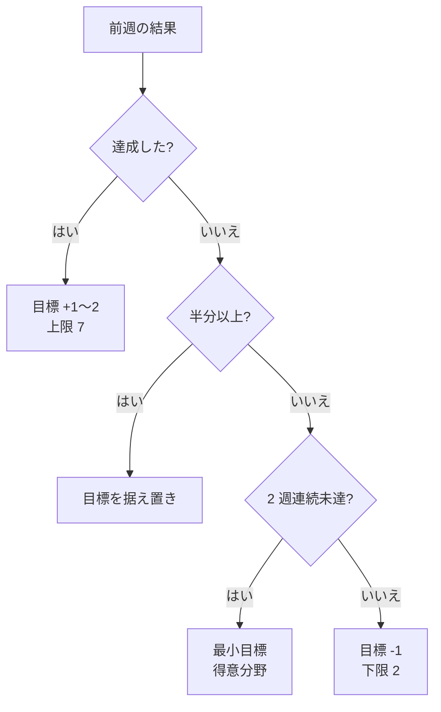

> リポジトリ: [Takenori-Kusaka/ganbari-quest](https://github.com/Takenori-Kusaka/ganbari-quest)

ゲーミフィケーションは、放っておくと増殖します。おみくじ、レベル、称号、実績、バトルがそれぞれ独自の報酬を持ち、独自の理由で追加され、やがてポイント経済を歪めます。がんばりクエストにもその時期がありました。ゲーミフィケーション設計書は自らの成り立ちについて、おみくじ・レベル・称号・実績・バトルの意図なき独立成長によりポイント経済を歪める問題を抱えていた、と記しています[^gami]。この章では、その反省から作られた 3 層モデルと、経済を壊さないための規律を扱います。

## 3 層モデルと「ポイント統一原則」

コアループの設計理由を記録した文書は、採用したモデルを 3 行で書いています[^rationale02]。

```text
L1 活動層    : 個別活動完了 → ポイント付与
L2 メタ習慣層: 「毎日正しく入力する」→ スタンプカード (rarity = anti-habituation) → ポイント付与
L3 経済層    : 累積ポイント → ごほうびショップ (唯一の出口) → 実物/お金/特権
```

このモデルの要は「ポイント統一原則」です。通貨はポイントだけ、出口はごほうびショップだけ。レベルや称号は「ポイント履歴の装飾」であり、独立した報酬を持ちません。設計書は全機構の位置づけを 1 つの表で管理し、「表現」に分類された機構への独立したポイント供給を原則違反と定めています[^gami]。新しい機構は、この表に行を足してから実装に着手します。

| 機構 | 分類 | 役割 | 出力 |
| --- | --- | --- | --- |
| 活動記録 | L1 | ポイント取得の主軸 | ポイント |
| スタンプカード | L2 | メタ習慣の強化 + 飽き対策 | ポイント（レア度で変動） |
| おみくじ | L1 副次 | 毎日の動機づけ | ポイント |
| バトル | L1 副次 | RPG 演出 + 副次ポイント | ポイント |
| レベル・称号 | 表現 | ポイント累積の視覚化 | 表示のみ |
| 実績（廃止） | — | チャレンジ機能に統合 | — |
| ごほうびショップ | L3 | ただ 1 つの出口 | 実物 / お金 / 特権 |

設計書の基本原則には、この製品がゲーミフィケーションで何を「しない」かも書かれています。

> 1. 活動記録の動機づけ以外は有害 — コレクション閲覧・着せ替え等のアプリ内滞在目的機能は禁止（ADR-0012）
> 2. 親が褒める仕組み — アプリはきっかけを作るだけ。最終的な報酬は親からの言葉。アプリが主役になってはならない
> 3. ポジティブトーンのみ — 罰則・減点・ネガティブフィードバックは一切設けない[^gami]

「アプリが主役になってはならない」は、この章全体を貫く規律です。

## L2: スタンプカードの設計

L2 は「毎日入力する」というメタ習慣を強化する層です。子供が 1 日 1 回おみくじを引くと、スタンプが週のカードに押されます。実装の定数を見ると、設計の意図が読み取れます[^stampsvc]。

```ts
// src/lib/server/services/stamp-card-service.ts
// レア度別排出確率
const RARITY_WEIGHTS: Record<string, number> = { N: 60, R: 25, SR: 12, UR: 3 };
// レア度別ポイント倍率
const RARITY_MULTIPLIER: Record<string, number> = { N: 1, R: 2, SR: 4, UR: 8 };
/** 押印時の基本ポイント（レア度倍率を掛ける） */
const INSTANT_STAMP_BASE = 5;
/** 週末redeem時のスタンプ1個あたりの固定ポイント（レア度無関係） */
const POINTS_PER_STAMP = 10;
/** 5/5コンプリートボーナス（週末redeem時） */
const COMPLETE_BONUS = 50;
```

レア度は 4 段階で、出現率は 60% / 25% / 12% / 3% です。押した瞬間にもらえるポイントはレア度で 5 / 10 / 20 / 40 と変わりますが、週末にカードを交換するときのポイントはレア度と無関係にスタンプ 1 個 10 ポイント、5 個そろえば 50 ポイントのボーナスが加わり、合計は毎週一律 100 ポイントです。

レア度の変動には、明確な目的が書かれています。

> 目的: rarity 変動（N/R/SR/UR）は anti-habituation（習慣化への飽き対策）として設計されている。
> 同じ結果が毎回確定すると子供が飽きる（habituation）。rarity 変動によって毎回「どのレアリティか」という小さな予測不確実性が生まれる。これは variable-ratio 強化スケジュールとして機能し、継続記録習慣の形成を助ける[^gami]

変動比率の強化スケジュールは、射幸性を煽る機構と紙一重です。設計書はこの境界を「1 日 1 回」という上限で引いています。押印は 1 日 1 回、数秒で完了。カードの完成確認は週 1 回。スタンプを目当てに「もっとアプリを開く」設計は、前章の anti-engagement 原則の違反です[^gami]。

カードの枠が 7 個ではなく 5 個である理由も記録されています。「7 日タップで 1 枚」に揃える案は、1 日でも休むとカードが完成しないプレッシャー設計に逆行するとして退けられました。曜日ごとに固定の枠を持つ案は、月曜だけ忙しい家庭が永遠に月曜の枠を埋められず、旅行や病欠で交換不能になるとして退けられました。5 枠で曜日に依存しない設計は、週 7 日のうち 5 日、約 71% のタップで完成する「タップ忘れ 1 日の許容」を核にしています[^rationale04]。

## L3: 出口は 1 つ

L3 のごほうびショップは、ポイントのただ 1 つの出口です。棚には実物、お小遣い、特権の 3 種類があり、価格（何ポイントか）は親が決めます。「夜ふかし 30 分」「ゲーム時間 1 時間」のような特権の棚は、海外の子供向け金銭教育サービスとの差別化の核として、削らないことが決まっています。

経済を壊さないための規律が 1 つあります。

> 陳列と発行は別の行為: ごほうびショップの棚に商品を置くこと（`special_rewards` への INSERT）は通貨を発行しない。棚に置いた瞬間に同額が子供の残高に入ると、ごほうびが自分の代金を自分で払うことになり「活動して貯める → 使う」経済が成立しない[^gami]

当たり前に見えますが、機能を追加するたびに「ついでにポイントも配る」誘惑は生まれます。設計書に明文化しておくことで、レビューで即座に指摘できます。

## 褒める対象を「量」から「継続」へ

ポイントとは別に、この製品には「褒める」機構があります。初月に親へ届く価値プレビューのマイルストーンや、習慣化の証明書です。ここで一度、褒める対象を取り違えた設計がありました。記録の累計回数（5 回、10 回）で自動的に報酬を配っていたのです。設計書は現在、これを明確に禁じています。

> 褒めるべきは「続いたこと」であって「たくさん入力したこと」ではない。 記録の累計回数や剰余（`totalRecords % N`）で報酬を配ってはならない。1 日に何回記録しても発火してしまい、褒める対象を取り違える。[^gami]

代わりに残ったのは、記録の開始（1 回目）と継続（7 日、14 日、30 日の連続）、そして月単位で記録した日数が閾値を超えた「月レベルの習慣化達成」だけです。月 1 回に限る理由が興味深いところです。

> 月 1 回に限る理由は頻度ではなく §2.1-2 の「最終的な報酬は親からの言葉」。 5 回ごとに配ると、親が「がんばったね」と言う前にアプリが完結させてしまう。月 1 回なら親が気づいて声をかける余地が残る。[^gami]

アプリが褒めすぎると、親が褒める余地を奪う。この製品の報酬設計は、最終的な報酬をアプリの外、親の言葉に置くことで閉じています。

## 自動生成チャレンジ: 中期目標の層

日々のコアループには 2 つの限界があります。チャレンジ設計書はそれを次のように特定しています。

> 1. 記録のマンネリ化 — 毎日同じ活動だけを記録し続けると、子供にとって「ただの作業」になり動機が薄れる。
> 2. やる活動の偏り — 子供は得意・好きなカテゴリ（例: 運動）ばかり記録し、苦手・後回しのカテゴリ（例: 勉強・生活）に手が伸びない。[^challenge]

チャレンジは、この 2 つを「期間つきの中期目標」という 1 つの仕組みで解きます。設計上の決断は「親に作らせない」ことでした。当初は親が手動で目標を設定できる画面と、マーケットプレイスからチャレンジ集を取り込む導線がありましたが、どちらも廃止されました。自由度を上げると条件設定がプログラミングのように複雑になり、Pre-PMF には過剰だからです[^challenge]。現在は、アプリが子供ごとに週 1 件を自動生成します。

生成は機械学習やルールエンジンを使わず、行動科学の知見に基づくヒューリスティックと調整可能な定数で動きます[^challenge]。

| 定数 | 既定値 | 役割 |
| --- | --- | --- |
| `TARGET_DELTA` | 1 | 実測の週平均にこれを足したものを基準の目標にする |
| `MIN_TARGET` / `MAX_TARGET` | 2 / 7 | 目標の下限と上限（下限は「小さく始める」原則で 3 から 2 に下げた） |
| `WEAK_BIAS_BASE` | 5 | 苦手カテゴリを優先する重み |
| `EVERY_N_WEEKS_STRONG` | 4 | 「得意深掘り週」を入れる周期 |
| `BUMP_NORMAL` / `BUMP_OVERSHOOT` | 1 / 2 | 達成時の昇圧（大幅超過なら +2） |
| `MISS_RESCUE_AFTER` | 2 | 連続未達でレスキューに切り替える閾値 |

基本は直近 2 週間の活動ログから苦手なカテゴリを選び、4 週に 1 度は得意なカテゴリを深掘りします。前週の結果で翌週の目標を 3 分岐で調整し、達成なら +1 か +2、半分以上なら据え置き、半分未満なら -1 にします。2 週連続で未達なら、目標を最小に固定して得意カテゴリに切り替え、必ず達成体験を差し込みます。設計理由の文書は、この非対称を「滞在時間延伸でなく達成体験の確保が目的」と説明し、目標を上げるのは達成時のみで上限 7、「青天井で煽らない」と念を押しています[^rationale12]。



兄弟の競争は採りません。「兄弟間の勝ち負け比較は自己肯定感を毀損する（depression/自傷リスクの相関）」ため、チャレンジは各子供の自己基準に閉じます[^challenge]。

## 時刻の基準を 1 つにする

ポイント経済は「今日」「今週」の判定の上に成り立っています。ここで、UTC で動く本番環境の Lambda が問題になりました。書き込み側は UTC で「今週の日曜」を入れる一方、読み出し側は日本時間で「今日」を計算していました。その結果、週次チャレンジのバッジは毎週 9 時間まるごと消えました。「記録したのに今日のおやくそくが埋まらない」という不具合も同じ原因です。チェックリストの進捗の巻き戻りも同様でした[^challenge]。

対策は、暦の計算を日本時間の関数群に一本化し、プロセスのタイムゾーンに依存する日付の取得（ローカルの getter や `toISOString().slice(0, 10)`）を禁止することでした。禁止は CI のスクリプトが検出します[^challenge]。この検査は品質ゲート編で改めて扱います。

## 何を捨てたか

この章の設計は、捨てたものの多さで特徴づけられます。実績システムは廃止され、チャレンジ履歴に統合されました。称号のコレクションは廃止されました。兄弟の競争モードは削除されました。親が手動で作るチャレンジも、マーケットプレイスのチャレンジ集も廃止されました。ログインボーナスの日次レコードは、子供ごとの 1 行の状態（最終ログイン日と連続日数）に縮約され、削除すべき履歴を最初から生まない構造になりました[^rationale15]。

残ったのは 3 層だけです。活動を記録すればポイントが増え、毎日入力すればスタンプが押され、貯まれば親の用意した棚で使えます。この単純さは、初期状態からあったものではなく、増殖した機構を原則に照らして削り続けた結果です。

[^gami]: ゲーミフィケーション設計書。§1 設計背景（独立成長による経済の歪み）、§2.1 基本原則、§2.4 ポイント統一原則と機構の位置づけ表、§4a スタンプカードの詳細設計（1 日 1 回 cap、anti-habituation の意図）、「陳列と発行は別の行為」、褒める対象を「続いたこと」に限る規律と月 1 回の理由。出典: [docs/design/26-ゲーミフィケーション設計書.md](https://github.com/Takenori-Kusaka/ganbari-quest/blob/3af6c2ed9fd4fe5766fc80c255656e940f8ec8f0/docs/design/26-%E3%82%B2%E3%83%BC%E3%83%9F%E3%83%95%E3%82%A3%E3%82%B1%E3%83%BC%E3%82%B7%E3%83%A7%E3%83%B3%E8%A8%AD%E8%A8%88%E6%9B%B8.md)

[^rationale02]: コアループの設計理由。L1/L2/L3 の 3 層モデルの定義と採用理由。出典: [docs/rationale/02-core-loop-rationale.md](https://github.com/Takenori-Kusaka/ganbari-quest/blob/3af6c2ed9fd4fe5766fc80c255656e940f8ec8f0/docs/rationale/02-core-loop-rationale.md)

[^stampsvc]: スタンプカードのサービス層。レア度別の出現率と倍率、押印時の基本ポイント、週末交換時のポイント、完成ボーナスの定数。出典: [src/lib/server/services/stamp-card-service.ts](https://github.com/Takenori-Kusaka/ganbari-quest/blob/3af6c2ed9fd4fe5766fc80c255656e940f8ec8f0/src/lib/server/services/stamp-card-service.ts)

[^rationale04]: スタンプカード仕様の設計理由。7 枠案と曜日依存案の棄却理由、5 枠曜日非依存の採用理由。出典: [docs/rationale/04-stamp-card-spec-rationale.md](https://github.com/Takenori-Kusaka/ganbari-quest/blob/3af6c2ed9fd4fe5766fc80c255656e940f8ec8f0/docs/rationale/04-stamp-card-spec-rationale.md)

[^challenge]: チャレンジ設計書。§1 コアループの 2 つの限界、§2.1 顧客価値とユーザーカスタマイズを提供しない判断、競争を採らない理由、§3.1 週次自動生成の仕様、§3.4 生成アルゴリズムの調整可能定数、暦計算の JST 一本化とタイムゾーン不備が招いた不具合。出典: [docs/design/44-チャレンジ設計書.md](https://github.com/Takenori-Kusaka/ganbari-quest/blob/3af6c2ed9fd4fe5766fc80c255656e940f8ec8f0/docs/design/44-%E3%83%81%E3%83%A3%E3%83%AC%E3%83%B3%E3%82%B8%E8%A8%AD%E8%A8%88%E6%9B%B8.md)

[^rationale12]: チャレンジ自動生成の設計理由。前週結果による 3 分岐の目標調整、2 週連続未達のレスキュー、「青天井で煽らない」非対称設計の意図。出典: [docs/rationale/12-auto-challenge-generation-rationale.md](https://github.com/Takenori-Kusaka/ganbari-quest/blob/3af6c2ed9fd4fe5766fc80c255656e940f8ec8f0/docs/rationale/12-auto-challenge-generation-rationale.md)

[^rationale15]: ログインボーナスの日次レコードを子供ごとの状態カウンターに縮約した設計理由。出典: [docs/rationale/15-login-bonus-counter-rationale.md](https://github.com/Takenori-Kusaka/ganbari-quest/blob/3af6c2ed9fd4fe5766fc80c255656e940f8ec8f0/docs/rationale/15-login-bonus-counter-rationale.md)
