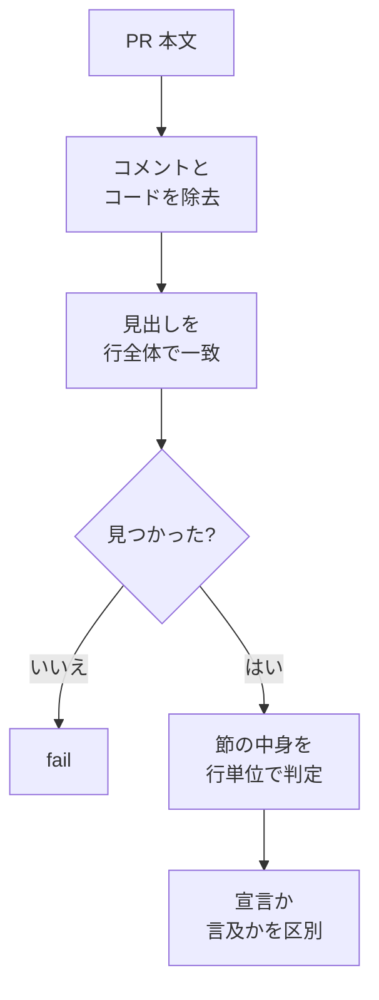

> リポジトリ: [Takenori-Kusaka/ganbari-quest](https://github.com/Takenori-Kusaka/ganbari-quest)

生成AIはプルリクエストの本文を「書けてしまい」ます。テンプレートの見出しをすべて埋め、検証コマンドを列挙し、チェックボックスに印を付けた本文が、実際に検証していなくても出てきます。がんばりクエストの gate の一群は、この本文そのものを入力にします。必須節があるか、閉じる Issue が宣言されているか、証跡の例外に理由が付いているか。この章では、本文を読む gate がどう作られ、どこで空振りし、どう直されたかを扱います。

## 30 行のテンプレート

PR テンプレートは 7 つの見出しだけです。2026 年 8 月に 102 行から 30 行以下へ、11 節から 7 節へ再構成されました。

| 節 | 何を書くか |
| --- | --- |
| 顧客価値・目的 | 誰の何が良くなるかを 1〜2 文。実装の説明ではなく変化 |
| 関連 Issue | 行頭の closing keyword。閉じない場合は理由をコメントで宣言 |
| 変更内容 | レビュアが diff を読む前に持っておくべき前提だけ |
| 検証 | コマンドと結果。実行していないものは「未実行」と書く |
| 影響範囲 | 顧客に見える変化、触った並行実装ペア、破壊的変更の有無 |
| 配布済み env / secret | 新規 env 追加時のみ。CI が「配布済み:」行を検出する |
| QM レビュー結果 | QM が記入 |

見出しの一覧は JSON に切り出され、CI の workflow、Dev の skill、ローカルの検査スクリプトが共通参照します[^sections]。「顧客価値・目的」の第 1 文には、2026 年 9 月から別の役割が付きました。リリース時に Discord のお知らせとして顧客へそのまま配信されます。テンプレートのコメントは「お客さまが読む文として書くこと。内部識別子・英字語・パスを書かない」と指示し、配信したくない場合は `release-note: none` を宣言させます[^template]。プルリクエストの本文が、そのまま顧客向けの文書になる設計です。

## 3 つの workflow と 4 つのレーン

本文を読む gate は 3 つの workflow に分かれています。

| workflow | job | 見るもの |
| --- | --- | --- |
| pr-template-gate | 4 job | 必須節の存在、Issue 参照、顧客価値の記入、closing keyword |
| pr-quality-gate | 4 job | スクリーンショットの有無と品質、Blob SHA の一致、描画エラーの混入 |
| pr-merge-gate | 2 job | チェックリストの未完了、`check-pr-body.mjs` の 6 パターン |

どれも `draft == false` のときだけ走ります。Draft の間は作業中なので検査しません。この条件が、[第Ⅴ部-1](pre-ready) で見た「pre-ready の PASS は CI 緑ではない」の一因です。ローカルの検査は Draft のうちに回すため、Ready にして初めて走る gate を原理的に見られません[^tplgate]。

判定はプルリクエストのレーンで切り替わります。レーンは `feature` / `integration` / `hotfix` / `dependabot` の 4 つで、判定は `pr-lane.mjs` だけが持ちます。統合 PR（develop から main）は feature 用のテンプレートを持たないため、当初は「必須節が無い」が本文の内容にかかわらず必ず立ち、「赤いが無視してよい check」が常設されていました。対処は「統合 PR では job を skip」ではなく「観点の切替」です。統合 PR でも本文は必ず検査対象に残し、見るものを「含有 PR 一覧の存在」「統合エビデンス表の存在」に差し替えます[^checkprbody]。

skip を認めない理由は空洞化の防止です。設計文書は「job は全レーンで必ず実行し、`if:` で全体を skip しない = required check の空洞化禁止」と明記しています。dependabot レーンだけは全 check を skip 相当にしますが、その判定も作成者が bot かどうかを見ます。作成者ではなく actor（イベントを起こした人）を見ると、人間がラベルを付けた瞬間に判定が反転するからです。さらに、bot が作った PR に人が commit を積んだ場合は、commit の author 一覧を渡して exempt を打ち切ります[^prlane]。

## 見出しは行全体の完全一致で探す

本文を読む gate の最大の空振りは、部分一致でした。各 gate はそれぞれ `body.includes('## X')` で見出しを探していて、以下をすべて「見出しがある」と誤判定していました。

- HTML コメント内の見出し文字列。顧客と監査のどちらからも見えない
- コードブロック内の引用
- 本文中の言及。「下記『X』参照」の X から節の切り出しが始まる実害を実測
- 前方一致する別の見出し

この実害は文書化されていました。統合 PR のテンプレートは「gate が本文検索するので説明コメント内に見出しを再掲しない」という、書き手側の回避運用を持っていました。運用で避けている限り、誰かが 1 度コメントに見出しを書けば gate は空振りします[^prbodysections]。

2026 年 8 月に判定は 1 つのモジュールに集約されました。規約は 3 つです。判定前に HTML コメントとコードブロックを除去する。見出しは行全体の完全一致で探す。見つからなければ `found: false` を返し、呼び出し側は必ず fail に倒す。3 つ目は「検査できなかった」を pass にしない思想で、[第Ⅴ部-5](visual-regression) のペア 0 件 skip と同じ class への対処です[^prbodysections]。

コメント除去には CodeQL の指摘が反映されています。1 回の replace では、除去後に残った断片が再びコメントを構成しうるため、変化しなくなるまで繰り返します。「1 回だけ剥がして素通り」を作らないためです[^prbodysections]。

## 宣言は行単位で読む

本文には、検査を skip させる宣言があります。「UI 変更なし」「該当なし（refactor / docs / chore）」と書けばスクリーンショットの検証がまるごと skip されます。だからこそ、何が宣言で何が言及かを行単位で区別します。以下は宣言と見なされず、gate は skip せずにスクリーンショットを要求します。

- 否定文（「UI 変更なし**ではありません**」）
- 引用行とコードブロック
- 未チェックのチェックボックス。チェックしていない = 宣言していない
- 手順や条件節（「UI 変更なし**の場合**」）と案内文（「〜と書いてください」）
- HTML コメント内。レンダリングされた本文に出ないため、レビュアと監査のどちらからも見えない

同じ理由で、テンプレートや案内文に opt-out の宣言そのものを書きません。テンプレートを消さずに出しただけで gate が skip されるからです。テストは実テンプレートを読んで、宣言が含まれていないことを検証しています[^routesclaude]。

例外の宣言には理由が必須です。Before と After が同一で正しいなら `ss-identical-ok`、ペアが原理的に無いなら `ss-pair-none`、環境の都合で描画できないなら `ss-render-impossible`。どれも 12 文字以上の理由を要求し、`TODO` や `n/a` のような定型の stub は理由として認めません。判定は [第Ⅴ部-4](fitness-functions) で見た `reason-declaration.mjs` が SSOT です。`ss-render-impossible` はさらに、実在する Storybook story のパスを本文に要求します。タイトルだけの言及は実在確認ができないため受理されません[^routesclaude]。

## ローカルで同じものを読む

`check-pr-body.mjs` は、直近 50 件のプルリクエストで頻発した 6 パターンをローカルで掴むために書かれました。必須節の見出しの不一致、禁止語（`予定`、`follow-up`、`TODO`、`別途`、`個別起票`）の混入、検証節の `--pr` 番号が別の PR を指している、チェックリストの未チェック、`mergeable: CONFLICTING`、PO 決裁ラベル付きなのに決裁ブリーフが無い。必須節は JSON ではなくテンプレートを runtime で parse して見出しを取り出すので、テンプレートを更新すれば検査も追従します[^checkprbody]。

このスクリプトは pre-ready の Step 9 であり、CI の `pr-merge-gate` からも同じものが呼ばれます。ローカルと CI で同じスクリプトを使う設計は、[第Ⅴ部-1](pre-ready) の cheap-fail-first の起点です。PR 本文だけを見る検査は最も安いので、最初に走ります[^checkprbody]。

`--pr <N>` の扱いには、同じ class の不具合が複数のスクリプトにありました。`--pr` を黙殺して空の本文を検査し、SKIP で exit 0 していたものです。Blob SHA の gate と描画エラーの gate の両方で見つかり、入力の解決は 1 つのモジュールに委譲されました[^blobsha]。

## 今ならこうする

本文を読む gate は、装置の中で最も大きな一群です。[第Ⅳ部-8](platform-session) で見たとおり、1 本のスクリプトに書式の検査 19 本が「証跡の真正性」の看板で同居し、統合 PR が 60 の検査中 57 で成功しながら書式の gate 2 本で 4 日間止まりました。26 の検査を id 単位で分離し、hard-fail は明示列挙した 7 件だけにした判断は、もっと早くできたはずです。

本文を読む gate の限界は明確です。文字列の形式は見られても、真偽は見られません。「検証: 実行済み」と書かれた行が本当かどうかは、gate には分かりません。数少ない例外が Blob SHA の一致で、これは証跡そのものの同一性を見ています。残りは、書き手が正直であることを前提に、正直な書き手が形式を間違える事故を減らす装置です。生成AIに対しては、テンプレートの空欄を「埋める」のではなく「実行していないものは未実行と書く」と指示する方が、gate を増やすより効きました。

[^sections]: PR 本文の必須節の SSOT。7 つの見出し、102 行から 30 行以下への削減、生成元テンプレートとの同時更新。出典: [.github/PR_TEMPLATE_SECTIONS.json](https://github.com/Takenori-Kusaka/ganbari-quest/blob/3af6c2ed9fd4fe5766fc80c255656e940f8ec8f0/.github/PR_TEMPLATE_SECTIONS.json)

[^template]: PR テンプレート本体。各節の記入指示、顧客価値の第 1 文が Discord のお知らせとして配信される仕様と `release-note` 宣言。出典: [.github/PULL_REQUEST_TEMPLATE.md](https://github.com/Takenori-Kusaka/ganbari-quest/blob/3af6c2ed9fd4fe5766fc80c255656e940f8ec8f0/.github/PULL_REQUEST_TEMPLATE.md)

[^tplgate]: PR テンプレート必須ゲートの workflow。4 つの job、`draft == false` の条件、レーン判定の composite action。出典: [.github/workflows/pr-template-gate.yml](https://github.com/Takenori-Kusaka/ganbari-quest/blob/3af6c2ed9fd4fe5766fc80c255656e940f8ec8f0/.github/workflows/pr-template-gate.yml)。判定ロジックの SSOT と「job は全レーンで必ず実行」の設計は [scripts/pr-template-gate-checks.mjs](https://github.com/Takenori-Kusaka/ganbari-quest/blob/3af6c2ed9fd4fe5766fc80c255656e940f8ec8f0/scripts/pr-template-gate-checks.mjs)

[^checkprbody]: PR 本文のスキャナ。6 パターン、テンプレートの runtime parse、lane-aware 化の経緯（統合 PR で「赤いが無視してよい check」が常設された実測と観点の切替）。出典: [scripts/check-pr-body.mjs](https://github.com/Takenori-Kusaka/ganbari-quest/blob/3af6c2ed9fd4fe5766fc80c255656e940f8ec8f0/scripts/check-pr-body.mjs)。CI 側の配線は [.github/workflows/pr-merge-gate.yml](https://github.com/Takenori-Kusaka/ganbari-quest/blob/3af6c2ed9fd4fe5766fc80c255656e940f8ec8f0/.github/workflows/pr-merge-gate.yml)

[^prlane]: レーン判定の SSOT。bot actor の集合、auto-merge 対象との区別、作成者で判定する理由、commit author による exempt の打ち切り。出典: [scripts/pr-lane.mjs](https://github.com/Takenori-Kusaka/ganbari-quest/blob/3af6c2ed9fd4fe5766fc80c255656e940f8ec8f0/scripts/pr-lane.mjs)

[^prbodysections]: PR 本文の見出し判定 SSOT。部分一致の 4 つの誤判定、書き手側の回避運用の実害、3 つの判定規約、コメント除去の不動点ループ。出典: [scripts/lib/ci/pr-body-sections.mjs](https://github.com/Takenori-Kusaka/ganbari-quest/blob/3af6c2ed9fd4fe5766fc80c255656e940f8ec8f0/scripts/lib/ci/pr-body-sections.mjs)

[^routesclaude]: routes 配下の CLAUDE.md。§SS の命名規約と「検査できなかった」ときの扱いの宣言一覧、§「UI 変更なし」は宣言として書く（行単位の判定規律と除外 6 項目、テンプレートに宣言を書かない理由）。出典: [src/routes/CLAUDE.md](https://github.com/Takenori-Kusaka/ganbari-quest/blob/3af6c2ed9fd4fe5766fc80c255656e940f8ec8f0/src/routes/CLAUDE.md)

[^blobsha]: Blob SHA 一致の gate。`--pr` 黙殺の是正と入力解決の SSOT への委譲。出典: [scripts/check-ss-blob-sha-uniqueness.mjs](https://github.com/Takenori-Kusaka/ganbari-quest/blob/3af6c2ed9fd4fe5766fc80c255656e940f8ec8f0/scripts/check-ss-blob-sha-uniqueness.mjs)。同 class の描画エラー gate は [scripts/check-ss-render-health.mjs](https://github.com/Takenori-Kusaka/ganbari-quest/blob/3af6c2ed9fd4fe5766fc80c255656e940f8ec8f0/scripts/check-ss-render-health.mjs)
