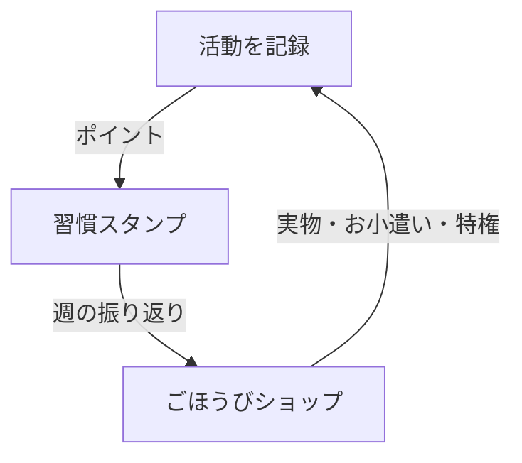

> リポジトリ: [Takenori-Kusaka/ganbari-quest](https://github.com/Takenori-Kusaka/ganbari-quest)
> サービス: [がんばりクエスト](https://www.ganbari-quest.com/)（登録なしで触れる[デモ](https://demo.ganbari-quest.com/)があります）

この章だけは製品の話をします。本書の主題は「生成AIに実装を任せて商用サービスを作る」ための設計とプロセスですが、対象となる製品の輪郭を知らないと、以降の章で出てくる設計判断がなぜ必要だったのかが伝わりません。逆に言えば、製品の紹介はこの章と次の章でほぼ終わりです。以降は技術の話になります。

## 何を作ったのか

がんばりクエストは、3〜18歳の子供の日常の活動を「がんばり」として記録し、親子で振り返るための家庭向け Web アプリケーションです。歯みがき、宿題、お手伝いといった活動をタップで記録すると、ポイントがたまります。たまったポイントは、親が用意した「ごほうびショップ」で実物のプレゼント、お小遣い、あるいは「夜ふかし 30 分」のような特権と交換できます。

企画書はこの製品を「子供の日常活動を RPG 風ゲーミフィケーションで動機づけし、成長を可視化する家庭向け Web アプリケーション」と定義しています[^plan01]。ただし RPG 風の見た目は手段であって目的ではありません。企画書が設計原則の 4 番目に置いているのは、次の一文です。

> Anti-engagement 原則 — アプリ内滞在時間の最大化は価値毀損指標。「活動記録する → 数秒で閉じる」最短経路を設計原則とする（ADR-0012）[^plan01]

つまり、子供がこのアプリの中で長く遊ぶことは、設計上の失敗として扱います。この原則は [第Ⅰ部-2](anti-engagement) で詳しく扱います。

## 3 つの仕組み

製品の骨格は、LP（ランディングページ）が「3 つの仕組み」と呼んでいる 3 層のループです[^lp]。

- 活動の記録（L1）。「はみがきした」「宿題おわった」をタップで記録します。候補は学年別のプリセットとして用意され、家庭ごとに追加や調整ができます。
- 習慣スタンプ（L2）。1 日 1 回だけ引ける「おみくじスタンプ」が週のスタンプカードに押され、週末にまとめてポイントになります。個々の活動ではなく「毎日入力する」というメタ習慣を強化する層です。
- ごほうびショップ（L3）。たまったポイントのただ 1 つの出口です。実物、お小遣い、特権の 3 棚を親が設定し、子供が自分で選んで交換します。

企画書はこのモデルの差別化の核心を「親は褒める必要がない（定量化が代替）、子は言うことを聞く必要がない（自分の欲しい報酬が待つ）」と書き、ショップを「親の『許可した欲望』と子の『本物の欲望』の交点」と位置づけています[^plan01]。海外の BusyKid や Greenlight が提供している「子の経済的自立トレーニング」を、日本の家庭向けに持ち込む設計です。ポイントの詳細な設計は [第Ⅰ部-4](point-economy) で扱います。

このループの周辺に、いくつかの補助機能があります。朝の持ち物チェックリスト、1 日のがんばりをエネルギーにして戦う夜のボスバトル、5 つの軸（うんどう・べんきょうなど）をレーダーで示す成長レポート、時間とともにステータスが少しずつ減る「ステータス減少設定」などです[^lp]。どれも「記録を続ける」ことを支える位置にあり、単体で長く遊ぶための機能ではありません。

## 年齢で画面が変わる

対象年齢は 3〜18歳で、年齢に応じて 4 つのコアモード（幼児 3〜5歳、小学生 6〜12歳、中学生 13〜15歳、高校生 16〜18歳）を切り替えます。0〜2歳は「準備モード」として、子供向けの演出を持たない親向けの画面を提供します[^plan01]。幼児モードはひらがな中心で、タップ領域が 80px の大きなボタンを使います。小学生以降は学年に合わせて漢字と情報密度が上がります[^lp]。

重要なのは、年齢による差はあくまで画面（UI）の差であり、機能の差ではないことです。LP の内容設計書は「年齢差別化軸は UI 軸のみ」と明記し、「中学生から使える専用機能」のような訴求を禁止しています[^lpmap]。この境界は、後の章で扱う「LP の文言は実装の事実から作る」原則（インフラ編の LP 配信の章）と直結しています。年齢モードの実装は [第Ⅰ部-3](age-tiers) で扱います。

## 誰のために作ったのか

ペルソナ定義書は 2 種類の保護者を主要ターゲットとしています。1 人目は共働きで時短勤務の保護者で、クラウド版の主要ターゲットです。2 人目は IT エンジニアの保護者で、自宅で動かすセルフホスト版の主要ターゲットです[^persona]。

この 2 人目の存在が、製品の配布形態を決めました。がんばりクエストは AWS 上の SaaS として提供すると同時に、AGPL-3.0 のオープンソースとして公開し、自宅の小型 PC などで同じアプリを動かすことができます[^readme]。企画書は 2026-04-11 の改訂で、それまでの「VPS やドメイン管理を保護者に委ねる寄付モデル」を捨て、この二本立てに移行しました。一般の保護者に VPS の運用を求めるのは UX の障壁であり、継続開発の収益を寄付だけで担保するのも難しい、というのが理由です[^plan01]。この判断が、以降の章の多くを規定します。クラウド版はフルサーバレスで月額維持費をゼロに近づける必要があり（インフラ編のコストの章）、セルフホスト版は同じコードを別のデータベースで動かす必要がある（インフラ編のセルフホストの章）からです。

## 価格

価格は 3 段階です。定価はコード上の定数を単一の情報源とし、LP の料金表も特定商取引法の表記も、この定数から生成されます[^price]。

| プラン | 月額（税込） | 位置づけ |
| --- | --- | --- |
| 無料プラン | 0 円 | 子供 2 人まで。仕組みはすべて使える。90 日を超えた記録は削除される |
| スタンダードプラン | 500 円 | 家庭での本格運用 |
| プレミアムプラン | 780 円 | 長期の記録と証跡を残す運用 |

有料プランは 7 日間の無料体験から始まり、クレジットカードの登録は要りません。期間が終わると自動で無料プランに戻るため、気付いたら課金されていたということが起きない設計です[^pricing]。年額プランは新規購入を停止し、月額 2 種に一本化しました[^pricing]。

価格の設計で興味深いのは、制限の置き方です。プライシング戦略書は「チューニングは無料、創造は有料」という哲学を掲げ、プリセット活動を使う・表示順を変える・基本サマリーを見るといった操作は無料で開放し、カスタム活動の追加やチェックリストの作成、高度な分析に制限を置いています[^pricing]。無料プランの利用者を「機能を削られた人」ではなく「十分に使える人」にする設計で、これは [第Ⅰ部-5](pre-pmf-scope) で扱う課金への慎重さの表れでもあります。

プラン名も一度変えています。第 3 段階は当初「ファミリープラン」でしたが、2026-05-29 の改訂で「プレミアムプラン」に改名しました。B2C で「Family」は Apple One や Spotify のように「メンバーを追加できる」ことを表す確立された規範であり、家族のメンバー数が固定のこの製品では誤った期待を生むこと、そして 3 段階が表しているのは家族構成ではなく「運用の本格度」であることが理由です[^terms21]。

## 3 つのお約束

LP には「お子さまのデータは、家族だけのものです」という節があり、広告なし・家族限定・保護者専用のカギ付き・データを家族の手元に、の 4 つを約束しています[^lp]。このうち「保護者専用のカギ」は「おやカギコード」と呼ぶ仕組みで、子供が自分でポイントを増やしたり設定を変えたりできないよう、見守り画面を保護者だけが開ける鍵でロックします。実装はアーキテクチャ編の認証の章で扱います。

もう 1 つ、LP には個人開発であることの明示があります。「本サービスは個人開発のため、利用規約にて賠償上限を定めております」という一文です[^lp]。これは隠すべき弱点ではなく、本書が扱う主題そのものです。一人の人間が生成AIとともに、この規模の商用サービスを 7 か月で作り、月額 1〜3 ドルで運用しているという事実が、本書の出発点になります。

## 試すには

- [がんばりクエスト](https://www.ganbari-quest.com/) — LP。無料プランはメール認証だけで始められます
- [デモ](https://demo.ganbari-quest.com/) — 登録なしで、子供の画面と保護者の画面を年齢モードごとに触れます。記録や設定は保存されません
- [GitHub](https://github.com/Takenori-Kusaka/ganbari-quest) — ソースコード。設計書と意思決定記録（ADR）も同じリポジトリにあります

次の章では、この製品の設計を最も強く縛っている原則、「滞在時間を価値毀損と数える」を扱います。

[^plan01]: 企画書 v2.0（2026-04-11 改訂）。製品定義、設計原則 4「Anti-engagement 原則」、親子ポイント経済モデルの差別化核心、VPS 寄付モデルからデュアルモデルへの移行理由を引用。出典: [docs/design/01-企画書.md](https://github.com/Takenori-Kusaka/ganbari-quest/blob/3af6c2ed9fd4fe5766fc80c255656e940f8ec8f0/docs/design/01-%E4%BC%81%E7%94%BB%E6%9B%B8.md)

[^lp]: LP（トップページ）の見出しと本文。「3 つの仕組み」「毎日の冒険をもっと楽しくする 2 つの工夫」「親が安心できる運用補助」「お子さまのデータは、家族だけのものです」「サービス利用に関する重要なご案内」の各節。出典: [site/index.html](https://github.com/Takenori-Kusaka/ganbari-quest/blob/3af6c2ed9fd4fe5766fc80c255656e940f8ec8f0/site/index.html)

[^lpmap]: LP 内容設計書。「年齢差別化軸は UI 軸のみ」および料金情報の配置原則（実価格が想像価格より低い場合は早期に数字を見せる）。出典: [docs/design/lp-content-map.md](https://github.com/Takenori-Kusaka/ganbari-quest/blob/3af6c2ed9fd4fe5766fc80c255656e940f8ec8f0/docs/design/lp-content-map.md)

[^persona]: ペルソナ定義書。メインペルソナ P1（クラウド SaaS 版）とサブペルソナ P2（OSS セルフホスト版）。出典: [docs/design/11-ペルソナ定義書.md](https://github.com/Takenori-Kusaka/ganbari-quest/blob/3af6c2ed9fd4fe5766fc80c255656e940f8ec8f0/docs/design/11-%E3%83%9A%E3%83%AB%E3%82%BD%E3%83%8A%E5%AE%9A%E7%BE%A9%E6%9B%B8.md)

[^readme]: リポジトリ README のライセンス節（AGPL-3.0-only）。出典: [README.md](https://github.com/Takenori-Kusaka/ganbari-quest/blob/3af6c2ed9fd4fe5766fc80c255656e940f8ec8f0/README.md)

[^price]: 定価の定数。`PLAN_PRICE_YEN` が月額 500 円 / 780 円の単一の情報源で、「表示に数値を複製すると値上げ時に LP 料金表と Stripe 実請求額が食い違う」ため整形側は数値を持たない。出典: [src/lib/domain/constants/plan-price.ts](https://github.com/Takenori-Kusaka/ganbari-quest/blob/3af6c2ed9fd4fe5766fc80c255656e940f8ec8f0/src/lib/domain/constants/plan-price.ts)

[^pricing]: プライシング戦略書。3 ティア構成、7 日間無料体験（カード登録不要・終了後は自動で無料プランへ）、年額の新規停止、「チューニングは無料、創造は有料」の制限設計。出典: [docs/design/19-プライシング戦略書.md](https://github.com/Takenori-Kusaka/ganbari-quest/blob/3af6c2ed9fd4fe5766fc80c255656e940f8ec8f0/docs/design/19-%E3%83%97%E3%83%A9%E3%82%A4%E3%82%B7%E3%83%B3%E3%82%B0%E6%88%A6%E7%95%A5%E6%9B%B8.md)

[^terms21]: プラン用語統一規約。2026-05-29 改訂で「ファミリープラン」を「プレミアムプラン」に改名した 3 つの理由（業界規範ミスマッチ、訴求軸乖離、業界汎用性）。出典: [docs/design/21-プラン用語統一規約.md](https://github.com/Takenori-Kusaka/ganbari-quest/blob/3af6c2ed9fd4fe5766fc80c255656e940f8ec8f0/docs/design/21-%E3%83%97%E3%83%A9%E3%83%B3%E7%94%A8%E8%AA%9E%E7%B5%B1%E4%B8%80%E8%A6%8F%E7%B4%84.md)
