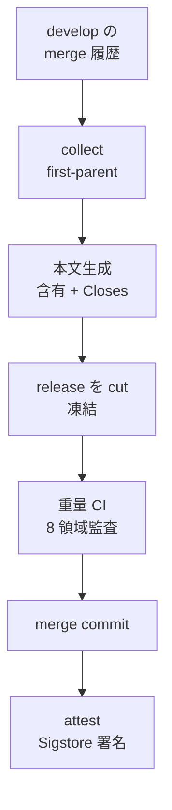

> リポジトリ: [Takenori-Kusaka/ganbari-quest](https://github.com/Takenori-Kusaka/ganbari-quest)

develop に積まれた PR は、統合 PR で 1 度に main へ入ります。統合 PR は bot が発行し、本文は git の履歴から生成され、merge は attestation として署名されます。この章では、その装置の設計と、運用の実測（第 22 回は 181 本、1,368 ファイル）、そして「stacked PR を採用しない」と決めた理由を扱います。

## stacked PR を採用しない

先に、採用しなかった方を書きます。dev-process の並列 Agent 運用は「stacked PR は採用しない（base は develop 1 つに固定する）」と定めています。理由は機械的です。`ci.yml` は `pull_request: branches: [main, develop]` で発火するため、別の feature branch を base にした PR では CI・lp-metrics・quality gate のどれも起動しません。動くのは Labeler だけです。後続の Issue が直前の PR に依存していても、develop への merge を待ってから新しい PR を切ります[^parallelops]。

ただし、これは stacked PR という方法そのものへの否定ではありません。オーナーによれば、採用したかったが当時は GitHub の機能として一般提供されていなかっただけで、今なら基本的に採用したい、です。7 か月の間、PR を積む場所は 1 つしかありませんでした。develop です。統合 PR は、develop に積まれた N 本の PR を 1 つの release branch にまとめた、ただ 1 つの「スタック」でした。

## bot が発行する

統合 PR は `integration-pr.yml` が発行します。cron は月曜と木曜の JST 06:00 で、手動の dispatch もあります。develop と main に差分が無ければ、何もせず job summary に「no-diff → skip」と書いて終わります。差分があれば、`chore` 系の standing な PR を upsert します。発行だけで、merge はしません。merge は監査の role の専権です[^integrationyml]。

名義は GitHub App の bot です。[第Ⅶ部-2](branch-strategy-evolution) で見たとおり、`GITHUB_TOKEN` では author が `github-actions[bot]` になって pr-author-guard に閉じられ、下流の CI も起動しません。App の短命 token なら bot 独自の identity が author になり、承認は人と lab が行うので、作成者と承認者の分離が自然に成り立ちます。

本文は `scripts/integration-pr-body.mjs` が生成します。workflow は薄い orchestrator で、本文を組み立てるロジックを YAML に散らさない。pure function にして unit test を書く。この形は hotfix-back-merge、integration-attest、close-leak-report でも同じです[^integrationyml]。

## 含有 PR を git から数える

統合 PR の本文には、含有する PR の一覧があります。当初の収集は時刻を anchor にしていました。2026-07-29 の #4053 で、21 本あるはずの一覧が 3 本しか出ていないと分かりました。原因は 2 つで、anchor が hotfix の commit で前進していたこと、そして ISO 8601 の文字列比較で `+09:00` 形と `Z` 形が混在して時刻順にならなかったことです[^issue4053]。

修正は、時刻を捨てることでした。「main に未取込か」は git が構造として持つ事実で、時計・TZ・anchor のどれにも依存させない。収集は `git log --first-parent origin/main..origin/develop` の merge 履歴を SSOT とし、時刻は表示と drift の日数にだけ使う。そして生成した一覧の行数を「含有 + 除外（back-merge と統合 PR 自身）= main..develop の merged PR 数」の突合式で自己検証し、一致しなければ収集と本文生成の両方が非 0 で終了する。少ない一覧を silent に PR へ書かない[^branchstrategy]。

[第Ⅴ部-4](fitness-functions) の「記録を反証可能にする」の、統合 PR への適用です。一覧は、それが正しいことを自分で検査してから PR に載ります。

## Closes を集約する

[第Ⅶ部-2](branch-strategy-evolution) で見たとおり、develop への merge では Issue が auto-close されません。統合 PR は、含有する各 PR の `## 関連 Issue` の節から行頭の `Closes #N` を集め、自分の本文に並べます。merge commit が main に到達すると、GitHub が一括で close します[^branchstrategy]。

集める規則は細かい。code fence の中、inline code、否定文の引用、本文中の参照（`#3133 (#3131 監査検出)` のような形）は除外する。over-close を防ぐためです。`Closes: #N` のコロン形と全角の `＃` は拾う。`fix: #N subject` のような conventional commit の行は集めない。`epic` label の tracking issue は除外し、「(tracking, close 対象外)」と注記する。AC 未検証のまま force-close しないためです。見出しの揺れ（`##` から `####`、空白の有無、末尾のコロン）は正規化する。under-close を防ぐためです。

そして、集約が空振りしないように、develop 向けの `feat` と `fix` の PR には `pr-template-gate` の 6 番目の job が closing keyword の記入を要求します。閉じない PR は `<!-- no-issue-close: 理由 -->` で宣言する。検出の規約は、集約と gate で同じ関数を共有します。週次の `close-leak-report` は、それでも漏れた「main 反映済みなのに open」の候補を job summary に出します。auto-close はしません。誤爆を避けるためです[^closeleak]。

## 署名して残す

統合 PR が merge されると、`integration-attest.yml` が merge commit に attestation を付けます。含有 PR 群、テスト結果、NG 0 件の evidence を in-toto の Release predicate に変換し、Sigstore で署名して GitHub の attestations API に永続化する。merge 後も `gh attestation verify <sha>` で「この統合は何を含み、何を検証したか」を改ざん検知可能な形で追えます。deploy とは独立した job で、失敗しても deploy を阻害しません[^attest]。

[第Ⅳ部-3](maker-not-approver) で見た「散文の self-report は退化する」への、最後の対策です。監査の evidence は `tmp/` に置かれて揮発していました。署名して GitHub に置けば、揮発しません。

## 運用の数字

runbook は、判断の閾値を持ちます。重量 gate が 1 件でも fail なら merge 見送り。severity 3〜4 の finding が残れば見送り。severity 1〜2 だけなら backlog に起票して merge 可。部分 merge はしない。見送った統合 PR は close せず、develop で直して release に append するか cut し直す[^runbook]。

drift の閾値は、前回統合からの日数が 3 日で警告、5 日で危険。未統合の PR が 10 本で警告、20 本で危険。「1 統合 PR に 20 件超は監査 1 回の認知限界超過」。肥大したら `release/<date>-1` と `-2` に時系列で分割する。コストは、重量レーンの critical path が 15〜20 分、最大の変動費は 8 領域監査の LLM API、NG 0 件なら triage は 1 日 15〜30 分[^runbook]。

実測は、閾値の外にあります。第 22 回の統合 PR #4892 は、181 本の PR、1,368 ファイル、+246,316 行と −88,961 行でした。前回の統合（8 月 13 日）から 29 日が空き、QM の差し戻し 33 件を経て「再 cut」で merge されました。危険閾値の 9 倍です。第 17 回は同じ日に 4 回 cut し直し、第 16 回は「再 2」です。統合 PR の merge commit のメッセージが 147KB になり、deploy の環境変数の上限を超えて `exit 126` で落ち、64KB で切り詰める hotfix が入ったこともあります[^pr4892]。

回数の番号も揺れています。8 月 6 日の統合は「第 21 回」、8 月 12 日の統合は「第 20 回」です。番号は PR の題名にあり、機械は数えていません。オーナーの説明は、監査チームの作業を定型化しきれていない、定型化したいが context の大きさが厳しい、というものです。このリポジトリの開発は、それほど token を消費します。

## 段階自動化

統合の自動化は S0 から S4 の 5 段で計画されています。S0 は統合 PR の upsert だけ、S1 で手動の cut を廃止、S2 で監査の run を schedule で起動、S3 で clean な run を auto-merge、S4 で green は全自動。各段の gate は「自動の本文と含有 PR の列挙が 3 サイクル連続で正確」のように観測で決め、記録は tracker Issue のコメントに 1 サイクル 1 行で積みます。不変条件は「merge を止めるのは rules-based の自動チェックのみ、LLM の finding は advisory」です[^branchstrategy]。

2026-09-16 現在は S0 です。cut は手動で、監査は手動で起動され、approve と merge は人です。

## 今ならこうする

含有 PR を git の first-parent から数え、突合式で自己検証する設計は、この本で見た「反証可能にする」の中で最も直接的な例です。統合 PR の本文が間違っていたら、監査は間違ったものを監査します。本文の正しさを機械が保証することは、監査の前提でした。

閾値は守られませんでした。20 本で危険と書いた runbook の下で、181 本が 1 度に入りました。理由は、8 月 13 日から 9 月 11 日の間、main へは hotfix が 2 本入っただけで、統合が 1 度も行われなかったことです。S0 では cron が PR を upsert するだけで、cut と監査と merge は人の手番です。止まったのは装置ではなく手番でした。cadence を上げる計画（daily、12 時間）の前に、手番が止まった日を検出する仕組みが要りました。それは、この本を書いている時点でありません。オーナーの見方はもう 1 段引いています。不具合の多さで PR が増えた、というのが実情です。PR の本数で置いた危険閾値は AI 駆動の開発ではあまり意味を持たないかもしれない、見直す、というものです。

stacked PR を採用しなかった判断は、当時の CI の制約の下では正しかった。develop という 1 つの積み場所と、統合 PR という 1 つのスタックで足りました。積む場所を増やすと、CI の動かない場所ができるからです。GitHub 側の機能が揃った今なら、依存する PR を積んで出す方が自然で、オーナーもそう考えています。採り直すなら、`ci.yml` の発火条件と `main-pr-base-guard` を、積んだ PR の base に合わせて変えるところからです。

[^parallelops]: 並列 Agent / worktree 運用 §4「stacked PR は採用しない（base は develop 1 つに固定する）」。出典: [docs/sessions/dev-process/parallel-agent-ops.md](https://github.com/Takenori-Kusaka/ganbari-quest/blob/3af6c2ed9fd4fe5766fc80c255656e940f8ec8f0/docs/sessions/dev-process/parallel-agent-ops.md)

[^integrationyml]: 統合 PR を発行する workflow（#2871）。設計原則、cadence、no-diff 早期 exit。本文生成と含有 PR 収集の SSOT。出典: [.github/workflows/integration-pr.yml](https://github.com/Takenori-Kusaka/ganbari-quest/blob/3af6c2ed9fd4fe5766fc80c255656e940f8ec8f0/.github/workflows/integration-pr.yml)、[scripts/integration-pr-body.mjs](https://github.com/Takenori-Kusaka/ganbari-quest/blob/3af6c2ed9fd4fe5766fc80c255656e940f8ec8f0/scripts/integration-pr-body.mjs)、[scripts/collect-integration-prs.mjs](https://github.com/Takenori-Kusaka/ganbari-quest/blob/3af6c2ed9fd4fe5766fc80c255656e940f8ec8f0/scripts/collect-integration-prs.mjs)

[^issue4053]: Issue #4053「統合 PR の『含有 PR 一覧』が 21 本中 3 本しか出ていない — anchor が hotfix commit + TZ 混在の文字列比較」。出典: [Issue #4053](https://github.com/Takenori-Kusaka/ganbari-quest/issues/4053)

[^branchstrategy]: ブランチ戦略 SSOT。§2 含有候補の収集（#4053）、§3.2 Closes 集約（#3423 / #3444 / #3462）、§10 自動化の段階移管（S0〜S4）と観測ログ運用。出典: [docs/sessions/branch-strategy.md](https://github.com/Takenori-Kusaka/ganbari-quest/blob/3af6c2ed9fd4fe5766fc80c255656e940f8ec8f0/docs/sessions/branch-strategy.md)

[^closeleak]: close 漏れの週次レポート（#3459、auto-close なし）。出典: [.github/workflows/close-leak-report.yml](https://github.com/Takenori-Kusaka/ganbari-quest/blob/3af6c2ed9fd4fe5766fc80c255656e940f8ec8f0/.github/workflows/close-leak-report.yml)、[scripts/audit/close-leak-report.mjs](https://github.com/Takenori-Kusaka/ganbari-quest/blob/3af6c2ed9fd4fe5766fc80c255656e940f8ec8f0/scripts/audit/close-leak-report.mjs)

[^attest]: 統合 merge の attestation（#2876）。in-toto Release predicate、Sigstore 署名、deploy との独立。出典: [.github/workflows/integration-attest.yml](https://github.com/Takenori-Kusaka/ganbari-quest/blob/3af6c2ed9fd4fe5766fc80c255656e940f8ec8f0/.github/workflows/integration-attest.yml)

[^runbook]: 統合 PR の運用判断 runbook（#2952）。NG 時の flow、drift の閾値、肥大時の分割、コストと triage の見積。出典: [docs/runbooks/integration-pr-operations.md](https://github.com/Takenori-Kusaka/ganbari-quest/blob/3af6c2ed9fd4fe5766fc80c255656e940f8ec8f0/docs/runbooks/integration-pr-operations.md)

[^pr4892]: 第 22 回の統合 PR #4892（181 PR、1,368 ファイル）、第 17 回 #3931（`release/2026-07-24-4`）、merge commit 147KB の hotfix #3689。出典: [PR #4892](https://github.com/Takenori-Kusaka/ganbari-quest/pull/4892)、[PR #3931](https://github.com/Takenori-Kusaka/ganbari-quest/pull/3931)、[PR #3689](https://github.com/Takenori-Kusaka/ganbari-quest/pull/3689)
