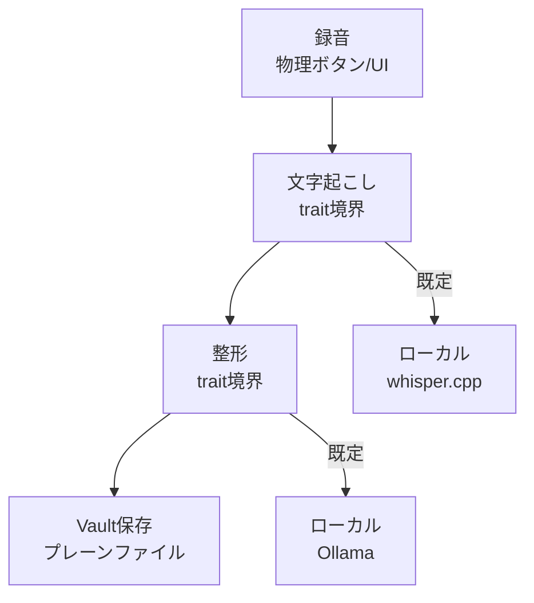

> 個人開発OSS「QuickScribe」（ローカル完結ボイスジャーナル）の設計連載の一章です。個別の設計に入る前に、アプリ全体の構造と、本書のどの章がその構造のどこを扱うのかを示します。コードは v1.13.0 時点。設計判断は該当箇所を引用し脚注で出典（ADR）を示します。
> リポジトリ: [Takenori-Kusaka/QuickScribe](https://github.com/Takenori-Kusaka/QuickScribe)

前章で、このプロダクトが立っている空白と、そこに立つと決めた理由を書きました。この章は、その決定を構造にどう落としたかの見取り図です。個別の判断の根拠は各章に譲り、ここでは「何が何の裏に隠れているか」だけを押さえます。

## 課題と方針

アプリがやることは、言葉にすると3つしかありません。**話す・整える・残す**です。設計上の問題は、この3つのうちどれが価値の本体で、どれが差し替え可能な部品かを決めることでした。

方針は前章の結論そのままです。価値の本体は「要約せずニュアンスを残す整形」に置き、それ以外 ― 文字起こし、プロバイダ、起動の入口、保存形式、配布経路 ― は交換可能・機械化・非破壊にする。技術スタックを決めた ADR も、この境界の切り方を設計の中心に据えています[^adr05]。

## 設計のコア

実体は Tauri 2 のデスクトップアプリで、Rust のバックエンドと Svelte のフロントエンドでできています。処理の背骨は1本の流れです。

この図で言いたいことは2つだけです。

ひとつは、**流れの途中に2つの trait 境界がある**こと。文字起こしと整形は、どちらも抽象（trait）の裏にいます。上位のオーケストレーションは、具体的なプロバイダが何本あるかを知りません。だから「既定をクラウドからローカルへ動かす」ような重い方針転換を、あとから差し込めました。

もうひとつは、**その境界の既定が両方ともローカルに倒れている**こと。文字起こしはローカルの whisper.cpp、整形はローカルの Ollama が既定です。クラウドは、鍵を設定した人だけが明示的に選ぶオプトインです。結果として、製品全体に効く性質が2つ決まります。ひとつは、既定の状態では音声とテキストのどちらも端末の外に出ないこと。もうひとつは、既定のローカル経路が鍵も要らず無償で動き、従量課金が発生するのは鍵を入れてクラウドを選んだときだけだということです。この2点は各章で繰り返さず、ここに一度だけ書いておきます。

## 各章がどこを扱うか

上の構造を、章に割り当てるとこうなります。

| 構造の部分 | 扱う章 |
|---|---|
| 2つの trait 境界そのもの（差し替えの仕組み） | エンジン抽象の章 |
| 整形（価値の本体。不変条件の置き方） | 整形の章 |
| 既定をローカルに倒すことと、その正直な可視化 | プライバシーの章 |
| 残す側の形式（中間ファイルと将来互換） | データ設計の章 |
| 入口（物理ボタンからの起動体験） | 物理トリガーの章 |
| 文字起こしの精度を競争軸から外す扱い | 精度の章 |
| 配布とアップデート（単一バイナリと遅延ロード） | 付章 |

ここまでが設計編（v1.0 時点）です。このあとに続く実測編は、公開後に実測がこの設計を叩いた記録で、既定モデル・速度・話者分離・整形の検証の4本が入ります。設計編が「こう決めた」なら、実測編は「決めたあと何が起きたか」です。

## 実際に起きた効果

この境界の切り方が実際に効いたことは、後続の章で具体的に出てきます。整形の既定をクラウドからローカルへ動かす判断は、新しいプロバイダの trait 実装を足すだけで入りました。日本語の文字起こし既定を実測で覆したときも、既定値を1つ差し替えるだけで主力を入れ替えられました。どちらも、価値の本体でない部分を境界の裏に置いたことの配当です。

## 学びと宿題

全体を1枚に描いてみて分かったのは、**このアプリで交換可能にできたのは「話す」と「残す」の間の配管だけ**だということです。録音の入口と、保存したあとの「育てる」体験は、まだ抽象の裏に入っていません。

正直な宿題を1つ。この図の右端、Vault に残したあとが空白です。「残して育てる」の「育てる」、つまり複数の記録を横断して問いや傾向を見つける部分は、本書のどの章にも設計として書けていません。構造上いちばん価値が出るはずの場所が、いまは構造として存在しない、というのが現状です。

次章から、この図の左から順に見ていきます。まずは2つの trait 境界そのものです。

[← 前の章](market-positioning) ／ [次の章 →](engine-abstraction)

[^adr05]: ADR-0005「技術スタック」より。Tauri 2 / Rust / Svelte を選んだうえで、文字起こし・整形などを差し替え可能な抽象境界として定義し、価値の本体に工数を集中する方針。出典: [docs/adr/0005-tech-stack.md](https://github.com/Takenori-Kusaka/QuickScribe/blob/main/docs/adr/0005-tech-stack.md)
