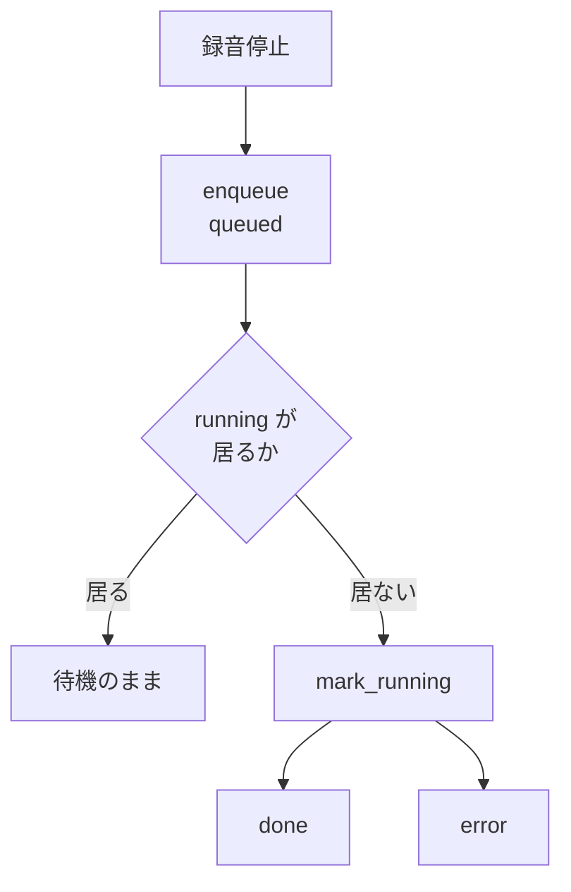

> 個人開発OSS「QuickScribe」（ローカル完結ボイスジャーナル）の設計連載の一章です。前章では物理ボタンから録音を始める入口を作りました。今回は、その入口が速すぎたために起きた問題 ― 文字起こしが終わる前に次を録ってしまう ― をどう設計で受け止めたかを書きます。コードは v1.13.0 時点。設計判断は該当箇所を引用し脚注で出典（ADR）を示します。
> リポジトリ: [Takenori-Kusaka/QuickScribe](https://github.com/Takenori-Kusaka/QuickScribe)

物理ボタンひとつで録れるようにすると、使い方が変わりました。思考を小分けにしたいので、録音を何回も分けて投げるようになったのです。ところが文字起こしには時間がかかります。**前のジョブが終わる前に次の録音を停止すると、前の結果が失われていました。**

入口の摩擦を下げた結果、その下流が詰まった、という話です。この章はその詰まりを設計で受け止めた記録です。

## 課題と方針

満たしたかったことは、要望の言葉そのままでした。**取りこぼさない**ことです。そこから条件を並べます。

- **複数の録音を投げても、どれも失われない**。文字起こし中に次を停止しても前の結果を捨てない。
- **今どれが処理中で、どれが待ちかが分かる**。見えない待ち行列は不安になります。
- **失敗したものを拾い直せる**。エラーで終わったジョブを再試行できる。
- **通常の使い方でUIを重くしない**。1〜数件のときに画面を占領しない。

方針は1つに絞りました。**並列で速くするのではなく、順番どおり確実にやる**。文字起こしは CPU と GPU を重く使うので、真に並列でデコードするとリソースが競合して全部のジョブが遅くなります。そして「複数が同時に走る進捗」を破綻なく見せるやり方の先行事例も、調べた範囲では見つかりませんでした[^adr26]。取りこぼさないという要望は、並列度を上げなくても満たせます。

## 技術選定

### 並列度1の逐次キューを既定にする

処理モデルは**FIFO の逐次キュー**にしました[^adr26]。並列度は1で固定です。これで「取りこぼさない」を満たしつつ、**画面上で走っているジョブが常に高々1件**になります。並行進捗の表示が破綻する余地を、UIの工夫ではなく処理モデルの側で消したわけです。

将来 opt-in で並列度を増やす余地は設定として残しました。ただし既定にはしません。速さのために不確実性を増やす取引を、既定で押しつけない、という線です。

### 状態は5つに絞る

ジョブの状態は `queued` / `running` / `done` / `error` / `canceled` の5つです[^adr26]。

```rust
pub enum JobStatus {
    /// 待機中（前のジョブ処理待ち）。
    Queued,
    /// 実行中（画面上は高々1件）。
    Running,
    /// 完了（結果あり）。
    Done,
    /// 失敗（error_code あり）。
    Error,
    /// キャンセル済み。
    Canceled,
}
```

状態ごとに、利用者が取れる操作を1つだけ決めました。`done` なら開いて整形へ進む、`error` なら再試行、`queued` と `running` ならキャンセルです。**状態の数と操作の数を絞ると、一覧の行に何を出すか迷わなくなります。**

### 無限スクロールを使わない

ジョブ一覧は行型のリストにして、無限スクロールは採りませんでした[^adr26]。ジョブ管理は「特定のものを探す」「上位を確認する」という目的の作業で、無限スクロールはその手の作業に向かないという指摘があります。通常運用の1〜数件では、ヘッダに控えめなバッジ（処理中N件）を出し、展開したときだけ一覧を見せます。履歴が育った場合にだけ、履歴ビューへ仮想スクロールを足す段階実装にしました。

### 進捗は割合と残り時間で出す

10秒を超える処理では、割合と残り時間を出すのが定石です。逐次キューなので `running` は常に1件で、**その1件だけを割合つきで見せ、残りは状態バッジで示す**という分担にしました[^adr26]。前処理（デコードやモデルのダウンロード）だけは終わりが読めないので、そこは割合を出しません。

## 設計のコア

逐次であることを、UIの約束ではなくキューの実装で保証しています[^job]。次に実行すべきジョブを返す関数が、走っているジョブがある間は `None` を返します。

```rust
    pub fn next_queued(&self) -> Option<JobId> {
        if self.has_running() {
            return None;
        }
        self.jobs
            .iter()
            .find(|j| j.status == JobStatus::Queued)
            .map(|j| j.id)
    }
```

この4行が「並列度1」の全部です。呼び出し側がうっかり2つ目を走らせようとしても、渡すものがありません。**不変条件を、運用の注意ではなくデータ構造の問い合わせに埋め込む**、という書き方です。

状態遷移も同じ考えで組みました。`Queued` から `Running` への遷移は、対象が存在して、かつ実際に `Queued` のときだけ成功し、そうでなければ偽を返します。不正な遷移をその場で弾くので、ありえない状態の組み合わせが一覧に現れません。



ヘッダのバッジに出す「処理中N件」は、`queued` と `running` を合わせた数です。待っているものを数に含めるのは、利用者が知りたいのは「あと何件残っているか」だからです。

フロント側は、同じジョブモデルを純粋関数で扱います。`upsertCreated` / `setStatus` / `setProgress` / `setDone` / `setError` が、いずれもジョブ配列を受け取って新しい配列を返す形です。UIの状態更新をイベント処理の中に散らさず、配列の変換として切り出してテストできるようにしています。

## 実際に起きた効果

いちばんの効果は、**入口の設計を後戻りさせずに済んだ**ことです。物理ボタンで気軽に録れることは差別化軸なので、「文字起こし中は次の録音を禁止する」という解き方は取りたくありませんでした。下流にキューを置いたので、入口の軽さをそのまま残せました。

もう1つは、逐次に決めたことで**表示の難問が消えた**ことです。走っているジョブが常に1件なら、進捗の出し方は1通りに決まります。UIで頑張って解く問題を、処理モデルの選択で消せました。

## 学びと宿題

一番の学びは、**摩擦を下げると下流が詰まる**ということです。物理ボタンで入口を軽くした結果、利用者の使い方が変わり、前提にしていた「1回録って1回待つ」が崩れました。入口だけを速くしても体験は速くならず、詰まる場所が移動するだけです。

もう1つは、**UIの難しさを処理モデルで消せることがある**という点です。複数の並行進捗を破綻なく見せる方法を探すより、並行させないと決めるほうが確実でした。速さのために選択肢を増やすより、確実さのために並列度を1で固定する。ここは「選択肢は多いほど親切、ではない」という本書の他の判断と同じ形です。

正直な宿題を1つ。**逐次にしたぶん、待ち時間は素直に積み上がります**。3件投げれば3件分待ちます。GPU で1件あたりは速くなりましたが、待ち行列そのものを短くする工夫（たとえば短い録音を先に処理する、待ち時間の合計を見せる）は入っていません。取りこぼさないことは満たしましたが、待たせないことはまだ満たしていません。

次章では、この行列を流れていく文字起こしの「精度」を、なぜ競争軸にしないと決めたかを書きます。

[← 前の章](physical-trigger) ／ [次の章 →](accuracy-as-commodity)

[^adr26]: ADR-0026「複数バックグラウンド文字起こしジョブの逐次キュー化とジョブ一覧UI」。処理モデルは並列度1のFIFO。真の並列デコードはリソース競合で全ジョブが遅くなり、並行進捗UIの先行事例も見つからなかったため。状態は queued / running / done / error / canceled の5つ。一覧は行型リストで無限スクロールは不採用。進捗は割合と残り時間を優先。将来の並列度Nは opt-in の余地として設定に残す。出典: [docs/adr/0026-multi-background-transcription-jobs.md](https://github.com/Takenori-Kusaka/QuickScribe/blob/main/docs/adr/0026-multi-background-transcription-jobs.md)

[^job]: ジョブキューの実装（`JobStatus` / `JobQueue::enqueue` / `next_queued` / `mark_running` / `active_count` など）。状態遷移は不正な遷移を偽で弾く。抜粋は v1.13.0 時点。出典: [src-tauri/src/job.rs](https://github.com/Takenori-Kusaka/QuickScribe/blob/main/src-tauri/src/job.rs)（フロント側のジョブ配列の純粋関数は [src/lib/jobs.ts](https://github.com/Takenori-Kusaka/QuickScribe/blob/main/src/lib/jobs.ts)）
