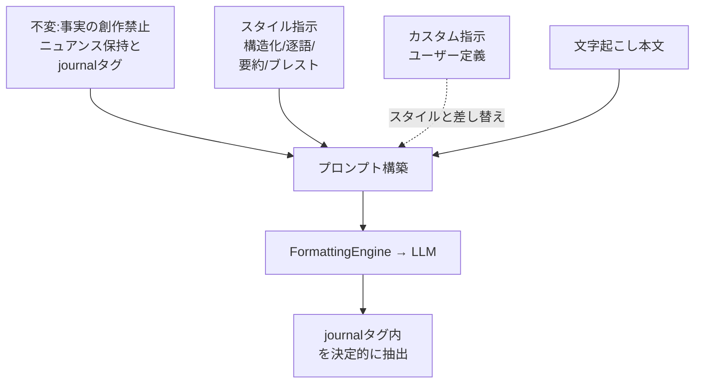
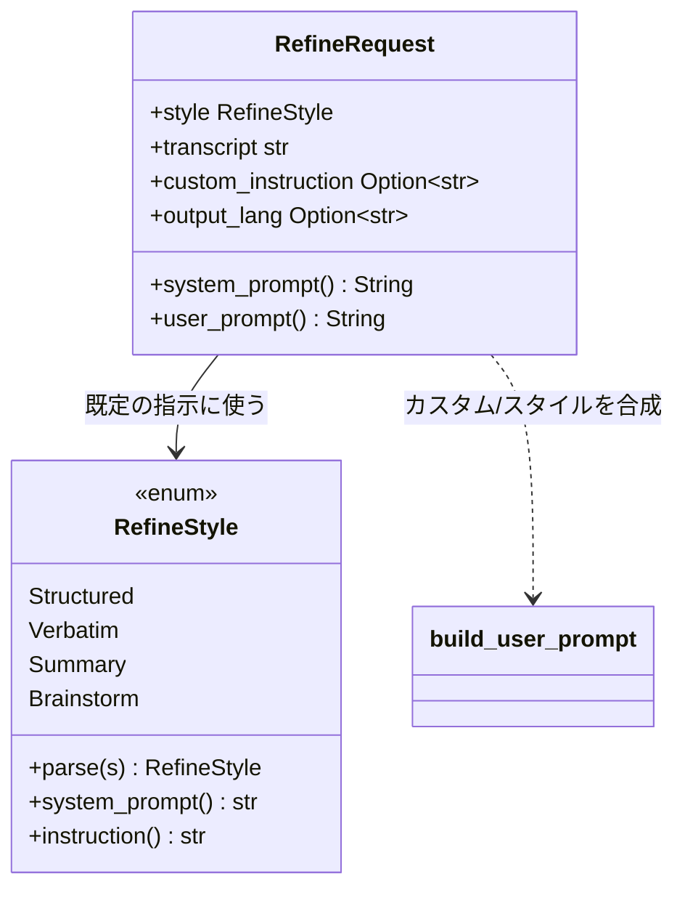

> 個人開発OSS「QuickScribe」（ローカル完結ボイスジャーナル）の設計連載の一章です。前章では文字起こしと整形を差し替え可能にする境界を作りました。今回は、その境界の裏でいちばん価値を担う「整形」そのもの、つまり**要約して捨てるのではなく、ニュアンスを残して整える**をどう設計したかを書きます。コードは v1.13.0 時点。設計判断は該当箇所を引用し脚注で出典（ADR）を示します。
> リポジトリ: [Takenori-Kusaka/QuickScribe](https://github.com/Takenori-Kusaka/QuickScribe)

このアプリの価値の本体は、文字起こしの精度ではなく「整形の知性」だと市場ポジショニングの章で書きました。では「整形の知性」とは具体的に何をしているのか。今回はそこを開きます。

結論から言うと、やっていることは高度なアルゴリズムではありません。**LLMへのプロンプトを、コア価値が絶対に外れないように構造化しているだけ**です。ただ、その「外れないように」の部分に、いくつか地味だが効いている設計判断が入っています。要約スタイルを選んでも「本人のニュアンスは残す」が消えないこと、ユーザーが自由なカスタム指示を書いても「事実を捏造しない」が外れないこと、そしてAIの余計な前置きや後書きを確実に取り除くこと。この3つをどう担保したかが今回の話です。

## 課題と方針

整形に求めたことは次の通りです。

- **要約して捨てない**。話し言葉には言い直しや迷い、語り口があります。それを消さずに、読み返せる形に整える。
- **スタイルを行き来できる**。同じ音声を、構造化・逐語・要約・ブレストのどれでも整形し直せる。これがコア価値です[^adr04]。
- **ユーザーが自分の整形指示を書ける**。用意したスタイルに収まらない人のために、カスタムの整形指示を許す（S3.3）。
- **どんな指示でもコア規律は外さない**。カスタム指示でも「事実を捏造しない」「本人のニュアンスを残す」は必ず効く。
- **AIの余計な出力を混ぜない**。LLMは「はい、整形しました」のような前置きや、末尾の補足を足しがちです。日記の本文にそれが混ざると困ります。
- **出力言語を選べる**。原語の記録は残しつつ、整形結果だけ別の言語で出す選択肢も持つ（翻訳。詳細は別章）。

狙いは一言でいうと、**コア価値をプロンプトの「不変条件」として固定する**ことです。

整形の指示は2種類に分かれます。スタイルによって変わる部分（構造化するのか逐語で残すのか）と、絶対に変えてはいけない部分（捏造しない・ニュアンスを残す・本文だけを出す）です。この2つを混ぜて書くと、スタイルを足したりカスタム指示を許したりするたびに、うっかりコア規律が抜け落ちます。そこで、**変わる部分（スタイル指示）と変わらない部分（共通のシステム指示）を分離**し、変わらない部分はどのスタイル・どのカスタム指示でも必ず合成されるようにしました。「整形の知性」は賢いモデルに丸投げして生まれるのではなく、この不変条件の置き方で守られている、という設計です。

## 技術選定：3つの判断

### スタイルを型で表す

整形スタイルは自由文字列ではなく、4つの列挙型 `RefineStyle`（Structured / Verbatim / Summary / Brainstorm）で表しました[^refine]。フロントからは英語と日本語のどちらでも渡せて、未知・空は既定（Structured）に倒します。

```rust
pub enum RefineStyle {
    /// 既定: 見出し+箇条書きで構造化し、ニュアンスを残す。
    Structured,
    /// 逐語: 言い淀み・繰り返しも極力残し、最小限の整形のみ。
    Verbatim,
    /// 要約: 全体を短く要約し要点を絞る。
    Summary,
    /// ブレスト: 内容から問い・観点・次の一歩を広げる。
    Brainstorm,
}
```

スタイルごとの指示は、この enum のメソッドが返します。注目してほしいのは、**要約スタイルの指示にすら「ニュアンスは残す」が入っている**ことです[^refine]。

```rust
            RefineStyle::Summary => "\
                - 全体を短く要約する\n\
                - 重要な要点だけを3〜5個の箇条書きにする\n\
                - 細部は削ぎ落としつつ、本人の結論・気持ちのニュアンスは残す",
```

要約でさえ、ただ短くするのではなく「捨てない」を残す。これがこのプロダクトの要約と、会議ツールの要約との違いです。

### 不変のシステム指示と、差し替え可能なスタイル指示を分ける

プロンプトは2層です。全スタイル共通の**システム指示**（不変）と、スタイルごとの**指示ブロック**（差し替え可能）。システム指示にはコア規律を書きます[^refine]。

```text
あなたは話者本人の思考整理を助けるアシスタントです。事実を捏造せず、
書かれていないことは足さず、本人のニュアンス・迷い・語り口を残してください。
整形後の本文だけを <journal> と </journal> で囲んで出力し、
タグの外には前置き・挨拶・後書き・補足説明を一切書かないでください。
```

そして、ユーザーのカスタム指示は**スタイルの指示ブロックだけを差し替え**、このシステム指示と「事実を捏造しない」という共通条件は**必ず残る**ように組み立てます[^refine]。

```rust
fn build_user_prompt(instruction: &str, transcript: &str) -> String {
    format!(
        "以下は音声の文字起こしです。話者本人の思考整理を助けてください。\n\
         {instruction}\n\
         - 事実を捏造せず、書かれていないことは足さない\n\n\
         ---\n{transcript}"
    )
}
```

`instruction` にはスタイル既定の指示か、ユーザーのカスタム指示のどちらかが入ります。どちらであっても「捏造しない」の一行はコード側が付けます。**カスタムを許しても品質ガードが構造的に外れない**、という設計です。ここを「プロンプト全体をユーザーに書かせる」設計にしていたら、コア規律はユーザーの書き方次第で簡単に失われていました。

### 声から感情を読まない

整形の周辺で、実装できるのにやらないと決めたものがあります。**声由来の感情メタデータ**です[^adr30]。音声からは話者・性別・年齢・声質に加えて感情も推定できて、別モデルを同じ波形に並走させればローカルでも実現できます。争点は実現可能性ではなく、自己理解の体験に寄与するかでした。

調べて分かったのは3つです。第一に、感情のラベル付けは一律に有益ではありません。言語化が扁桃体反応を下げる機序は知られていますが、効果は刺激の強度や主体に依存し、低強度では逆に苦痛を増やすという報告があります。**機械が付けた断定的な情動ラベルを見せることは、自己認識を歪める側に働きうる**わけです。第二に、音響から感情価を復元する精度そのものが脆弱です。覚醒度は音響から取れても、感情価は主に言語内容に依存します。第三に、表現的筆記の効き目は、感情メタではなく一貫した物語の構築と自己距離化から来ます。

つまり投資すべきは感情ガジェットではなく整形でした。感情への寄与は、音響分類器ではなく**LLM が言葉の文脈からニュアンスを保つ経路に一本化**します。感情アークの可視化はジャーナルをダッシュボードに変えてしまい、「リッチすぎると簡便でなくなる」というこのプロダクトの制約にも逆行します。**やらないと決めることも設計です。**

### 出力制御は JSON でなく XML タグ境界で

LLMに整形させると、本文の前後に「はい、整形しました」「補足すると…」といった3層（前置き・本文・後書き）が付きがちです。日記の本文にこれが混ざるのは困ります。

素直に考えると「JSONで `{"body": "..."}` を返させて `body` を取り出す」となりそうですが、これは**採りませんでした**。本文をJSONに封入させると、長文や記号・改行のエスケープで**出力品質が落ち、壊れやすくなる**という調査結果があったためです[^outctl]。

代わりに、**本文は自由生成のまま `<journal>…</journal>` というタグで囲ませ、コード側でタグ内を決定的に抽出**します。LLMには「本文だけをこのタグで囲め、外には何も書くな」と指示するだけ。JSONの厳密な構造を強いるより出力が安定し、抽出はコード側の単純な文字列処理で決まります。「モデルに構造を守らせる」より「緩く囲ませて機械で刈り取る」ほうが頑健だった、という判断です。

## 設計のコア

整形サブシステムの流れはこうです。入口は `RefineRequest`。不変のシステム指示とスタイル/カスタム指示がプロンプト構築で合成されます。合成した指示は `FormattingEngine`（エンジン抽象の章の抽象境界）越しにLLMへ渡り、返ってきた出力から本文だけを取り出します。


肝は、プロンプトを組み立てる一点で**必ず不変条件が合流する**ことです。スタイル指示・カスタム指示という「変わる入力」がどちらの経路を通っても、システム指示と「捏造しない」は合成されます。



`output_lang`（出力言語）を指定した場合は、このシステム指示に「指定言語で出力するが、ニュアンスとトーンは保つ」という一文が追記されます。**翻訳しても「ニュアンスを保つ」が外れない**のは、追記がシステム指示側に入るからです[^refine]。

### 変えられるものと変えられないものを、型で見せる

整形の入力は `RefineRequest` に束ねてあります[^refine]。

```rust
pub struct RefineRequest<'a> {
    pub style: RefineStyle,
    pub api_key: &'a str,
    pub model: &'a str,
    pub transcript: &'a str,
    // ...
    /// ユーザー定義のカスタム整形指示(S3.3)。Some かつ非空なら style の指示の代わりに使う。
    /// システム指示(捏造禁止・<journal>タグ境界)は共通で不変＝カスタムでも品質ガードが効く。
    pub custom_instruction: Option<&'a str>,
    // ...
    pub output_lang: Option<&'a str>,
    // ...
}
```

このリクエストが `system_prompt()` と `user_prompt()` を組み立てます。分岐は2つだけです。カスタム指示があればスタイル指示の代わりに使う。出力言語があればシステム指示に翻訳の一文を足す。どちらの分岐でも、捏造禁止・ニュアンス保持・タグ境界という不変条件は通ります。**「何を変えられて、何を変えられないか」がインターフェースの形で表れている**のが狙いです。



`system_prompt`（不変条件）と `instruction`（スタイル別）が別メソッドに分かれているのが、この章のいちばんの構造です。

## 実際に起きた効果

この分離が効いたのは、あとから自由度を足したときです。カスタム整形指示（S3.3）でユーザーが振る舞いを好きに変えられるようにしても、捏造禁止・ニュアンス保持・タグ境界は `build_user_prompt` とシステム指示の側に残るので、品質ガードを外す経路がそもそも作られませんでした。同じ理由で、出力言語の指定を足したときも「翻訳するがニュアンスとトーンは保つ」という一文をシステム指示側へ追記するだけで済みました。

使い勝手の面では、同じ音声をスタイル違いで整形し直せることが効いています。逐語で内容を確かめてから構造化する、という行き来ができます。

## 学びと宿題

一番の学びは、**コア価値は賢いモデルではなくプロンプトの構造で守る**、という当たり前だが忘れやすい点です。「ニュアンスを残す整形」を売りにするなら、その規律が**どのスタイル・どのカスタム指示でも絶対に外れない**ことを、コード側で保証しないといけません。ユーザーにプロンプト全体を書かせる自由度と、コア規律を守る不変性は、両立させられます。変わる部分と変わらない部分を分けて、合成する一点で必ず不変条件を合流させればよいだけでした。

もう1つは、**LLMに厳密な構造（JSON）を守らせるより、緩く囲ませて機械で刈り取るほうが頑健**だったことです。`<journal>` タグ境界は素朴ですが、長文の日記本文では JSON エスケープより明らかに安定しました。出力制御は「モデルを信じて構造を強いる」より「モデルの自由生成を前提に、境界だけ決めて後段で決定的に処理する」ほうが壊れにくい、という一般則を実感しました。

最後に正直な弱点を1つ。この章で「ニュアンスを残す」と繰り返し書きましたが、**それが本当に残せているかを、私はまだ客観的に計測できていません**。市場ポジショニングの章でも触れたとおり、コア価値そのものの評価指標が無いのです。ここは自分の宿題として別に切り出してあります（意味保持・ニュアンス保持の自動評価とルーブリック評価の設計）。プロンプトで「残せ」と命じる設計はできても、「残った」を測る設計はこれからです。

次章では、この整形の既定を「クラウド」から「ローカル」へ動かした判断と、その正直さをどうUIで担保したか（プライバシーの可視化）を書きます。

[← 前の章](engine-abstraction) ／ [次の章 →](local-first-privacy)


[^adr04]: ADR-0004「プロダクトポジショニング」より。コア価値は文字起こし精度ではなく「ニュアンスを残しつつ思考を整理する整形の知性」で、逐語⇄要約⇄ブレストの行き来を一級の概念に置く。出典: [docs/adr/0004-product-positioning-voice-journal.md](https://github.com/Takenori-Kusaka/QuickScribe/blob/main/docs/adr/0004-product-positioning-voice-journal.md)

[^refine]: 整形スタイル `RefineStyle`、不変のシステム指示、`build_user_prompt`、`RefineRequest` の実装。カスタム指示でも共通の不変条件が付与される。出典: [src-tauri/src/refine.rs](https://github.com/Takenori-Kusaka/QuickScribe/blob/main/src-tauri/src/refine.rs)

[^adr30]: ADR-0030「声由来の感情/情動メタデータを非対応とする（やらない決定）」。感情ラベリングの効果が刺激強度や主体に依存すること、音響単独では感情価の回復が脆弱なこと、表現的筆記の効き目が物語の構築と自己距離化に由来することを一次文献で確認している。そのうえで、感情への寄与を LLM 整形の経路へ一本化する判断。出典: [docs/adr/0030-no-voice-emotion-metadata.md](https://github.com/Takenori-Kusaka/QuickScribe/blob/main/docs/adr/0030-no-voice-emotion-metadata.md)

[^outctl]: 本文を JSON に封入すると品質が劣化し壊れやすいため、`<journal>` タグ境界で囲ませてコード側で決定的に抽出する、という出力制御の判断。出典: refine.rs のコメントおよび `docs/research/sources/llm-output-control.md`（[リポジトリ](https://github.com/Takenori-Kusaka/QuickScribe)）
