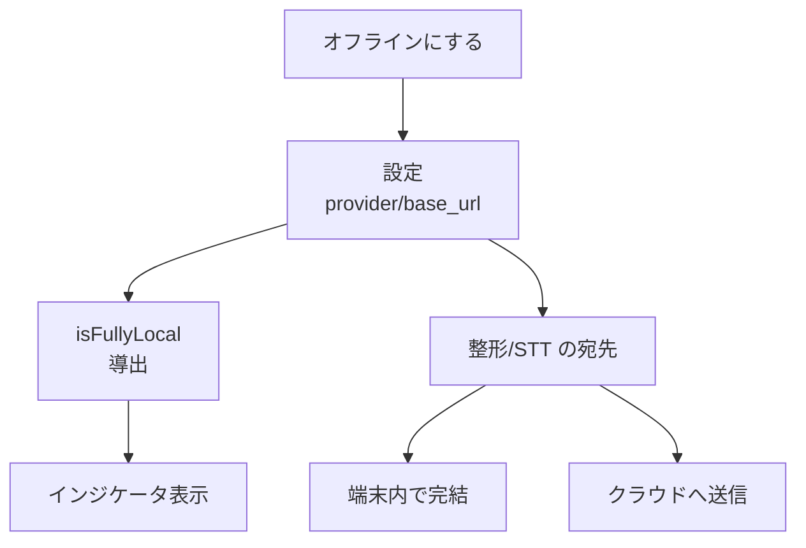
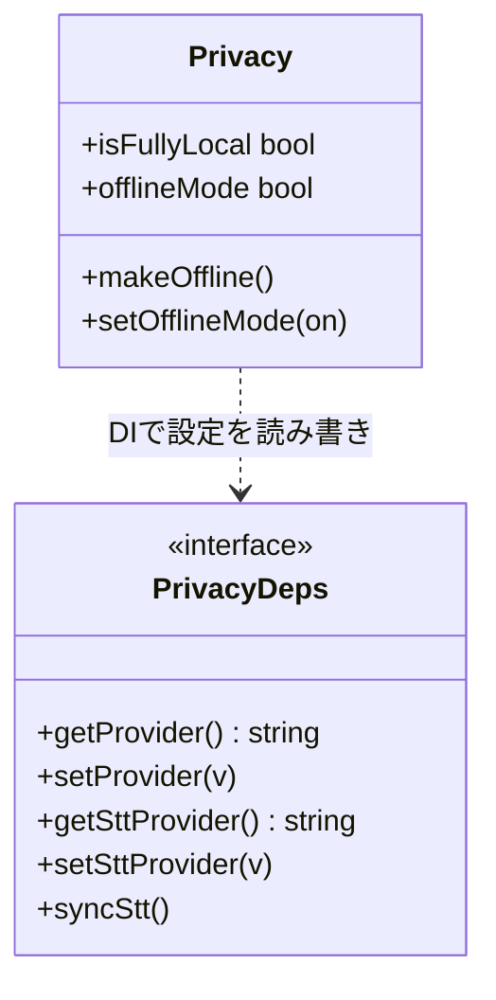

> 個人開発OSS「QuickScribe」（ローカル完結ボイスジャーナル）の設計連載の一章です。前章では整形の中身を書きました。今回は、その整形やSTTを「ローカルに閉じる」という価値を、どう既定とUIに落とし込んだかを書きます。コードは v1.13.0 時点。設計判断は該当箇所を引用し脚注で出典（ADR）を示します。
> リポジトリ: [Takenori-Kusaka/QuickScribe](https://github.com/Takenori-Kusaka/QuickScribe)

本書の冒頭で「ローカルプライバシーそのものはコモディティだ」と書きました。ローカルで完結することは、もう珍しくありません。では何で差がつくのか。私の答えは、**既定をどちらに倒すか**と、**現状を正直に見せられるか**の2点です。この章は、正直に言うと**自分が一度やらかした過剰主張を、どう是正したか**の記録でもあります。

## 課題と方針

プライバシーまわりで満たしたかったことは次の通りです。

- **既定でローカルに倒す**。「設定を変えた人だけ安全」ではなく、何もしなくても端末内で完結する。
- **今どうなっているかを正直に見せる**。整形やSTTにクラウドを選べば、当然データは送信されます。それを隠さず表示する。
- **クラウドから一手でローカルへ戻せる**。プライバシーが気になったら、ワンクリックでオフラインに固定できる。
- **選択肢を増やしすぎない**。プライバシー設定でトグルが林立すると、簡便さが死にます。核心課題「リッチすぎると簡便でなくなる」がここにも効きます。

差がつくのは**既定と表示の誠実さ**だ、というのが設計の出発点です[^adr19]。ここで白状します。初期のUIは「話した言葉はこの端末から出ません」と表示していました。ところが当時の**既定の整形はクラウド**（鍵を入れて使うクラウドLLM）だったので、この表示は**実態に反する過剰主張**でした。ユーザーがクラウドを選んでいれば、言葉は端末から出ています。この矛盾を是正したのが、この章で書く設計です。

狙いは2つです。**表示を「主張」ではなく「現在の構成からの導出」にする**こと。そして最終的に、**既定そのものをローカルに動かす**こと。前者で嘘をつかなくし、後者で「何もしなくても安全」を実現します。

## 技術選定

### 表示を主張でなく導出にする

「オンデバイス完結」という表示を、固定の文言ではなく、**現在の設定から計算する値**にしました。整形がローカル、かつSTTがローカルのときだけ真になる `isFullyLocal` です[^privacy]。

```typescript
  const isFullyLocal = $derived(
    refineEndpointIsLocal(deps.getProvider(), deps.getBaseUrl()) &&
      deps.getSttProvider() === "local",
  );
```

判定がプロバイダ名だけを見ていないところが、あとから効きました。OpenAI 互換のエンドポイントを指定できるようにした結果、「プロバイダ名は `openai` でも接続先が自分の端末のローカル LLM」という組み合わせが生まれます。名前だけで判定していたら、この構成を「クラウド送信あり」と誤って表示していました。いまは接続先の URL が loopback かどうかまで見ます。**実態から導く方針を貫くと、実態の定義が増えたときに判定も自然に追従します。**

これが真のときだけ「オンデバイス完結」、それ以外は「クラウド送信あり」と出します[^adr19]。表示は設定に追従して自動で変わるので、**UIが実態と食い違う余地がありません**。過剰主張は「頑張って正しい文言を書く」ではなく、「文言を状態から導く」ことで構造的に潰しました。

### トグルは1つに留める

プライバシーを気にしたユーザーのために、**「オフラインにする」をワンクリック**で提供します。押すと整形をローカル（Ollama）、STTをローカル whisper に固定します[^privacy]。

```typescript
function makeOffline() {
  deps.setProvider("ollama");
  deps.setSttProvider("local");
  deps.syncStt();
}
```

ここで「プロバイダごとに送信可否のトグルを並べる」設計もあり得ましたが、採りませんでした。トグルが増えるほど、ユーザーは「結局いま安全なのか」を判断できなくなります。**状態はインジケータ1つで見せ、切り替えはボタン1つ**。核心課題への回答です。

### 既定をローカルへ動かす（重い判断は記録する）

最初のプライバシー可視化（ADR-0019）では、あえて**既定は変えませんでした**（クラウドのまま）。既定変更はユーザー体験を大きく動かすので、「Deciderの承認と新しい意思決定記録が要る」と条件を付けて保留したのです[^adr19]。

その後、条件を満たして既定を動かしました。**整形の既定をクラウド（Gemini）からローカル（Ollama）へ、日本語STTの既定を kotoba-whisper へ**変更する判断です[^adr21]。これで新規ユーザーは、何も設定しなくても端末内で完結します。「既定は最強のメッセージ」で、どれだけUIで安全性を訴えても、既定がクラウドなら本気度は伝わりません。

## 設計のコア

設定（プロバイダ選択）から `isFullyLocal` を導出し、インジケータに表示する。クラウドを選んだときだけ外部へ送信し、「オフラインにする」は設定をローカルへ上書きする。この関係を図にすると次の通りです。



UIのプライバシーロジックは、Appの設定stateに直接触らず、 **依存を注入** （DI）して受け取る形にしました[^privacy]。プロバイダの読み書きとSTT同期を関数として外から渡します。

```typescript
export interface PrivacyDeps {
  getProvider: () => string;
  setProvider: (v: string) => void;
  getSttProvider: () => string;
  setSttProvider: (v: string) => void;
  syncStt: () => void;
}
```

こうすると、`isFullyLocal` の真偽や「オフラインにすると本当にローカルへ切り替わるか」を、UIを起動せずにユニットテストできます。プライバシーという**間違えてはいけないロジックほど、UIから引き剥がして単体で検証**する、という判断です。実際に「ローカル整形＋ローカルSTTのときだけ true」「makeOffline がローカルへ切り替える」といったテストが対になっています。

状態モジュールが外に見せるものは最小です[^privacy]。

- `isFullyLocal`（読み取り専用の導出値）＝ 今オンデバイス完結か。
- `offlineMode`（永続化される固定モード）＝ ONの間はローカルに固定。
- `makeOffline()` / `setOfflineMode(on)` ＝ ローカルへ切り替える／固定する操作。

「読み取れるのは実態、変更できるのはローカルへ倒す方向だけ」という非対称が、そのまま外向きのインターフェースになっています。UIはこの状態を読んで表示を出すだけで、判断ロジックを持ちません。



`isFullyLocal` が導出（読み取り専用）、`makeOffline`/`setOfflineMode` が「ローカルへ倒す」操作、という構造がこの章の要点です。

## 実際に起きた効果

この設計で確かに変わったのは2点です。1つは、表示を実態から導出するようにしたことで、UIが実態と食い違う過剰主張が構造的に起きなくなったことです。プライバシー判定が `isFullyLocal` の一箇所に集約され、プロバイダが増えても「ローカル集合に含まれるか」を更新すれば表示は自動で追従します。もう1つは、既定をローカルへ動かしたことで、新規ユーザーが何も設定しなくても端末内で完結するようになったことです。既定のローカルは無料で、クラウドは選んだ人だけ従量になります。

## 学びと宿題

一番の学びは、**誠実さは気持ちではなく仕組みで担保する**ということです。「嘘をつかないUI文言を書こう」と気をつけるのではなく、**文言を状態から導出**してしまえば、実態と食い違いようがありません。過剰主張をやらかした反省から得た、いちばん効いた設計判断でした。

もう1つは、**既定は最強のプライバシー表明**だという点です。どれだけUIで安全を語っても、既定がクラウドなら本気度は伝わりません。既定をローカルに動かす判断は重く、意思決定記録を分けてまで慎重に進めましたが、動かして初めて「何もしなくても安全」が本当になりました。

最後に正直な弱点を1つ。**既定をローカル整形にした代償として、Ollama が入っていないと初回の整形が失敗します**[^adr21]。明確なエラーとクラウドへの即切替は用意しましたが、Ollama の同梱や自動セットアップはまだ手つかずです。「何もしなくても安全」は達成しましたが、「何もしなくても動く」にはもう一歩足りていません。ここは今後の宿題です。

次章では、整えた記録を「捨てずに残して育てる」ためのデータ設計 ― 中間ファイルとスキーマの持ち方を書きます。

[← 前の章](formatting-intelligence) ／ [次の章 →](vault-data-design)


[^adr19]: ADR-0019「プライバシー状態の可視化と『オフラインにする』導線」。初期UIの過剰主張（実態はクラウド送信）の是正、`isFullyLocal` による状態表示、トグルを1つに留める判断。出典: [docs/adr/0019-privacy-indicator-and-offline-mode.md](https://github.com/Takenori-Kusaka/QuickScribe/blob/main/docs/adr/0019-privacy-indicator-and-offline-mode.md)

[^adr21]: ADR-0021「ローカルファースト既定」。整形の既定を `gemini` から `ollama`（ローカル）へ、日本語STTの既定を `kotoba-q5` へ変更した判断と、Ollama 未導入だと初回整形が失敗するというトレードオフ。出典: [docs/adr/0021-local-first-defaults.md](https://github.com/Takenori-Kusaka/QuickScribe/blob/main/docs/adr/0021-local-first-defaults.md)

[^privacy]: プライバシー状態モジュール（`isFullyLocal` の導出、`makeOffline` / `setOfflineMode`、依存注入 `PrivacyDeps`）の実装。出典: [src/lib/privacy.svelte.ts](https://github.com/Takenori-Kusaka/QuickScribe/blob/main/src/lib/privacy.svelte.ts)
